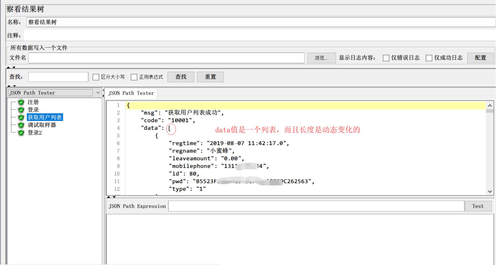
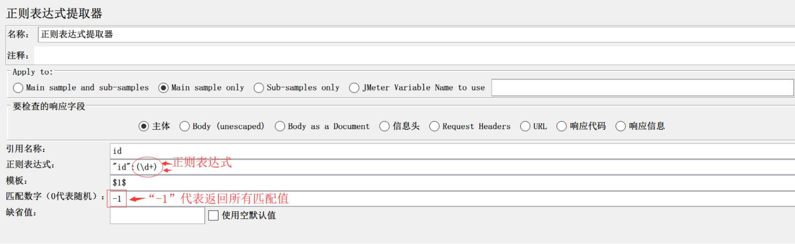
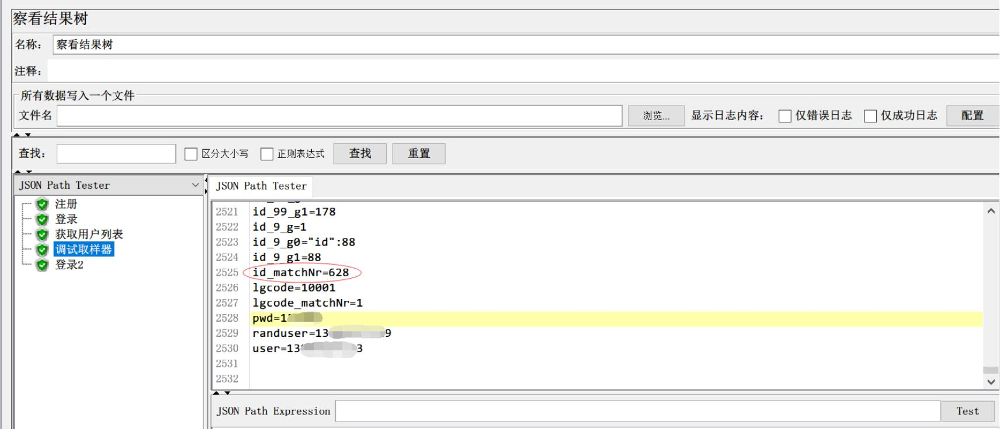

# Jmeter不写代码，秒秒钟提取动态列表最后一个值

**提取动态列表最后一个值**

- 在用jmeter做接口测试时，我们经常会遇到，一个接口返回一个json串，在这个json串中，某个节点的值是一个列表，而且这个列表的长度是动态变化的。如：

  

  获取用户列表，用户信息是个列表，类似的接口，在企业中非常常见，如果我们在接口中没有传递翻页参数时，这个列表的长度往往都是不固定的，随时变化的。

- 如果你只想获取列表中已知索引位置的某个参数值，这个很简单，用个json提取器，或者用正则提取器+指定索引号，都能如愿提取出来。

- **哪如果想要提取列表最后一个索引位置某个参数的值，怎么办呢？**   是不是，就用个‘-1’的索引号，就能解决呢？
  - 你是不是，也有这样一个问题？你是不是也是这样想的呢？
  - 然后......
  - 然后你干嘛了？你发现你用‘-1’实现不了，你又去百度，百度告诉你，用Beanshell，写一堆你不知所云的‘天书’（java代码）。你期望美梦成真(因为问题很简单，杀鸡已经用上了牛刀了)，但是，理想很美好，现实很骨干，你的辛苦付出并没有获得应有的回报。老天啊，你不是耍我吧，一个这么简单的问题，你搞了我一整天啦，来个人，帮我把这些写代码忽悠人的都 ‘X’了吧(此时，你是不是怨声载道)。
  - 天涯何处不相逢，都是沦落人啊！
  - 只是，我可能‘山重水复疑无路，柳暗花明又一村’，发现了个‘隧道’

- **正则+关联函数**，获得动态列表最后一个索引位置的某个参数值

  - 先用正则提取器出所有的预期参数的值(如：我想提取data列表中所有id的值)

    

  - 此时，在调试取样器中，我们将看到如图：

    

  - 注意图中重点，有一个 ‘id_matchNr'=***，这是什么呢？这个就是匹配结果总数量，也就是说，这个值，告诉了我们列表的数量(前提是，正则表达式没有错)。看到了列表总长度，想到了什么？是不是直接用这个值作为列表索引，就能获得最后一个参数值了! bingo，思路有了，开干！

  - **关联函数__v, ${__V(id_${id_matchNr})} ${id_matchNr}是得到列表最大值，用一个关联函数，就得到列表最后一个的参数值。 注意：** *列子中的’id' 是我们正则提取器中的存储“引用名称”*

  - 验证：把关联函数${__V(id_${id_matchNr})}，放入你需要的地方，运行后，查看该参数的值，再把列表拷贝出来，搜索看参数值是不是最后一个。

- 到此，我们就完成了列表最后一个值的提取和使用及验证。

---
> 想要获取更多有趣有料的测试知识，欢迎关注 **柠檬班** 微信公众号