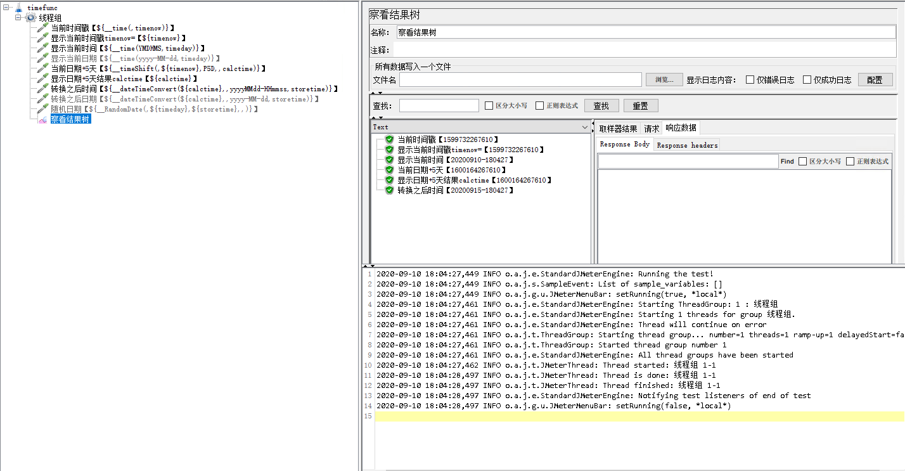
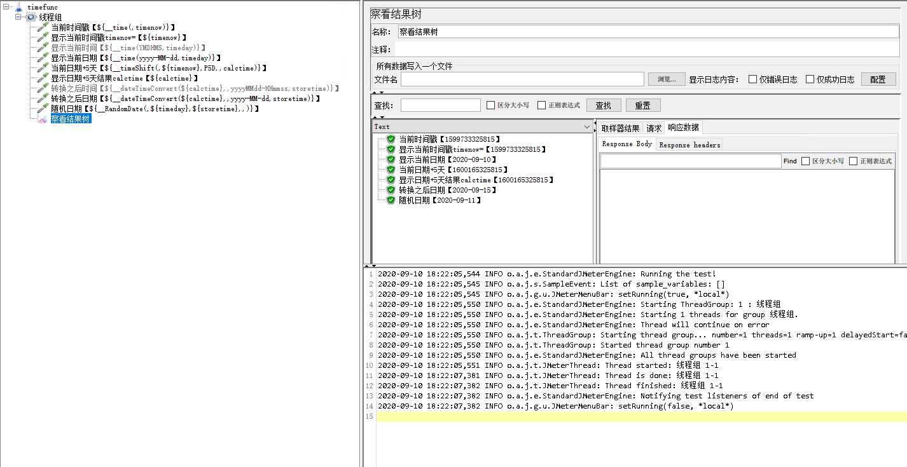
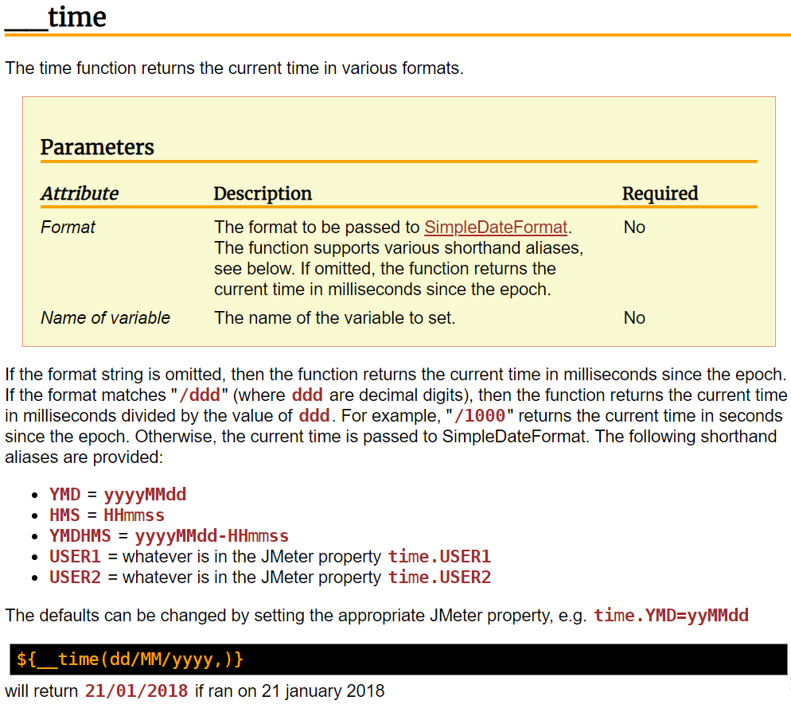
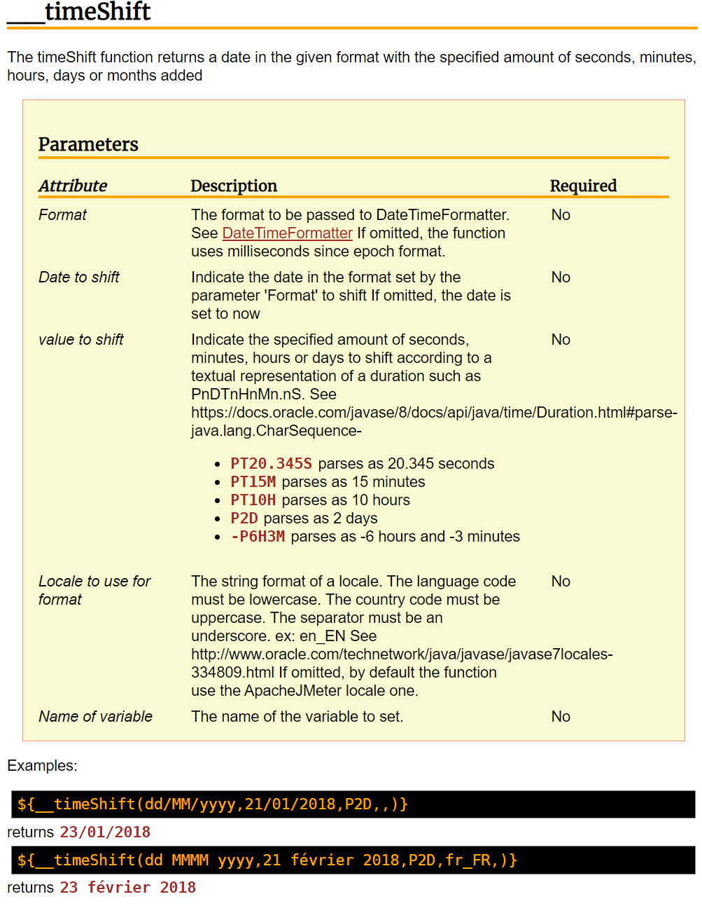
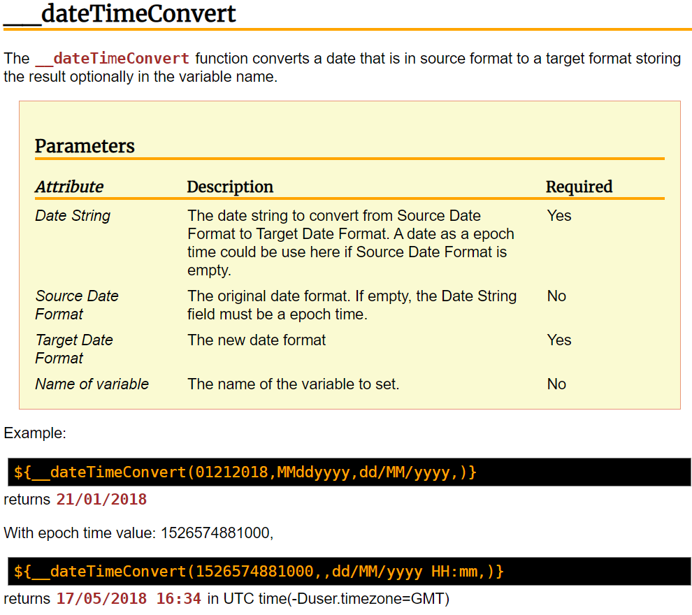
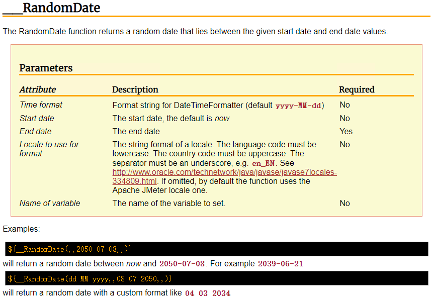

# Jmeter如何把时间戳转为本地时间

jmeter中，有很多已经封装好的函数，使用这些函数，就能实现某些特定的功能，这对于没有代码基础，或代码基础薄弱的同学来说，是一个非常大的福音。

其实，在我们使用jmeter的时候，遇到一些稍微复杂一点的功能实现时，

+ 我们大概有三种实现方式，

  + 第1种，就是使用jmeter现有的元件或下载一些插件，使用元件来实现预期功能；
  + 第2种，就是使用jmeter提供的函数，有使用过jmeter的同学，如果细心点，应该会发现，jmeter的函数其实也包括两部分，一部分是自带的函数，一部分是通过安装插件引入函数，使用这些函数，有时候能实现一些意想不到的效果，采用函数实现，比采用元件实现，更简单，脚本也更简洁；
  + 第3种，使用代码实现，注意，我说的代码实现，并不限于java语言，也不限于BeanShell元件。可以是jmeter二次开发，可以是groovy语言或jython语言，可以是JSR223元件等。

  > 是不是，从来没有人和你这样讲过，自己也没有认真总结过？

今天，给大家讲的就是，jmeter函数中，有关 时间 的相关函数用法，相信这篇文章的内容，在其他的地方绝对学不到的。

先看两张图，看大家能不能看明白，看明白了，说明你就已经掌握了。

## 获取当前时间戳函数__time()

这个函数，相信大家都清楚，大家可能用的最多的就是通过这个函数，可以生成**当前时间的时间戳**，或者**格式化当前时间**。

常用于接口参数需要时间时的参数。

这个函数，有两个可填参数。

+ 如果都不填，那么获得的是当前时间的时间戳；
+ 如果填第一个参数，就是**格式化当前时间**，填写对应的时间格式，把当前时间用对应的格式返回；如果想要格式化时间精确到毫秒：`${__time(yyyy-MM-dd HH:mm:ss:SSS,)}`
+ 如果填第二个参数，就是把时间结果用一个**变量**接收

但是，不管怎么用，都只能**获取当前时间**。

## 时间位移__timeShift()

这个函数，是离获取当前时间的time函数最近的一个函数，也是大家最容易与time函数混淆的函数。是**时间位移**函数。

常见于脚本中需要做时间偏移计算时用。

这个函数，它有五个可选参数：

+ 如果所有的都不填，哪也是获取当前的时间戳；
+ 第1个参数，是**格式化时间**，如果不填，时间戳精确到毫秒，如果填了，就格式化输出时间；
+ 第2个参数，**日期**，上一个参数的格式返回这个日期，如：`${__timeShift(yyyy-MM-dd,20200915,,,)}`   如果未填，则为当前日期；

+ 第3个参数，**时间位移**，以可选的正号‘+’ 和负号‘-’开头，负号‘-’开头，表示整个时间相减；再以大小写p为前缀，后面跟具体位移数和单位，单位'D'为天，'H'为小时，'M'为分钟， 'S'为秒，而'T'必须在任意一个H\M\S出现之前，数字可以是正数或负数；天\时\分，前的数字为整数，秒，可以是小数。如在当前日期上增加2天4小数6分10.234秒：`${__timeShift(yyyy-MM-dd HH:mm:ss:SSS,,p2dt4h6m10.234s,,)}`       <a href='https://docs.oracle.com/javase/8/docs/api/java/time/Duration.html#parse-java.lang.CharSequence-'> 详见 </a> 
+ 第4个参数，**区域语言设置**
+ 第5个参数，定义**存储结果的变量名**

## 时间戳转为本地时间__dateTimeConvert()

这个函数，相信很多同学都没有用过，也极少看到有介绍这个函数的相关文章，但是，这个函数的作用却非常大。他的作用就是**将时间戳转换为本地时间**。

常用于对接口响应结果中的时间戳进行转换。

这个函数，有四个参数

+ 第1个参数，**被转换的时间**，为空时，表示当前时间戳，精确到毫秒
+ 第2个参数，被转换时间的**时间格式**，上面时间的格式 
+ 第3个参数，**转换后的时间格式**，
  + 例： `${__dateTimeConvert(09102020011034,MMddyyyyHHmmss,yyyyMMddHHmmss,)}` 原始时间格式为：月日年时分秒，转换后为：年月日时分秒
  + 例2：`${__dateTimeConvert(1599723255000,,yyyyMMdd HHmmss,)}` 一个精确到毫秒的时间戳，转换为：年月日 时分秒 格式时间
+ 第4个参数，定义**存储结果的变量名称**

## 随机时间__RandomDate()

看到这个，相信你就知道，肯定是随机数，是的，但是它是**随机日期函数**。可以在一个随机日期之间，随机选一个日期返回。注意，这个函数操作的是 **日期**。

这个函数，有五个参数

+ 第1个参数，**日期格式**，默认为 年-月-日
+ 第2个参数，**起始日期**，随机日期区间起始值，包含起始值，空时，默认为当前日期
+ 第3个参数，**结束日期**，随机日期区间结束值，不包含结束值
  + 例： `${__RandomDate(yyyyMMdd,20200718,20200918,,)}` 从一个日期格式为yyyyMMdd日期区间随机区一个日期
+ 第4个参数，**区域语言设置**
+ 第5个参数，定义**存储的变量名称**

好了， 看完了这篇文章，你是否已经掌握用函数生成时间戳作为输入参数，也掌握了，从接口返回时间戳，把时间戳转换为比较方便查看的本地时间。

<a href='https://github.com/wohuyuelong/articles/blob/master/jmx/weather-0724.jmx'> 参考源码 </a>