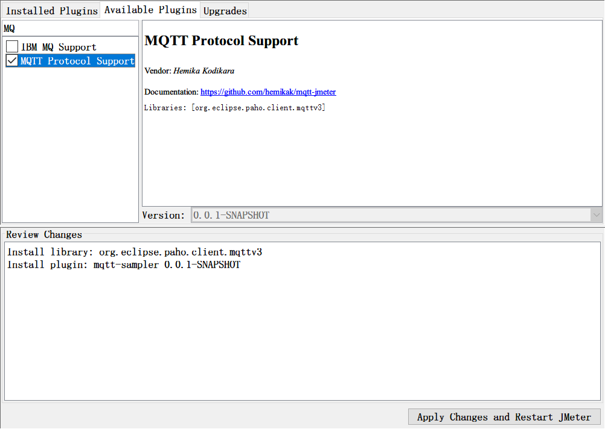
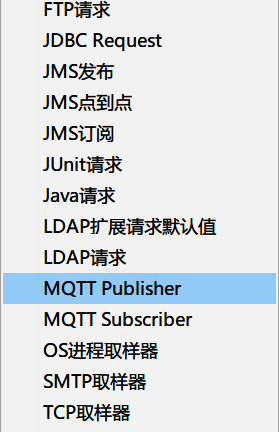
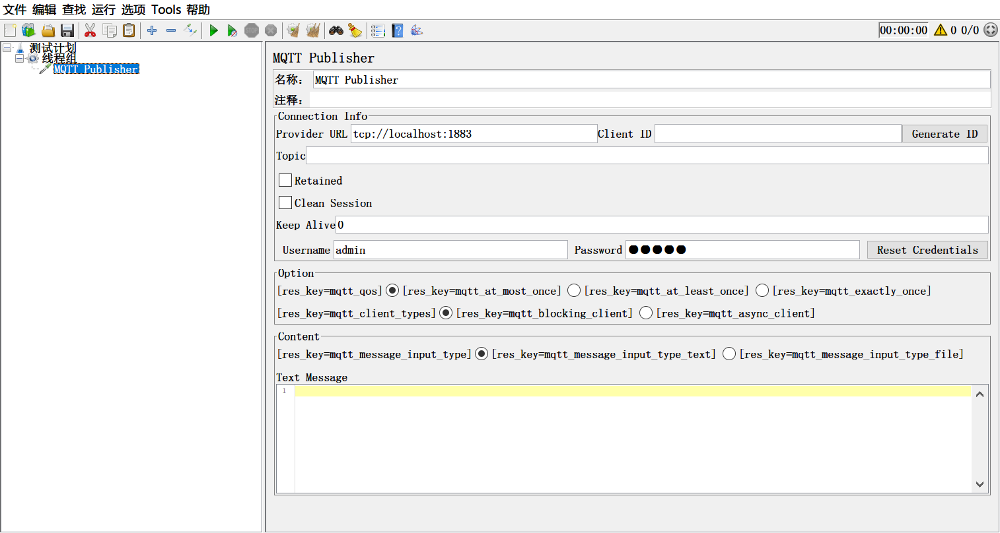
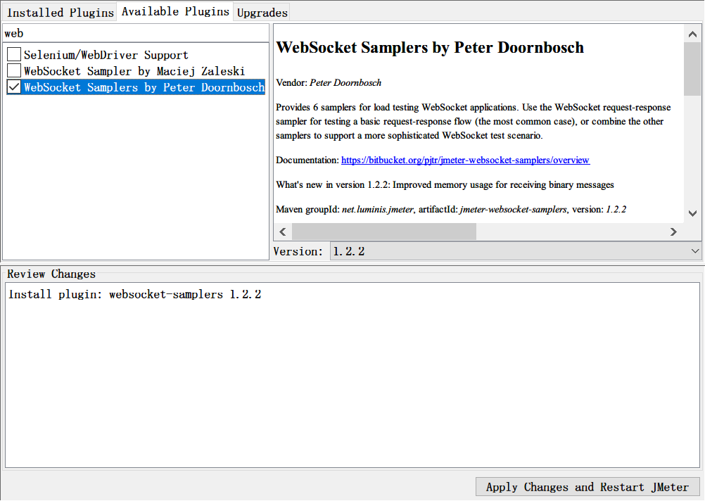
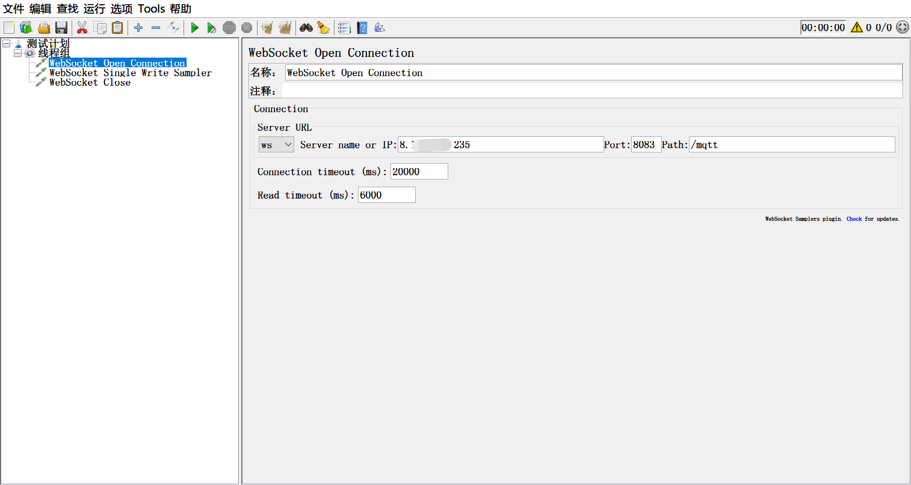
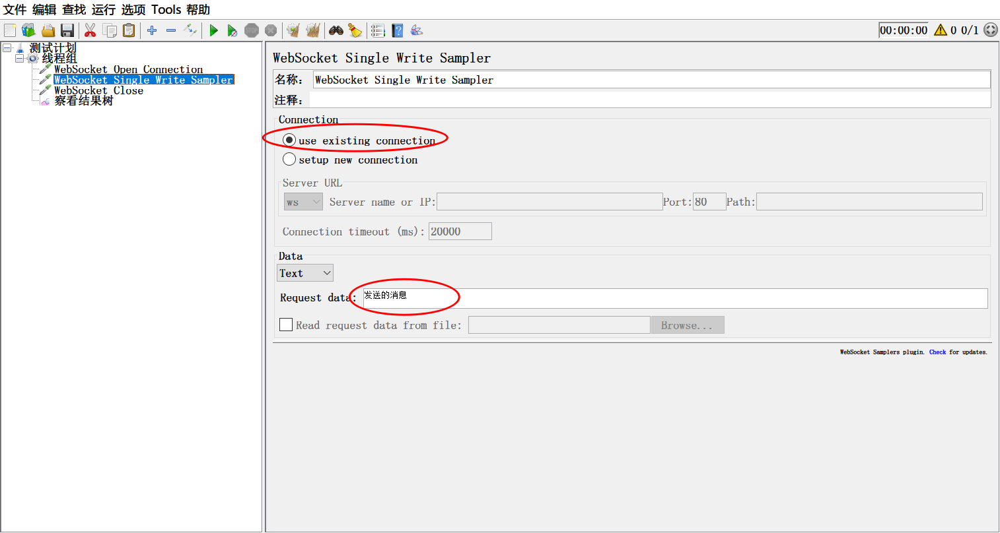

# Jmeter测试MQTT服务

## MQTT介绍

MQ(message queue)消息队列，是基础数据结构 先进先出 的一种典型数据结构。一般用来解决应用解耦，异步消息，流量削锋等问题，实现高性能，高可用，可伸缩和最终一致性架构。

MQ主要产品包括：RabbitMQ、ActiveMQ、RocketMQ、ZeroMQ、Kafka

MQTT 是轻量的 (Lightweight)、发布订阅模式 (PubSub) 的物联网消息协议

至于现在企业中，特别是电商企业中，喜欢用MQ的原因，可以参考阅读：https://www.zhihu.com/question/54152397   文章写的不错，还挺有趣的

## linux机器中MQTT服务搭建

**注意**： 如果已经有MQTT环境，环境搭建这一章节，可以跳过

### 安装

准备一台linux机器(以centos7)，搭建国内开源emqx项目，目前该项目最新版本，还未发布centos8版本，所以，如果您的电脑为centos8，centos7均可以执行：

```shell
# 安装必须的依赖
sudo yum install -y yum-utils device-mapper-persistent-data lvm2

# 添加稳定的存储库
sudo yum-config-manager --add-repo https://repos.emqx.io/emqx-ce/redhat/centos/7/emqx-ce.repo

# 如果低于cento8，可以直接用这一个命令一键安装，centos8则要执行上面的，再执行这句
curl https://repos.emqx.io/install_emqx.sh | bash
```

### 启动

执行：

```sh
# 直接启动
emqx start

# 或者
sudo systemctl start emqx

# 或者
sudo service emqx start

# 查看运行状态
emqx_ctl status

# 停止
emqx stop
```

### 访问

MQTT服务采用TCP协议传输数据，端口有多个，其中可以外部访问的端口默认1883。

管理台访问端口18083，用户：admin，密码：public

| 端口  | 说明                                                         |
| ----- | ------------------------------------------------------------ |
| 1883  | MQTT / TCP 协议端口，**可以被外部访问**                      |
| 11883 | MQTT / TCP 协议内部端口，只能当前机器自身访问                |
| 8883  | MQTT / SSL 协议端口                                          |
| 8083  | MQTT /  WS 协议端口                                          |
| 8084  | MQTT / WSS 协议端口                                          |
| 18083 | MQTT / HTTP协议端口，**HTTP管理台访问端口，用户admin ,密码public** |

### 配置及日志

**配置文件**： /etc/emqx/emqx.conf

listener.tcp.external = 0.0.0.0:1883	# 可以外网访问的端口

listener.tcp.internal = 127.0.0.1:11883	# 只能本机访问

log.dir = /var/log/emqx	# 日志文件路径

log.level = warning	# 日志级别

log.file = emqx.log	# 日志文件，会自动在后面增加数字

**日志文件：**/var/log/emqx


+ 参考：
  + https://docs.emqx.io/broker/v3/cn/install.html#
  + https://docs.emqx.io/broker/latest/cn/

## Jmeter测试MQTT

### 方法一：

#### 安装插件MQTT Protocol Support

启动jmeter，进入 选项(options) > Plugins Manager > Available Plugins 搜索MQ， 选择MQTT Portocol Support, 然后安装并重启jmeter。



安装成功后，在jmeter的取样器中，新增了MQTT Publisher、MQTT Subscriber



其中，MQTT Subscriber 是注册一个主题，MQTT Publisher是使用主题发送消息。

添加MQTT Subscriber 在 Provider URL地址中，填写你的服务器ip，然后点击右侧的 Generate ID 自动生成Client ID,然后再在Topic中，输入一个主题信息，在Text Message中，填写要发布的信息。run一下，就成功了。



### 方法二：

#### 使用websocket插件

在插件管理中，安装 WebSocket Samplers by Peter Doornbosch



安装成功后，在取样器中，添加WebSocket Open Connection， 协议选择默认的ws， ip填写你的服务器ip地址，端口默认为8083，Path根据你的MQ的socket地址填写。



再添加 WebSocket Single Write Sample， Connection选择 use existing connection， 在Request data中，填写要发送的信息，run一下，搞定。



---

好了， 关于Jmeter如何调用MQ的测试方法，我们就介绍到这。你都掌握了吗？


> 想了解更多有趣，有料的测试相关技能技巧，欢迎关注**柠檬班**微信公众号，或在腾讯课堂中搜索柠檬班机构，观看测试相关视频。