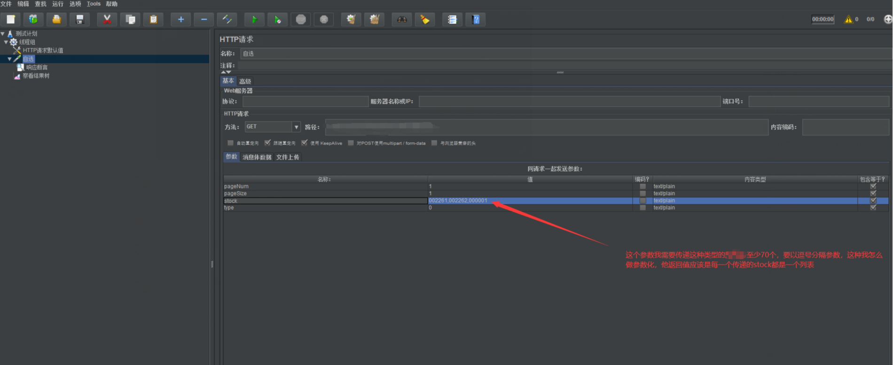
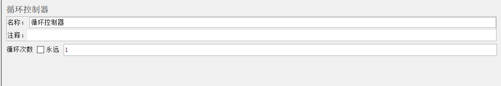
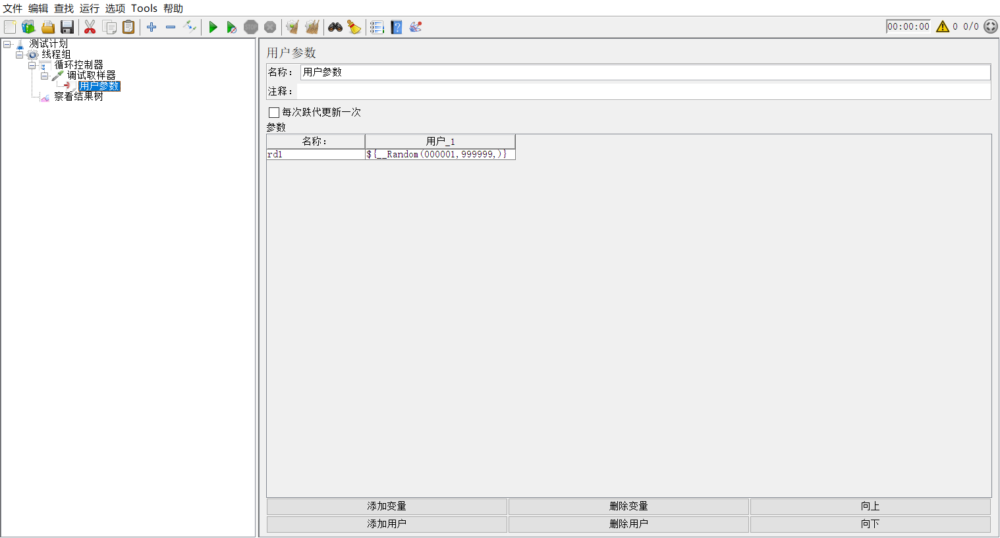
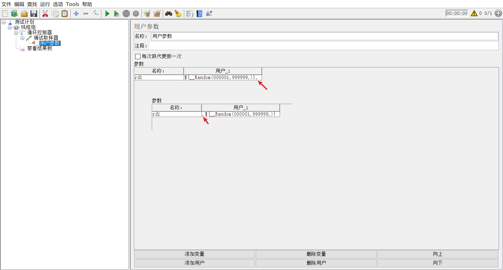
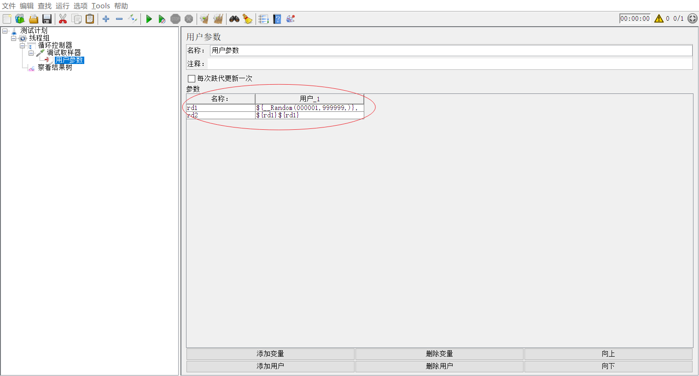
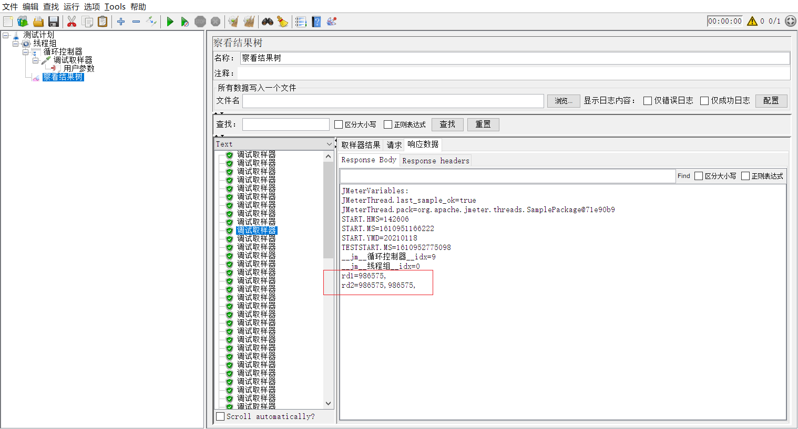
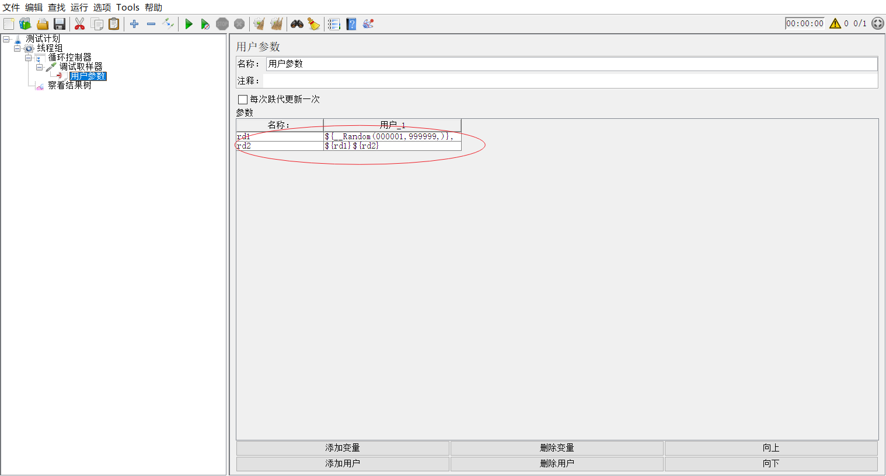
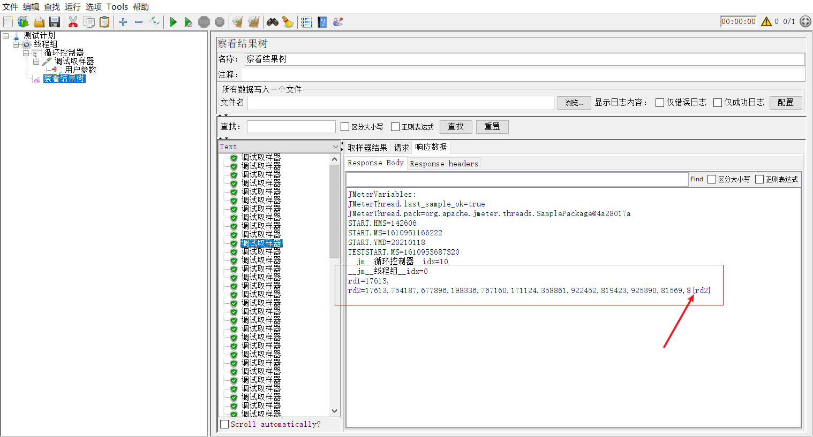
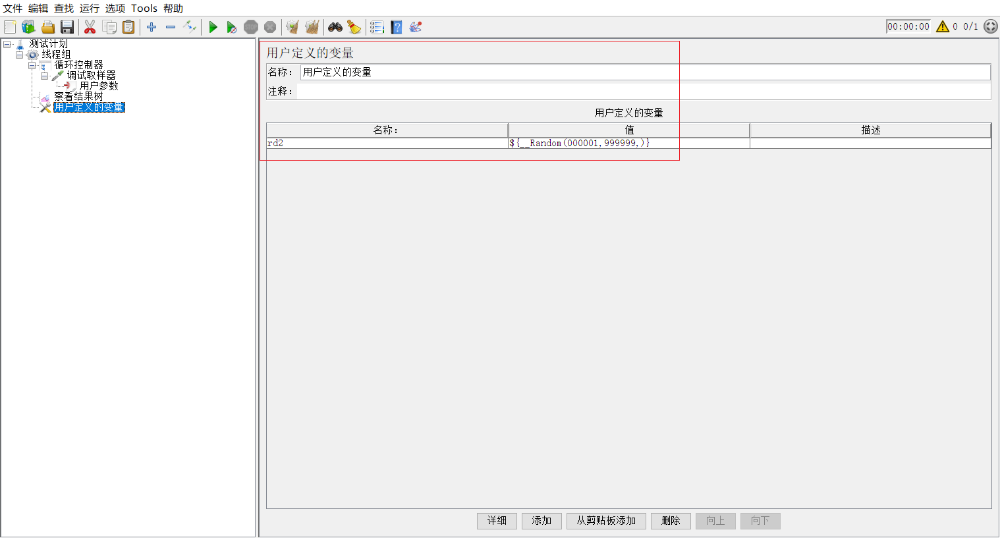
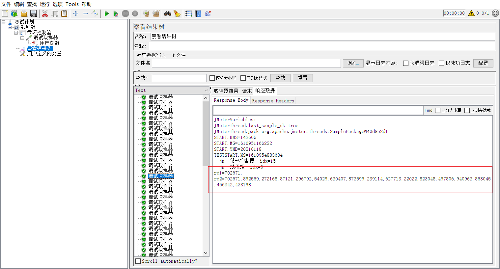

# Jmeter接口测试，参数值为列表，如何参数化？

最近在我的教学过程中，我的一个学生问了我一个问题，他们公司的一个接口参数值是列表，列表中值的数量有多有少，问我在jmeter中如何让这个参数的值进行参数化？

看到这种问题，你的第一反应是什么？

写java代码？我相信，如果你有一定的程序语言基础，你肯定会想着写代码。因为代码对你来说，不是难事。但是，如果你不懂代码呢？

如果你不懂代码，哪你肯定就会想着用jmeter自带的Random函数。

但是，当你使用Random函数，去生成随机数的时候，如何生成70个随机数，用逗号连接，构成一个列表，这个事情难住你了。

下面，我就给不懂代码的同学，讲讲如何使用jmeter现有的元件来实现这样一个需求。

首先，我们肯定知道，需要用Random函数和循环控制器。在线程组下面添加一个循环控制器，循环控制器只需要设置一个循环次数就可以了。

他的需求是至少70个，至于到底多少个没有说，所以，这个循环次数，我们就可以用Random随机函数，随机一个大于等于70的数字就可以，${\_\_Random(70,79,)}随机函数中最大值，随便写大于70的数字。

接下来就是造出列表中的第1 个数。定义什么元件来接收这个随机数字呢？

**用户定义变量**， 还是 **用户参数**？

听过我的课的同学，肯定都知道使用**用户参数**，如果不清楚，可以咨询我们的工作人员。

用户参数，是一个前置处理器，所以，我们需要添加一个取样器；我们目的是造数据，这个取样器并不需要发起请求，所以，取样器我们可以使用‘调试取样器’，生成如：

现在，运行脚本，你会发现，在查看结果树中，每个 ‘调试取样器’  看到rd1变量的值都不一样，但是，每次的值都只有1个。

进一步分析需求，需求中，还说，每个值之间用逗号分隔，哪我们看下，是否可以在rd1这个变量中添加一个‘逗号’呢。

添加了，运行，发起不管加载后面，还是在前面，都可以，jmeter运行没有出错。

这个是什么意思呢？

我在一个函数变量的前面，或后面添加一个‘逗号’，居然，能正常！

‘逗号’，是一个字符吗？是！哪这个算不算，两个**字符连接**呢？

是的！ jmeter中，字符与字符相连，不需要用‘+’号，可以直接写在一起，就连接了。

让rd1的值，前面或后面，加符号，可以直接相连，哪我们可不可以把rd1与自己相连接呢？有了想法，哪就赶紧行动吧。是不是，再‘添加变量’，定义值为${rd1}${rd1}?

运行！！！

发现，有rd2不管运行多少次，值都只有2个。**这是怎么回事呢**？

我们来理解一下，变量rd2的值为 ${rd1}${rd1} ，其实，是不是就是rd2的值，是调两次rd1，把两个rd1连接在一起。如果这个能理解，哪是不是就能理解，不管我们循环多少次，rd2的值都只有2个。

继续想。

会不会想到，rd2的值用rd1与rd2自身连接？

运行！

这次，我们看到rd2的值，在循环此次不一样的时候，rd2的值长度不一样，在递增。也就是说，这样，我们可以造出几十个类似的数据连接成的一个列表了。

但是，rd2的值，最后一个是${rd2}，这显然又不符合我们的要求。怎么办？

是不是想着又给rd2定义一个值？哪这次，继续用**用户参数**，还是用**用户定义变量**呢？

这次，我们用**用户定义变量**！

> 楞楞的分不清 用户定义变量 和 用户参数 的用法，可以联系我们的工作人员

运行！

现在，不管我们运行多少次，都能正常生成rd2的值了。

在这位同学的接口中，直接使用变量引用${rd2}，是不是就搞定了。很简单吧！

不过，如果，你是一个追求完美主义者。我下面两个问题，你可以思考下：

**问题一：**

上述这种方法，生成的rd2，其实是要比循环控制器的循环次数多1的，也就是说，如果循环70次，实际rd2是有71个值的。知道什么原因吗？怎么验证吗？

**问题二：**

上述的方法，rd2的值比循环次数多1，如何使rd2值的数量与循环次数相同？

[参考脚本](https://github.com/wohuyuelong/articles/blob/master/jmx/rd.jmx)

