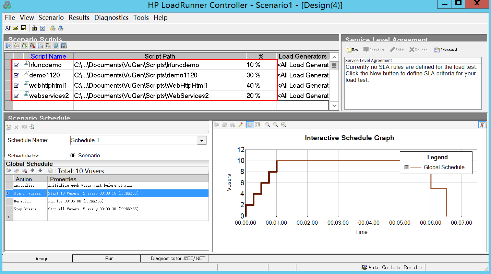
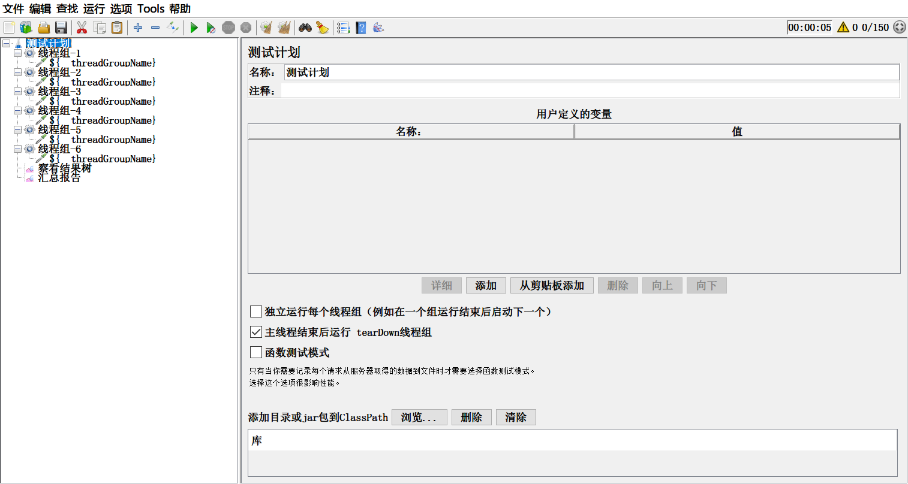
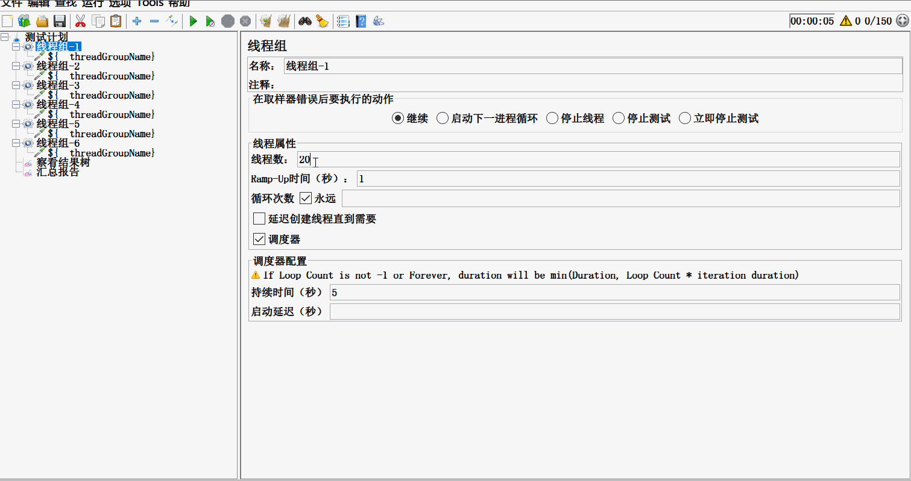

# Jmeter性能测试如何设计混合场景

说混合场景设计，那么首先我们就要弄明白什么是混合场景。你去百度jmeter混合场景设计，多数人的文章，都只会说到，在脚本中增加 if控制器，增加一层判断，让原本顺序执行的取样器，有了一个分支，就认为是混合场景了。哪真的混合场景，就是这样的吗？

**首先，什么是混合场景。**

做性能测试，场景设计，就是为了模拟真实用户对服务器发起请求，那真实的环境用户请求会是什么样呢？也许同时，有100个人在访问你的服务器，对你服务器发起了请求事件，但是他们的请求可能各不相同，有的是刷新页面，有的是登录，有的请求某个商品，有的在添加购物车，有的在付款...... 每个人的情况可能都不一样，没有一定的非是即非的关系，但是，在这个时间点，对于服务器来说，收到了用户的请求，就必须处理，就有计算压力。所以，一个真正的混合场景，不是用一个if控制器就能实现的。

**那么，如何实现性能测试的混合场景设计呢？**

首先，我们看下loadrunner是如何实现混合场景设计的。在loadrunner中，要实现混合场景设计，我们可以在Controller中，添加多个不同的脚本，然后配置不同的策略来分配并发用户。可以设置不同的百分比虚拟用户，也可以直接设置不同数量的虚拟用户。场景运行时，就根据这样一个配置，一起向服务器发起请求。服务器收到的请求，就是不同脚本中的请求，从而实现了混合场景测试。

这个，对于用jmeter工具做性能测试，是否有启发呢？

我们都知道，jmeter是用线程组做场景设计，向服务器发起的所有请求，都是挂在线程组下面。一个线程组设计好了，那么它的所有虚拟用户，都是按照线程组下的取样器顺序，从上往下执行(没有逻辑控制器时)。视乎，就无法模拟，有的取样器接口请求人多，有的接口取样器请求人少，甚至跳过某些接口取样器请求而执行其他的。如果做不到，那就不能算是真正的混合场景了。

其实，刚才讲的loadrunner混合场景设计时，使用了多个不同脚本，这个地方已经给了我们很好的启发。jmeter也可以使用多个不同的脚本。怎么做呢？其实很简单，就是在一个jmeter测试计划下面，创建多个线程组，每个线程组中，就可以包括不同的接口取样器。同时，不同的线程组，还可以设置不同性能场景。

现在，你看到是，在一个测试计划下面，创建了多个线程组，每个线程组下面都挂不同的取样器。

**不同的线程组，设置了不同数量的并发用户，当启动运行时，所有线程组，都开始运行了，而且都是独立运行。**对于服务器来说，是不是同时都会收到不同线程组中不同接口取样器发过来的请求，都需要去做处理，这不就是真正的混合场景吗？

这个设计，其实，已经很简单的告诉我们，jmeter也能做混合场景设计，只需要在一个测试计划下，挂载多个线程组，同时运行多个线程组就可以。不同的线程组，运行的虚拟用户，进行特定设置，不同的场景模型也进行特定设置，这样就可以完全真实的做到模拟真实情况的混合场景设计了。

那么，这样一个技术的实现，会不会有什么难题呢？

在单个线程组内部，进行参数传递时，用上关联，就能顺利传参。但是，如果要在多个线程组之间传递参数，就不能直接传递了。因为，jmeter在设计线程组的时候，线程组与线程组之间是相互独立的，不能直接传参。这个时候，就需要在生成的参数线程组中，使用setproperty函数把参数设置为属性，然后在使用参数的线程组中，再使用P函数，获取属性。这样，就可以实现跨线程组传递参数了。详细操作方法，可参见我的另一篇文章“

[jmeter跨线程组取参数的两种方法]: http://www.lemfix.com/topics/418	"jmeter跨线程组取参"

> ---
>
> 想了解更多有趣，有料的测试相关技能技巧，欢迎关注**柠檬班**微信公众号，或在腾讯课堂中搜索柠檬班机构，观看测试相关视频。

