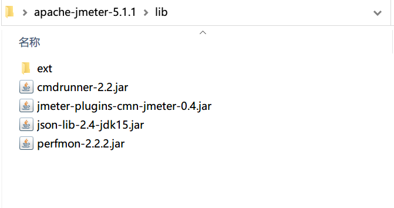
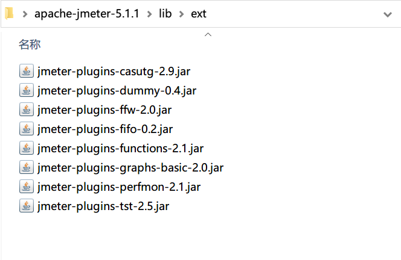
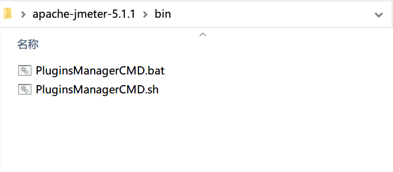

# Jmeter插件jpgc无法下载安装问题解决办法

说到jmeter插件，你的第一反应，可能会是jpgc这个插件，对吗？

但是，最近你去下载jpgc这个插件，却会非常烦恼。为什么呢？因为最近频繁的爆出，这个插件包无法下载；或者下载成功，也自动重启了jmeter，但是插件功能依然未能加载，无法使用。

这样的问题，反反复复出现多次，你说烦不烦人？

哪这个问题，怎么解决呢？

找一个安装成功的jmeter路径仔细看下，你会发现，成功安装，并能正常使用的同学，他们的lib文件夹和ext文件夹，都有更新新文件

这两个文件夹都有新文件更新， 相信大家都不会感觉到意外，因为这你们放的是jmeter依赖的jar文件，更新插件，这些地方有文件更新，很正常。

但是，在我们的jmeter的bin文件夹中，还新增了两个文件，这两个是我们插件生效的必须文件。

所以，但我们反复下载都不成功的时候，我们可以打包上面的文件，放入我们的jmeter文件夹中，此时，再次启动jmeter，插件功能就生效了，可以正常使用。

好了，通过这篇文章的学习，你知道如何解决你的jmeter无法下载jpgc插件的方法了吗？

---

> 更多有趣有料的测试相关知识，欢迎微信关注 **柠檬班** 微信公众号

