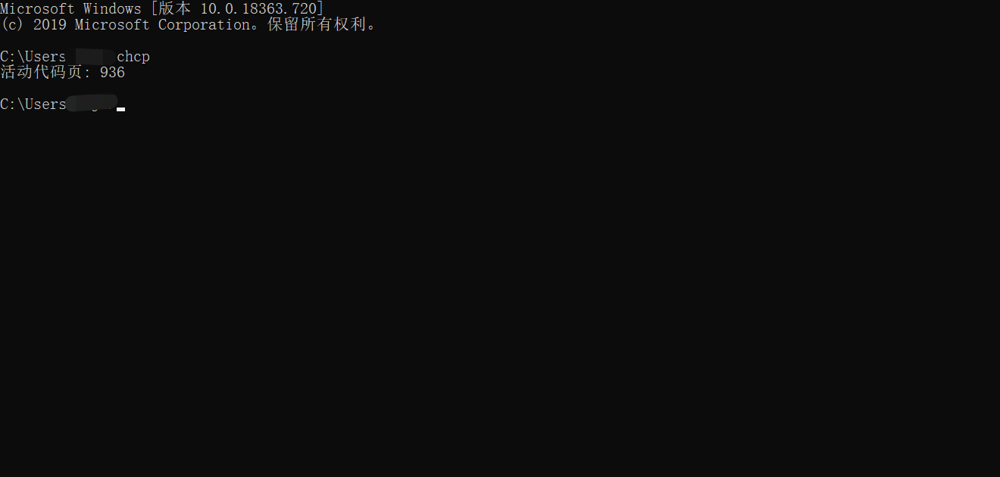
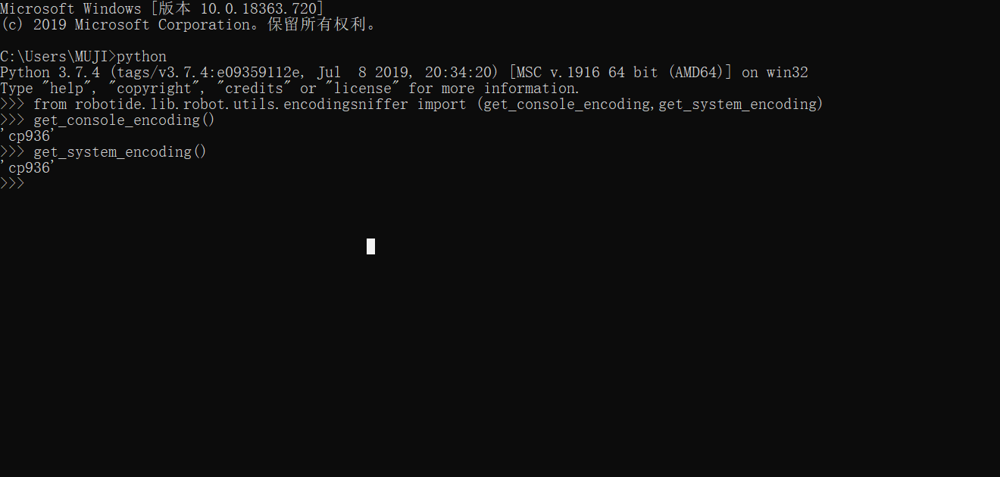
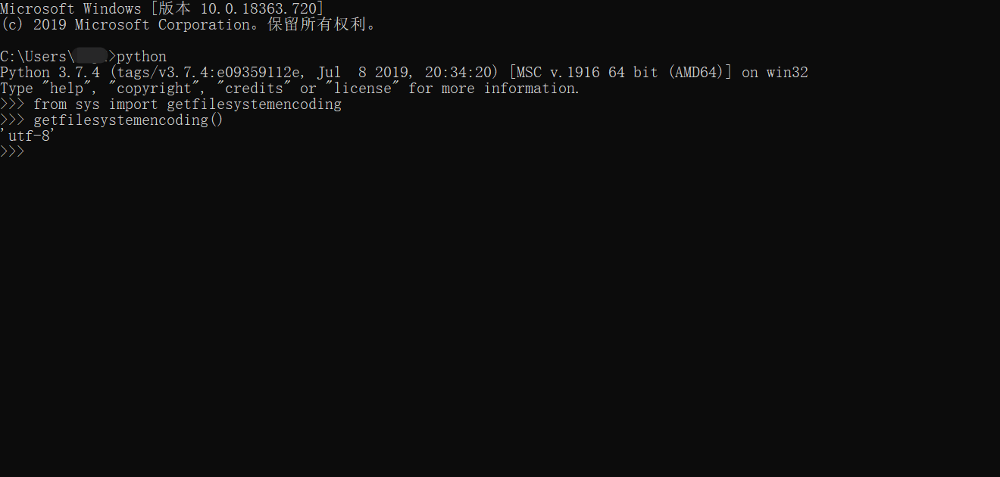

# RIDE1.7.4.1版本中文乱码问题解决办法与剖析

RIDE是robotframework框架进行自动化测试脚本开发，官方推荐的开发工具。目前已经支持python3了，而且也已经支持在windows、linux等系统中安装使用(相关安装办法，可以看我另外文章)。但是，在windows中，使用RIDE时，路径中包含中文，或者测试用例中使用中文，在GUI运行时，控制台输出中文乱码。究其原因，其实很简单，就是因为python3的默认编码格式为utf-8，而我们国内windows系统，默认字符集编码为cp936。



两个字符集不一致，运行时控制台输出信息时，用了utf-8，而实际中文为cp936，就这样乱码了。

说到这里，详细很多同学都已经明白怎么解决了。既然知道是控制台输出的时候字符集不一致导致的，哪就去修改代码中控制台输出这个源文件代码就可以啊！

对，你说的没问题。我们的RIDE这框工具，刚好也是源代码开源的。你在电脑上安装后，你是可以直接看到源代码的，而且从github上，也可以下载源代码。

哪它这个控制台输出的源代码是哪个文件，路径在哪呢？

这个文件在你的电脑 

`%PYTHON_HOME%\Lib\site-packages\robotide\contrib\testrunner\testrunnerplugin.py`

%PYTHON_HOME% 代表你单前电脑的python安装路径。

> **注意：** \Lib\site-packages 是pip的默认包安装路径，如果你自行修改了pip默认安装路径，哪请到你指定为位置中寻找。

找到这个文件后，用记事本等工具打开。

---

## 方法一：

找到大概559-565行左右的如下代码

```python
if PY2:
    if is_unicode(string):
        textctrl.AppendTextRaw(bytes(string.encode('utf-8')))
    else:
        textctrl.AppendTextRaw(string)
else:
    textctrl.AppendTextRaw(bytes(string, encoding['SYSTEM']))  # DEBUG .encode('utf-8'))
```

修改其中的 else 分支的写法

```python
if PY2:
    if is_unicode(string):
        textctrl.AppendTextRaw(bytes(string.encode('utf-8')))
    else:
        textctrl.AppendTextRaw(string)
else:
    textctrl.AppendTextRaw(bytes(string, encoding['OUTPUT']))  # DEBUG .encode('utf-8'))
```

修改完成后，保存，重启RIDE。

此时，你去运行包含有中文的脚本，在控制台，都能正常看到中文，从report中，也能看到中文。

哪问题来了， 原始代码‘SYSTEM’，为什么修改为‘OUTPUT’就好了，这都是些什么呢？

如果你稍微学过一点python，你看到这样的写法，大脑中第一反应会是什么？ **常量** 对不对？但是，仔细一看，好像又不对，哈哈，这不是常量，而是一个字典取了不同值，只不过这个字典的key为全大写。此时，我们就可以通过这个可以，找到文件头部大概第82-84行这个字典的定义：

```python
encoding = {'CONSOLE': CONSOLE_ENCODING,
            'SYSTEM': SYSTEM_ENCODING,
            'OUTPUT': OUTPUT_ENCODING}
```

此时，看到了这个字典，再看它的value，对，这个value就是常量了。哪这个SYSTEM_ENCODING和这个OUTPUT_ENCODING又是什么呢？

此时，我们再看第77-81行

```python
if PY2 and IS_WINDOWS:
    SYSTEM_ENCODING = 'mbcs'
else:
    SYSTEM_ENCODING = get_system_encoding()
OUTPUT_ENCODING = getfilesystemencoding()
```

这几行代码，什么意思呢？大概意思是，如果是python2且为windows系统，那么SYSTEM_ENCODING就为mbcs编码，如果不是，那SYSTEM_ENCODING就是get_system_encoding()的值为编码。OUTPUT_ENCODING的值为getfilesystemencoding()方法执行的结果编码。

来，我们来运行一下看下。





从这两个脚本的运行结果，你看懂了什么？

从上面第一张图，我们可以看到get_console_encoding和get_system_encoding 的结果都为cp936，说明，我们的控制台编码 和 系统编码都是cp936，从上面第二张图，我们看到我们的文件编码为utf-8。也就是说编码格式不一致。

所以，在当源代码第565行`textctrl.AppendTextRaw(bytes(string, encoding['SYSTEM']))`取值编码为encoding['SYSTEM']时，编码为cp936，与文件编码utf-8不一致，改成`textctrl.AppendTextRaw(bytes(string, encoding['OUTPUT']))` 就与文件编码一致都用了utf-8.所以，我们修改第565行，让文本转换为跟文件一样的编码格式，就能正常显示中文了。

ok，上面的弄明白了吗？弄明白了，哪你是否能想到另外的一种办法了呢？

---

## 方法二

既然是因为系统编码和我们的文件编码不一致导致的，`SYSTEM_ENCODING = get_system_encoding()`是获取系统编码，`OUTPUT_ENCODING = getfilesystemencoding()`是获得文件编码。我们是不是可以令其统一呢？

没错，我们可以，我们可以修改第80行代码，

`SYSTEM_ENCODING = get_system_encoding()`

为

`SYSTEM_ENCODING = getfilesystemencoding()`

或者

`SYSTEM_ENCODING ='utf-8'`

是不是，都能保证字典encoding['SYSTEM']的值为 utf-8 与我们的文件编码一致了呢？

```python
if PY2 and IS_WINDOWS:
    SYSTEM_ENCODING = 'mbcs'
else:
#    SYSTEM_ENCODING = get_system_encoding()
    SYSTEM_ENCODING = 'utf-8'
```

大家不防动手试一试噢！修改之后，保存，重启RIDE.

好了，上面的原理和方法都给大家讲了，你是否get到这篇文章都知识了了？

---

> 想了解更多有趣，有料的测试相关技能技巧，欢迎关注**柠檬班**微信公众号，或在腾讯课堂中搜索柠檬班机构，观看测试相关视频。

