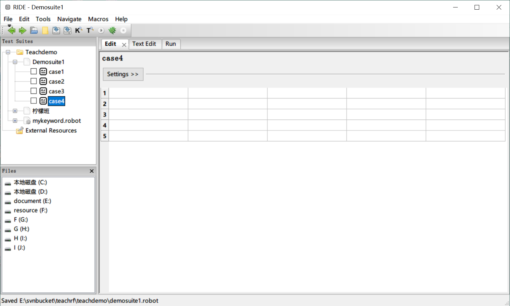
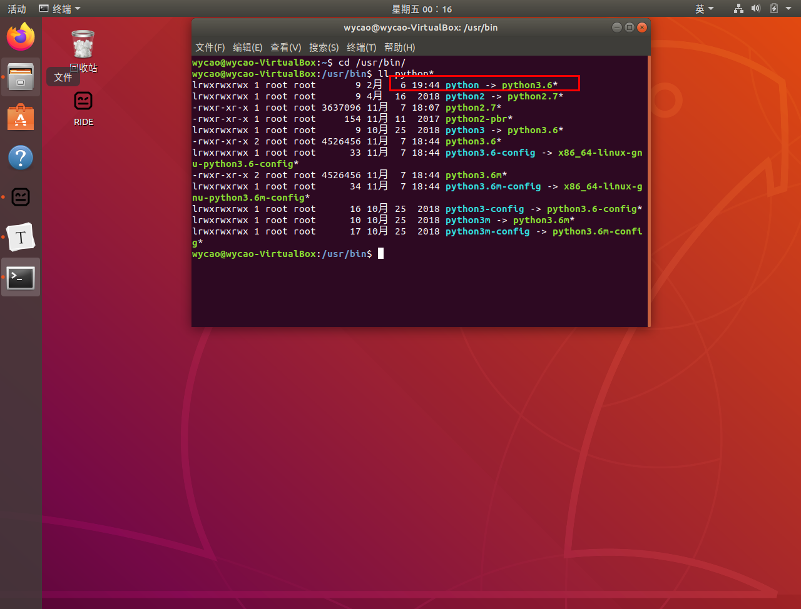
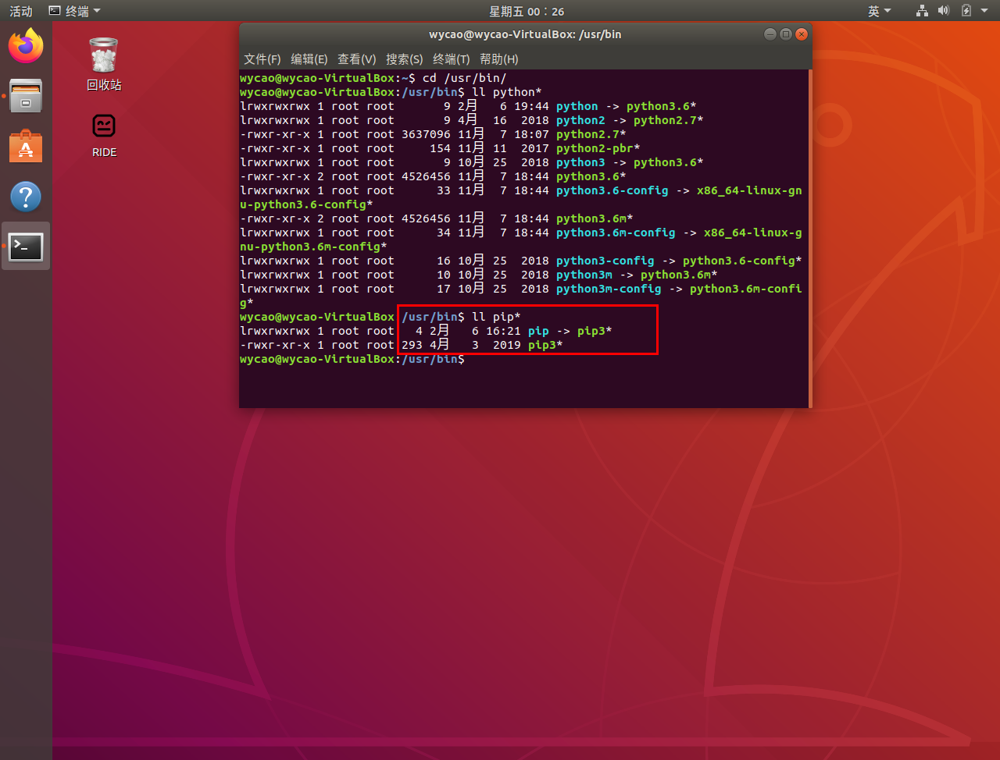
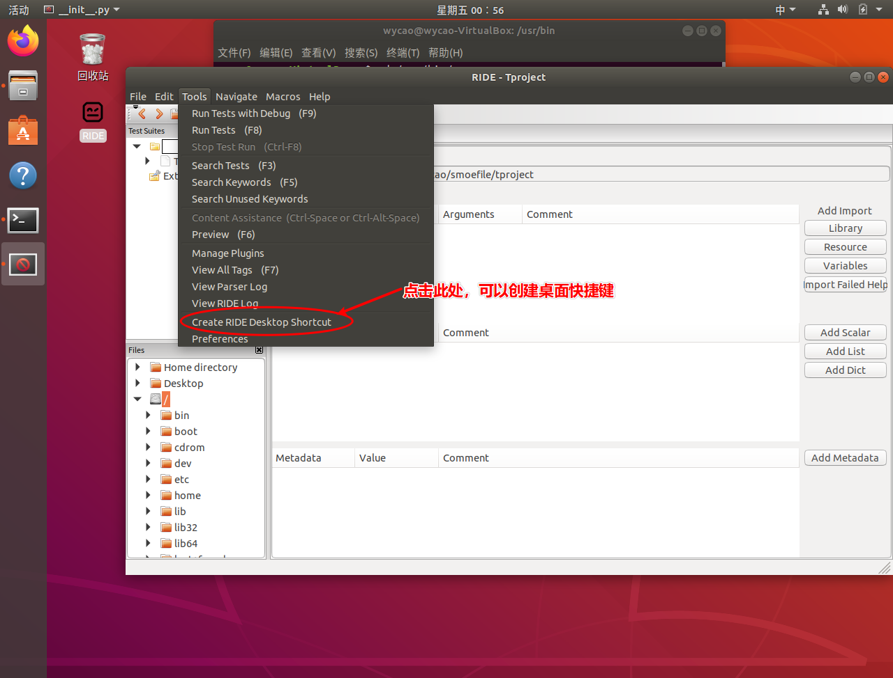

# 号外：RIDE可以在linux+python3的环境中运行啦！

RIDE1.7.4.1版本，是一个python自动化测试中跨越式的版本更新。

## RIDE是什么

**RIDE是什么？它是用来干什么的？**对于一些吃瓜群众来说，可能还不清楚，所以，我在开篇，先简单给大家介绍一下这个工具。

RIDE是python自动化测试框架robotframework的官方推荐编辑器，这个编辑器可以像编execl一样编辑自动化脚本，然后在python环境中运行脚本，实现自动化测试。所以它深受robotframework做自动化测试的人员喜欢。

robotframework是一个基于python的开源自动化测试框架，它支持python2和python3。

## 为什么说RIDE1.7.4.1是跨越式版本更新

RIDE虽然是robotframework官方推荐的编辑器，但是它在1.7.3版本以前，都只支持python2.所以曾今就导致很多用robotframework做自动化测试的人员误以为robotframework只支持python2.在1.7.3基础上更新而来的1.7.4.1版本，已经很好的支持了python3，彻底打破了人们的这样一个误解。<u>**RIDE1.7.4.1已经可以在python3环境中运行了。**</u>

robotframework是开源的，RIDE这款编辑器也是开源的，它的GUI图形界面是使用的python中非常著名的图形界面库wxpython。由于wxpython在4.0.4版本以前只支持window系统。所以就导致以前的RIDE版本只能在windows系统使用。从而也让很多测试人员认定RIDE只能在windows中使用。但是，在RIDE1.7.4.1版本发布的2020年1月20日的时候，wxpython也在里程碑节点前发布了4.0.7版本，这个版本已经支持UNIX系列系统了。也就是说，wxpython可以在我们常用的linux和mac系统中运行了。所以，<u>**RIDE1.7.4.1已经可以在linux和mac系统中安装运行了。**</u>

因为有了这么两个重大更新，所以我说，RIDE1.7.4.1的更新，是具有跨越式意义的。虽然，你现在去使用RIDE1.7.4.1版本，还会有一些明显的缺陷，但是这并不影响它本身带来的改变。

**好了，下面我就带领大家来认识一下RIDE1.7.4.1**

我们先看下，RIDE1.7.4.1在windows系统中安装成功后，运行界面效果：



## windows+python3+RIDE安装

windows中目前这个解决方案，安装RIDE最新版本非常简单。

首先，确保系统中默认python环境为python3

	>  **注意**：<u>不能用python3.8版本</u>. RIDE暂时不支持python3.8

然后，在dos窗口中执行：

​	`pip install robotframework`

 然后再在dos窗口中执行：

​	`pip install robotframework-ride==1.7.4.1`

 待命令安装成功，RIDE即可使用

```
注意： 
由于pip默认使用国外源，用它安装一些软件可能会因为网络原因导致安装失败，可以采用两种方法：
	方法1：反复执行安装命令，直到成功。或者切换网络，反复执行安装命令。
	方法2：修改pip源为国内源，然后再执行安装命令。推荐用这种方法，因为这种方法，成功率高，安装软件速度快。

有的人员可能安装过RIDE，知道上面两个命令，可以用后面一个就可以，但是这个地方，还是建议大家用两个命令，因为RIDE在1.5版本之后，把robotframework和robotframework-ride分开了。

如果是python2环境，安装最新的RIDE可能会出错，解决办法请自行研究。
```

 安装成功后，只要在dos窗口中，执行：ride.py 即可启动RIDE.

```
注意：由于每个人的电脑实际情况不一样，有可能个别人员会出现执行ride.py 无法启动RIDE.那么建议大家找到python3的安装根目录，找到ride.py文件，使用 python ride.py去启动。

如果还不行，请自行研究解决。
```

## linux + python3 + RIDE安装

在上面，我已经给大家看到RIDE的效果图，是一个图形界面软件。要在linux中使用图形界面的RIDE，肯定也需要图形界面的linux系统。所以，为了让大家看得懂，学的会，我就用Ubuntu18.04图形界面linux系统给大家讲解。稍微了解一点linux系统和python的人员，可能会知道，linux系统本身自带了python环境，因为linux系统有些功能就是基于python语言开发的，所以系统一定要有python。有的linux系统使用的是python2，有的使用python3，所以不同linux发行系统python的版本不一样。好了，我们知道这些信息之后，就可以开始动手在Ubuntu18.04上安装RIDE1.7.4.1了。

**Ⅰ** ：我们先要拥有一个Ubuntu18.04的机器，这个大家可以使用虚拟机，虚拟这样一个系统。

**Ⅱ**：打开linux的terminal终端，安装gtk。虽然linux系统一般都会自带gtk，但是为了保守起见，还是先要安装下gtk。**为什么要安装gtk呢？**因为wxpython在linux中运行，依赖gtk。

```sh
sudo apt-get install build-essential

# 这个有点大，可能时间有点长,请耐心等待
sudo apt-get install gnome-devel gnome-devel-docs	
```

**Ⅲ**：确定linux系统中默认python的版本

```sh
cd /usr/bin
ll python*
```

如果看到如图：



说明，当前系统默认python版本为python3的3.6版本，如果如图中 python -\> python2.7 这样，说明默认python版本为python2的2.7版本。我们则需要执行：

```shell
sudo rm -rf python
# 创建软链接， 数字3.6可以根据你系统实际python3的版本更改
sudo ln -s python3.6 python
```

执行成功后，你就看到如上图linux默认的python版本为python3。

**Ⅳ**：再确认系统pip对应版本。

```sh
ll /usr/bin/pip*
# 或
cd /usr/bin
ll pip*
```

如果出现如图，说明系统中已经安装了pip，且pip对应python3版本



如果上述命令执行返回为空，说明未安装pip工具，则需安装pip

```shell
sudo apt install python3-pip
cd /usr/bin
sudo ln -s pip3 pip
```

建议修改pip源为国内源

```shell
cd 
mkdir .pip
cd .pip
touch pip.conf
vi pip.conf
# 把下面代码复制到pip.conf文件中保存
[global]
index-url = https://pypi.tuna.tsinghua.edu.cn/simple
[install]
trusted-host=mirrors.aliyun.com
```

把python3添加到环境变量

```shell
# python版本3.6根据你系统实际情况更改
echo alias python=python3.6 >> ~/.bashrc
source ~/.bashrc
```

**Ⅴ**：安装wxpython

```shell
# 这个命令下载wxpython4.0.7.post2版本，然后安装。
# 受网络原因，下载可能会很慢
# 可以自行独立下载，注意 地址中的操作系统、wxpython版本号及对应的
# python版本要根据你的系统实际情况更改
sudo pip install -U -f https://extras.wxpython.org/wxPython4/extras/linux/gtk3/ubuntu-18.04/wxPython-4.0.7.post2-cp36-cp36m-linux_x86_64.whl wxpython

# 如果已经独立下载，可执行如下：
sudo pip install -U -f wxPython-4.0.7.post2-cp36-cp36m-linux_x86_64.whl wxpython
```

**注意**： 安装wxpython 要用超管用户；wxpython的版本不能低于4.0.7.post2

**Ⅵ**：安装robotframework和robotframework-ride

```shell
sudo pip install -U robotframework
sudo pip install -U robotframework-ride
```

**注意**：要用超管用户执行安装；在安装过程中，可能会出现选择快捷键的创建位置，如果出现，可以选择桌面作为快捷键存放位置。

**Ⅶ**：启动RIDE

如果上一步安装，没有出现创建快捷键，可以在terminal终端中执行 ride.py 启动RIDE，正常启动如下图，如果异常，则回顾上面安装步骤



好了，大功告成，linux+python3+RIDE的安装完成，可以自己写个脚本秀一下啦！

再告诉大家一个好消息：**linux下运行RIDE，脚本运行时，中文显示正常哦**。在window下，中文会被转换为16进制显示。这个问题，官方已经知道，但也无能为力，给的办法也无法临时解决，只能期待RIDE的下一个版本解决了。

至于mac下，如何安装RIDE，我只能说很抱歉，资本不够，希望大家多多支持我们柠檬班，支持我，下次再给大家讲解。

好了，今天就给大家讲到这，这个技能你get到了吗？

---
> 更多有趣有料的测试知识和技能，欢迎大家关注我们 **柠檬班** 微信公众号