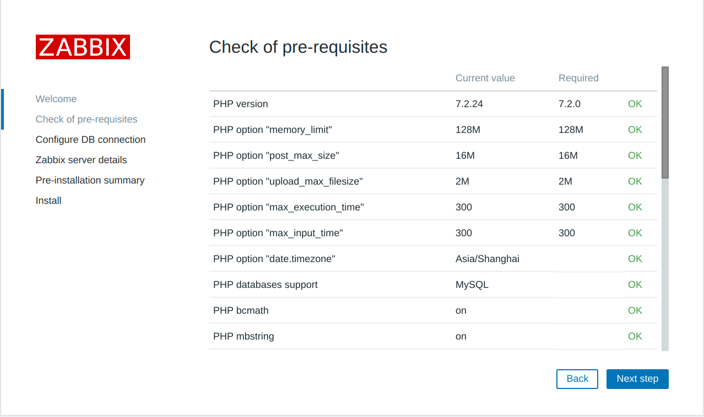
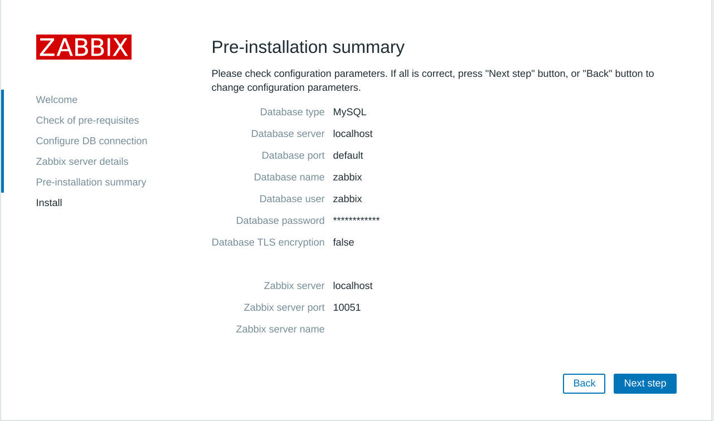

# centos7 + zabbix5.0 + mysql5.7 + nginx + grafana安装

[TOC]

## 准备centos7 系统

可以使用我们课程提供的全空系统，安装相关必要工具

```sh
yum install wget vim gcc*-y
```


## 安装mysql5.7数据库

```sh
# 直接安装
wget -i -c http://dev.mysql.com/get/mysql57-community-release-el7-10.noarch.rpm
yum -y install mysql57-community-release-el7-10.noarch.rpm

# 上面操作亦可为
rpm -Uvh http://dev.mysql.com/get/mysql57-community-release-el7-10.noarch.rpm


yum -y install mysql-community-server

# 启动mysql
systemctl start  mysqld.service

# 查看状态
systemctl status mysqld.service

# ============
# 修改my.cnf
# ============
vi /etc/my.cnf
# 添加validate_password_policy配置 0（LOW），1（MEDIUM），2（STRONG）
validate_password_policy=0
# 关闭密码策略
validate_password = off
# 设置字符集
[mysqld]
character_set_server=utf8
init_connect='SET NAMES utf8'

# ------------
# 重启mysql
systemctl restart mysqld


# =============
# 下面开始数据库配置
# =============
# 获取密码
grep "password" /var/log/mysqld.log

# 第一次登录输入上一步看到密码
mysql -uroot -p

# 修改密码
ALTER USER 'root'@'localhost' IDENTIFIED BY '你的新密码';

quit;

# 重启mysql
systemctl restart mysqld

# 配置数据库开机启动
systemctl enable mysqld
```

## 安装zabbix及相关配置

```sh
# 安装fping(可选)
wget http://fping.org/dist/fping-5.0.tar.gz
tar -xzvf fping-5.0.tar.gz
cd fping-5.0 
./configure --prefix=/usr/local/fping && make && make install

sed -i '1i\export PATH=$PATH:/usr/local/fping/sbin' /etc/profile && source /etc/profile
echo "export PATH=$PATH:/usr/local/fping/sbin" >> /etc/bashrc

# 查看版本
fping -v
```

安装zabbix-server 和zabbix-agent

```sh
rpm -Uvh http://repo.zabbix.com/zabbix/5.0/rhel/7/x86_64/zabbix-release-5.0-1.el7.noarch.rpm
#or 
wget http://repo.zabbix.com/zabbix/5.0/rhel/7/x86_64/zabbix-release-5.0-1.el7.noarch.rpm
yum install zabbix-release-5.0-1.el7.noarch.rpm -y


wget http://repo.zabbix.com/zabbix/5.0/rhel/7/x86_64/zabbix-server-mysql-5.0.6-1.el7.x86_64.rpm
yum install zabbix-server-mysql-5.0.6-1.el7.x86_64.rpm -y


yum install zabbix-agent-5.0.6-1.el7.x86_64.rpm -y

yum install centos-release-scl -y

```

修改配置文件zabbix.repo

```sh
vim /etc/yum.repos.d/zabbix.repo

[zabbix-frontend]
...
enabled=1
...
```

安装zabbix frontend

```sh
yum install zabbix-web-mysql-scl zabbix-nginx-conf-scl -y
```

配置数据库

```mysql
mysql -uroot -p

mysql> create database zabbix character set utf8 collate utf8_bin;
mysql> create user zabbix@localhost identified by 'zabbix123456';
mysql> grant all privileges on zabbix.* to zabbix@localhost;
mysql> quit;
```

初始化数据库(**时间可能有点长，千万不要中断**)

```mysql
zcat /usr/share/doc/zabbix-server-mysql-5.0.6/create.sql.gz |mysql -uzabbix -p zabbix

密码：zabbix123456
```

配置zabbix-server

```sh
vim /etc/zabbix/zabbix_server.conf

DBPassword=zabbix123456
```

配置前端php

```sh
vim /etc/opt/rh/rh-nginx116/nginx/conf.d/zabbix.conf

listen 80;
server_name 机器的ip地址;

# 去掉这两个前面的注释
```

配置启用nginx

```sh
vim /etc/opt/rh/rh-php72/php-fpm.d/zabbix.conf

listen.acl_users = apache,nginx

# 配置时区，去掉前面的注释
php_value[date.timezone] = Asia/Shanghai
```

启动所有服务

```sh
systemctl restart zabbix-server zabbix-agent rh-nginx116-nginx rh-php72-php-fpm

# 配置开机启动
 systemctl enable zabbix-server zabbix-agent rh-nginx116-nginx rh-php72-php-fpm
```


## 访问zabbix前端

浏览器访问  http://机器IP 








## grafana+zabbix

[可参考](/zabbix与grafana结合，监控性能测试服务器/)

```sh
# 下载grafana
wget https://dl.grafana.com/oss/release/grafana-7.1.3-1.x86_64.rpm

# 安装grafana
sudo yum install grafana-7.1.3-1.x86_64.rpm

# 安装插件
grafana-cli plugins install alexanderzobnin-zabbix-app

# 重启grafana
systemctl restart grafana-server
```

再在grafana的平台中，选择plugin管理，选择启用zabbix

再添加database，选择zabbix

在引入模板

## zabbix监控被测服务器

[参考](/prometheus监控服务器)


## zabbix监控模板配置

[参考](/zabbix 监控模板配置)