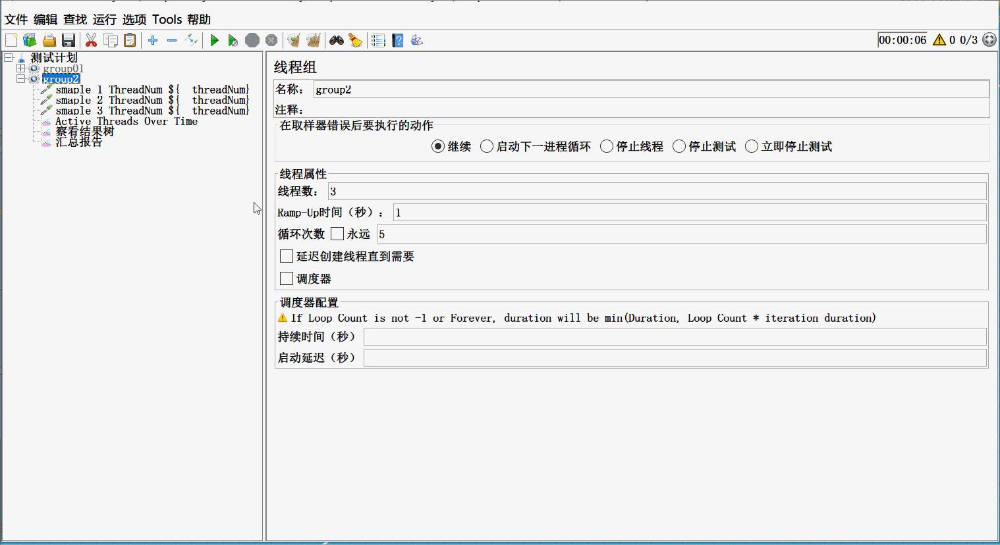
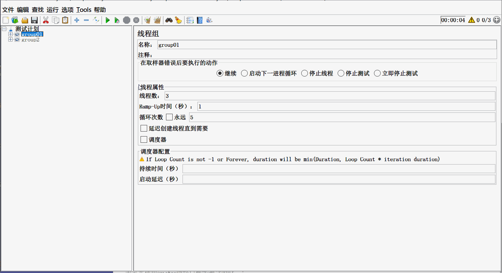
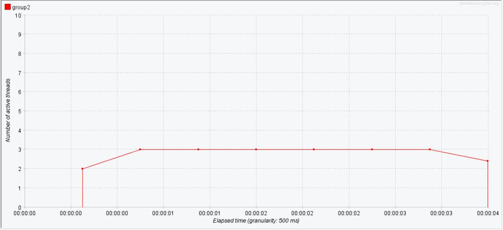
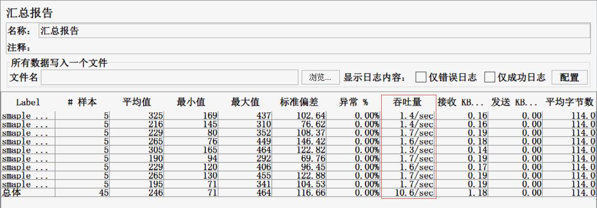
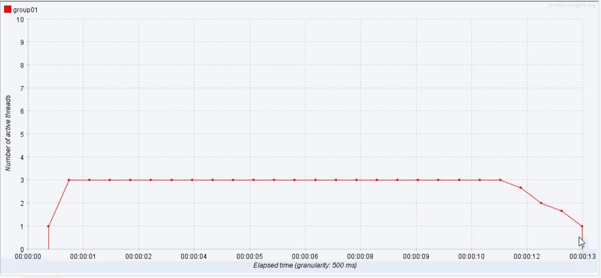
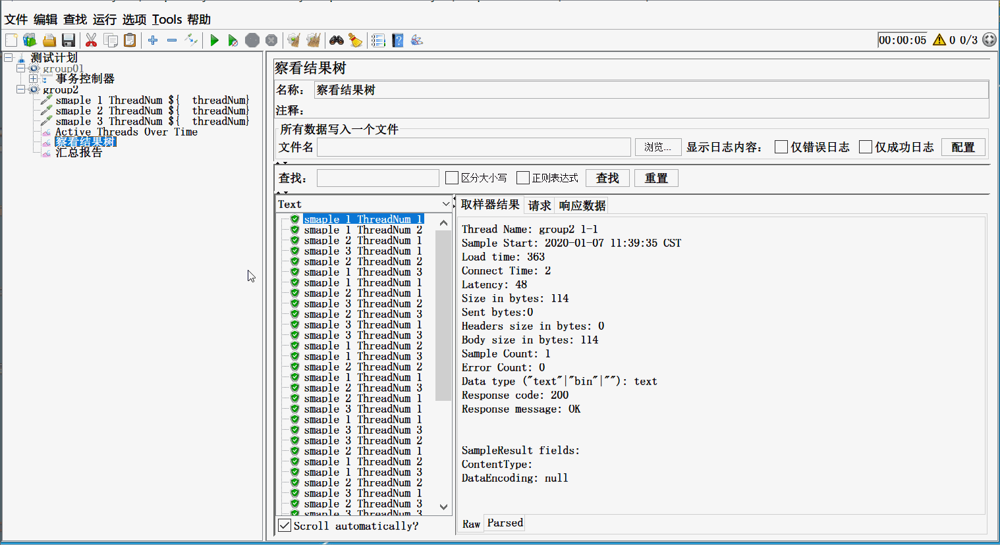
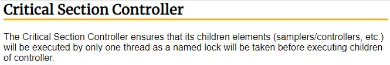
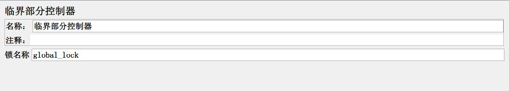
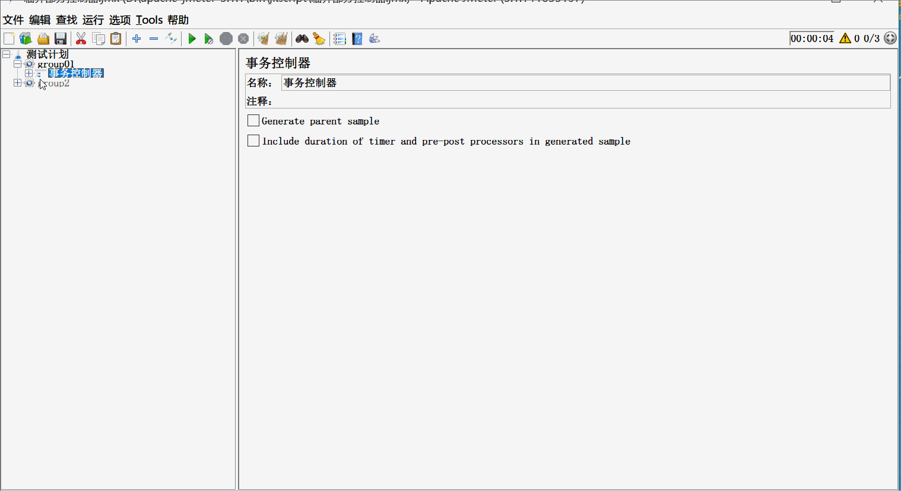
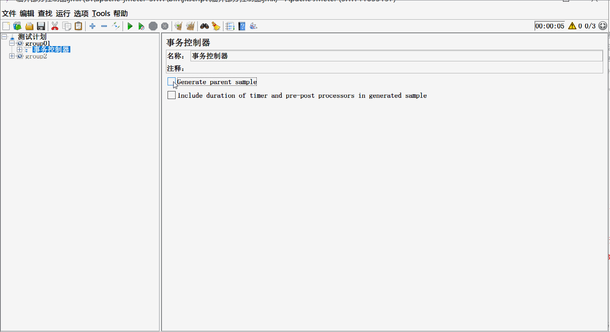

# Critical Section Controller(临界部分控制器)到底该如何用？

​	有同学在使用jmeter做性能测试的时候，有这样一个诉求，就是一个完整的业务包含多个接口请求，且有先后顺序。在做性能测试的时候，要求接口请求顺序永远按照自己定义好的请求顺序执行。

​	于是，他就在jmeter中线程组下按顺序添加了多个接口请求取样器，模拟并发请求调试。看到效果如下图(图一)：

脚本调试是通了，但是，他看到查看结果树中显示请求结果数据好像不是按照顺序请求(没有仔细去分析，根据结果自认为的)，认为这样不符合自己的诉求，于是开始寻找新的办法。通过长时间的摸索，终于找到了一个貌似能解决的办法，增加一个critical section controller(临界部分控制器)，认为增加一个锁，能控制执行顺序。于是修改脚本生成如图(图二):

看到 查看结果树中显示的请求顺序与预期一致，是按照接口的顺序执行的，于是认为这样就是正确的。

**但是**，不知道大家看了这两个图后，有没有注意一个细节？

*第一种方式：*

*第二种方式：*

<u>第一种方式，整个执行过程只用了4秒种，第二种方式，执行过程耗时13秒，汇总报告中的吞吐量是按每分钟计算。*</u>

这句话什么意思呢？就是说，<u>第二种方式</u>，虽然眼睛是看到了查看结果树中的数据是按照自定义的顺序执行的，但是<u>执行时间远远大于第一种方式</u>，换句话说，<u>服务器的压力要远远小于第一种方式</u>。**<u>人为的方式导致性能测试指标值错误</u>**。

**哪我们应该怎么做呢？**

首先，对于这样一种，遇到问题时，自主思考和学习的行为能力，还是值得表扬和肯定的。只是，需要学习的时候，再深入一点点，再细致一点点。

接下来，我们讲讲该怎么做。首先，我们要知道，<u>在jmeter中，同层级无逻辑控制器控制的取样器，执行顺序是从上往下，顺序执行的</u>。这句话，怎么理解？在我们单个用户脚本调试阶段，执行顺序是从上往下；在多用户并发时，每一个并发用户(线程),也都是从上往下执行的，只是因为是并发，同一时刻，可能有不同用户(线程)做完了不同接口请求，查看结果树只是按照完成时间的先后显示请求结果。为了验证我说的这句话，我们可以再看下下图(图三)

从查看结果树中，我们看ThreadNum号想同的请求，请求的顺序是不是都从sample1 到 sample3。这样，其实已经满足了预期诉求。

哪critical section controller(临界部分控制器)到底怎么用呢？我们先看下官方给我们的解答：

临界部分控制器确保其子元素(采样器\控制器等)将仅由一个线程执行，在执行控制器的子元素之前先命名一个锁锁定。

说直白点，就是并发请求(线程)这个控制器时，会先根据‘锁名称’生成一个‘锁’，锁定控制器下的所有子元素，等到所有子元素都执行完‘锁’才会释放，下一个请求(线程)才能执行，即，<u>把原本的并发请求的并行处理方式，变成了串行处理</u>。所以，就会看到上面我们说到的第二种方式的时间远远大于第一种方式。哪如何让critical section controller 可以并行处理呢？我们再看看官方给的解释，它说的是，线程执行时，先根据‘锁名称’生成锁，串行，是因为锁名称相同，已经被占用，无法生成新的锁，所以只能等待锁的释放，哪我们是不是可以考虑让锁名称变成动态的呢？每个线程要用的时候，生成一个新的锁名称而且不重复，是不是就可以并行处理了。想要锁名称变成动态，方法很多，使用随机数函数、使用时间戳函数、使用线程数函数......, 是不是很多，只要用个自动生成值的函数就可以。

这个，就是修改了critical section controller的锁名称为动态值，当某个线程调用时，就会自动生成一个新的锁名称。看最后执行的时间5秒，汇总报告中的吞吐量，是不是和第一种方式基本相同？

当然，有的同学比较追求完美，就是想看到最后的结果一定要按顺序展示。没问题，满足你的要求。

是不是，看到结果也是你指定的顺序，执行的时间也和第一种相同，最后的汇总报告中，看到了一个事务总数据。

好了，critical section controller(临界部分控制器)的使用，你是否已经掌握了呢？

---
> 获得更多有趣有料的软件测试技能，欢迎关注 **柠檬班**微信公众号。

