# docker容器化grafana+influxdb监控平台

## 创建grafana容器

```shell
docker run -itd --name=grafana -p 3100:3000 grafana/grafana
```

## 创建influxdb容器

```sh
# 下载镜像
docker pull influxdb:1.7-alpine

# 创建容器
docker run -itd --name influxdb1.7 -p 8806:8086 -v $PWD:/var/lib/influxdb influxdb:1.7-alpine
```

## 平台配置

访问grafana管理台： http://192.168.114.129:3100	账户/密码：admin/admin

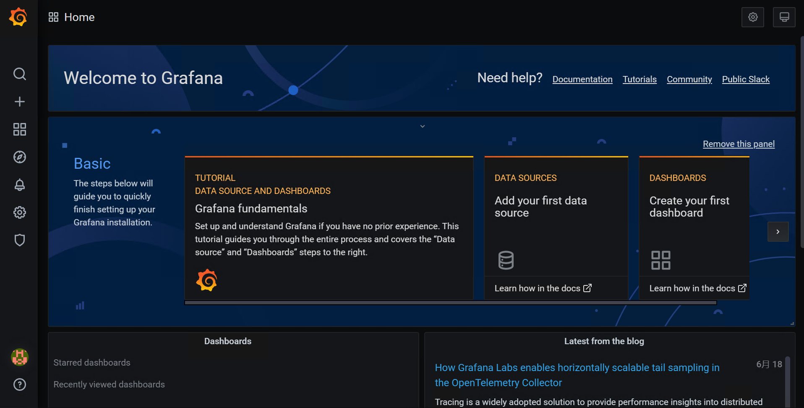

### 第1步，添加数据库

add your first data source

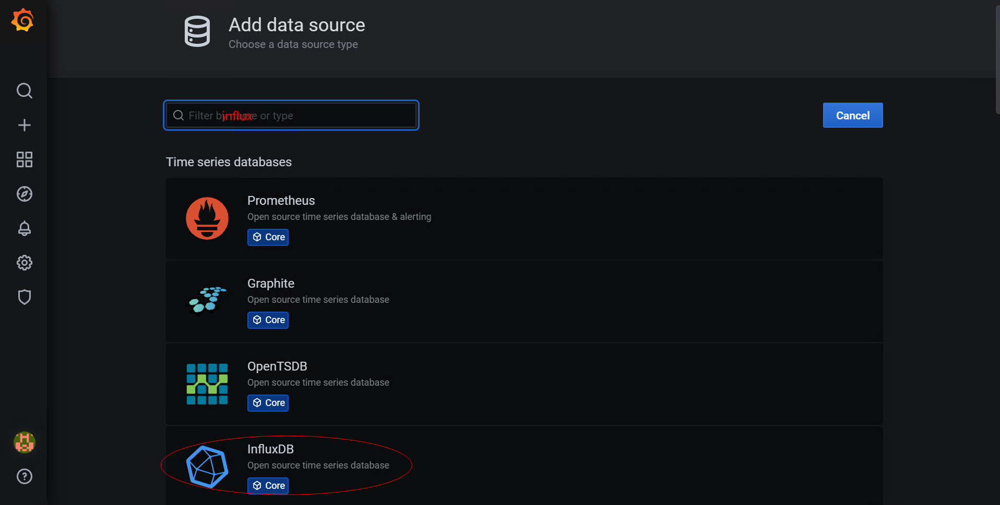

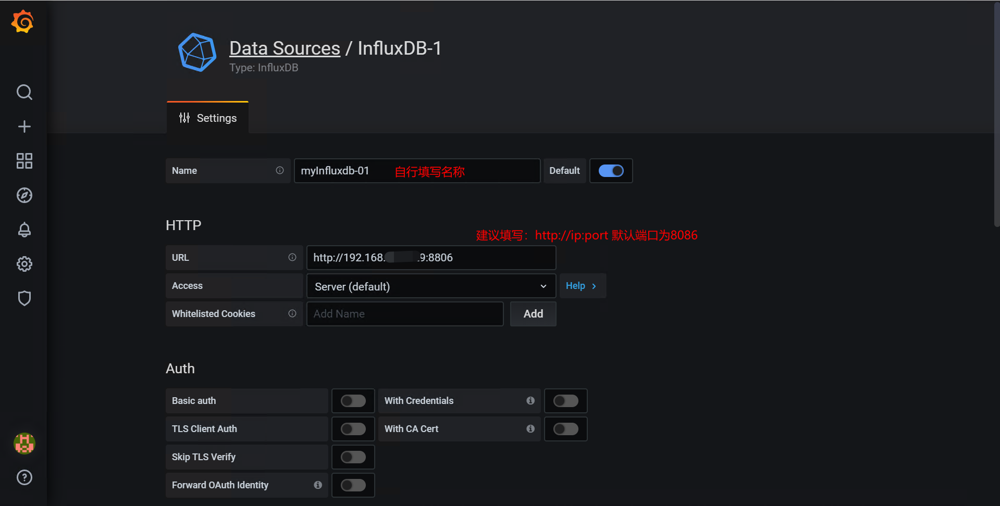

向下滚动，填写数据库的名称为：**jmeter**， 然后点击‘Save & Test’

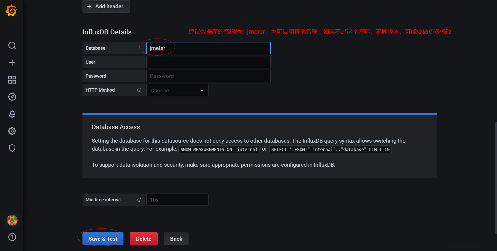

提示：


意思是，没有jmeter这个数据库。

在influxdb中创建jmeter数据库：

**方法1：**

在宿主机中执行：

```sh
[root@localhost]# curl -G http://localhost:8806/query --data-urlencode "q=CREATE DATABASE jmeter"

# 8806的端口要根据创建influxdb容器时，映射端口进行变更。默认是8086
# 执行后，有个警告提示信息，可以忽略，数据库已经创建成功
```

**方法2：**

通过influxdb容器，执行influx命令方式创建：

```sh
[root@localhost]# docker exec -it influxdb1.7 influx
>
> create database jmeter;
>
> show databases;
>
> exit

# influxdb1.7 为创建influxdb容器的名称
# create database 创建数据库，后面跟数据库名称
# show databases 显示所有数据库
# exit 退出
```

### 第2步，创建数据展示面板

Create your first dashboard

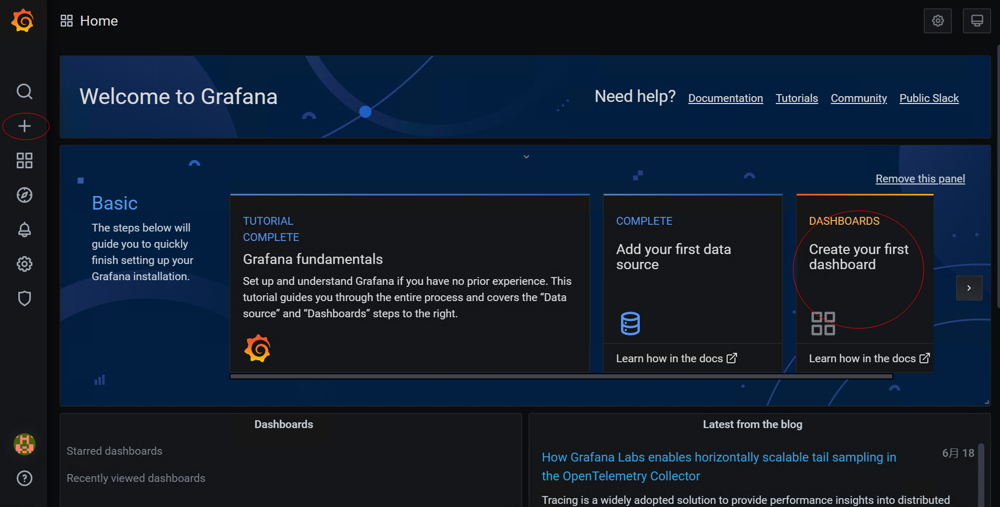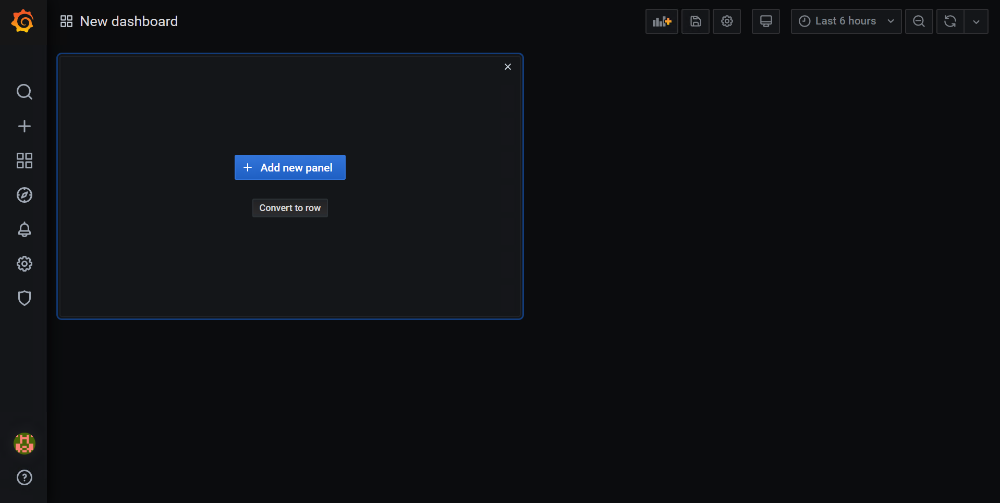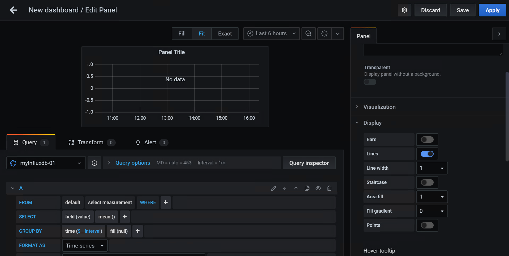

这就创建了一个面板，用于展示数据。

对于，一些看懂了这个图的，可能知道，这个就是在里面写select语句，就能展示数据了，但是，如果没有看懂，或者不知道写select语句的同学，可能就会觉得这个太没意思了，对吧！

那好，接下来，我就教大家怎么使用高大上的DashBoard面板。

首先，我们回到首页，点击左侧快捷菜单图标 + 选择，import

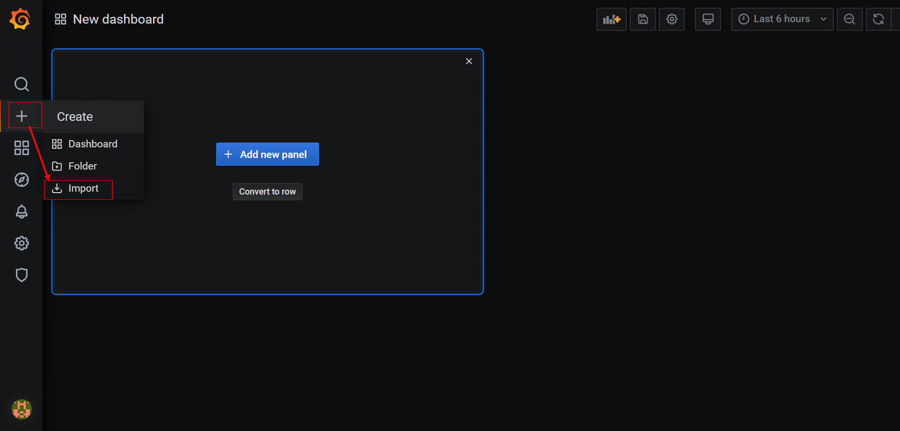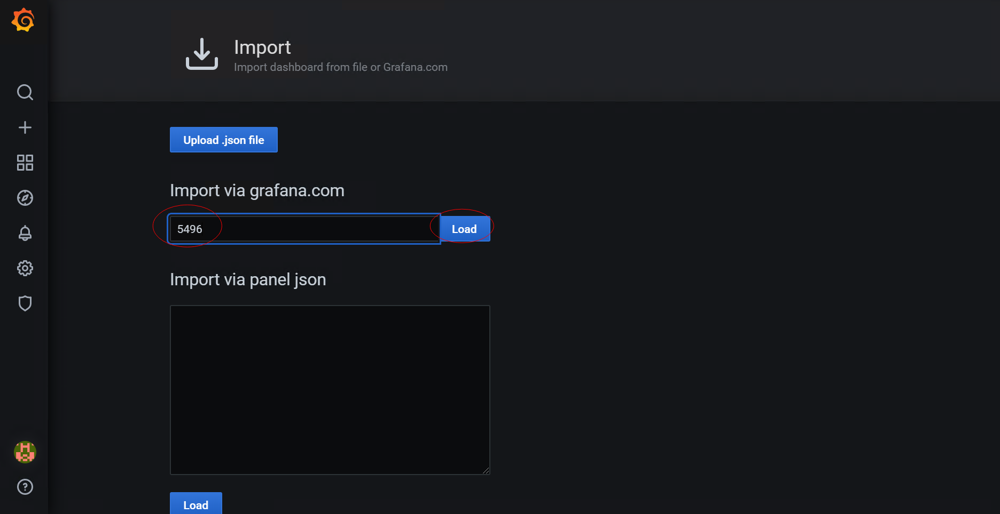

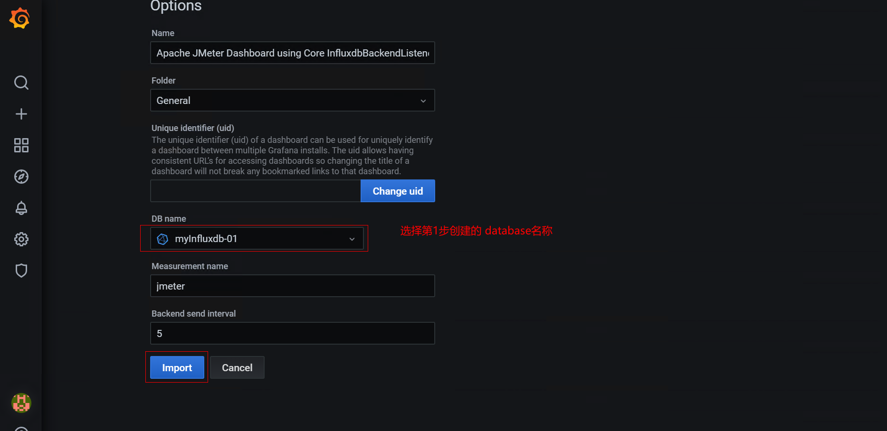

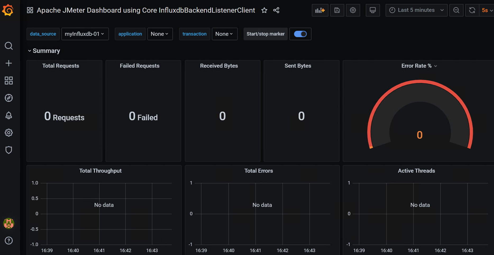

想要获取其他模板，可以访问：https://grafana.com/grafana/dashboards?dataSource=influxdb&search=jmeter&orderBy=name&direction=asc

至此，我们的监控平台已经搭建好了。接下来要做的就是要和jmeter结合，展示性能数据了。