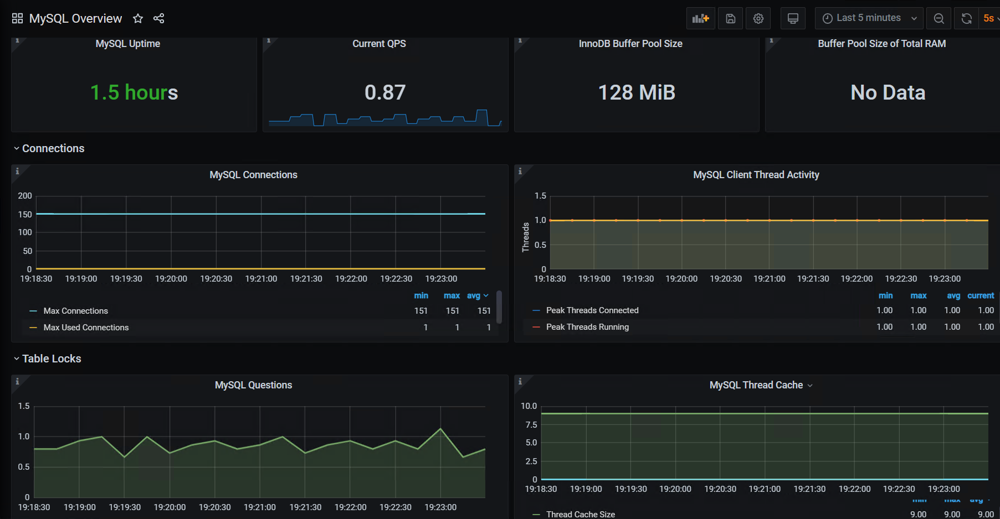

# 史上最容易的mysql数据库性能测试监控平台搭建--柠檬班独家发布

数据库作为数据存储软件，在现在企业项目中，得到普遍应用，而mysql作为免费的开源版本，更是得到大量企业的青睐，成为主流存储数据库。而数据库的性能，很大程度上，会影响项目应用服务的性能，所以，企业对mysql数据库的性能是非常关注的。

今天，我们虽然不是讲解mysql数据库的性能测试，但是，监控，作为性能测试或日常数据库维护必须的一环，我们还是有必要认真学习一下的。

说到mysql数据库的监控，可能很多人，第一反应会是jprofile监控。但是，我不推荐。因为，我们有更方便，简单易上手的监控平台，就是我们今天讲的grafana+prometheus监控平台监控数据库。通过浏览器访问监控平台，可以看到如下图：



为了让零基础的同学，也能分分钟掌握这项技术，我们从安装数据库，搭建监控平台，一步步讲起。

## 创建环境

```sh
# 创建一个docker网络
docker network create monitor-network

# 创建一个mysql数据库
docker run -itd --name mysql_575 --network=monitor-network -p 3366:3306 -e MYSQL_ROOT_PASSWORD=123456 daocloud.io/library/mysql:5.7.5
```

完成这一步，你已经用docker，创建了一个5.7.5版本的mysql数据库，名称叫‘mysql_575’，数据库的root账户密码为123456，数据库外部访问端口为3366，可以用客户端工具，直接连接使用了。

接下来，我们搭建grafana+prometheus的监控平台

```sh
# 创建grafana容器
docker run -itd --name docker-grafana --network=monitor-network -p 3300:3000 grafana/grafana

# 创建prometheus容器
docker run -itd --name docker-prometheus --network=monitor-network -p 9990:9090 prom/prometheus
```

执行完这两个命令，我们的监控平台环境就已经安装好了

接下来，我们就安装数据库的监控

```sh
# 创建mysqld-exporter容器
docker run -itd -p 9114:9104 --name=my_exporter --network=monitor-network -e DATA_SOURCE_NAME="root:123456@(mysql容器的hostname:3306)/" prom/mysqld-exporter
```

> mysql容器的hostname，可以通过 ` docker inspect mysql_575`  查看到；
>
> ‘mysql_575’是我们安装的数据库的名称，也可以用查看到的IPAddress值
>
> 命令设置了监控工具外部访问端口为 9114
>
> 命令中 root:123456 是数据库安装root账户和密码 

可以通过浏览器访问 http://安装了mysqld-exporter的机器ip:9114  ，如果能正常访问且显示数据，说明数据库的监控已经安装好。

> 注意： 浏览器要能正常访问，需要服务器上开放9114端口

此时，我们环境安装工作就完成了。

接下来，就是配置prometheus收集存储监控数据。

### 配置prometheus

从容器中拷贝出prometheus的配置文件

```sh
# 从Prometheus容器中拷贝配置文件到宿主机
docker cp docker_prometheus:/etc/prometheus/prometheus.yml $PWD
```

> docker_prometheus 是上面创建prometheus容器时 name后面的值

修改配置文件

```sh
# 修改prometheus.yml，在文件对底下，参照如下信息配置，注意书写格式
vim prometheus.yml


scrape_configs:
  - job_name: 'prometheus'
    static_configs:
      - targets: ['localhost:9090']
 
  - job_name: 'mysql-exporter'
    static_configs:
      - targets: ['mysqld-export容器ip:9104']
```

> `docker inspect my_exporter `可以查看到mysql-exporter容器的IPAddress信息； my_exporter是上面安装数据库监控命令中name的值

把修改后的配置文件，拷贝到容器中，重启，使其生效

```sh
# 把修改后的Prometheus配置文件拷贝到容器中
docker cp $PWD/prometheus.yml docker_prometheus:/etc/prometheus/prometheus.yml

# 重启动prometheus容器
docker restart docker-prometheus
```

配置后，可以通过浏览器访问  http://安装了prometheus的机器ip:9090  如果页面能正常访问，说明配置修改正常。

> 注意： 浏览器要能正常访问，需要服务器开放9090端口

现在，环境与配置文件都弄好了，就差在监控平台展示数据了

## 配置granfan+prometheus平台

### Ⅰ、登录grafana

浏览器访问 http://安装了grafana的机器ip:3000 账号密码均为 admin


### Ⅱ、添加prometheus数据源

登录后，在首页点击 ‘Add your fist data source’


在跳转页面，选择Prometheus，填写相关信息


点击back按钮，回到首页

### Ⅲ、引入模板 7362

点击 import


输入7362，点击 load


即可看到数据库实时监控效果


参考 官方