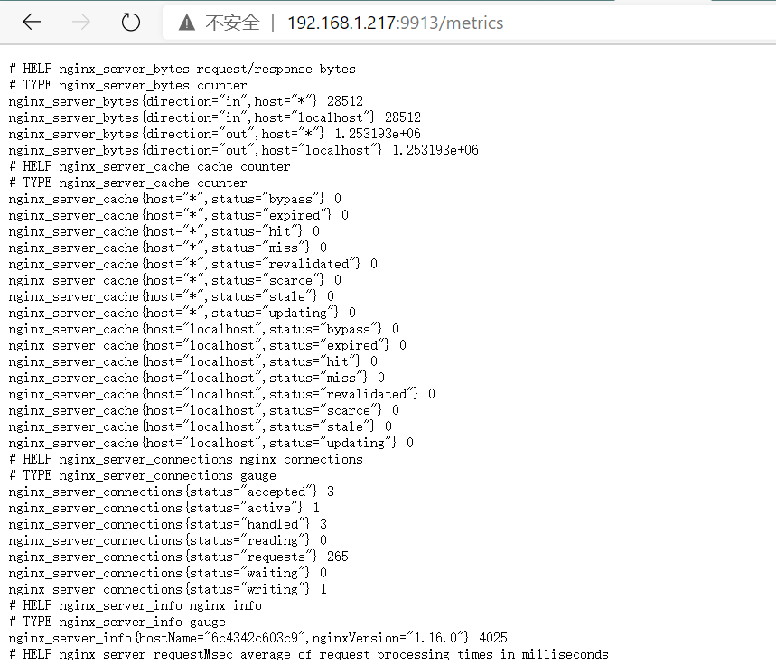
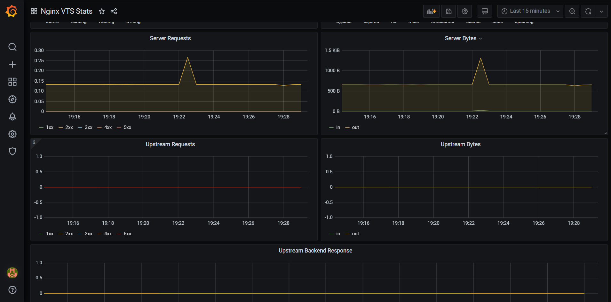

# grafana+prometheus+nginx监控负载均衡
## 安装java项目

```shell
# 安装jdk, 如果已经安装，可以忽略这一步
yum install java-1.8.0-openjdk* -y

# 使用tomcat部署项目

# 复制tomcat，至少要有2个tomcat才方便构建集群

# 修改任意一个tomcat的conf/server.xml文件中的端口，如8080改为8180  其他端口，自行修改
```


## 安装nginx

```shell
yum install make zlib zlib-devel gcc-c++ libtool  openssl openssl-devel -y

# 下载
wget https://sourceforge.net/projects/pcre/files/pcre/8.44/pcre-8.44.tar.gz/download

# 解压
tar -xzvf pcre-8.44.tar.gz

# 进入解压后的文件夹
cd pcre-8.44
./configure
make && make install

# 下载
wget http://nginx.org/download/nginx-1.19.5.tar.gz

# 解压
tar -xzvf nginx-1.19.5.tar.gz

# 进入nginx解压后的文件夹
# 注意：如果命令后面增加了 --add-module 参数，则要先执行下面的下载nginx-module-vts操作
./configure --prefix=/usr/local/nginx --with-http_stub_status_module --with-http_ssl_module --add-module=/opt/nginx-module-vts/

make && make install

# 启动nginx
/usr/local/nginx/sbin/nginx
# 重新加载nginx配置
/usr/local/nginx/sbin/nginx -s reload
```


## 安装nginx-vts-export

```shell
yum install git -y
cd /opt
git clone https://gitee.com/mirrors/nginx-module-vts.git
# 在编译nginx的时候，增加了--add-module参数，这个地方的路径要和哪里一致

# 下载0.10.3版本
wget https://github.com/hnlq715/nginx-vts-exporter/releases/download/v0.10.3/nginx-vts-exporter-0.10.3.linux-amd64.tar.gz

tar -xzvf nginx-vts-exporter-0.10.3.linux-amd64.tar.gz
```


## 配置nginx

```ini
vim /usr/local/nginx/conf/nginx.conf

# 配置类似如下修改

http {
	...
    vhost_traffic_status_zone;
    vhost_traffic_status_filter_by_host on;

    ...
    
	upstream web_app {
 	server 127.0.0.1:8080 weight=1 max_fails=2 fail_timeout=30s;
	server 127.0.0.1:8180 weight=1 max_fails=2 fail_timeout=30s;
	}
	
	...
	
    server {

        ...

        location /status {
            vhost_traffic_status_display;
            vhost_traffic_status_display_format html;
        }
        location / {
            proxy_next_upstream http_502 http_504 error timeout invalid_header;
            proxy_set_header Host  $host;
            proxy_set_header X-Real-IP $remote_addr;
            proxy_set_header X-Forwarded-For $proxy_add_x_forwarded_for;
            proxy_pass http://web_app;
            root   html;
            index  index.html index.htm;
        }
		...
    }
}
```

+ vhost_traffic_status_filter_by_host on; 开启此功能，在nginx配置有多个server_name是，会根据不同的server_name进行流量统计，否则默认把流量全部计算到第一个server_name上。

```shell
# 验证nginx配置文件修改是否正确, 如果出现，请求根据错误修改
/usr/local/nginx/sbin/nginx -t

# 重新加载nginx配置文件
/usr/local/nginx/sbin/nginx -s reload
```


## 启动nginx-vts-export

```shell
# 进入nginx-vts-export解压后的文件夹
cd nginx-vts-exporter-0.10.3.linux-amd64

# 运行
nohup ./nginx-vts-exporter -nginx.scrape_uri=http://localhost/status/format/json &
```


启动服务后，可以通过浏览器访问 http://ip地址:9913/metrics   查看是否有收集nginx数据

**注意：** 如果页面不能访问，说明nginx-vts服务部正常，请确认服务和网络； 如果能访问，但是页面只有少量几行数据，说明没有收集到监控数据，请重复上面的 **安装nginx**  和 **下面的 配置nginx** 操作




## 安装docker--可选安装

**注意：** 是否安装docker为可选，下面有使用docker安装相关工具方法

```shell
curl -fsSL https://get.docker.com | bash -s docker --mirror Aliyun

# docker加速
 /etc/docker/daemon.json
 {"registry-mirrors":["https://reg-mirror.qiniu.com/"]}
```


## 安装prometheus

方法一：直接安装

```shell
# 下载最新的包
wget https://github.com/prometheus/prometheus/releases/download/v2.20.1/prometheus-2.20.1.linux-amd64.tar.gz

# 解压包
tar -xzvf prometheus-2.20.1.linux-amd64.tar.gz

# 进入解压后的文件夹
cd prometheus-2.20.1.linux-amd64/

# 启动服务
./prometheus
```

方法二：docker安装

```shell
# 拉取镜像，创建容器
docker run -itd --name 容器名称 -p 9090:9090 prom/prometheus

# 重启容器
docker restart 容器名
```


启动服务后，可以通过浏览器访问 http://ip地址:9090 访问

## 修改prometheus.yml文件

```shell
# 进入prometheus解压的文件夹
vim prometheus.yml

- job_name: 'nginx-vts'
  static_configs:
  - targets: ['被监控机器ip:9913']
  
```

**注意：**修改了prometheus的配置文件，需要重启prometheus才能生效

```shell
# 先检查prometheus服务是否启动，如果启动，请先停止

# 在prometheus解压的文件夹中，启动prometheus服务
nohup ./prometheus &
```


## 安装grafana

方法一：直接安装

```shell
wget https://dl.grafana.com/oss/release/grafana-7.3.3-1.x86_64.rpm
sudo yum install grafana-7.3.3-1.x86_64.rpm -y

# 启动grafana服务
service restart grafanan-server
```


方法二：docker安装

```shell
# 下载镜像
docker pull grafana/grafana

# 创建容器
docker run -itd --name=grafana --restart=always -p 3000:3000 -v $PWD/grafana-storage:/var/lib/grafana grafana/grafana
```


安装成功后，启动grafana服务，即可用浏览器访问 http://ip:3000 账户密码均为 admin 登录

### grafana添加prometheus数据源

登录grafana，进入**add data source**， 选择prometheus

只需要在页面HTTP的**URL**地址中填写： http://localhost:9090   localhost代表prometheus的机器ip，然后点击页面最底部的 **Save & Test**  ，如果页面提示信息为绿色，说明数据源添加成功。

### 引入模板

在grafana菜单中点击 **import**， 在页面第1个文本框中输入 **2949** 然后点击 **load**  面板即被引入。

在跳转的页面中，可以调整右上角的时间区段，从而可以看到页面中的数据图表。




[参考](https://www.cnblogs.com/JustinLau/p/11336412.html)