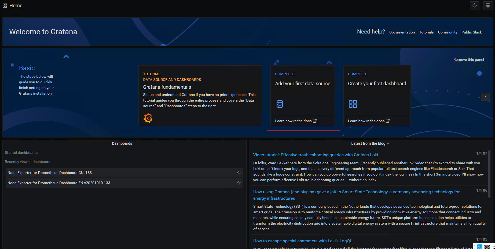
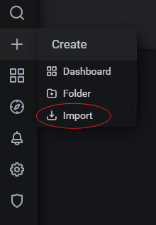
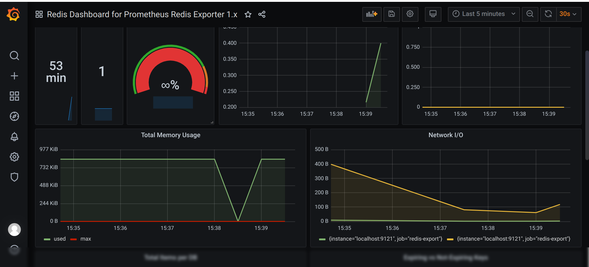

# grafana+prometheus+redis 监控缓存数据库

## 下载安装grafana

在centos7系统中，直接安装grafana

```shell
# 下载安装grafana
wget https://dl.grafana.com/oss/release/grafana-7.3.3-1.x86_64.rpm
sudo yum install grafana-7.3.3-1.x86_64.rpm -y
```

启动grafana服务

```shell
# 启动服务
systemctl restart grafana-server
```


## 下载安装prometheus

下载prometheus源码包

```shell
# 通过源码包使用
wget https://github.com/prometheus/prometheus/releases/download/v2.20.1/prometheus-2.20.1.linux-amd64.tar.gz

# 解压包
tar -xzvf prometheus-2.20.1.linux-amd64.tar.gz

# 进入解压后的文件夹
cd prometheus-2.20.1.linux-amd64/

# 后台启动服务
nohup ./prometheus &
```


## 下载安装redis

在centos7中直接安装redis

```shell
# centos7安装redis
$ yum install gcc-c++ make -y

# 通过gcc -v 可以看到此时gcc的版本的为4.8.5，但是redis6+需要gcc的版本大于5.3，所以需要升级gcc
# 升级gcc
$ yum -y install centos-release-scl
$ yum -y install devtoolset-9-gcc devtoolset-9-gcc-c++ devtoolset-9-binutils
$ scl enable devtoolset-9 bash
$ echo "source /opt/rh/devtoolset-9/enable" >>/etc/profile
# 此时，通过gcc -v 看到gcc的版本应该是在9以上

$ wget http://download.redis.io/releases/redis-6.0.8.tar.gz
$ tar xzf redis-6.0.8.tar.gz
$ cd redis-6.0.8
$ make

# 后台启动
$ nohup src/redis-server &
```


## 下载安装redis_exporter

从github上下载redis_exporter源码包

```shell
# 下载
wget https://github.com/oliver006/redis_exporter/releases/download/v1.17.1/redis_exporter-v1.17.1.linux-amd64.tar.gz

# 解压
tar xzf redis_exporter-v1.17.1.linux-amd64.tar.gz

# 启动
cd redis_exporter-v1.17.1.linux-amd64
nohup ./redis_exporter &
```


## 配置prometheus

修改prometheus.yml文件

```shell
# 修改配置文件
vim prometheus.yml
  - job_name: 'prometheus'

    # metrics_path defaults to '/metrics'
    # scheme defaults to 'http'.

    static_configs:
    - targets: ['localhost:9090']
  - job_name: 'redis-export'
    static_configs:
    - targets: ['localhost:9121']
```

**重启prometheus**

## 配置grafana监控平台

浏览器访问 http://grafana的ip:3000  登录账号密码：admin


在首页，选择 add you first database，选择prometheus，填写信息确定保存



左侧菜单栏 import 



输入模板id 763，确定




 


