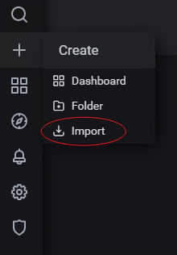

# 使用docker搭建granfana+prometheus监控平台监控测试服务器资源

互联网发展的今天，人们对互联网产品的用户体验要求也越来越高，企业为了能提供更优质的用户体验，就会绞尽脑汁想尽各种办法。而对于服务器的资源监控，搭建一个资源监控平台，就是一个很好的维护优质服务的保障平台。利用监控平台，监控服务器资源的使用情况，实时查看用户在使用企业产品服务时，基础支撑能力情况，发现监控异常，能够第一时间做出相应的调整决策，从而保障提供用户优质体验。

今天，就给大家讲解一种基于目前企业普遍使用的技术，快速搭建一个非常前沿、高大上的监控平台：**docker + grafana + prometheus**


## docker

docker相信大家都已经在用了，因为现在大多企业中都在用。使用它来搭建环境，相比传统方式，速度要快非常非常多，同时，服务运行起来后，对资源的消耗也少很多，而且还能方便对各种服务进行定向扩容。而它的安装也非常的简单，准备一台linux机器，如centos7，只需要执行两个命令，就可以安装成功。

> <font color="red">**注意**</font>： 下面没有特别说明，默认linux机器防火墙是关闭的；linux机器与被测服务器网络是通的。

```sh
# centos7 安装docker
# 安装依赖
yum install -y yum-utils device-mapper-persistent-data lvm2

# 安装docker
curl -fsSL https://get.docker.com | bash -s docker --mirror Aliyun

# 设置开机启动
systemctl enable docker
```

## prometheus

Prometheus是一套开源的监控+预警+时间序列数据库的组合，现在越来越多的公司或组织开始采用Prometheus，现在常见的kubernetes容器管理系统，也会搭配Prometheus来进行监控。

Prometheus本身不具备收集监控数据功能，需要使用http接口来获取不同的export收集的数据，存储到时序数据库中。

使用docker方式安装Prometheus非常的简单

```sh
# 下载Prometheus镜像
docker pull prom/prometheus

# 创建Prometheus容器
docker run -itd --name=docker_prometheus --restart=always -p 9090:9090 prom/prometheus
```

容器创建成功后，即可通过浏览器访问 http://prometheus机器ip:9090 查看


### grafana

Grafana是一个跨平台的开源的度量分析和可视化工具，可以通过将采集的数据库查询后可视化的展示，并及时通知。官方提供了非常多的可视化模板，根据不同的数据源，选择不同的插件或模板即可。

使用docker安装，也是非常非常简单

```sh
# 下载镜像
docker pull grafana/grafana

# 创建容器
docker run -itd --name=grafana --restart=always -p 3000:3000 -v $PWD/grafana-storage:/var/lib/grafana grafana/grafana
```

容器创建成功后，即可通过浏览器访问  http://grafana机器ip:3000，默认账号密码都是：admin


## node_export

node_export是Prometheus的一个export，主要是用来收集服务器硬件资源使用情况的。所以这个往往会部署再被监控的服务器上。即：grafana、Prometheus会独立部署在一台机器上，node_export则被部署在被监控的服务器上，收集被监控的服务器资源数据，给Prometheus，然后再通过grafana展示出来。

node_export部署在被监控的服务器上，可以根据服务器的实际情况，选择直接安装，还是用docker安装。

+ 服务器上直接安装node_export
  + 首先，用浏览器访问： https://github.com/prometheus/node_exporter/releases  这里能获得node_export所有的发布版本，可以根据自己服务器的实际情况，选择要下载的包
  + 下载包后，上传到被监控的服务器上，解压
  + 进入解压文件夹，直接启动  `./node_exporter`

+ 服务器上用docker安装node_export

```sh
# 下载镜像
docker pull prom/node-exporter

# 创建容器
docker run -itd --name=node-exporter \
	--restart=always \
	-p 9100:9100  \
	-v "/proc:/host/proc:ro" \
	-v "/sys:/host/sys:ro" \
	-v "/:/rootfs:ro" \
	prom/node-exporter
```

node-exporter部署启动好了后，在服务器的**防火墙上开放9100**端口，则可以通过浏览器访问 http://服务器ip:9100/metrics  查看监控收集的数据。


## 配置Prometheus+node_exporter

prometheus本身没有数据收集功能，需要用node_exporter收集，他们俩之间如何连接在一起呢？这就要修改Prometheus的配置文件，这个文件在Prometheus容器的 /etc/prometheus/prometheus.yml

```sh
# 从Prometheus容器中拷贝配置文件到宿主机
docker cp docker_prometheus:/etc/prometheus/prometheus.yml $PWD
```

修改prometheus.yml文件

```sh
vim prometheus.yml


scrape_configs:
  - job_name: prometheus
    static_configs:
      - targets: ['localhost:9090']
        labels:
          instance: prometheus
 
  - job_name: linux
    static_configs:
      - targets: ['被监控的服务器ip:9100']
        labels:
          instance: localhost
```

<font color="blue"> **注意** </font>：yml文件的编辑，注意格式；想添加多个监控服务器时，可以在中括号中，用逗号分隔写多个

```sh
# 把修改后的Prometheus配置文件拷贝到容器中
docker cp $PWD/prometheus.yml docker_prometheus:/etc/prometheus/prometheus.yml
```

重启Prometheus容器

```sh
docker restart docker_prometheus
```

## 配置Grafana+Prometheus

现在，万事俱备，只欠东风了，只需要配置grafana+prometheus就能看到监控结果了。

用浏览器访问 http://grafana机器ip:3000  登录用户密码：admin

登录后，在首页，选择 "Add your first data source"


选择 Prometheus，填写相关信息


点击back按钮，回到首页

再点击 import




输入12884、9276，点击 load

再页面底部，Prometheus数据库下拉框中，选择自己添加的数据源的名称，点击 import按钮，所有工作就都完成。


