# jmeter如何循环使用接口返回的多值？

有同学在用jmeter做接口测试的时候，经常会遇到这样一种情况，Ⅰ 、<u>*就是一个接口请求返回了多个值，然后下一个接口想循环使用前一个接口的返回值*</u>。

**这种要怎么做呢？**

有一定基础的人，可能第一反应就是先提取前一个接口返回的所有值，然后再用一个循环控制器，循环使用值就可以了啊。

对，非常棒，思路清晰，完全正确，但是做起来真的就这么简单吗？

好，现在加大一点难度，Ⅱ、<u>*我只想循环请求前一个接口返回值中的随机不定长度的某一些值(并不想用全部的)。*</u>

**这样的，好做吗？**

今天，我就和大家讲讲，这两种，我们如何实现。

**第一种**，如：有一个获取用户列表的接口，返回了所有的用户信息，接下来，我就想把所有用户都登录一遍。这种**常见于企业中有一个获取商品列表的接口，就想验证下所有的商品详情信息是否都正常，是否存在无效商品**。我们怎么做呢？

首先，在我们的获取用户信息列表接口，看下接口返回信息的类型和用户手机号码字段名称，如果返回类型时json的，我们就在下面增加一个后置处理器——json提取器或正则提取器，提取所有用户的手机号码信息(

[至于json提取器如何提取所有值，请参阅]: http://www.lemfix.com/topics/965	"jmeter 鲜为人知的 jsonpath 用法"

)。

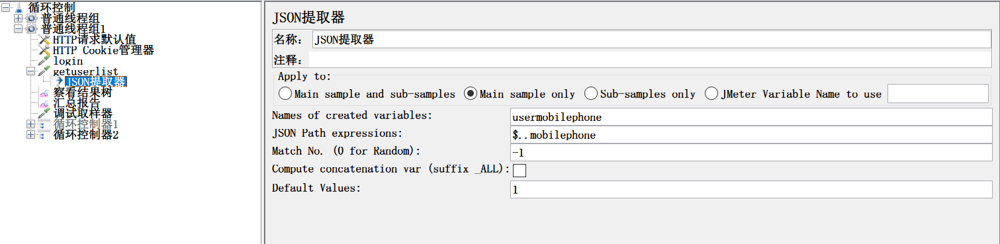

然后，我们再添加一个逻辑控制 > 循环控制器。因为获取的用户手机号码总数可能一直在变，不是一个固定值，所以，循环次数不能使用固定值。*<u>哪这个循环控制循环次数怎么配置呢？</u>*我们要使用上一步，json提取中变量名称加\_matchNr这样的新变量(为什么要加上\_matchNr,请参阅)。

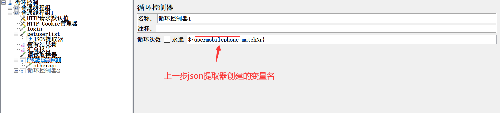

然后，在循环控制器下面挂上下一个接口。那此时又有个新问题了，有了循环次数，<u>*接口每次调用的时候，接口参数中手机号码如何自动更新值呢？*</u> 这个问题，有经验的同学，可能会第一反应说，加个计时器。对，是个好办法。但是，我呢，比较懒，不想去再添加一个计时器配置元件，我就加个计时器函数(如何使用V函数，请参阅)。

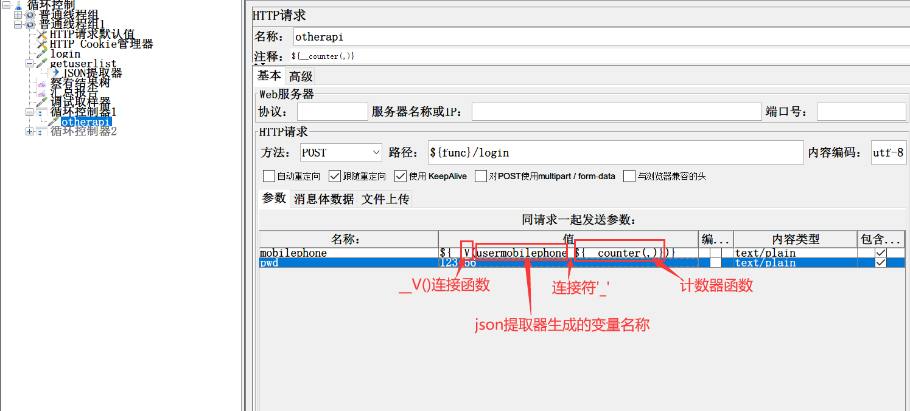

ok，万事俱备，只欠东风。run一下看下。

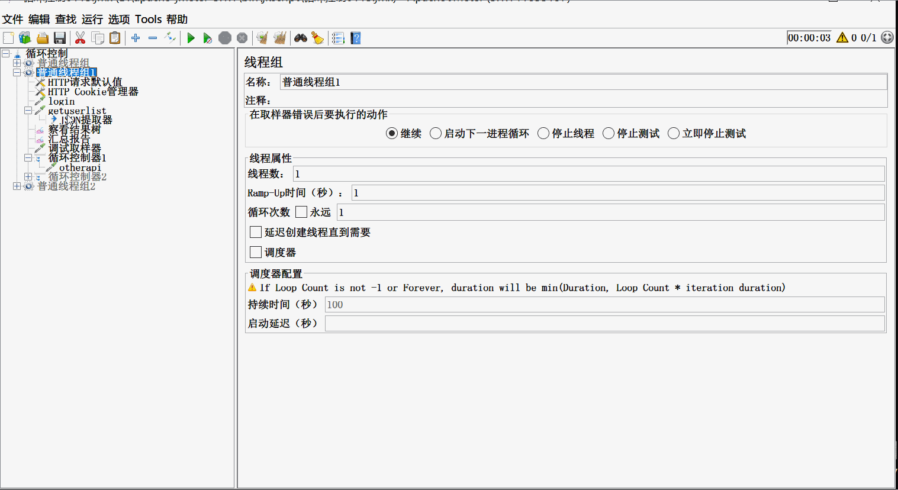

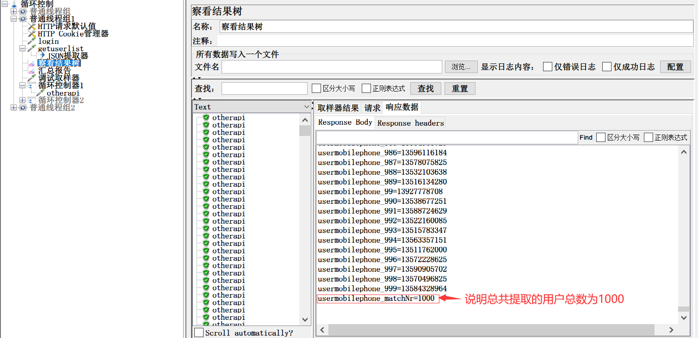

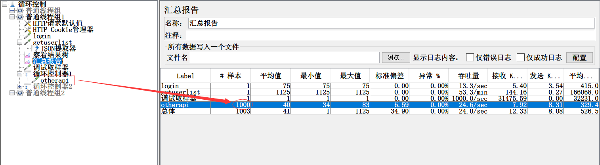

看到了吗？总共有1000个手机号码，最后，汇总报告中，显示的总取样次数也是1000，说明我们的循环写法没有问题。

**第二种**，我们想随机抽取所有用户中的随意长度用户，**常见于企业中商品数量比较多，随机抽检任意多个商品，验证商品详情是否正常。**这样的，我们该如何做呢？

第一步，依然是在获取用户列表接口下面添加后置处理器——json提取器或正则提取器。只是，这次我们的提取写法不一样了。

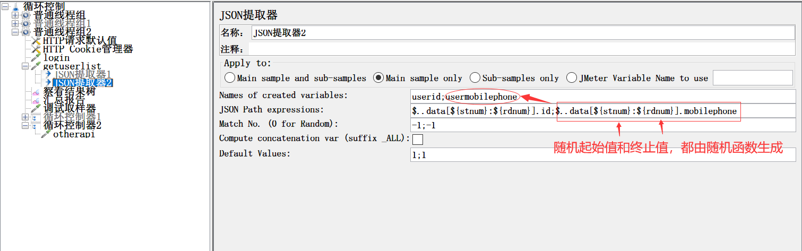

第二步，依然是添加循环控制器，只是，又有一个新问题了，因为都是随机数，起始和终止值之间的差距不确定，<u>*循环次数也就不确定，哪这个循环次数如何设置呢？*</u> 这里我们引入一个intSum求和函数

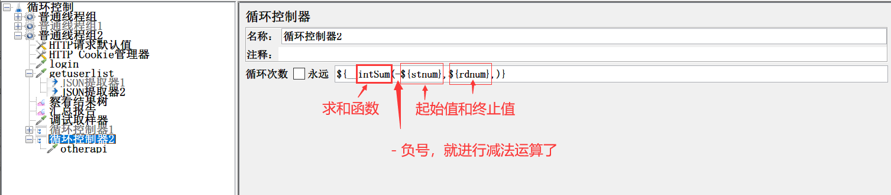

第三步，同第一种方法的第三步完全一样(有同学可能会问，为什么会完全一样呢？留个大家自学研究，动手验证)。

最后，我们也来run一下，看看我们的结果。

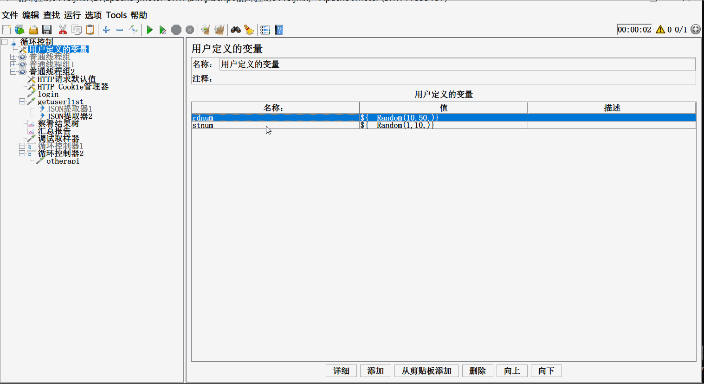

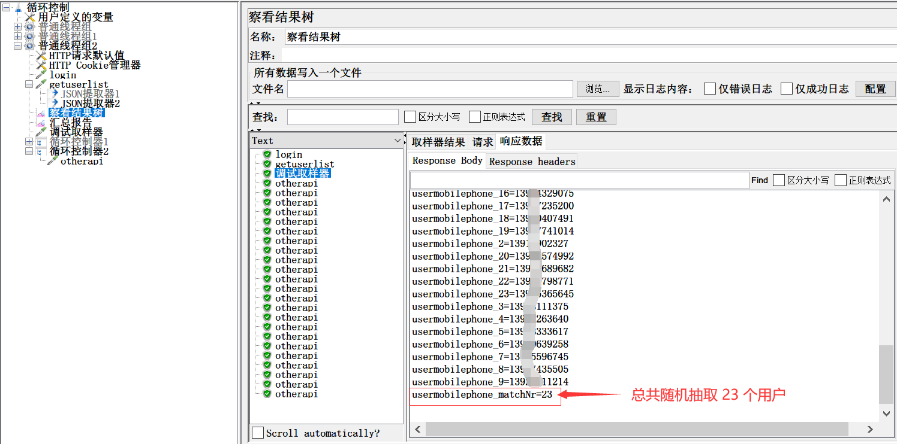

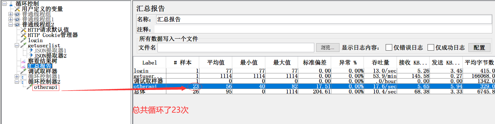

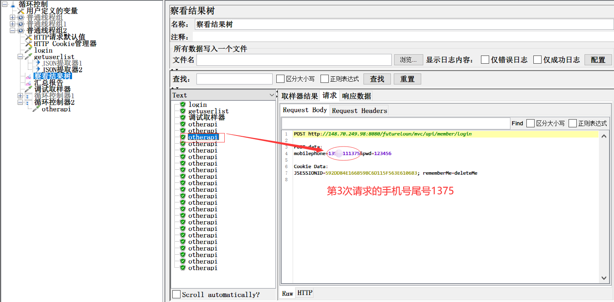

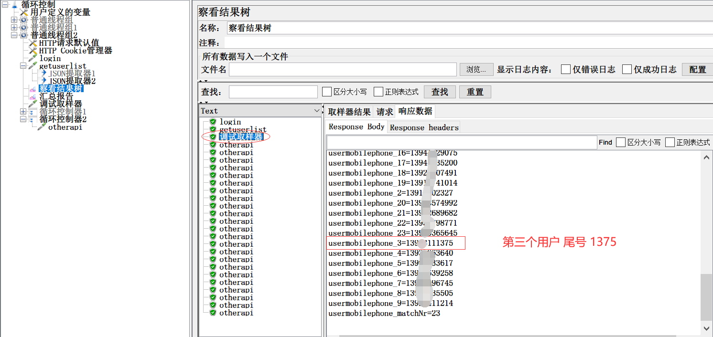

是不是‘碗豆腐’，完美！

好了，这样一个技巧，你是否已经get到了呢？

---
> 更多有趣有料的软件测试技能，欢迎关注 **柠檬班** 微信公众号。