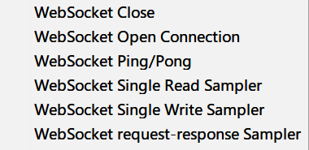
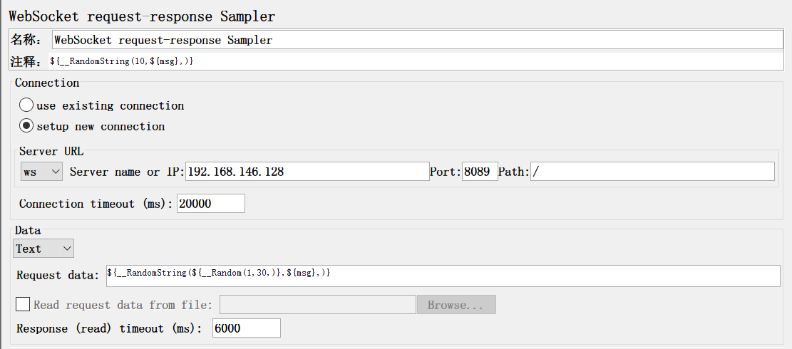
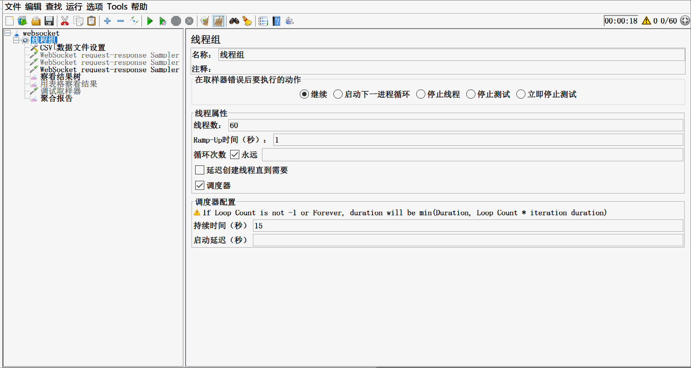

# jmeter如何测试websocket接口

jmeter做接口测试，很多人都是做http协议的接口，就有很多人问websocket的接口怎么测试啊？

首先，我们要明白，websocket接口是什么接口。


然后，我们怎么用jmeter测试？

jmeter要测试websocket接口，需要先下载安装一个**websocket samplers by peter doornbosch** 的插件，插件安装成功后，再次启动jmeter，会在jmeter取样器最下面显示6个socket相关的取样器



websocket close 用于正常关闭websocket连接

websocket open connection 用于显式设置websocket连接

websocket ping-pong  用于发送ping和接收 pong请求

websocket single read sampler 用于接收一个文本或二进制的websocket请求

websocket single write sampler 用于发送一个文本或二进制的websocket请求

websocket request-response sampler 用于执行基本的请求-响应请求

日常测试时，使用websocket request-Response sampler就足够了。



connection，有两个单选，一个是使用已经建立的连接，如果选择这种，那么，在该取样器之前要使用 websocket opnen connection先连接；如果选择新建一个连接，则该取样器中，需要配置serverURL信息。

serverURL中，首先是协议，下拉框有两个选项，ws和wss. ws是明文数据传输，wss是密文数据传输，相当于http和https的差别。

server name or ip 就填写服务器的域名或ip地址

port 对应服务的端口

path  对应服务路径，根用 /

data 就是发送的数据，支持两种，text文本，和binary 二进制

request data为发送的数据，当数据类型为文本是，可以带jmeter的参数，如果为binary 二进制时，则输入的为二进制内容。

工具的配置就是这些，如果你只配置了websocket request-Response sampler 请求结束后，websocket连接不会关闭。但是会在下次运行时，GC(垃圾收集)会自动回收资源关闭连接。如果期望，测试结束时，立马关闭，可以使用websocket close 取样器，也可以修改jmeter.properties文件，设置 `websocket.thread.stop.policy = wsClose`， 若设置为 `websocket.thread.stop.policy=tcpClose`则要在关闭jmeter时关闭连接。

接下来我们搭建一个demo，测试websocket接口。

首先、在linux服务器上下载websocketd：https://github.com/joewalnes/websocketd/releases   在这个页面中，找到你系统对应的包，下载后安装，并配置好环境变量。

然后，在服务器依然地方，创建一个soc.py文件

```python
#!/usr/bin/python

# 注意，下面的代码为python3，如果是python2，请自行参考修改
msg = input()
print("You send socket message is {}".format(msg))
```

然后，在linux服务器上执行

```shell
# port为端口，可以自行修改
# soc.py 为你自己定义的py文件名称
websocketd --port=8089 python -m soc.py
```

然后，检查下你的服务器防火墙，开放你配置的端口

此时，一个websocket的服务器已经搭建好，可以用jmeter来测试了。



这样就实现了用jmeter测试websocket接口

---

> 想了解更多有趣，有料的测试相关技能技巧，欢迎关注**柠檬班**微信公众号，或在腾讯课堂中搜索柠檬班机构，观看测试相关视频。

