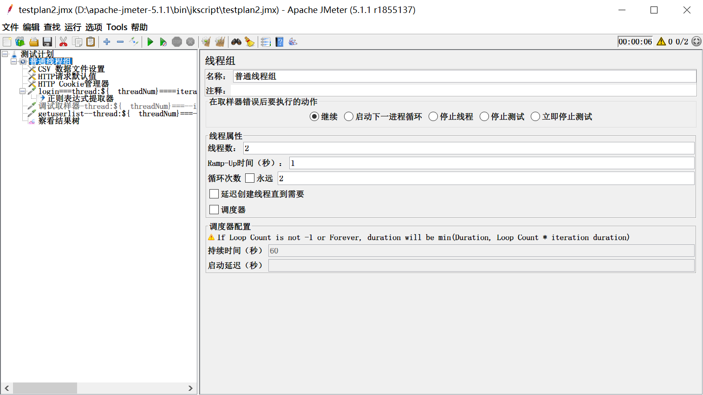
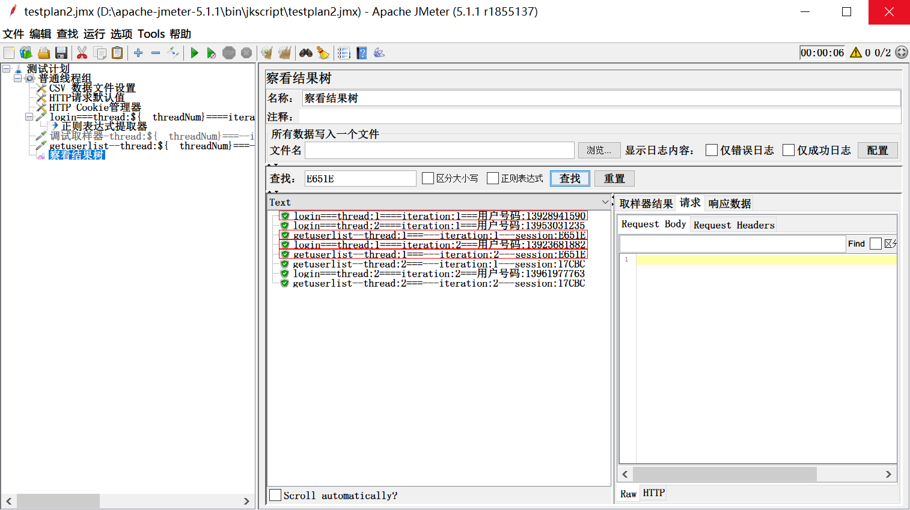
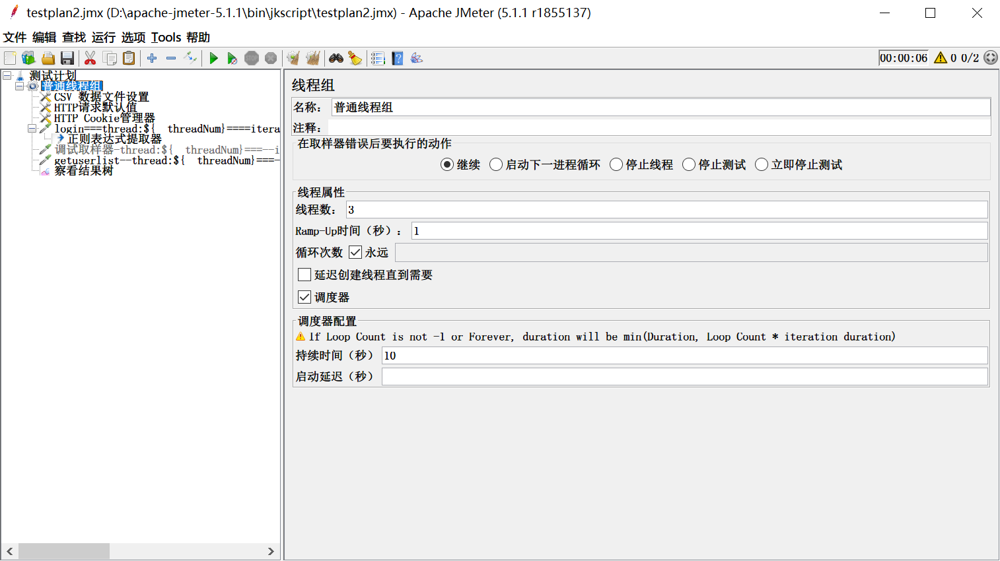
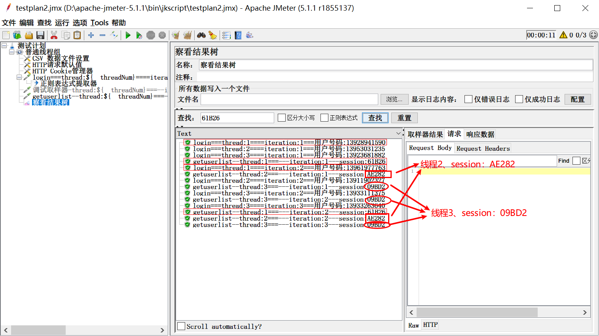
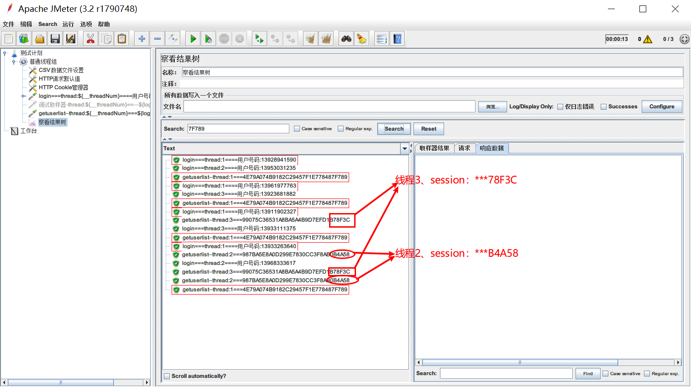
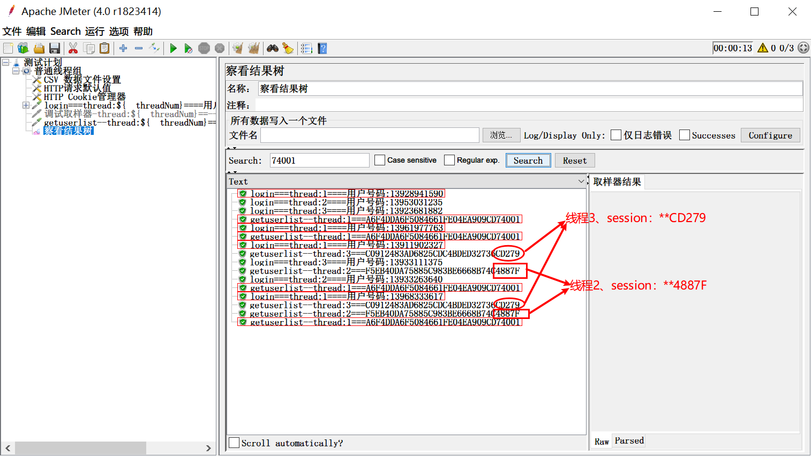
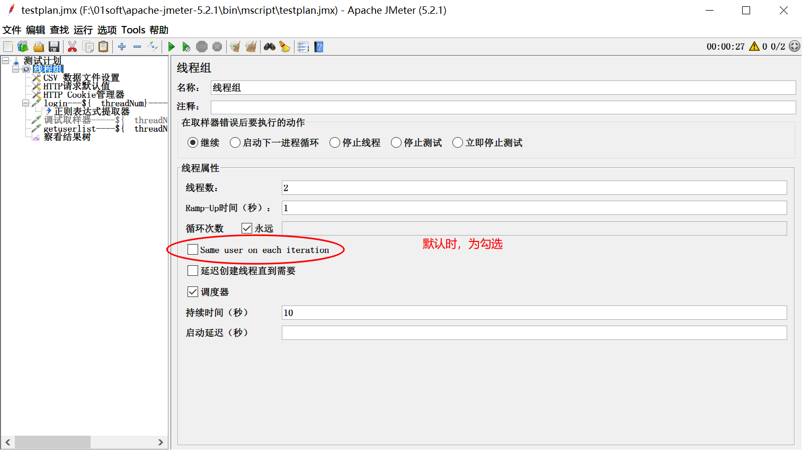
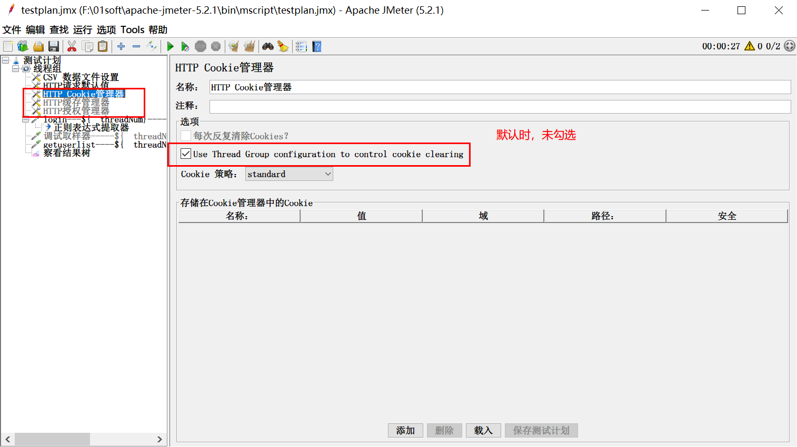
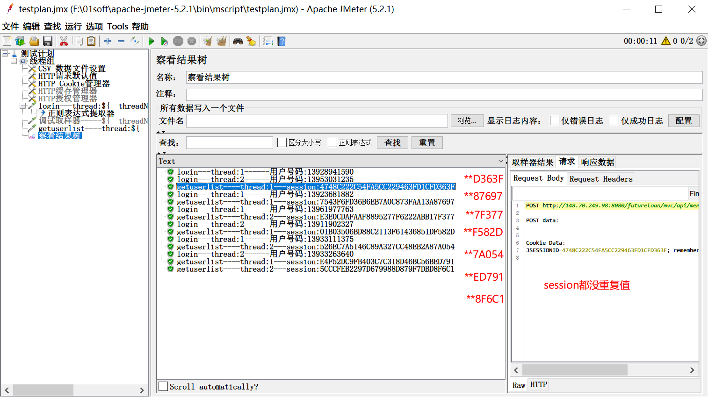

# jmeter撒的一个谎，你可能都已经信以为真了

jmeter是目前大家都喜欢用的一款性能测试工具，因为它小巧、简单易上手，所以很多人都愿意用它来做接口测试或者性能测试，因此，在目前企业中，使用各个jmeter的版本都有，其中以jmeter3.x、4.x的应该居多。

但是，不管大家使用jmeter的什么版本，都可能被jmeter的一个谎言个欺骗了，直到最近jmeter5.2.1版本发布，这个谎言才逐渐付出水面。

**到底是什么谎言呢？**

应该大家在做性能测试的时候，都喜欢<u>设置N个线程数，然后循环M次，以此来模拟真实同时N多个用户使用被测系统</u>。对吧！

现实中被测系统，在N多个用户同时使用时，这N个用户应该都是相互独立，互不关联的，对吧！

我们用jmeter设置N个线程数，循环M次，目的就是想模拟这样N个互不关联的用户使用被测系统。但是，jmeter却在这个时候，给我们撒了一个弥天大谎。

大家先看这张图，我在jmeter5.1.1版本创建一个普通的线程组，设置线程数2、循环次数2，线程组下用一个“csv数据文件设置”获取登录的账户信息，一个普通的http取样器做登录，一个普通的http取样器做登录后获取用户列表。为了找出这个‘谎言’，我在登录接口下面加个后置正则表达式提取器，提取登录成功后的session值，然后把session值放在下一个取样器的‘名称’中打印出来。

**分析**：如果完全等价于真实场景，那应该有4个用户登录，生成4个session，用4个不同的session去获取用户列表信息，对吧！

好，现在我们用这个脚本run一下，看下结果：

看下结果：

看到一个奇怪的事情没有？**4个手机号都不相同，但是session只有2个。**线程1的两次迭代使用了相同的session，线程2的两次迭代也使用了相同的session。说明同一线程无论迭代多少次，都是使用相同的session，也就是线程第一次登录的用户生成的session一直用于后面的迭代。

为了验证，我们的这个总结，我们修改线程数为3，迭代次数为永远，持续循环10秒钟，再看下run的结果。

看到了吗？**不管迭代多少次，同一个线程下，所有用户都是使用相同的session。**

原来在我们使用jmeter做性能测试时，使用多线程循环迭代多次，并不是我们理想中的真实场景。jmeter欺骗了我们。

那，这种情况，只是出现在jmeter5.1.1版本中吗？我们把相同的脚本，拷贝到jmeter3.2版本和jmeter4.0版本中，我们再来看看。

看到了吗？原来这是jmeter的家族遗传史啊，都是这样的情况。没有深入研究，你是不是一直都认为jmeter多用户迭代做性能测试，就是你理想中的模拟用户真实使用场景的呢？

**那，这个有没有什么办法，做到你理想中的模拟用户真实的使用场景呢？**

告诉大家一个好消息，在jmeter最新的5.2.1版本中，已经发生变化啦！*走过、路过、不要错过，都过来看看啦！*别被一个‘谎言’迷惑终身啦！

在jmeter5.2版本发布的时候，已经在 线程组 的设置中，悄悄的加上了一个复选配置项：Same user on each iteration 默认为勾选，同时，在cookie管理器、缓存管理器、授权管理器 的配置选项中，也都增加了一个 ‘Use Thread Group configuration to control clearing’ 的复选配置项。

**加了这个，怎么用呢？**

首先，我们的脚本和前面的脚本做法完全一样。

只是，要注意，<u>1、在线程组配置时，**要去掉默认**的Same user on each iteration 的勾选；2、在cookie管理器配置中，**要勾选** Use Thread Group configuration to control cookie clearing</u>

做好了这些，我们来run一下看下：

这样配置后，在发起获取用户列表信息时session都是使用新登陆的用户生成的session，每次都不一样。这样，也就更真实的模拟了大量用户访问被测系统的实际情况。

好了，这个技能，你get到了吗？

---
> 更多有趣有料的软件测试知识，欢迎关注 **柠檬班** 微信公众号，我们讲不定期发布更多测试相关技能知识。
