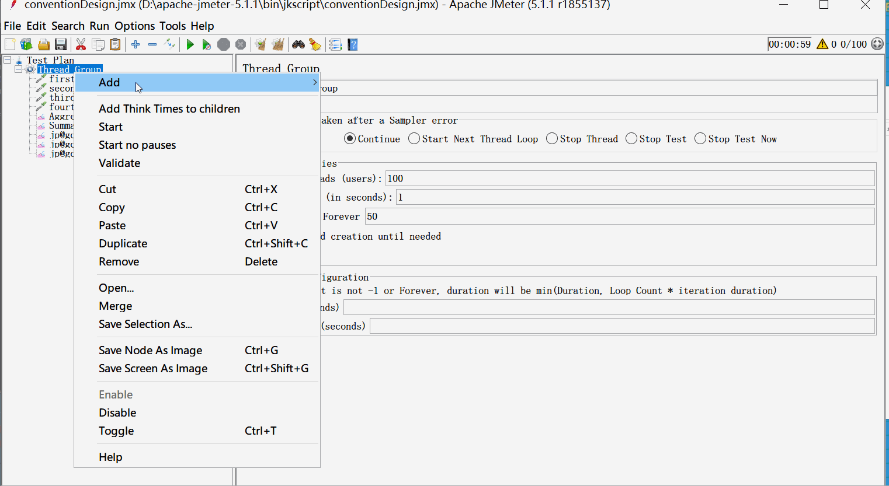
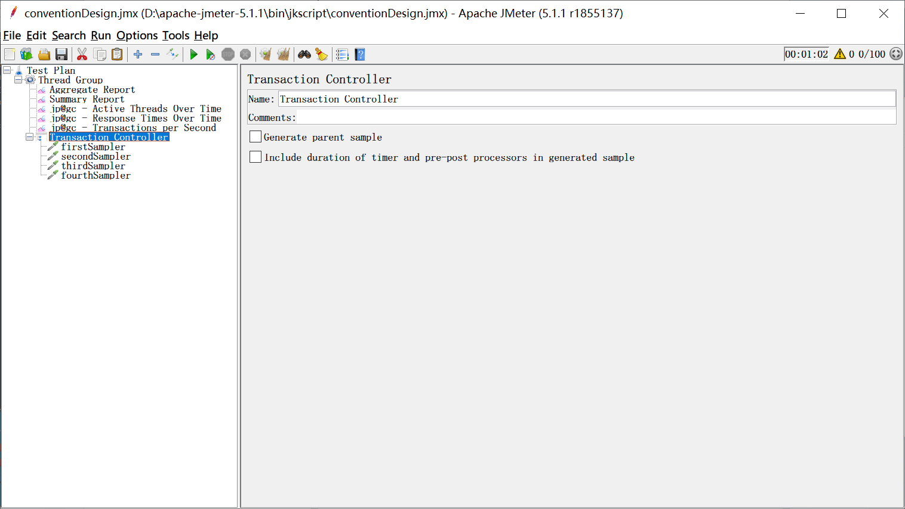
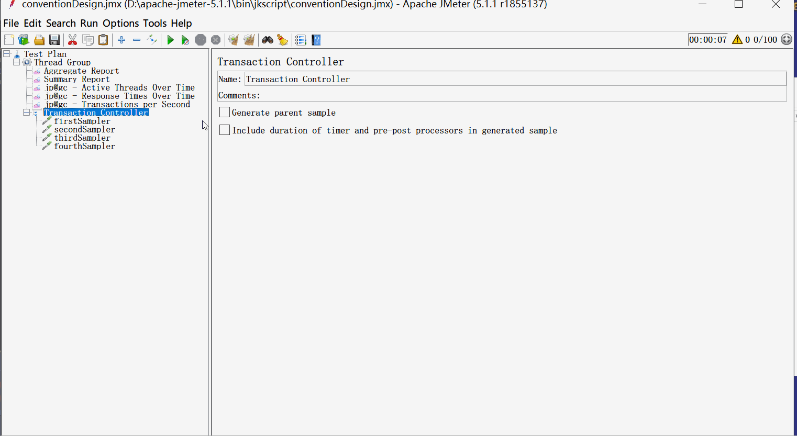

jmeter根据事务生成报告[原创]

​	平时大家在使用jmeter做接口性能测试的时候，都喜欢用聚合报告或汇总报告，但是大家在使用过程中，进程会遇到一个问题，没个接口在聚合报告中，都生成一条报告数据，如果有n多个接口，就生成n多条数据。

而实际诉求可能是，<u>多个接口是一个业务，我想对一个整体业务做性能测试，得到整个业务的性能测试报告数据</u>，明显上面的不符，哪我们要怎么做呢？

​	这里，教大家一个方法，在我们的取样器前面增加一个事务控制器，把一个业务的所有接口都挂在事务控制器下面。

​	听了我这么一说，有同学，就开始动手，如上图这样去操作了，结果发现，只是多了一条数据啊！并不是我想要的一个业务一条线啊！

​	哪我们真正想要的，一个整体业务场景，仅仅输出一条线这个要怎么弄呢？

​	我们来看下 *事务控制器* 的配置页面

​	在配置页面，我们看到有两个复选项

 - [x] Generate parent sample  生成父样本
 - [ ] Include duration of time and pre-post processors in generated sample  在样本生成中包含持续时间和前后处理器时间

知道怎么做了吗？把**生成父样本的复选框勾选上**

看，是不是 只有一条数据线了。

------

> 更多有趣有料的测试知识，欢迎关注 **柠檬班**微信公众号

