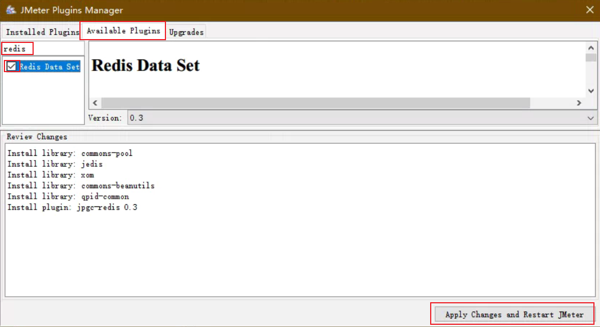
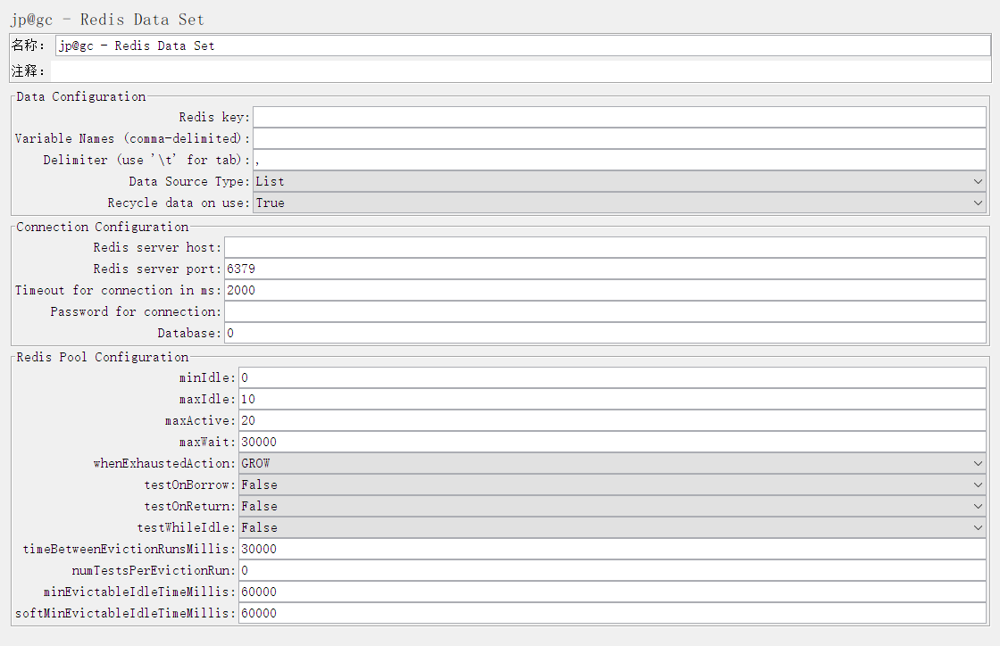
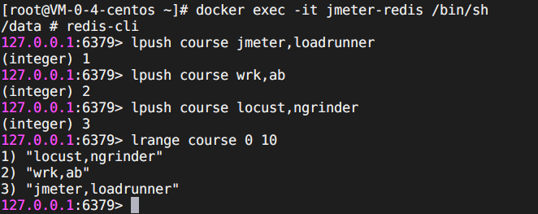
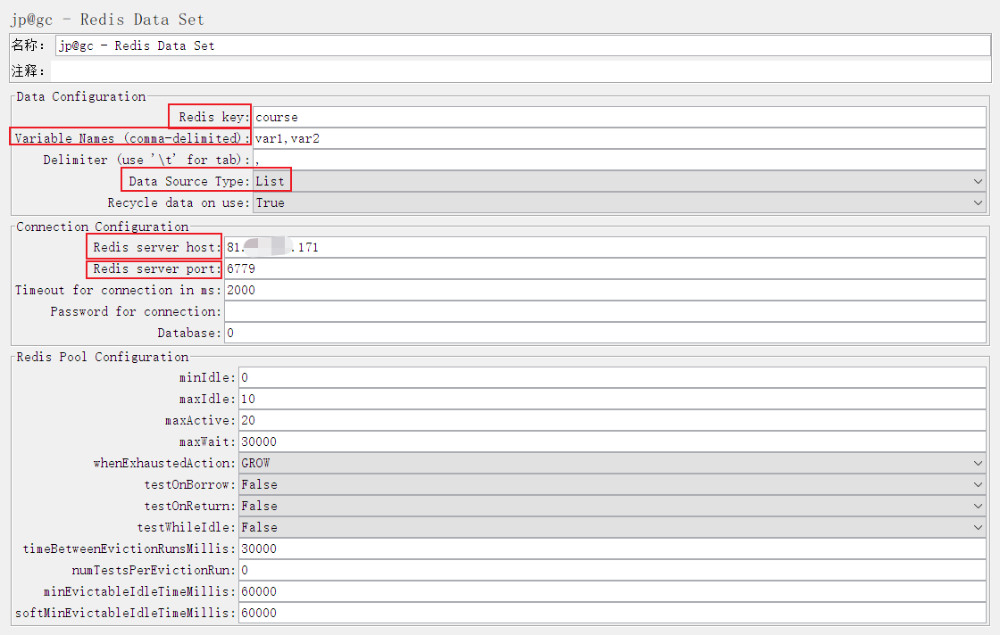
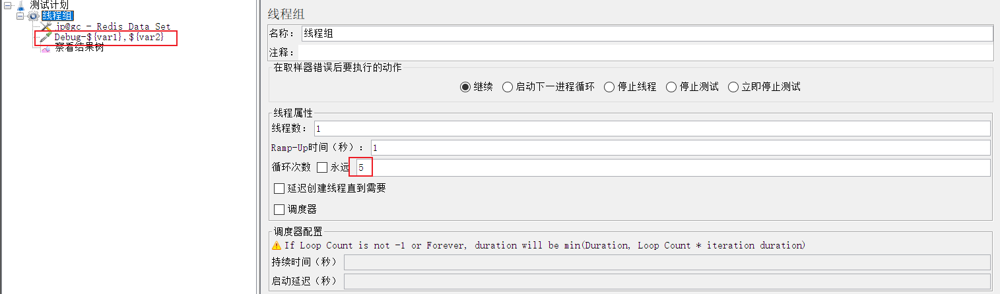
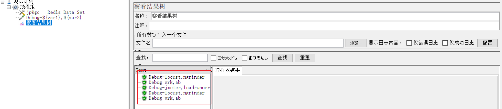
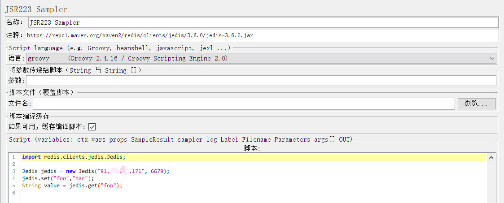
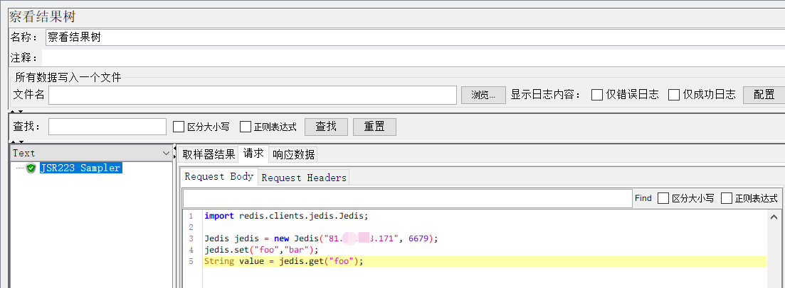
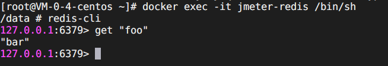

# Jmeter调用redis

 Jmeter作为当前非常受欢迎的接口测试和性能测试的工具，在企业中得到非常广泛的使用，而redis作为缓存数据库，也在企业中得到普遍使用，那如何使用jmeter来测试redis数据库呢？今天我们就来讲一讲怎么使用jmeter来调用redis。

## jmeter准备

由于jmeter本身并没有带有redis的测试入口，我们需要去安装redis插件。

首先，我们下载jmeter-plugins-manager-1.6.jar文件，放到jmeter的lib的ext文件夹中，然后重启jmeter。

然后，在‘选项’菜单下，点击‘plugin manager’，打开插件管理弹窗，选择‘Available Plugins’，在搜索框中，输入 redis



然后，选中‘Redis Data Set’，点击‘Apply Changes and Restart JMeter’

带自动下载后重启jmeter。

然后，在jmeter的线程组上右键，添加 > 配置元件 > jp@gc - Redis Data Set



此时，已经可以通过jmeter配置连接redis数据库了。如果你已经有了redis数据库，那你就直接可以在当前的界面中进行相关的配置，如果你还没有redis数据库，就需要安装redis数据库。

## 安装redis数据库

安装redis数据库的方法很多，那使用docker方式的安装，可能是最简单的，下面我就用docker的方式来安装redis数据库。

```sh
docker run -itd --name jmeter-redis -p 6779:6379  daocloud.io/library/redis:3.2.8-alpine redis-server --appendonly yes
```

好了，现在有了redis数据库，该往数据库里面插入一些数据了。

```shell
# 进入容器
docker exec -it jmeter-redis /bin/sh

# 命令模式，连接redis
redis-cli

# 插入列表数据
lpush course jmeter,loadruner
lpush course wrk,ab
lpush course locust,ngrinder
```



现在，redis数据库库中，已经有了一个列表course，我们可以在jmeter中，获取它的数据。

## jmeter使用redis数据

在RedisDataSet中配置相关信息



+ Data Configuration
  + Redis key：Redis中的key，Redis数据库中列表（有序数据）或集（无序数据）的名称
  + Variable Names：由数据集导出到测试元素的变量的名称（设置取出来的value存放在哪个变量中）
  + Delimiter：存储在Redis列表或集合中的行中使用的分隔符（取出的value有多个值时，变量名之间的分隔符）
  + Date Sources Type：数据源类型，有List、Set两种选择
  + Recycle data on Flase： 数据是否重复使用

+ Connection Configuration
  + Redis server host：Redis服务器IP地址
  + Redis server port：Redis服务端口
  + Timeout for connect in ms： 连接超时时间，默认2000 ms
  + Password for connection：连接Redis的密码
  + Database：数据库名称，连接Redis的第几个数据库，默认为0
+ Redis Pool Configuration

| 字段                           | 用法                                                         | 默认值 |
| ------------------------------ | ------------------------------------------------------------ | ------ |
| minIdle                        | 至少有多少个处于空闲状态的redis实例                          | 0      |
| maxIdle                        | 一个线程池最多有多少个处于空闲状态的redis实例                | 10     |
| maxActive                      | 控制一个pool可分配多少个redis实例，通过pool.getResource()来获取；如果赋值为-1，则表示不限制；如果pool已经分配了maxActive个jedis实例，则此时pool的状态就成exhausted | 20     |
| maxWait                        | 表示当borrow一个redis实例时，最大的等待时间，如果超过等待时间，则直接抛出JedisConnectionException | 30000  |
| whenExhaustedAction            | 表示当pool中的redis实例都被allocated完时，pool要采取的操作；默认有三种WHEN_EXHAUSTED_FAIL（表示无redis实例时，直接抛出NoSuchElementException）、WHEN_EXHAUSTED_BLOCK（则表示阻塞住，或者达到maxWait时抛出JedisConnectionException）、WHEN_EXHAUSTED_GROW（则表示新建一个jedis实例，也就说设置的maxActive无用） | GROW   |
| testOnBorrow                   | 在borrow一个redis实例时，是否提前进行alidate操作；如果为true，则得到的redis实例均是可用的 | False  |
| testOnReturn                   | 在return给pool时，是否提前进行validate操作                   | False  |
| testWhileIdle                  | 如果为true，表示有一个idle object evitor线程对idle object进行扫描，如果validate失败，此object会被从pool中drop掉；这一项只有在timeBetweenEvictionRunsMillis大于0时才有意义 | False  |
| timeBetweenEvictionRunsMillis  | 表示idle object evitor两次扫描之间要sleep的毫秒数            | 30000  |
| numTestsPerEvictionRun         | 表示idle object evitor每次扫描的最多的对象数                 | 0      |
| minEvictableIdleTimeMillis     | 表示一个对象至少停留在idle状态的最短时间，然后才能被idle object evitor扫描并驱逐；这一项只有在timeBetweenEvictionRunsMillis大于0时才有意义 | 60000  |
| softMinEvictableIdleTimeMillis | 在minEvictableIdleTimeMillis基础上，加入了至少minIdle个对象已经在pool里面了。如果为-1，evicted不会根据idle time驱逐任何对象。如果minEvictableIdleTimeMillis>0，则此项设置无意义，且只有在timeBetweenEvictionRunsMillis大于0时才有意义 | 60000  |
|                                |                                                              |        |

接下来我们添加调试取样器，在名称中引用redis变量名称。然后，线程组循环次数设置多次。



运行



我们看到，获得了redis的数据。

## jmeter向redis中写数据

上面呢，我们已经有讲到了，怎么来获取redis数据库里面的数据？那接下来呢，我们给大家讲一下如何向redis数据库里面写入数据。

首先，我们下载[jedis的jar](https://repo1.maven.org/maven2/redis/clients/jedis/3.6.0/jedis-3.6.0.jar)包， 把下载的包，放入jmeter的lib文件夹下，重启jmeter

然后，在jmeter中，新增一个线程组，添加‘jsr223 sampler’

```groovy
import redis.clients.jedis.Jedis;

Jedis jedis = new Jedis("81.69.228.171", 6679);
jedis.set("foo","bar");
String value = jedis.get("foo");
```

 

运行脚本



从redis数据库中确认，数据已经入库



好了，通过jmeter写入数据和获取数据的方法都讲了，你学会了吗？