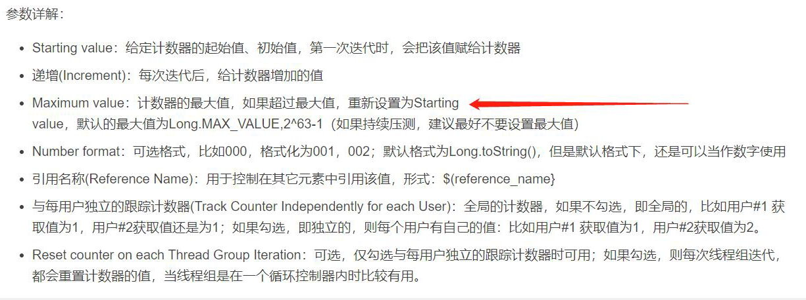

# jmeter特殊技巧

## 问题1：

问题描述：做性能测试，想要循环使用一批数据，但是担心性能测试执行时，总次数超过数据量，怎么解决？

### 技巧：

使用计数器元件，因为计数器元件在运行时，当实际值大于设置的最大值时，自动会从起始值开始计数




## 问题2：

问题描述：jmeter中一个接口返回信息为json格式，json中包含了列表形式的值，现在想通过判断列表中的某个参数的值，从而得到相同索引的另外一个参数的值

```json
{
	"pic": "load-perf-tool",
	"data": [{
			"id": 1,
			"name": "jmeter",
			"class": "jmeter-01"
		},
		{
			"id": 2,
			"name": "wrk",
			"class": "wrk-02"
		},
		{
			"id": 3,
			"name": "ab",
			"class": "ab-03"
		},
		{
			"id": 4,
			"name": "ngrinder",
			"class": "ngrinder-04"
		},
		{
			"id": 5,
			"name": "loadrunner",
			"class": "loadrunner-05"
		}
	]
}
```

想要获得name为loadrunner的id值

### 技巧：

$..[?(@.name=="loadrunner")].id


## 问题3：

问题描述：

### 技巧：