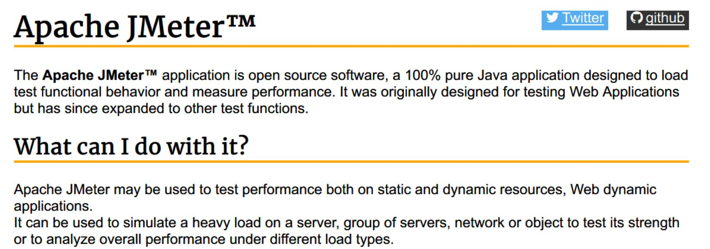
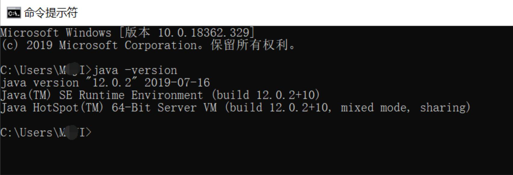
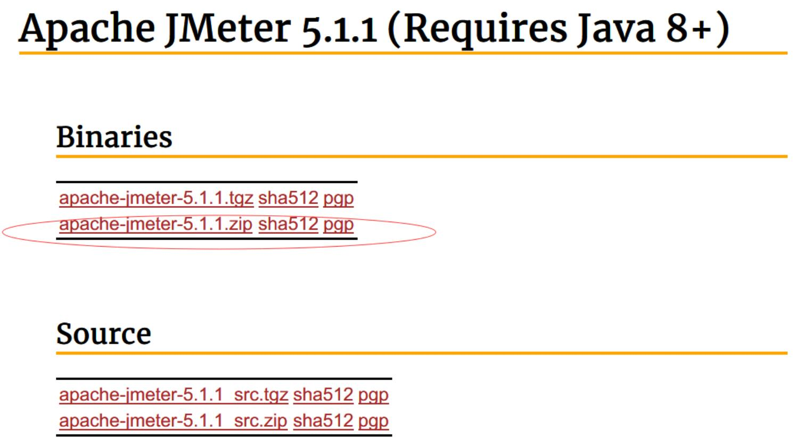
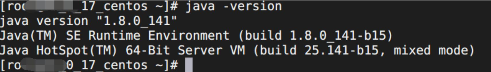

# jmeter环境安装

## Jmeter介绍

jmeter的官网：https://jmeter.apache.org/
jmeter是Apache下，纯java写的开源测试工具，常被测试人员用来做接口测试、性能测试、压力测试，是当前非常流行的一款测试工具。

因为他是用java开发的开源软件，所以他需要在java环境下才能运行，也同时决定了它可以跨平台(因为java是一种支持跨平台的语言)。 既然他要java运行环境，所以，安装jmeter之前，我们先要检查机器是否拥有java运行环境。

## windows下安装运行jmeter

1、在电脑的‘运行’框中，输入cmd 回车，打开windows的dos窗口 2、在dos窗口中，输入：java -version 回车

如果出现如图，说明已经拥有java运行环境，**如果报错，则说明java运行环境没有配置好**，则要重新安装或检查java运行环境

- java运行环境安装

  - java的运行环境叫JRE(Java Runtime Environment)
  - jdk(Java Development Kit)：是java开发工具包
  - jre是java运行环境，而jdk开发工具包中集成了jre，所以，我们想要安装java运行环境，jre、jdk任选一个安装即可。

- **jdk安装**

  - 进入jdk官网：https://www.oracle.com/technetwork/java/javase/downloads/index.html 下载一个jdk版本
  - 双击下载完成后的包，根据提示，下一步下一步安装
  - 安装完成后，再在dos窗口中，输入 java -version 回车 查看是否正常返回
  - *如果不能正常返回*
    - 打开系统环境变量
    - 检查是否存在JAVA_HOME 检查PATH中是否有%JAVA_HOME%\bin; 检查CLASSPATH中是否有.;%JAVA_HOME%\lib;%JAVA_HOME%\lib\tools.jar 没有就要添加，确定保存
    - 再次在dos窗口中，输入 java -version 回车 查看，如果正常说明java环境已正常，如果还是报错，那就重复上面检查环境变量配置

- **配置jmeter**

  - 官网下载：

    https://jmeter.apache.org/download_jmeter.cgi

    

  - 解压zip包

  - 启动jmeter： 进入解压文件夹下的 bin 文件夹中

    - 启动方法1： 双击 jmeter.bat文件
    - 启动方法2：双击JmeterApache.jar文件 或在dos中进入该bin文件夹，执行 java -jar JmeterApache.jar

## linux(unix系)下安装运行jmeter

**注意：** 如果想在linux中运行带界面的jmeter，需要linux本身具有图形界面，如linux为服务器(如云服务器)，一般没有图形界面，所以jmeter将不能以图形界面模式运行

- 同样，首先是检查是否已经安装好java运行环境

  - 在终端中，执行 java -version

    

  - 出现如图，说明java环境已经安装，如果报错，则需要安装java运行环境

  - linux下安装jdk

    - debain ubuntu deepin：sudo apt-get install openjdk-8-jre， 其他系统可以用：su -c "yum install java-1.8.0-openjdk"
    - 安装完成后，执行java -version 检查是否正常返回

  - 配置jmeter

    - 官网下载：https://jmeter.apache.org/download_jmeter.cgi
    - 解压下载包，进入解压后的 bin文件夹中
    - 执行 sh jmeter.sh 执行 java -jar JmeterApache.jar 启动jmeter

---
> 想要获取更多有趣有料的测试知识，欢迎关注 **柠檬班** 微信公众号