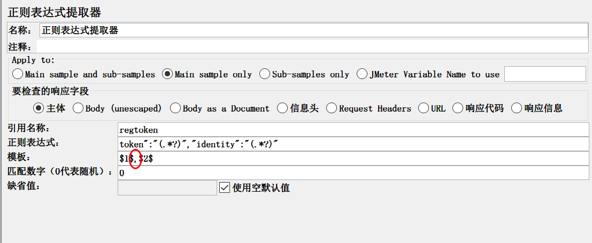

# jmeter用一个正则提取器提取多个值的两种方法

jmeter中，用json提取器，一次提取多个值，这个很多人都会。但是，用正则提取器一次提取多个，是否可以呢？

肯定，很多人都自信满满的说，可以！形如：`token":"(.*?)","identity":"(.*?)"` 写一个这样的正则表达式，不就是可以提取两个了吗！

是的，这种做法没有错，但是，你发现一个问题吗？你的“ Name of created variable 引用名称” 应该怎么填呢？你是填一个，还是多个，多个你又用什么符号来分隔呢？

然后，然后你就楞住了，因为你不能用正则提取器，同时把提取的多个值写到对应的变量中，虽然你理想的写了多个变量名称，也用符号分隔了，结果，你用调试取样器查看得时候，你发现，你取的多个值，都在一个变量里面了，而且这个变量带有符号。

**什嘛，不能一次提取多个？哪我要用多个，怎么用？**

这里，给大家讲两种方法：

**方法一：** 如果你眼睛比较尖，你可能从上面一张图，已经看到了曙光。在上一张图中，我们又retoken,iden_g1 和retoken,iden_g2 看到了吗？他们的值是不是就是你想要的呢？

所以，我们可以在一个正则提取器中，同时提取多个值，多个值时，模板之间不用分隔符号，用一个变量接收，然后在关联使用时，使用变量名称\_g1、变量名称\_g2...... 依次类推，就可以了。

**方法二：** 既然用一个变量接收，他会接收全部的提取值，那我就把值拆开。用一个定义的标点符号，拆开成多个值。

写多个正则表达式，用1个变量接收，模板之间用 逗号 分隔

用一个 split函数，进行拆分，放入新的变量中

从调试取样器中，可以看到拆分之后的结果

使用新的变量名称，注意，使用第一个变量，则用 新变量名称_1

最后，请求，在查看结果树中，看到请求的结果，已经使用拆分后的值了。

好了，两种方法都get到了吗？

---

> 更多有趣有料的测试相关知识，欢迎微信关注 **柠檬班** 微信公众号