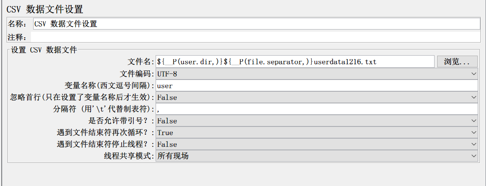
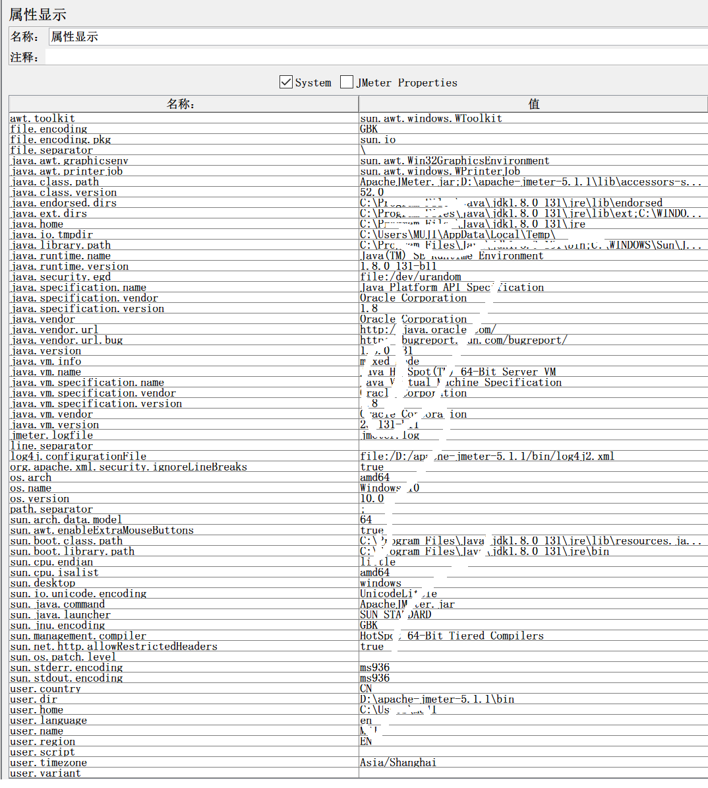
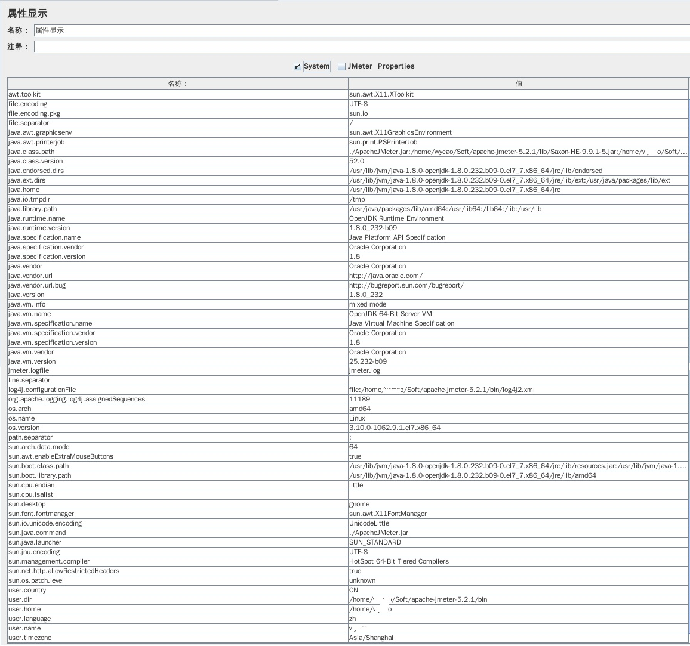

# jmeter跨平台时，csv文件路径该如何设置

​	很多人在使用jmeter进行参数的时候，喜欢用csv文件设置方式，就是先准备一个数据文件，然后再在jmeter中添加csv文件设置，配置读取文件中的数据来用于测试。

​	这样一种方式，非常好用，但是在企业实际工作中，经常会出现编写脚本的机器和实际执行测试的机器类型不一样。如：调试脚本时，用的是windows机器，但是在与jenkins结合，持续集成之后，运行的环境在linux系统中；或脚本调试时，是windows机器，做分布式测试时，为了能获得更大的并发用户，采用linux机器最为助攻机。

​	在这样一种诉求下，大家的文件路径不一致，就带来了很多困扰，不知道如何解决。

​	今天呢，我就针对大家这样一个问题的困惑，给一个非常简单的**万能解决方法**。先把解决办法给大家，后面，再给大家讲解。

​	首先，在你启动的jmeter的**bin目录**中，创建你的csv文件，添加数据。

​	然后，在jmeter中，添加 配置元件 > csv数据文件设置，在文件路径中，写上 ${\_\_P(ser.dir,)}${__P(file.separator,)}userdata1216.txt ，其中 userdata1216.txt为你的数据文件名称。

好了， 就这样ok了，这样你的只要把你的测试数据文件上传到执行你脚本机器jmeter的bin路径下，这个脚本就可以跨平台执行了。

​	哪为什么这样写就可以跨平台呢？首先，大家要知道__P()这个函数，这是一个获取属性的函数。明白这点，那应该就能想明白user.dir 和 file.separator 都是属性。接下来，就又会问了，这两个属性，他们的值会是什么呢？下面，我们再看两张图

看懂了吗？

​	第一张，是window下的jmeter获取到的系统所有属性，其中 file.separator 的值是 ‘\’  user.dir 是我jmeter的路径；第二张图是linux系统中，jmeter获取到的所有系统属性，其中file.separator 的值是 ‘/’  user.dir 是我jmeter的路径。

现在应该明白${\_\_P(ser.dir,)}${__P(file.separator,)}userdata1216.txt  这个是什么意思了吧。根据系统不同、jmeter安装路径不同，自动获取jmeter的路径，然后再获取不同系统下的文件路径分隔符，最后跟上文件名称，这样，你在做csv数据读取文件，进行参数化时，就不用担心跨平台，路径不一致问题了，**前提就是你的数据文件要放在jmeter的bin路径下**。

---
> 这个知识，是不是很有用呢？更多有趣有料的测试知识，欢迎关注 **柠檬班**微信公众号