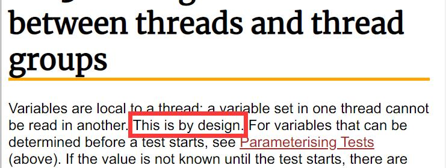
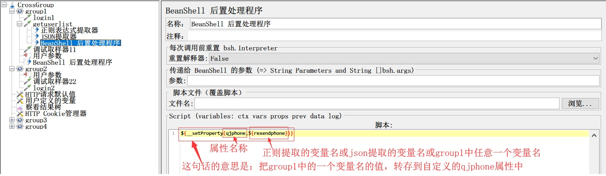
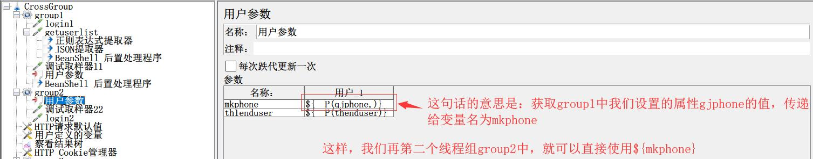
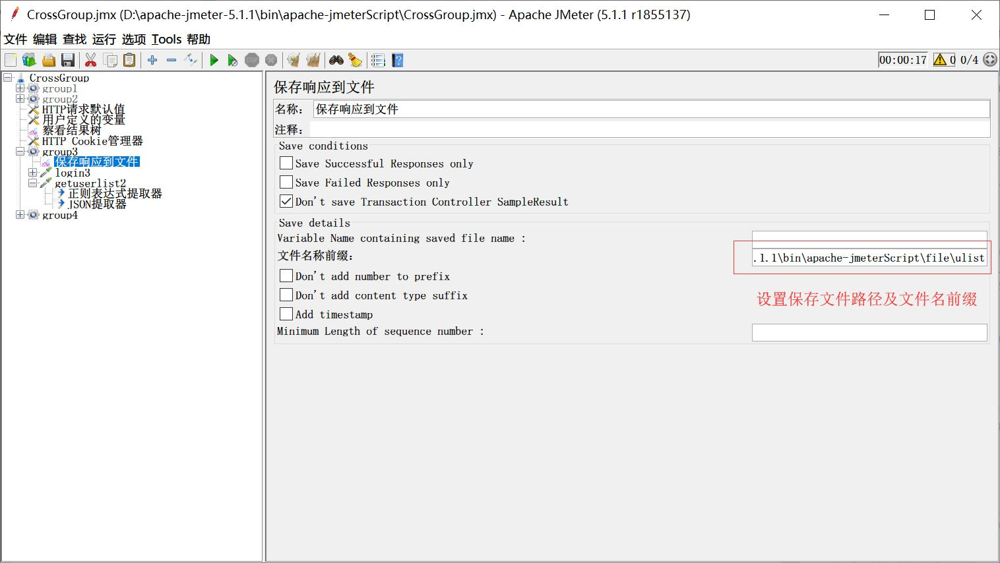
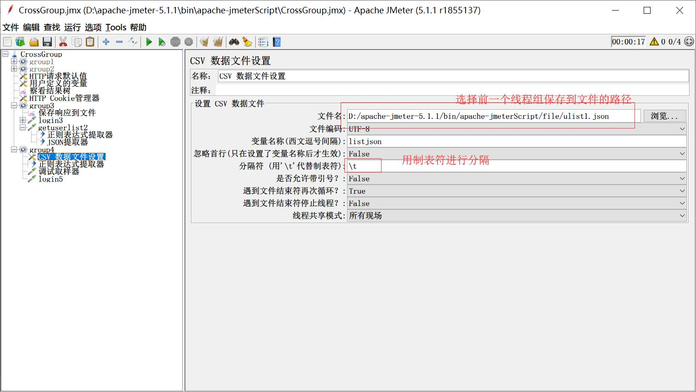
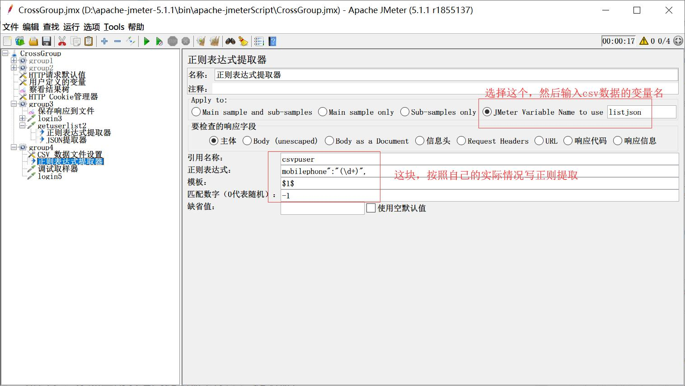

# 【柠檬班】史上最简单的Jmeter跨线程组取参数值的两种办法(不写代码)【原创】

如果你工作中已经在用jmeter做接口测试，或性能测试了，你可能会遇到一个麻烦，哪就是jmeter的变量值不能跨线程组传递。

看，官方就已经给出了解释。这个不是jmeter的缺陷，这是jmeter的设计使然的。如果变量在开始测试之前已经确定了，我们可以用参数化关联就可以实现。但是如果值时动态生成，每循环一次，值就变化一次，那么怎么弄呢？

此时，你可能就会去百度了，对吗？你会发现，很奇怪，机会所有的百度结果都千遍一律的告诉你用Beanshell***，写上一些不知所云的代码。如果你不懂java，你看这着这开始写代码了，而且还写着一些晦涩难懂的东西，你是不是已经开始头痛了。

如果是这样，那你就继续往下看，我来教你两手。两种方法，轻轻松松搞定，你都不用写些哪啥都不懂的代码。

---
## 方法一：定义属性法
**思路：**jmeter中，属性是全局的，是可以动态设置的；而变量是独属于每个线程的
+ 第一步：我们在jmeter中，添加两个**线程组**
+ 第二步：在第一个线程组中，调用一个接口，提取你想要的值存储到一个变量中
+ 第三步：在第一个线程组中，添加一个Beanshell后置处理器，然后再打开菜单栏中的 Tools -> 函数助手对话框(Function Helper Dialog)，在弹窗中，选择__setProperty函数，表达式第一个值输入将要存放的**属性名称(英文)**，第二个值输入你在第二步中定义的变量名称，生成函数。复制函数、关闭弹窗，把函数粘贴到BeanShell后置处理器的Script窗口中。

    如果不想用Beanshell处理器，也可以用一个‘用户参数’，任意定义一个参数名称，值中填写 ${__setProperty(qjphone,${rexendphone})},这样也可以。
+ 第四步：在第二个线程组中，添加一个‘用户参数’，添加变量(Add variable),设置变量名称，再次打开函数助手，选择__P函数，在函数的第一个value值文本框中输入${第三步设置**属性名称**}，生成函数，复制函数，关闭弹窗，把它粘贴到添加的变量的值文本框中

+ 第五步：在第二个线程组中，接口参数使用定义的变量${变量名称}

这样，就实现了跨线程组之间传递参数。是不是，很简单。It's so easy!
**注意：**
   - 如果想要设置多个属性，可以在第三步的时候，粘贴多个函数，修改函数中属性名称和变量名称，每个函数之间用英文';'分开。

---
> 如果这你都觉得难了，不要灰心，继续往下看，我再教你一个更容易理解的方法。
> 想要获得更多实用、好用的测试技能，欢迎关注**柠檬班**公众号，腾讯课堂中搜索柠檬班

## 方法二：文件转接法
**思路：**一个线程组运行结果，存储到文件，另一个线程组，通过csv读取文件，然后再提取文件中需要的值，作为变量输入
+ 第一步：在jmeter中，添加两个**线程组**
+ 第二步：在第一个线程组中，调用接口，然后添加监视器->保存响应到文件，设置保存文件的路径和文件名前缀

+ 第三步：在第二个线程组中，添加一个csv数据文件设置(csv set data config)，文件名设置为第二步中，设置的保存文件路；变量名称自行定义；**分隔符设置为'\t'**(为什么这个地方要用\t，留个作业，请大家思考吧)

+ 第四步：添加正则表达式提取器(或json提取器)，apply to 选择'Jmeter variable Name to use'，然后输入csv读取文件设置的变量名；再编写正则提取式

+ 第五步：在第二个线程组中，添加接口，使用正则提取器中的变量名称

至此，文件转接法完成。

是不是两种方法都相当简单，都没有去写晦涩难懂的代码！而且都实现了跨线程组传参取值。

---
当然，这两种方法都能实现跨线程组传递参数取值，不过，他们还是有差异的。如果想了解更多关于他们两种方法之间的差异，可以关注**柠檬班**公众号，或在腾讯课堂中搜索柠檬班机构，关注我们，获得更多实用，好用的测试技能分享。

