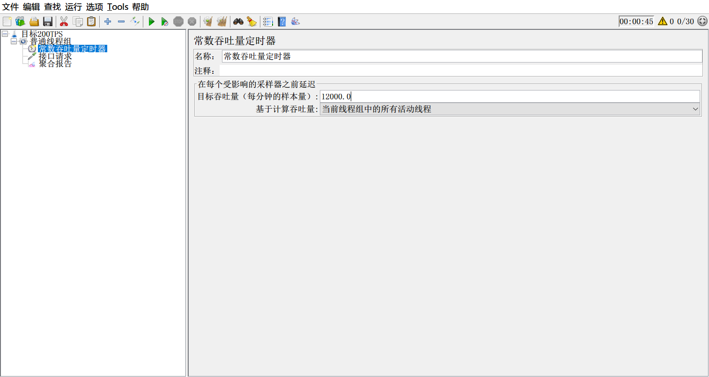
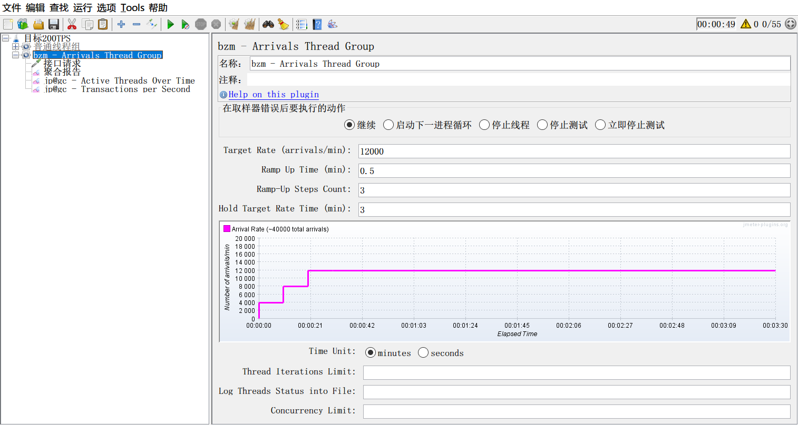
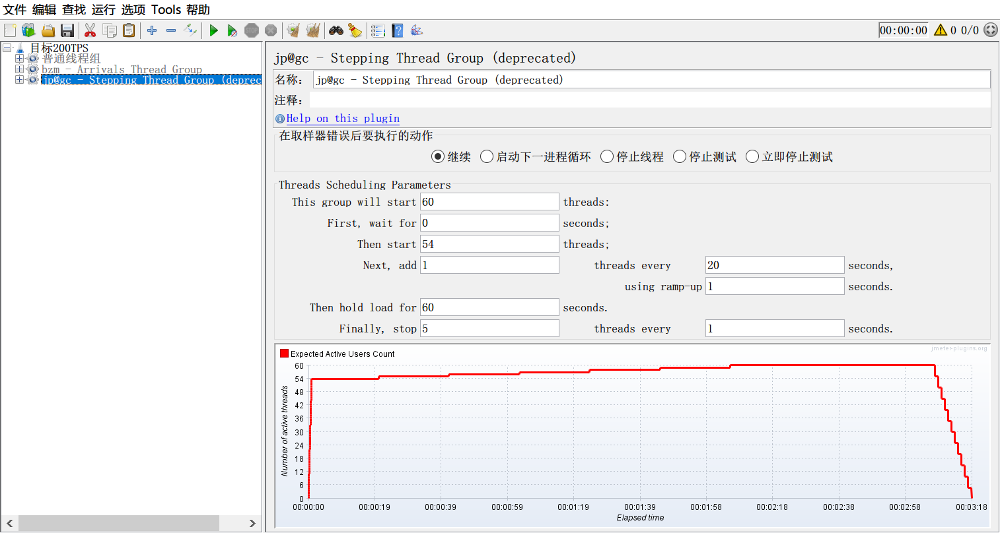

# jmeter面向目标的性能场景设计

说到jmeter设计性能场景，大家是不是第一想到的就是jmeter的普通线程组进行性能场景设计？

jmeter普通线程组，对通过改变并发用户(线程数)，找出或验证性能指标还是非常简单、方便的。

但是在企业中，做性能测试，就是这么简单的找性能指标就够了吗？显然不是。会经常遇到，通过确定定义的某个预期性能指标值，要你验证实际的性能情况是否能够超过预期期。比如：**期望某个接口系统的处理能力不低于200次/秒，问你，这样的场景，你如何设计？**

相信，有些同学，天生对性能测试感到畏惧，看到这样的问题，就不知道如何下手的。其实，这个题目很简单，就是看服务器对某个接口的TPS值是否能大于等于200，就可以了。系统处理能力，说的就是我们性能测试中的TPS。只要设计一个目标场景TPS能超过200，而不报错，响应时间也在可接受的范围内就可以了。

但，问题是，这个目标场景要怎么设计呢？

有做过性能测试的同学可能会知道，在loadrunner中，有“手动场景”和“面向目标场景”，所以用loadrunner可以很简单实现。但是jmeter不一样，平常大家用的基本全都是“手动场景”类型，很少有同学懂得jmeter的面向目标场景该如何设计。

今天，我们就来给大家分析分析，jmeter如何做面向目标的场景设计。

用jmeter工具，说到TPS，肯定很多人就会想到吞吐量，就会在吞吐量上找突破口。通过一通百度，和一段时间自己的学习研究，肯定会发现，用一个“**常数吞吐量定时器Constant Throughput Timer**”可以实现预设一个固定的12000的值(因为在这个定时器中，单位是每分钟)，从而实现目标200TPS的诉求。

是的，这个定时器，确实就是可以实现这样一个目标。但是，接下来的问题是，用普通线程组，要设置多少并发用户，才能让这个TPS值达到呢？<u>并发用户(线程数)设置小了，这个目标达不到，并发用户(线程数)设置大了，不能找出真实的TPS值。一个一个并发用户数去猜，时间浪费了，效率太低。</u>这个又该怎么做呢？

今天在这里，柠檬班的Allen老师给大家讲一个方法思路。

大家可以去下载jmeter的[插件管理器](https://jmeter-plugins.org/)，然后再利用插件管理器，下载jpgc插件。然后添加**bzm - Arrivals Thread Group**线程组。

> 如果不知道下载插件，不会使用插件管理器下载jpgc，可以搜索**柠檬班**，咨询柠檬班老师。

参考如下图设置：

第1个，Target Rate 设置为目标12000，因为时间是分钟；第二个 RampUpTime 加速时长，随自己设置；第三个 Ramp-Up Steps Count 总共加速次数，随自己设置；第四个 Hold Target Rate Time 达到目标后，持续运行多长时间，随自己设置。

> Tips：在图表graph下面，有个Time Unit 单选，分钟\秒，切换后，上面的设置单位会发生变化，注意切换后，要按照需求更改相关设置数据。

大家可以看到，整个设置过程，完全没有设置并发用户数。也就是说，为了达到200TPS值，并发用户数，完全是在运行过程中动态调整变化的。我们只需要再添加 **Active Threads Over Time** 监听器，查看运行过程中，实时的并发用户数，再添加 **Transactions per Second** 监听器， 查看运行过程中，实时TPS值，我们就可以**<u>通过这两个监听器，实时对比看到，在某个时间点TPS达到或超过200，此时活跃的并发用户的值，就知道系统在多少并发用户数时，能满足预期目标</u>**；如果发现运行过程中，已经报错，或相应时间超长，TPS却始终都无法达到预期的200，哪就说明，该接口无法达到预期目标。

是不是，突然发现，事情变得很简单了呢？

如果你还想知道具体是多少个并发用户(线程数)让接口达到200TPS，我们再用一个 **Stepping Thread Group**，如下图配置：

实时观察活跃线程数和tps值，就能比较准确的找到并发用户数量了。

好了，jmeter面向目标的场景设计，就给大家讲到这了，你是否已经掌握了呢？

> 更多有趣有料的软件测试知识，欢迎关注 **柠檬班** 微信公众号！

<a href="https://github.com/wohuyuelong/articles/blob/master/jmx/goal-oriented-200TPS.jmx">参考源代码</a>

