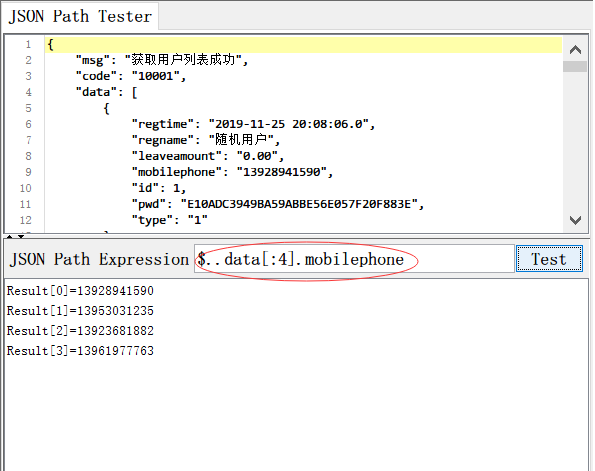

# [柠檬班]jmeter鲜为人知的jsonpath用法[原创]

在jmeter使用过程中，我们经常会看到接口返回数据类型为application/json，也就时我们常说的json格式，而在功能测试时，我们经常会要对它的结果进行断言，确认结果是否与预期一致，有时候还会从结果中提取某个值，作为下一个接口的输入，俗称关联。

之前，我有写过一篇文章，

！[jmeter 不写代码，秒秒钟提取动态列表最后一个值]（http://www.lemfix.com/topics/407）

大家想了解的话，可以去看看。

今天这篇，我们将在此基础上，给大家讲一些更多的鲜为人知的jsonpath技巧。

平时大家用jsonpath提取某个值，用的都是$.key1.key2.key3这样用一个点加节点名称，一步一步往下找，直到找到为止，对吗？*有没有觉得，这样的写法很死，很古板，*万一有一天，key2的名称变了，这个路径是不是就不能用了，就错误了。哪我们有没有好的办法呢？今天，我就给大家讲一个非常非常好用的办法，用形如 $..key3   用两点，加唯一末梢节点名称。

这样还有什么好处呢？

看到吗？把所有的值都获取出来了。那可能又有同学会问了，我不想要所有的，我只想要其中某几个，怎么搞？

或者，我只想要最后一个

或者，还有同学，想刁钻一下，说我只想要满足某个条件的值。如这个，我只想要id>200的手机号码

哇， 看到没有，**<u>原来json可以切片，还可以条件取值</u>**。

其实，我告诉大家，它还有一个

看到没有，很神奇，对吧，居然一次性把所有的value值 全都取出来了。是不是太不可思议了。你是不是 要开始骂娘了，这是哪个老师教的说json提取只是用$.这样的方式，还有这么多，都不说的。  我告诉大家，这些，不是老师不说，是国内，这些技巧鲜有人知。只有我们柠檬班才会和大家说。
