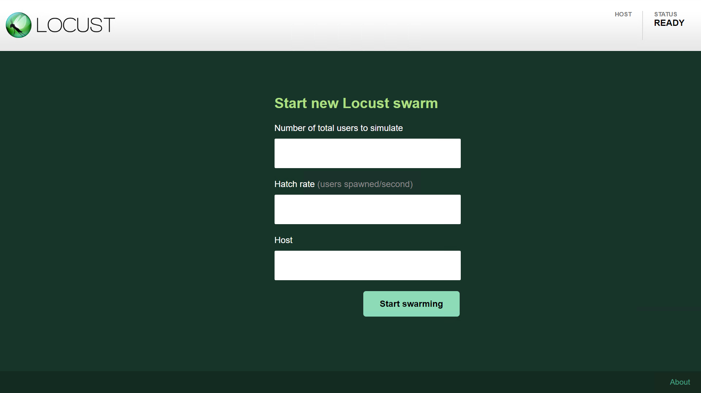
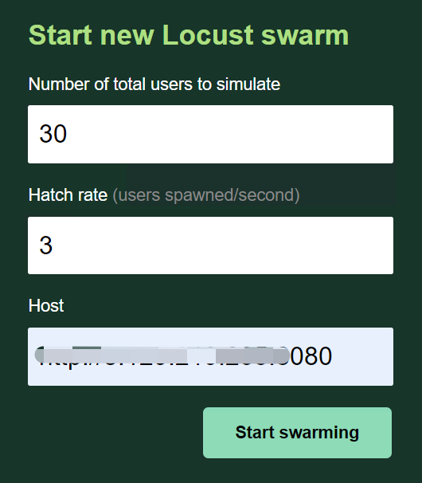
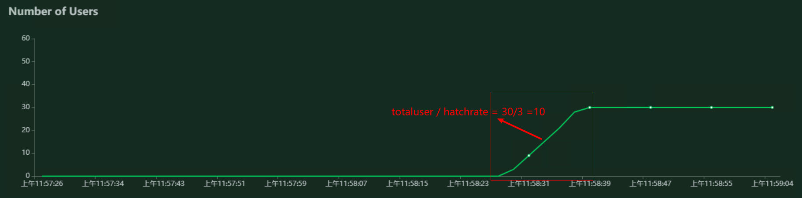
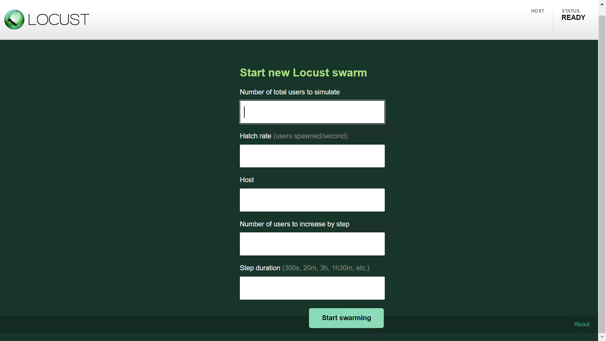
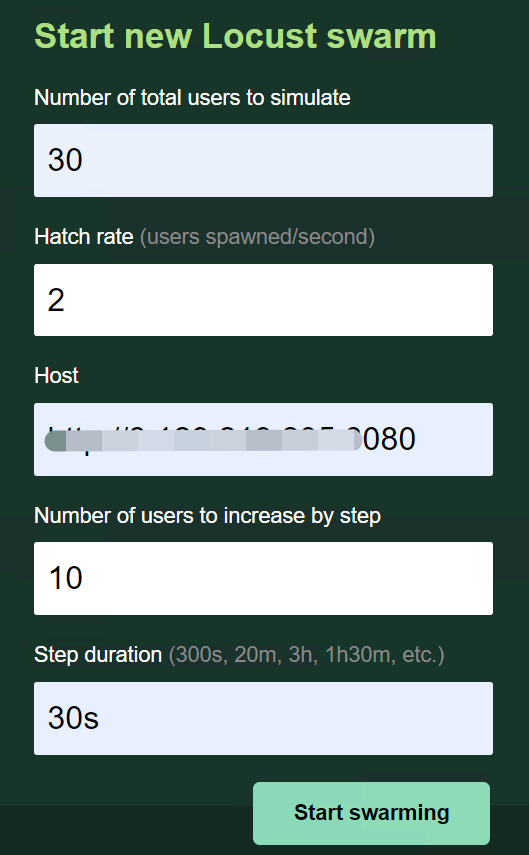
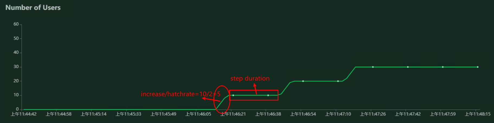
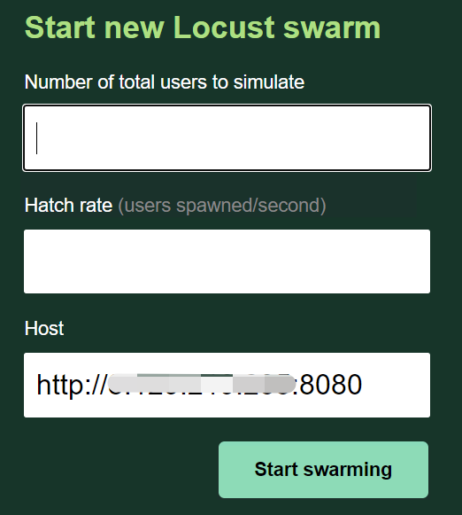

# 一文让locust小白，变成性能测试老司机

## locust介绍

locust是一款完全基于事件的负载测试工具，做性能测试使用的‘协程’方式，有webui图形界面、无图形界面、分布式等多种运行方式。

## locust安装

​	首先，系统中安装python3.6及以上版本，确认安装好了pip

​	然后，安装locust，在终端中执行：`pip install locust`

> + **注意：** 
>   + Ⅰ  这种方式安装的是最新的 locust 版本，最新的版本已经是 locust 1.*
>   + Ⅱ  如果想安装低于 1.*的版本， 请使用 `pip install locustio=版本号`  低于 1 的版本，包名称不一样。
>   + Ⅲ  本文内容 locust的版本为 0.14.6， 所以请使用 `pip install locustio==0.14.6`

​	验证系统是否正常安装了locust，可以在终端中执行：

```shell
# 获取locust的帮助信息
locust --help

#或
# 查看locust的版本信息
locust -V
```

如果执行结果能够正常返回信息，说明当前系统已经安装好了locust工具。

## locust脚本模板

对于一个初学者来说，是不是就期望能提供一个快速上手模板，套用模板就好呢？考虑到这点，我就在开篇，给大家一个模板：

```python
import random
from locust import TaskSequence, HttpLocust, task, seq_task, between


# 定义一个任务类，这个类名称自己随便定义，类继承TaskSequence 或 TaskSet类，所以要从locust中，引入TaskeSequence或TaskSet
# 当类里面的任务请求有先后顺序时，继承TaskSequence类， 没有先后顺序，可以使用继承TaskSet类
class MyTaskCase(TaskSequence):
    # 初始化方法，相当于 setup
    def on_start(self):
        pass

    # @task python中的装饰器，告诉下面的方法是一个任务，任务就可以是一个接口请求，
    # 这个装饰器和下面的方法被复制多次，改动一下，就能写出多个接口
    # 装饰器后面带上(数字)代表在所有任务中，执行比例
    # 要用这个装饰器，需要头部引入 从locust中，引入 task
    @task
    @seq_task(1)  # 装饰器，定义有执行顺序的任务，扩展中的数字，从小到大，代表先后执行顺序
    def regist_(self):  # 一个方法， 方法名称可以自己改
        url = '/erp/regist'  # 接口请求的URL地址
        self.headers = {"Content-Type": "application/json"}  # 定义请求头为类变量，这样其他任务也可以调用该变量
        self.user = "locust_" + str(random.randint(10000, 100000))
        self.pwd = '1234567890'
        data = {"name": self.user, "pwd": self.pwd}  # post请求的 请求体
        # 使用self.client发起请求，请求的方法根据接口实际选,
        # catch_response 值为True 允许为失败 ， name 设置任务标签名称   -----可选参数
        rsp = self.client.post(url, json=data, headers=self.headers, catch_response=True, name='api_regist')
        if rsp.status_code == 200:
            rsp.success()
        else:
            rsp.failure('regist_ 接口失败！')

    @task  # 装饰器，说明下面是一个任务
    @seq_task(2)  # 顺序任务装饰器，说明下面的任务，第二个执行
    def login_(self):
        url = '/erp/loginIn'  # 接口请求的URL地址
        data = {"name": self.user, "pwd": self.pwd}
        rsp = self.client.post(url, json=data, headers=self.headers,
                               catch_response=True)  # 使用self.client发起请求，请求的方法 选择post
        self.token = rsp.json()['token']    # 提取响应json 中的信息，定义为 类变量
        if rsp.status_code == 200 and rsp.json()['code'] == "200":
            rsp.success()
        else:
            rsp.failure('login_ 接口失败！')

    @task  # 装饰器，说明下面是一个任务
    @seq_task(3)  # 顺序任务装饰器，说明下面的任务，第三个执行
    def getuser_(self):
        url = '/erp/user'  # 接口请求的URL地址
        headers = {"Token": self.token}  # 引用上一个任务的 类变量值   实现参数关联
        rsp = self.client.get(url, headers=headers, catch_response=True)  # 使用self.client发起请求，请求的方法 选择 get
        if rsp.status_code == 200:
            rsp.success()
        else:
            rsp.failure('getuser_ 接口失败！')

    # 结束方法， 相当于teardown
    def on_stop(self):
        pass


# 定义一个运行类 继承HttpLocust类， 所以要从locust中引入 HttpLocust类
class UserRun(HttpLocust):
    task_set = MyTaskCase  # 定义固定的 task_set  指定前面的任务类名称
    wait_time = between(0.1, 3)  # 设置运行过程中间隔时间 需要从locust中 引入 between


'''
运行：
    在终端中输入：locust -f 被执行的locust文件.py --host=http://被测服务器域名或ip端口地址
    也可以不指定host
命令执行成功，会提示服务端口，如：*：8089
此时，则可通过浏览器访问机器ip:8089,看到任务测试页面
'''
```

有了这个模板，以后用locust，基本上就是可以为所欲为啦。

如果你还不满足，可以继续往下看，我们来增强一下。

## 增强

脚本增强，那就要看你对python的运用能力。我们经常拿locust来做性能测试，所以增强就是增强性能测试方面的使用，我们可以在终端中，执行locust --help看下它的帮助信息

```sh
C:\Users\pc>locust --help
usage: locust [-h] [-H HOST] [--web-host WEB_HOST] [-P PORT] [-f LOCUSTFILE]
              [--csv CSVFILEBASE] [--csv-full-history] [--master] [--slave]
              [--master-host MASTER_HOST] [--master-port MASTER_PORT]
              [--master-bind-host MASTER_BIND_HOST]
              [--master-bind-port MASTER_BIND_PORT]
              [--heartbeat-liveness HEARTBEAT_LIVENESS]
              [--heartbeat-interval HEARTBEAT_INTERVAL]
              [--expect-slaves EXPECT_SLAVES] [--no-web] [-c NUM_CLIENTS]
              [-r HATCH_RATE] [-t RUN_TIME] [--skip-log-setup] [--step-load]
              [--step-clients STEP_CLIENTS] [--step-time STEP_TIME]
              [--loglevel LOGLEVEL] [--logfile LOGFILE] [--print-stats]
              [--only-summary] [--no-reset-stats] [--reset-stats] [-l]
              [--show-task-ratio] [--show-task-ratio-json] [-V]
              [--exit-code-on-error EXIT_CODE_ON_ERROR] [-s STOP_TIMEOUT]
              [LocustClass [LocustClass ...]]

Args that start with '--' (eg. -H) can also be set in a config file
(~/.locust.conf or locust.conf). Config file syntax allows: key=value,
flag=true, stuff=[a,b,c] (for details, see syntax at https://goo.gl/R74nmi).
If an arg is specified in more than one place, then commandline values
override config file values which override defaults.

positional arguments:
  LocustClass

optional arguments:
  -h, --help            show this help message and exit
  -H HOST, --host HOST  Host to load test in the following format:
                        http://10.21.32.33
  --web-host WEB_HOST   Host to bind the web interface to. Defaults to '' (all
                        interfaces)
  -P PORT, --port PORT, --web-port PORT
                        Port on which to run web host
  -f LOCUSTFILE, --locustfile LOCUSTFILE
                        Python module file to import, e.g. '../other.py'.
                        Default: locustfile
  --csv CSVFILEBASE, --csv-base-name CSVFILEBASE
                        Store current request stats to files in CSV format.
  --csv-full-history    Store each stats entry in CSV format to
                        _stats_history.csv file
  --master              Set locust to run in distributed mode with this
                        process as master
  --slave               Set locust to run in distributed mode with this
                        process as slave
  --master-host MASTER_HOST
                        Host or IP address of locust master for distributed
                        load testing. Only used when running with --slave.
                        Defaults to 127.0.0.1.
  --master-port MASTER_PORT
                        The port to connect to that is used by the locust
                        master for distributed load testing. Only used when
                        running with --slave. Defaults to 5557.
  --master-bind-host MASTER_BIND_HOST
                        Interfaces (hostname, ip) that locust master should
                        bind to. Only used when running with --master.
                        Defaults to * (all available interfaces).
  --master-bind-port MASTER_BIND_PORT
                        Port that locust master should bind to. Only used when
                        running with --master. Defaults to 5557.
  --heartbeat-liveness HEARTBEAT_LIVENESS
                        set number of seconds before failed heartbeat from
                        slave
  --heartbeat-interval HEARTBEAT_INTERVAL
                        set number of seconds delay between slave heartbeats
                        to master
  --expect-slaves EXPECT_SLAVES
                        How many slaves master should expect to connect before
                        starting the test (only when --no-web used).
  --no-web              Disable the web interface, and instead start running
                        the test immediately. Requires -c and -t to be
                        specified.
  -c NUM_CLIENTS, --clients NUM_CLIENTS
                        Number of concurrent Locust users. Only used together
                        with --no-web
  -r HATCH_RATE, --hatch-rate HATCH_RATE
                        The rate per second in which clients are spawned. Only
                        used together with --no-web
  -t RUN_TIME, --run-time RUN_TIME
                        Stop after the specified amount of time, e.g. (300s,
                        20m, 3h, 1h30m, etc.). Only used together with --no-
                        web
  --skip-log-setup      Disable Locust's logging setup. Instead, the
                        configuration is provided by the Locust test or Python
                        defaults.
  --step-load           Enable Step Load mode to monitor how performance
                        metrics varies when user load increases. Requires
                        --step-clients and --step-time to be specified.
  --step-clients STEP_CLIENTS
                        Client count to increase by step in Step Load mode.
                        Only used together with --step-load
  --step-time STEP_TIME
                        Step duration in Step Load mode, e.g. (300s, 20m, 3h,
                        1h30m, etc.). Only used together with --step-load
  --loglevel LOGLEVEL, -L LOGLEVEL
                        Choose between DEBUG/INFO/WARNING/ERROR/CRITICAL.
                        Default is INFO.
  --logfile LOGFILE     Path to log file. If not set, log will go to
                        stdout/stderr
  --print-stats         Print stats in the console
  --only-summary        Only print the summary stats
  --no-reset-stats      [DEPRECATED] Do not reset statistics once hatching has
                        been completed. This is now the default behavior. See
                        --reset-stats to disable
  --reset-stats         Reset statistics once hatching has been completed.
                        Should be set on both master and slaves when running
                        in distributed mode
  -l, --list            Show list of possible locust classes and exit
  --show-task-ratio     print table of the locust classes' task execution
                        ratio
  --show-task-ratio-json
                        print json data of the locust classes' task execution
                        ratio
  -V, --version         show program's version number and exit
  --exit-code-on-error EXIT_CODE_ON_ERROR
                        sets the exit code to post on error
  -s STOP_TIMEOUT, --stop-timeout STOP_TIMEOUT
                        Number of seconds to wait for a simulated user to
                        complete any executing task before exiting. Default is
                        to terminate immediately. This parameter only needs to
                        be specified for the master process when running
                        Locust distributed.
```

**图形界面相关**

| 可选参数                               | 用法解释                                                     |
| -------------------------------------- | ------------------------------------------------------------ |
| -H HOST, --host HOST                   | 指定被测试的域名或ip地址及端口(两种方式都可以)，要带上 http://  前缀 |
| --web-host WEB_HOST                    | 运行locust的机器ip地址，浏览器访问时的ip(127.0.0.1\localhost\本机网络ip) |
| -P PORT, --port PORT, --web-port PORT  | 指定locust运行的端口，默认时8089，可以通过这个参数，自定义端口 |
| -f LOCUSTFILE, --locustfile LOCUSTFILE | 指定locust运行的文件，如果文件名称为locustfile.py，可以不带这个参数 |
|                                        |                                                              |

**无图形界面相关：**

| 可选参数                                       | 用法解释                                                     |
| ---------------------------------------------- | ------------------------------------------------------------ |
| --no-web                                       | **无头模式，**需要加 -c 和 -t 参数，启动时，根据配置直接运行 |
| ~~-t RUN_TIME, --run-time RUN_TIME~~           | ~~性能测试时，运行时长(30m秒,2m分钟，1h小时，1h30m)<u>只能在无头模式时用</u>~~ 已弃用 |
| ~~-u --users~~                                 | ~~性能测试，运行的用户数，    <u>只能在无头模式时用</u>~~ 已弃用 |
| ~~--headless~~                                 | ~~无头模式，需要加 -u 和 -t 参数，因为启动时，直接执行测试了~~ 已弃用 |
| ~~-T --tags~~                                  | ~~指定执行的任务标签名~~  已弃用                             |
| ~~-E --exclude-tags~~                          | ~~排除指定的任务标签名~~  已弃用                             |
| -c NUM_CLIENTS, --clients NUM_CLIENTS          | 无头模式中，运行的用户数，<u>只能在无头模式时用</u>          |
| -r HATCH_RATE, --hatch-rate HATCH_RATE         | 性能测试时，生成用户的速率，<u>只能在无头模式时用</u>        |
| -t RUN_TIME, --run-time RUN_TIME               | 无头模式中，运行的时长(30s秒、2m分钟、1h小时、1h30m)，<u>只能在无头模式时用</u> |
| --step-load                                    | 启用 **步长加载 模式**，做负载测试，需要有--step-clients 、--step-time |
| ~~--step-users~~                               | ~~步长加载模式中，逐步增加用户数~~ 已弃用                    |
| --step-clients STEP_CLIENTS                    | 步长加载模式中，加载的用户数，<u>仅与 --step-load 一起用</u> |
| --step-time STEP_TIME                          | 步长加载模式中，加载用的时间，<u>仅与 --step-load 一起用</u> |
| --csv CSVFILEBASE, --csv-base-name CSVFILEBASE | 把运行结果写入指定前缀的csv文件中，默认2秒写一次，可以在py脚本种[指定写入频率](#write_csv) |
| --csv-full-history                             | 将每个统计信息都写到 _stats_history.csv文件中                |
| --loglevel LOGLEVEL, -L LOGLEVEL               | 日志级别，DEBUG/INFO/WARNING/ERROR/CRITICAL  默认为INFO      |
| --logfile LOGFILE                              | 日志输出到文件，没有设置，日志将转到 stdout / stderr         |
| --print-stats                                  | 控制台输出                                                   |
| --only-summary                                 | 仅输出概要报告                                               |

**分布式相关：**

| 可选参数                            | 用法解释                                                     |
| ----------------------------------- | ------------------------------------------------------------ |
| --master                            | 设置为主控进程                                               |
| --master-bind-host MASTER_BIND_HOST | 绑定主控进程的ip地址，仅用于分布式的 --master                |
| --master-bind-port MASTER_BIND_PORT | 绑定主控进程的port端口，仅用于分布式的 --master，默认端口为 5557 |
| --slave                             | 设置为助攻进程                                               |
| --master-host MASTER_HOST           | 助攻机器连接的主控机器的ip地址，仅用于分布式的 --slave       |
| --master-port MASTER_PORT           | 助攻机器连接的主控机器的port地址，仅用于分布式的 --slave，默认情况主控端口5557 |

<span id = "write_csv">修改csv写入频率</span>

```python
import locust.stats
# 默认为 2 秒
locust.stats.CSV_STATS_INTERVAL_SEC = 1	# 自定义设置写入频率间隔为 1 秒
```

---

看了这个表格，这么多参数，是不是有些愣，不知道怎么用？

下面，我们就写三种，大家用的比较多的模式：

### 	模式一：web图形界面模式。

#### 		Ⅰ. 在终端中执行：

```powershell
locust -f 被执行的文件.py
```

py文件没有问题的话，将可以通过浏览器访问 http://localhost:8089 访问locust服务.



第1个"Number of total users to simulate" 填写的是 总共将运行的用户数；

 第2个 "Hatch rate"每秒加载的用户数； 

第3个 "Host"，被测接口的域名或ip端口地址(带http://)，

Start swarming , 启动

案例如图：





用5秒钟时间，启动30个用户，然后持续运行。


#### 		Ⅱ.当这个命令，再扩展一下，增加step-load，就可以增加步长压力，实现负载测试.

```powershell
locust -f 被执行的文件.py --step-load
```

 这样，访问 http://localhost:8089 时，就会出现步长的参数，如图：



"Number of users to increase by step" 逐步增加用户数； "Step duration"步长持续运行时间






#### 		Ⅲ. 指定locust运行时的ip和端口

```powershell
locust -f 被执行的文件.py  --web-host 127.0.0.1 -P 8389
```

此时，浏览器的访问locust界面的地址和端口为 http://127.0.0.1:8389 ,这样，就手动修改了web界面的访问地址。当然，web-host的值，可以是(localhost, 127.0.0.1, 当前机器的ip地址)中任意一种。

> **注意**：web-host的值，不能带http://


#### 		Ⅳ. 指定被测接口域名或ip端口地址

```powershell
locust -f 被执行的文件.py --host=http://ip:8080
```

此时，浏览器访问 http://localhost:8089 时，页面中，已经自动带入了 Host值



---

### 	模式二：无图形界面(无头模式)模式

无头模式，即无图形界面模式，不能通过浏览器访问页面来设置性能测试场景，只能通过命令中带参数来设置。参考命令如下：

```powershell
locust -f 被执行的文件.py --no-web -c 30 -r 2 -t 2m --host=http://ip:8080 --csv=结果报告文件前缀
# --no-web 指名用无图形界面模式
# -c 指定运行的最大用户数，对应图形界面中的 Number of total users to simulate
# -r 指定每秒生成用户数，对应图形界面中的 Hatch rate
# -t 指定总共运行时长，因在无图形界面中，没有停止按钮，需要有这个参数才能到时间就停止，不然会一直运行下去，直到终端ctrl+c强行停止
# --host 指定被测服务器域名或ip端口地址
# --csv 指定输出结果到csv文件的前缀
```

这样，就会按照设置的参数，运行，到达运行时长自动停止，同时把测试结果写到配置的文件前缀的 '\_stats.csv' 和 '\_stats_history.csv' 文件中.

---

### 模式三： 分布式运行

locust 除了上面两种常用的模式外，还有一种叫分布式，就是用主控机器，控制助攻机，一起执行测试。

​		Ⅰ.主控机器master和助攻机器slave，**同一台机器**

启动主控进程，在终端中执行：

```powershell
locust -f 被执行的文件.py --master
```

启动助攻进程，在终端中执行：

```powershell
locust -f 被执行的文件.py --slave
```

> + **注意：**
>   + Ⅰ 助攻进程<u>**可以启动多个**</u>，在多个终端中执行启动助攻进程，就能启动多个。
>   + Ⅱ 主控机master和助攻机slave，**<u>启动顺序没有要求</u>**，
>   + Ⅲ 启动主控机master后，检测到有助攻机进程，就会显示 'Client ** reported as ready. Currently **N** clients ready to swarm.' N指代数量
>   + Ⅳ 分布式支持图形界面、无图形界面，相比而言，图形界面用的较多，因为能轻松控制所有助攻机slave一起执行；分布式执行无图像界面命令，建议先启动助攻机slave，然后再在启动主控机master时，指定命令，不然，助攻机器将可能不同时执行。
>   + Ⅴ 分布式在执行时，设置的total users、Hatch rate，将<u>**平均分配**</u>到各个助攻机slave中执行。
>   + Ⅵ 建议一台机器slave个数，不要超过cpu核数数量。

​		

​		Ⅱ. 主控机器master和助攻机器slave，**不是**同一台机器

启动主控机器主进程master，在终端中执行：

```powershell
locust -f 被执行的文件.py --master
```

启动助攻机器进程slave，在终端中执行：

```powershell
locust -f 被执行的文件.py --slave --master-host=主控机器ip --master-port=5557
```

> + **注意：**
>   + 启动助攻机器进程时，--master-host指定主控机器master的ip地址，如果不带master-port则用默认的5557端口，如果主控机器指定了端口，则这个要对应修改
>   + 其他，与在同一台机器上一样


---

> 想了解更多有趣，有料的测试相关技能技巧，欢迎关注**柠檬班**微信公众号，或在腾讯课堂中搜索柠檬班机构，观看测试相关视频。