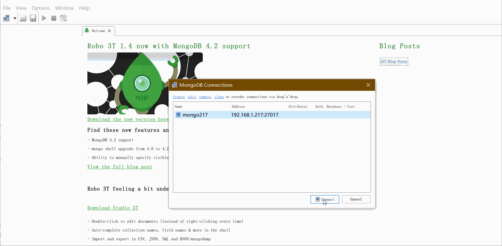

# mongodb入门

## 简介

mongodb是一个跨平台、面向文档的非关系型数据库，有高可用性和易扩展的特点。它存储的数据是类似于json的bson数据。存储时，不需要考虑数据对多少，只有数据结构语法没有问题，就能存储。

## linux中安装服务端

**注意：** mongodb服务，默认端口是27017

### 方法一：直接安装

用浏览器访问 https://www.mongodb.com/try/download/community  选中 “MongoDB Community Server”在右侧选中 version、platform、packeage，如选中 version为4.4.3，platform为centos7.0，package为server。点击下载按钮旁边的 “copy link”

```shell
# centos7 安装mongdb4.4.3
# 安装依赖
yum install libcurl openssl -y
yum install -y https://repo.mongodb.org/yum/redhat/7/mongodb-org/4.4/x86_64/RPMS/mongodb-org-server-4.4.3-1.el7.x86_64.rpm

# 启动、停止
systemctl restart\stop mongod

# 进入mongodb
mongo

# 查看数据库
show dbs;

# 查看数据库版本
db.version();

# 获取帮助
db.help();
```


国内镜像：http://mirrors.aliyun.com/mongodb/

centos的rpm：http://mirrors.aliyun.com/mongodb/yum/redhat/7/mongodb-org/


### 方法二：docker安装

```shell
# 安装mongodb 4.2.12版本
docker run -itd --name mongodb -p 27017:27017 mongo:4.2.12
```

mongodb的数据文件存储在 /var/lib/mogodb，日志文件在 /var/log/mongodb。

可以在 /etc/mongod.cnf 中配置数据文件和日志文件地址(不同版本，这个配置文件具体路径可能会有差异)。

```sh
cat /etc/mongod.conf.orig

# mongod.conf

# for documentation of all options, see:
#   http://docs.mongodb.org/manual/reference/configuration-options/

# Where and how to store data.
storage:
  dbPath: /var/lib/mongodb
  journal:
    enabled: true
#  engine:
#  mmapv1:
#  wiredTiger:

# where to write logging data.
systemLog:
  destination: file
  logAppend: true
  path: /var/log/mongodb/mongod.log

# network interfaces
net:
  port: 27017
  bindIp: 127.0.0.1


# how the process runs
processManagement:
  timeZoneInfo: /usr/share/zoneinfo

#security:

#operationProfiling:

#replication:

#sharding:

## Enterprise-Only Options:

#auditLog:

#snmp:

```


## windows安装客户端

### Robo 3T

在 https://robomongo.org/ 网站，下载安装包，然后解压，在解压包中，选择任意一个exe文件，都可以(两个exe是两个不同软件)。

启动软件，在弹窗中，选择‘<u>Create</u>’ 创建一个连接，配置mongodb服务器的ip，端口，默认是27017，再点击【**Connect**】按钮，即可连接数据库。


## 数据库操作

### 创建数据库

```sh
# 连接mongo数据库
mongo

# 创建数据库
use database_name

# 查看数据库
show dbs
```

### 创建集合

```
db.createCollection(集合名称, 选项参数)
```

| 字段   | 值类型 | 描述                                                   |
| ------ | ------ | ------------------------------------------------------ |
| capped | bool   | true表示创建固定集合，超过size值大小时，覆盖最早的文档 |
| size   | num    | 指定固定集合字节数大小，capped为true时，该值必填       |
| max    | num    | 指定固定集合包含的文档最大数量                         |

如：`db.createCollection("coll_name",{capped:true, size:6142800, max:10000})`

也可以通过课后端操作：

