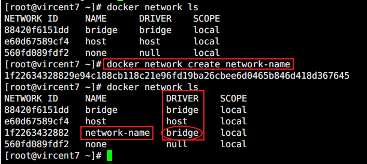
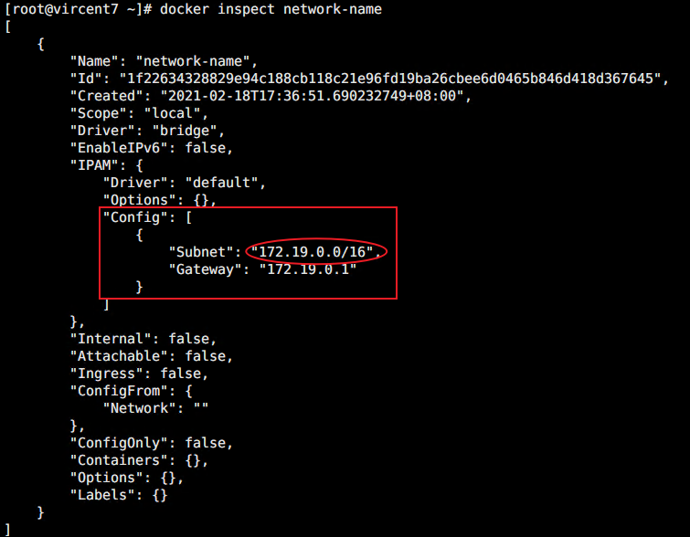
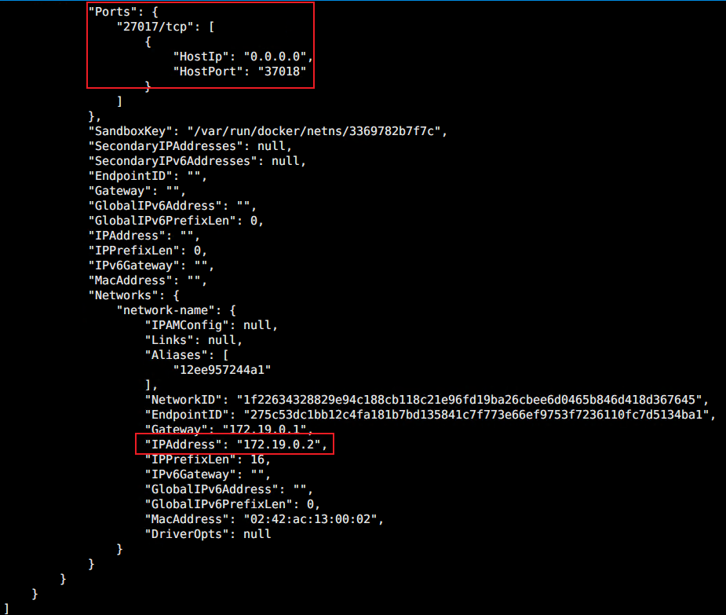
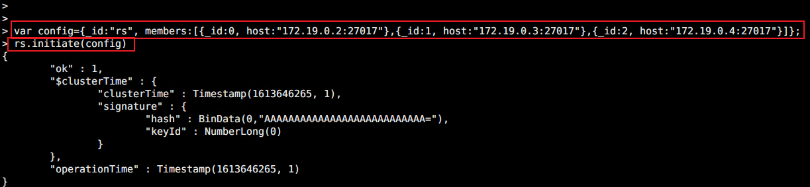
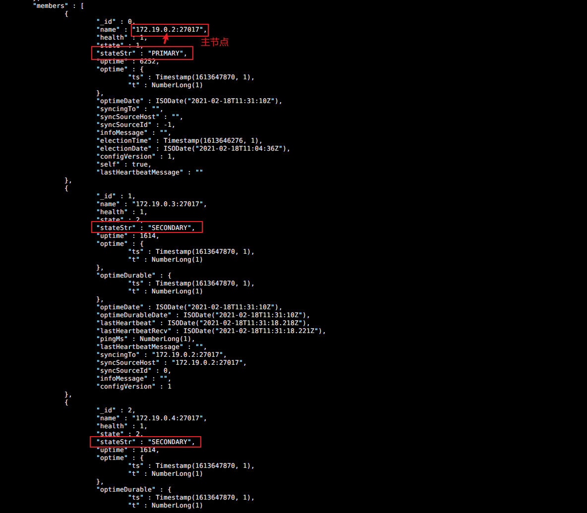

# mongodb创建副本集

### 方法一：多台机器配置副本集


### 方法二：用docker创建副本集

用docker创建副本集，我们可以在同一台机器中创建多个docker容器运行mongodb，然后再配置副本集。

大家也知道，docker是一个沙箱容器，宿主机可以和容器网络互通，但是，容器与容器之间是网络隔离的，为了让容器与容器之间网络互通，我们可以先创建一个docker网络。

+ 创建docker网络

```sh
# 创建network
docker network create network_name

# 查看network
docker network ls
```



可以看到，创建了一个名为 network-name的网络，再通过`docker inspect network-name`  可以查看新建的网络详细信息



+ 接下来，用docker创建mongodb数据库

```sh
# 创建3个mongodb容器节点
docker run -itd --name mongodb0 --network network-name -p 37018:27017 mongo:4.2.12 --replSet "rs"
docker run -itd --name mongodb1 --network network-name -p 37019:27017 mongo:4.2.12 --replSet "rs"
docker run -itd --name mongodb2 --network network-name -p 37020:27017 mongo:4.2.12 --replSet "rs"

# mongodb0 mongodb1 mongodb2 为容器名称
# network-name 为网络名称
# -p 后面跟端口映射
# mongo:4.2.12  为mongodb镜像tag标签
# --replSet "rs" 设置副本集 rs可以任意
```

创建好后，可以通过`docker ps -a` 查看是否正常启动运行，通过 `docker inspect 容器名称` 可以查看容器的详细信息，重点关注**IPAddress**



+ 接下来，进入任意一个mongodb副本集容器，配置副本集

```sh
# 进入容器
docker exec -it mongodb0 /bin/bash

# 执行mongo，进入mongodb
mongo
```

```javascript
> var config={_id:"rs", members:[{_id:0, host:"172.19.0.2:27017"},{_id:1, host:"172.19.0.3:27017"},{_id:2, host:"172.19.0.4:27017"}]};
// 172.19.0.*  是mongodb副本集的ip

> rs.initiate(config)
// 执行正常，返回如下图

```



执行完后，可以通过 `rs.conf()` 查看副本配置信息，通过`rs.status` 查看副本状态



+ 接下来，可以用客户端连接mongodb数据库，进行操作，看其他数据库是否能同步
  + 客户端工具，连接配置为**主节点**的容器对应的宿主ip和端口
  + 右键节点名称  > Create Database ，弹窗中，输入自定义数据库名
  + 选中自定义的数据库， 右键 Collections > Create Collection， 弹窗中，输入自定义数据集名称
  + 右键 选中自定义的数据集名称 > Inser Document... ，弹窗中，输入任意一段json格式信息，**save**保存
  + 客户端工具，连接其他数据库，查看，发现都有相同的数据库和对应数据
