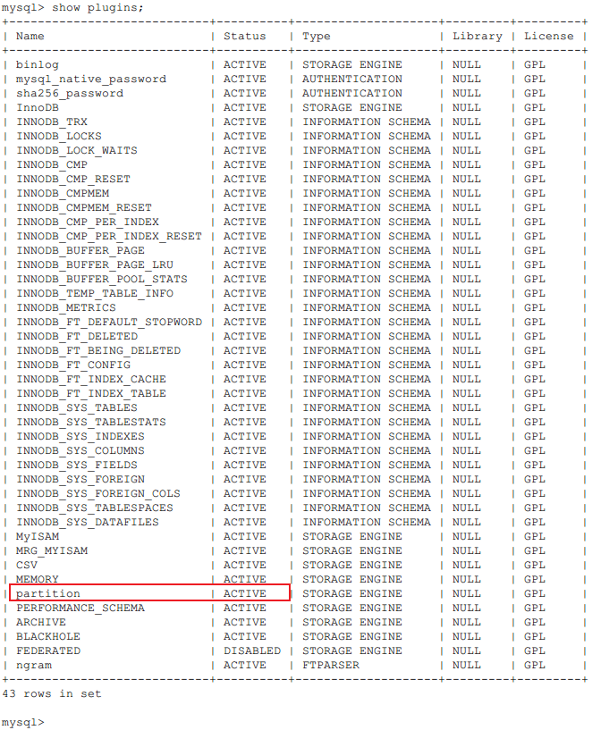

# mysql数据库分表分区

现在企业中，数据库选择用mysql的还是非常非常多的，公司比较规范的，在立项之初，就会认真讨论数据库的设计，而更多的中小微企业，可能就不会那么系统性的讨论数据库的设计了。

但是，不管怎么样，随着数据量的增加，或迟或早，都会遇到数据库性能瓶颈。数据库性能问题，套上那句话“不是没有，只是时机未到”。当数据量比较少时，基本不会有性能问题，在数据量比较多时，性能问题就会出现了。

今天，我们不是讨论使用层面上怎么优化脚本，我们讲讲数据库的设计，分表和分区，通过对某些特定的表减负，缩短查询时间，从而提高性能。

## 分表

分表，从字面上理解，就是把原本在**一张表中的数据，分开到多张实体表**中。基于这样的理解，其实现方式常见有两种：垂直切分、水平分表

### 垂直分表

垂直分表，是指对原始表的**列**进行拆分，根据一定的拆分规则，把一张表的列，拆分成多张表。如：把原始表中不常用的列拆分到一张表，把一些存储大数据量的字符拆分到一张表，把经常一起使用的列拆分到一张表，......等等。这样拆分的多张表，每张表都可以有自己的存储引擎、索引等，使用灵活，性能也可以得到提升。

按照这样的理解，大家见的比较多的‘视图’也是一种分表。

但是，**注意**，垂直分表，只是拆分了原始表的列，没有减少表的行，原来是多少行，还是多少行。

在企业中，对表垂直拆分一般都是开发人员或架构师，对业务比较熟悉的人执行。

### 水平分表

水平分表，最容易理解的是指对原始表的**行**进行拆分，根据一定的拆分规则，把原先存在一张表的数据，分表存储到多张表中。如：根据id取模，hash值、按日期月份...等等。

这样，原本存储在一张表中数据，被分开存储在不同的表中，大大降低了单表的数据量。

+ mysql数据库水平分表
  + 首先，创建2个及以上的表，字段与原表一致，但是存储引擎要确保为MyISAM。
    + 可以使用`create table 分表名 like 原表;`  创建表结构与原表相同的分表
    + 再用 `alter table 分表名 engine = MYISAM;`
  + 然后，再创建主表 `create table 主表名(......)ENGINE=MRG_MYISAM UNION=(分表名，多个用逗号分隔) INSERT_METHOD=LAST DEFAULT CHARSET=utf8;`
    + 注意：如果没有设置 INSERT_METHOD (值可以：FIRST、LAST、 NO)，数据将不能直接插入主表
  + 然后，再从原表中把输入插入到主表或分表中

```sql
-- 根据原表中id不同，插入到不同子表中
insert into 分表1(id,colname,.....) select id, colname,...... from 原表 where id%2=0;
insert into 分表2(id,colname,.....) select id, colname,...... from 原表 where id%2=1;
```

+ mysql水平分表MRG_MYISAM优点：
  + 适用于存储日志数据，根据月份不同，存不同的表，然后再压缩数据，通过查询主表获取数据
  + 可以大大提升读速度，主表的数据，分别存在在不同子表，子表又可以放在不同磁盘上，这样可以大大提升速度
  + 可以大大提升搜索速度，主表数据被分成多张子表，查询时，只要查对应的子表，不用查主表全部数据
  + 提升数据修复效率，某个子表的恢复要比主表所有数据恢复要快简单快捷很多
  + 索引效率也更高，因为主表不存数据，数据都在子表，每个子表自己维护索引，索引效率更高

+ mysql水平分表需要考虑的问题：
  + 主表存储引擎为MRG_MYISAM 或 MERGE，子表也必须为MyISAM引擎，需要考虑存储引擎的限制，如MyISAM不支持事务
  + 主表和子表表结构要完全一致
  + 主表存储引擎是MRG_MYISAM 或 MERGE，但是，某些MyISAM引擎的特性不能使用，如子表可以全文索引，但主表不能全文索引
  + 若使用 alter table 修改主表存储引擎，主表和子表的映射关系会自动断开，并且子表数据，会自动拷贝到修改后的表中
  + 主表 和 子表，主键都不能使用自增长(auto increment)
  + 子表之间无法保障主键唯一，在查主表时，返回子表数据，主键可能重复
  + 当正在使用主表时，不能对子表进行DCL操作(如：analyze、repair、optimize、alter、drop、delter、trancate)
  + 主表和子表之间映射的总行数上限为 2\*\*64=18446744073709551616
  + 不支持 insert delayed语句

另外一种水平分表，可能不是那么好理解，数据库集群或者说主从同步，读写分离。这样也是可以提升数据库性能的。

## 分区

分区和分表类似，不同的是，分表，是把原始表分成多个子实体表；而分区是将原始表的**数据划分到多个位置存放**，表还是一张表，只是数据分布在多个地方。

### 垂直分区

垂直分区(VerticalPartitioning)，根据表中的列，进行垂直划分，使某些特定的列数据被集中在某一个分区中。如：根据数据列使用频率

### 水平分区

水平分区(HorizontalPartitioning)，根据表的行进行分区，把表中满足某些特性的数据，集中保存在某一个分区中。如：按存储年份分区

+ 查看数据库是否支持分区

mysql 5.7版本，可以执行 `show plugins;` 查看数据库是否支持分区，partition为ACTIVE，表示支持分区



+ 分区类型：
  + RANGE分区：基于给定的连续区间访问，把数据分配到不同分区

  + LIST分区：基于枚举值列表进行分区

  + COLUMNS分区：分range columns 和 list columns分区

  + HASH分区：基于给定的分区个数进行分区

  + KEY分区：类似hash分区

  + COMPOSITE分区：复合分区

    

+ 分区操作：
  + 新增分区
    + 新增range分区

    ```sql
    create table 表名(字段...)partition by range (某个字段名) (partition 分区名 values less than(范围值) data directory = '磁盘路径' index directory = '磁盘路径',......)engine=Innodb charset=utf8;
    ```

    + 新增list分区

    ```sql
    create table 表名(字段...)partition by list (某个字段名) (partition 分区名 values in(值) data directory = '磁盘路径' index directory = '磁盘路径',......)engine=Innodb charset=utf8;
    ```

    + 新增hash分区

    ```sql
    create table 表名(字段...)partition by hash (某个字段名) partitions 下面分区数量 (partition 分区名 data directory = '磁盘路径' index directory = '磁盘路径',......)engine=Innodb charset=utf8;
    ```

    + 新增key分区

    ```sql
    create table 表名(字段...)partition by key (某个字段名) partitions 下面分区数量 (partition 分区名 data directory = '磁盘路径' index directory = '磁盘路径',......)engine=Innodb charset=utf8;
    ```

    

  + 修改分区

    + 重建

      **注意**：在给已有表，创建分区是，默认分区字段为表主键的一部分

    ```sql
    -- 重建range分区
    alter table 表名 reorganize partition 分区名1,分区名2... into(partition 分区名0 values less than (范围值));  -- 将原来的 分区1,分区2 合并到新的分区0中
    ```

    ```sql
    -- 重建list分区
    alter table 表名 reorganize partition 分区名1,分区名2... into(partition 分区名0 values in(范围值));  -- 将原来的 分区1,分区2 合并到新的分区0中
    ```

    ```sql
    -- 重建hash \ key分区
    alter table 表名 reorganize partition coalesce partition 分区数量;  -- 减少原来的分区数量到新的分区数量
    ```

    

    + 新增

    ```sql
    -- 新增一个range分区
    alter table 表名 add partition (partition 分区名 values in (值) data directory = '磁盘路径' index directory = '磁盘路径');
    
    -- 新增hash 、key分区
    alter table 表名 add partition partitions 8;  -- 将分区数扩展到8个
    ```

    ```sql
    -- 给已有表增加分区
    alter table 表名 partition by range()(partition 分区名 values less than (值),...);
    -- 按月份分区  range(moth(字段名))
    ```

    

  + 删除分区

  ```sql
  alter table 表名 drop partition 分区名;
  ```


### 分区的优势

+ 优势：
  + 与单个磁盘或文件系统相比，可以存储更多的数据
  + 可以极大的优化查询速度，因为，查询的where语句，不用再全分区数据查找，只需要在需要的一个或几个分区内查找就可以
  + 脚本中的聚合函数，可以轻松实现并行处理
  + 可以跨磁盘分散存储数据，获得更改的IO
  + 还原 或 删除某些数据时，能很轻松的实现对特定分区的操作

