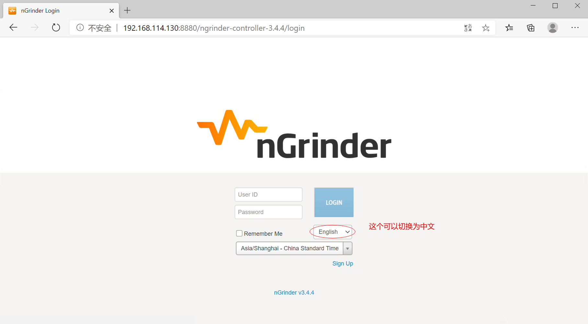
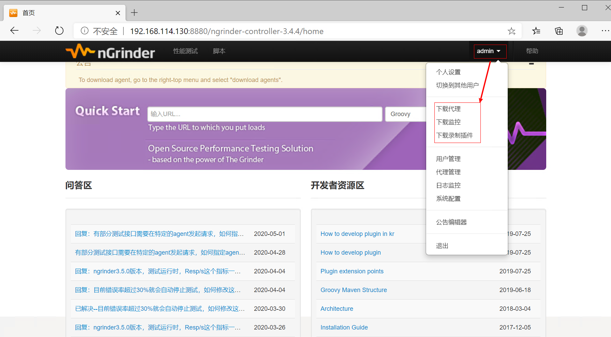
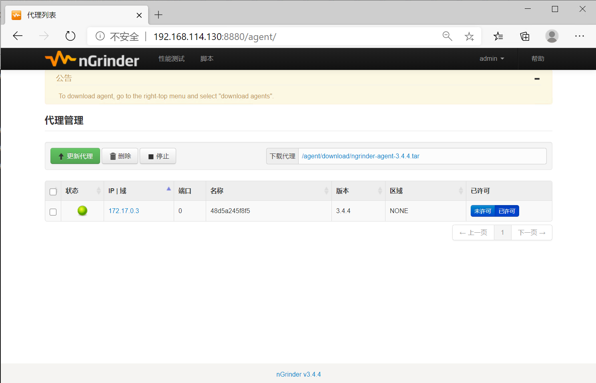
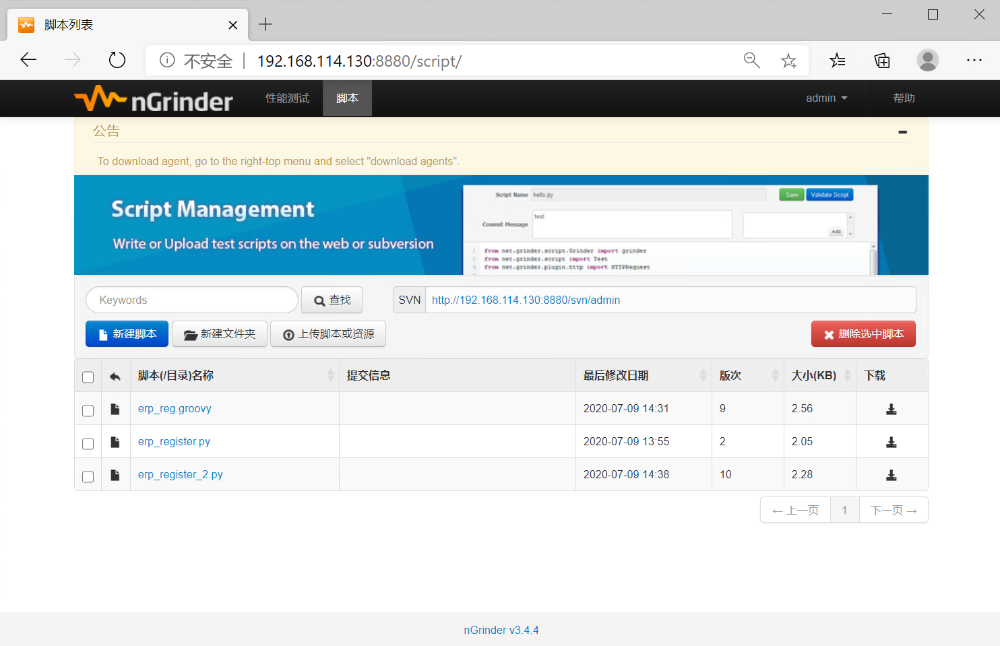
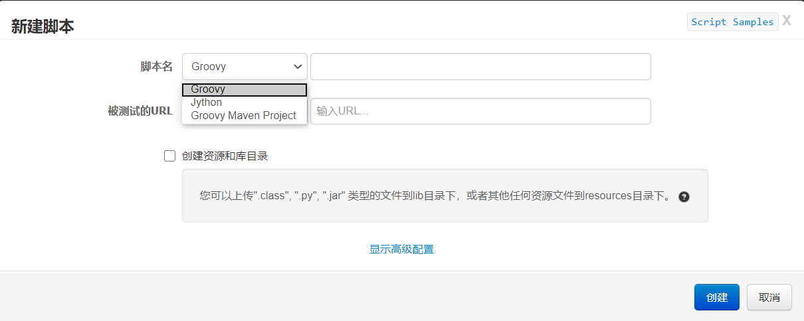
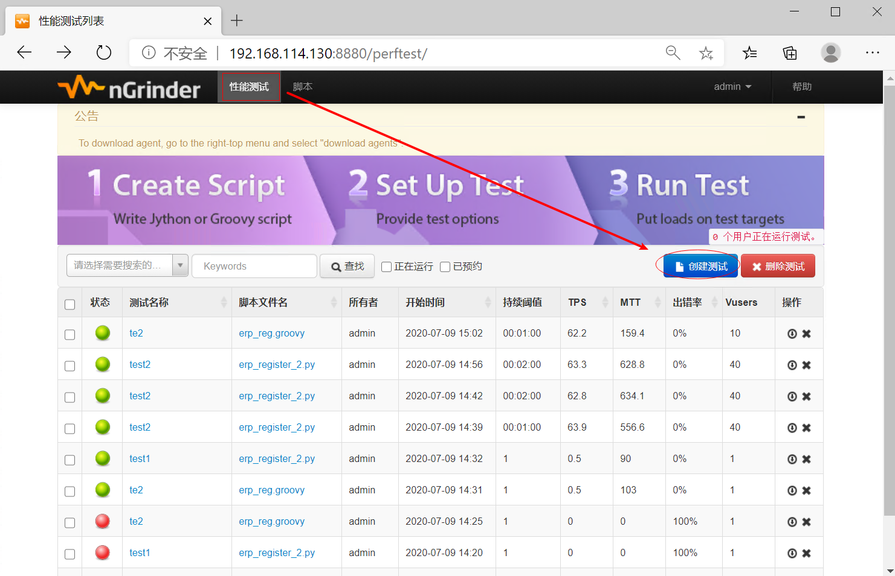
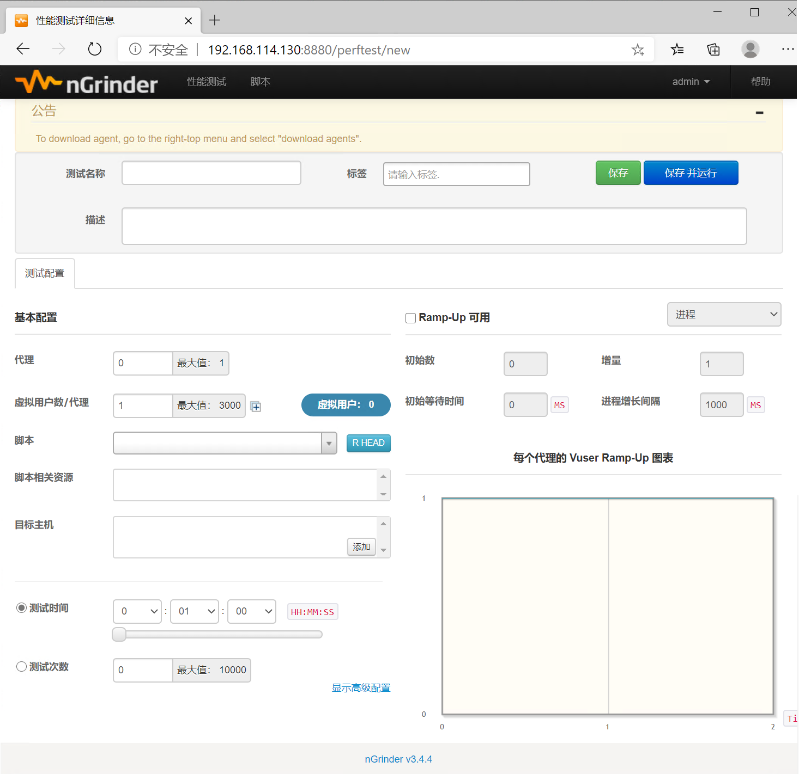
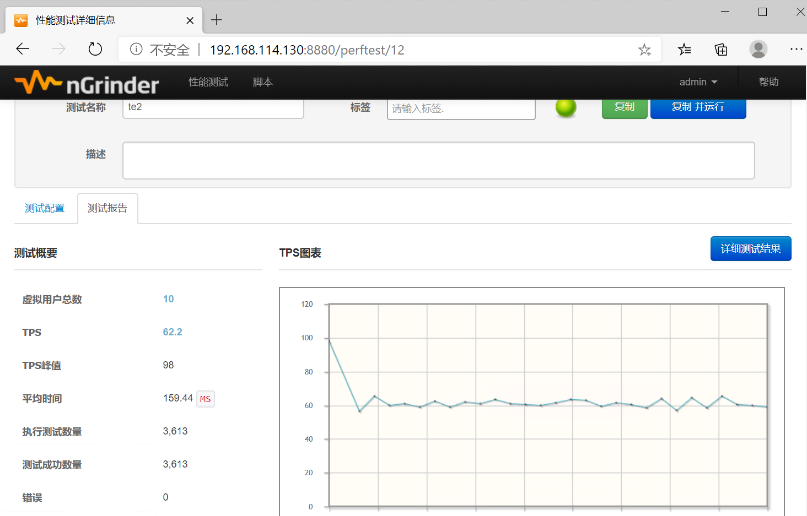
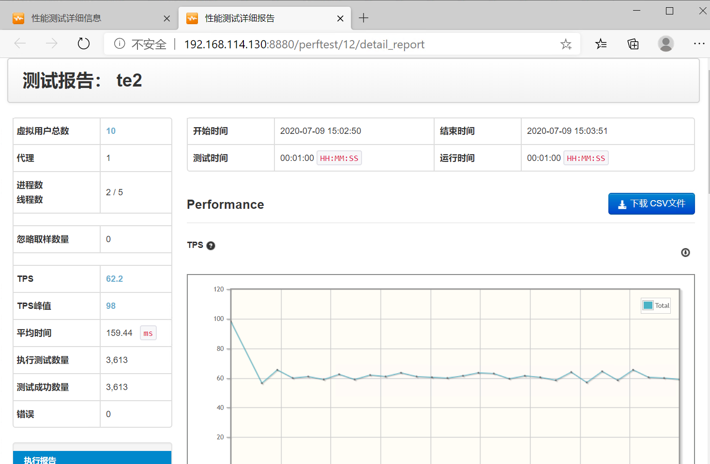

# ngrinder快速上手，写出自己的第一个脚本

## 简介

nGrinder是基于Grinder开源项目，由NHN公司的开发团队进行了重新设计和完善。nGrinder是一款非常易用，有简洁友好的用户界面和controller-agent分布式结构的强大的压力测试工具。

它的脚本，支持Jython、Groovy两种语言。

**官方网站**：http://naver.github.io/ngrinder/

**github地址**：https://github.com/naver/ngrinder


## ngrinder工作原理

它由一个Controller 和与它相连的多个 Agent 组成。用户通过web界面管理和控制测试，以及查看测试报告。

Controller 会把测试分发到每个Agent上去执行，用户可以在web管理界面中，设置多个使用多个**线程**或**进程**来并发的执行脚本。

nGrinder的脚本是python语言写的。Controller把这些脚本分发到各个Agent中，然后用Jython来执行。并在执行的过程中，收集运行情况、响应时间、测试目标服务器的运行情况等，并保存数据生成报告。


## ngrinder安装

+ **环境要求**

  + jdk1.6 以上
  + tomcat
  + 端口 16001、12000~12000+、13243(monitor)、8080(tomcat)

+ **下载包**

  + 下载war包 https://github.com/naver/ngrinder/releases
  + 下载tomcat (可选操作)

+ **启动服务**

  + **方法1**：直接运行

    +  java -jar ngrinder-controller-xx.war

    ```
    或
      
      java -XX:MaxPermSize=200m -jar ngrinder-controller-xx.war
    ```

    - 访问：http://localhost:8080/ 账户信息：admin/admin

  + **方法2**：采用tomcat运行

    + 解压tomcat包，把ngrinder的war包，放到tomcat的webapps文件夹

    + 访问：http://localhost:8880/ngrinder-controller-3.4.4 账户信息： admin/admin



+ **安装Agents\monitor**

  + 下载： 登录web管理界面，点击顶部导航用户信息，在下拉信息中，选择‘下载代理’，将会自动下载Agent，选择‘下载监控’，将自动下载monitor监控

  

  

  + 解压、启动Agent：双击 run_agent.bat(windows) ‘./run_agent.sh’(linux mac)

  ```shell
  [root@localhost ngrinder]#tar -xvf ngrinder-agent-3.4.4-192.168.114.130.tar
  [root@localhost ngrinder]# cd ngrinder-agent/
  [root@localhost ngrinder-agent]# ./run_agent_bg.sh
  
  ```

  

  + 解压、启动monitor：双击 ‘run_monitor.bat’(windows), './run_monitor.sh'(linux mac)

  ```sh
  [root@localhost ngrinder]# tar -xvf ngrinder-monitor-3.4.4.tar
  [root@localhost ngrinder]# cd ngrinder-monitor/
  [root@localhost ngrinder-monitor]# ./run_monitor_bg.sh
  
  ```

  

  代理服务启动后，在页面 admin > 代理管理，就能看到代理服务器




## 制作脚本

  在首页，Quick Start 文本框中输入 要录制脚本的地址，第二个文本框，选择生成脚本的语言类型，点击 **开始测试** 按钮，就可生成脚本。或者点击，菜单栏中的‘**脚本**’



点击‘**新建脚本**’按钮，弹窗中，选择脚本类型，填写脚本名称，被测URL(可选)，点击‘创建’即可创建出一个对应脚本语言的脚本



点击脚本列表 ‘脚本名称’列中的脚本名称，即可打开对应的脚本详情，不懂的groovy或jython的同学，可抓紧这个机会，看看自动生成的脚本，长什么样子哦。当然，这些脚本支持修改、也支持上传自己写好的脚本文件。


## 性能测试

点击顶部菜单栏中的‘**性能测试**’菜单



再点击 ‘**创建测试**’



在这个页面中，填写‘**测试名称**’，填写‘**代理**’数量(根据后面的提示)， 选择‘**脚本**’，如果脚本中有服务器地址，则可以不选择目标主机，如果没有，则需要添加‘**目标主机**’，然后点击右上角的‘**保存 并运行**’，这样就可以按照你的设计，进行性能测试了。

> **注意**： Ⅰ、ngrinder性能测试，支持 进程\线程 两种模式运行。
>
> ​			Ⅱ、想要进行负载测试，需要勾选 **Ramp-Up可用** 复选框，然后才能进行负载场景配置

性能测试执行过程成功，状态为绿色(红色为执行过程中出错)，执行成功，会展示一份测试报告概要。



点击‘ **详细测试结果**’ 可以看到更加详细的测试报告




## 扩展

Ⅰ、8080端口可能备用，可以指定其他端口

```sh
java -XX:MaxPermSize=200m -jar ngrinder-controller-xx.war --port 指定端口号
```

Ⅱ、想要后台运行

```sh
nohup java -XX:MaxPermSize=200m -jar ngrinder-controller-xx.war --port 指定端口号 &
```

Ⅲ、想要用docker方式部署

```shell
$ docker run -d -v ~/ngrinder-controller:/opt/ngrinder-controller --name controller -p 80:80 -p 16001:16001 -p 12000-12009:12000-12009 ngrinder/controller

$ docker pull ngrinder/agent
docker run -d --name agent --link controller:controller ngrinder/agent

```


好了，这么详细的介绍，你是不是已经可以快速上手，使用ngrinder了呢？

​	