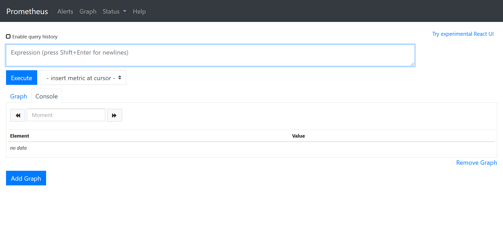
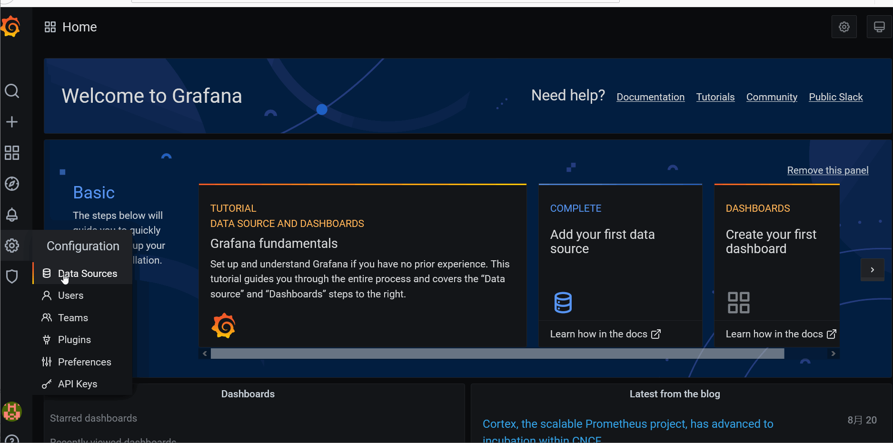
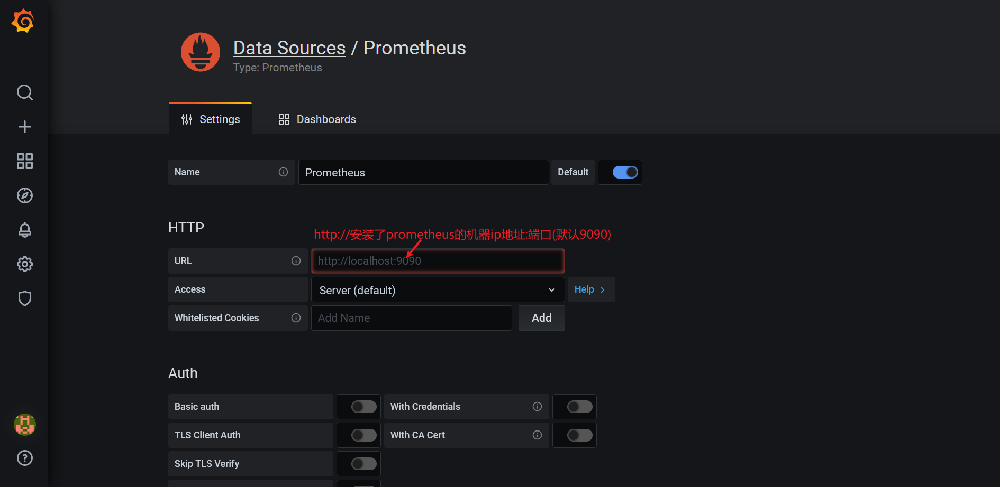
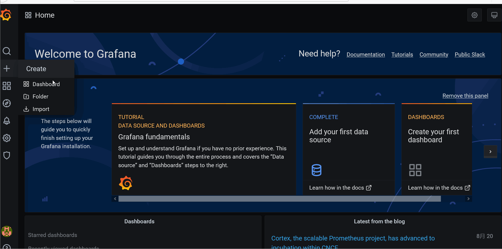
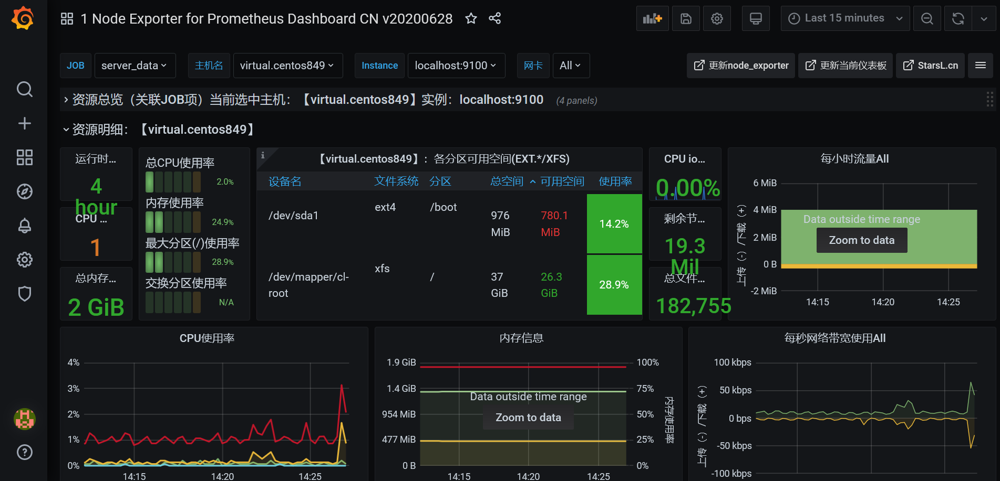

# prometheus监控服务器(七)

## 介绍

Prometheus 是由 SoundCloud 开源监控告警解决方案。它用时序数据的方式存储数据，有独立的PromQL (Prometheus Query Language) 数据查询语言。


## 安装

linux服务器中直接安装

```sh
# 下载最新的包
wget https://github.com/prometheus/prometheus/releases/download/v2.20.1/prometheus-2.20.1.linux-amd64.tar.gz

# 解压包
tar -xzvf prometheus-2.20.1.linux-amd64.tar.gz

# 进入解压后的文件夹
cd prometheus-2.20.1.linux-amd64/

# 启动服务
./prometheus

```

docker方式安装

```sh
# 拉取镜像，创建容器
docker run -itd --name 容器名称 -p 9090:9090 prom/prometheus

# 重启容器
docker restart 容器名
```


## 访问

浏览器访问： http://机器ip:9090



出现如上图，说明grafana已经正常，选择 *insert metric at cursor*  ，然后，点击【Execute】可以运行生成一条数据。

> 菜单栏 Status 下的功能，能看到更多配置信息

由于**Prometheus Server并不直接服务监控特定的目标**，其主要任务负责数据的收集，存储并且对外提供数据查询支持。因此<u>为了能够能够监控到某些东西，如主机的CPU使用率，我们需要使用到 <a href="https://github.com/prometheus/node_exporter/releases/download/v1.0.1/node_exporter-1.0.1.linux-amd64.tar.gz">Exporter</a>。</u>

> 想要获得更多服务器监控，可以从官方下载最新的工具。 <a href="https://prometheus.io/download/">官方监控工具下载</a>

**安装exporter监控服务器**

```sh
# 下载node_exporter
wget https://github.com/prometheus/node_exporter/releases/download/v1.0.1/node_exporter-1.0.1.linux-amd64.tar.gz

# 解压
tar -xzvf node_exporter-1.0.1.linux-amd64.tar.gz

# 进入node_exporter文件夹
cd node_exporter-1.0.1.linux-amd64

# 启动服务
./node_exporter

# 注意，不要停止该服务
```

服务启动后，可以通过 http://服务器ip:9100 访问该服务

**配置prometheus收集exporter数据**

```sh
停止 prometheus服务

# 修改prometheus.yml文件，该文件在 prometheus解压包根文件夹中
vim prometheus.yml

# 修改文件
scrape_configs:
  # The job name is added as a label `job=<job_name>` to any timeseries scraped from this config.
  - job_name: 'prometheus'

    # metrics_path defaults to '/metrics'
    # scheme defaults to 'http'.

    static_configs:
    - targets: ['localhost:9090']
  - job_name: 'server-data'
    static_configs:
    - targets: ['localhost:9100']

# 保存修改文件
# 重启动prometheus

```


## 使用grafana可视化prometheus收集的数据

进入grafana，配置数据源，选择prometheus





点击页面底部的 【save & test】

配置展示面板，面板id：8919



选择上一步添加的数据源名称，确定

