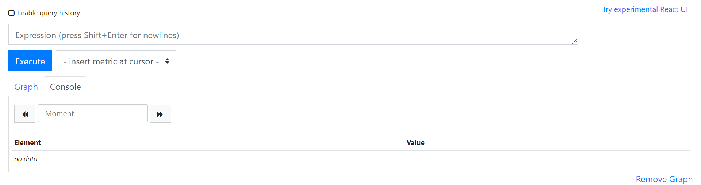
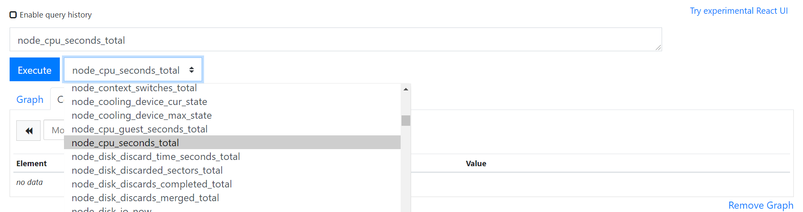
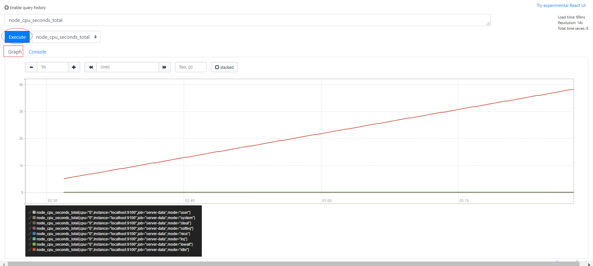
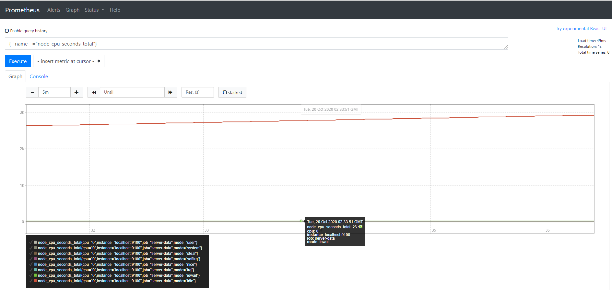

# prometheus语法

如果prometheus正常启动，在防火墙开放了9090端口时，可以通过浏览器访问  http://机器ip:9090  直接访问



在页面中“insert metric at cursor” 中选择查看的监控对象，如 node_cpu_seconds_total  然后点击 Execute 按钮



再切换到  graph



此时，我们已经看到了服务器cpu资源监控图

> 如果没有出现图，可能是因为时间跨度区间太长，可以点击 graph标签下面的 "- +"来调整图表时间区间，缩小区间，就能看到时间了。

## 设置标签匹配器

+ 这个功能类似，sql语法中where条件语句，不过在使用时，要用 {} 大括号，括号中间写条件，多个条件之间用逗号。

eg:

```
# 条件匹配
node_cpu_seconds_total{cpu="0", mode="system"}

# 点击 execute
```

点击 execute 按钮之后，graph中就只有1个图形线了。

逻辑符号除了上面用的 ‘=’ 还可以用

- =   等于
- !=  不等于
- =~  等于正则式匹配值
- !~   不等于正则式匹配值

eg：

```
# 模糊匹配
node_cpu_seconds_total{cpu="0", mode=~"user|system|irq"}

# 点击 execute
```

点击 execute 按钮之后，graph中就会看到 3 条图形线。

+ 可以使用 \_\_name\_\_ 直接匹配**指标名称**

eg:

```
# 精确匹配标签
{__name__="node_cpu_seconds_total"}

# 模糊匹配标签
{__name__=~"node_cpu.*"}
```



**但是**，指标名称不能是关键词： bool、on、ignoring、group_left、group_right

```
# 标签名，不能是关键字
on{__name__=~"node_cpu.*"}	# 这个会报错
```

## 设置范围取值器

+ 这个功能类似，sql语法中的between语句，实现区间取值，不过它使用 [] 中括号，括号中写范围

eg：

```
# 15分钟
irate(node_cpu_seconds_total{mode="user"}[15m])
```

+ 持续时间单位可以是：
  + ms  毫秒，eg：150ms
  + s  秒，eg：60s300ms
  + m  分钟, eg：5m15s
  + h  小时, eg：3h5m
  + d  天, eg: 1d
  + w  周, eg: 1w
  + y  年, eg: 1y

## 时间偏移

+ 这个功能类型sql语法中的offset，语法实现也是用 offset

```
# 偏移20分钟
node_cpu_seconds_total offset 20m

sum(node_cpu_seconds_total{mode="user"} offset 5m)
```

## 重点函数

+ abs()  返回绝对值
+ delta()  求差值
+ floor()  四舍五入
+ hour()  UTC时间小时
+ idelta()  时间计算
+ increase()  按时间增加
+ irate()  增长率
+ rate()  平均增长率
+ ln()  自然对数
+ log2()  二进制对数
+ log10() 十进制对数
+ minute() UTC时间分钟
+ month()  UTC时间月
+ round()  取整
+ sort()  升序
+ sort_desc() 降序
+ sqrt() 求平方根
+ time()  UTC秒
+ timestamp() 时间戳
+ year() UTC年