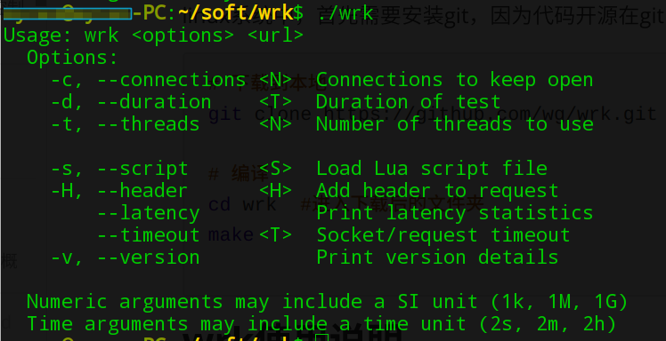
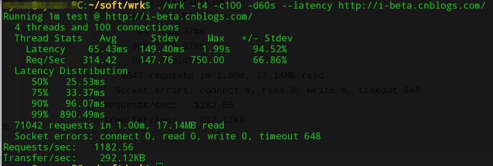

# wrk基准测试技能介绍

## wrk简介

wrk 是一个开源的支持HTTP协议的基准测试工具，它的特点是高并发低损耗，安装部署简单，但是，不适合做多协议及复杂场景的性能测试。它原生支持LuaJIT脚本

## wrk安装

linux系统中，首先需要安装git，因为代码开源在github上，运行依赖gcc、openssl

```shell
# 下载
git clone https://github.com/wg/wrk.git

# 编译
cd wrk	# 进入下载后的文件路径
make
```

## wrk使用说明



```shell
Usage: wrk <options> <url>                            
  Options:                                            
    -c, --connections <N>  Connections to keep open   
    -d, --duration    <T>  Duration of test           
    -t, --threads     <N>  Number of threads to use   
                                                      
    -s, --script      <S>  Load Lua script file       
    -H, --header      <H>  Add header to request      
        --latency          Print latency statistics   
        --timeout     <T>  Socket/request timeout     
    -v, --version          Print version details      
                                                      
  Numeric arguments may include a SI unit (1k, 1M, 1G)
  Time arguments may include a time unit (2s, 2m, 2h)
```

-c,  后面跟数字，代表http连接数

-d, 后面跟数字，代表持续运行时长

-t, 后面跟数字，代表启动多少个线程

-s, 后面跟脚本名称，脚本用lua编写

-H, 后面跟消息头

--latency	代表输出响应的详细信息

--timeout  后面跟设置的超时时长

-v, 版本信息

## 演示示例

```shell
wy@wy-PC:~/soft/wrk$ ./wrk -t4 -c100 -d60s --latency http://i-beta.cnblogs.com/
Running 1m test @ http://i-beta.cnblogs.com/
  4 threads and 100 connections
  Thread Stats   Avg      Stdev     Max   +/- Stdev
    Latency    65.43ms  149.40ms   1.99s    94.52%
    Req/Sec   314.42    147.76   750.00     66.86%
  Latency Distribution
     50%   25.53ms
     75%   33.37ms
     90%   96.07ms
     99%  890.49ms
  71042 requests in 1.00m, 17.14MB read
  Socket errors: connect 0, read 0, write 0, timeout 648
Requests/sec:   1182.56
Transfer/sec:    292.12KB

```




**命令：**./wrk -t4 -c100 -d60s --latency 网址

-t4: 4个线程

-c100: 建立100个连接

-d60s： 持续运行60s

-- Latency： 显示详细响应信息


`Running 1m test @ http://i-beta.cnblogs.com/`: 向某个网址持续施压 1 分钟

`4 threads and 100 connections`：4个线程，共建立100个连接

```shell
Thread Stats   Avg      Stdev     Max   +/- Stdev
    Latency    65.43ms  149.40ms   1.99s    94.52%
    Req/Sec   314.42    147.76   750.00     66.86%
```

简易的聚合报告，显示 **平均响值、标准方差、最大值、偏差振幅**(值越大，说明离散程度越高)

Latency：响应时间分布

Req/Sec：每秒请求数

```shell
  Latency Distribution
     50%   25.53ms
     75%   33.37ms
     90%   96.07ms
     99%  890.49ms
```

50%  75%  90%  99%的**响应时间**分布图表

`71042 requests in 1.00m, 17.14MB read`： 在 1 分钟内，共请求了71042次，读取了17.14MB数据

`Socket errors: connect 0, read 0, write 0, timeout 648`：本次测试，连接错误 0 次， 读取错误 0 次， 写错误 0 次， 超时错误 648 次

`Requests/sec:   1182.56`： 本次测试，所有线程平均每秒 1182.56 次请求

`Transfer/sec:    292.12KB`： 本次测试， 所有请求的平均吞吐量为 292.12KB


想要更深入了解wrk功能，可以在github上 查看帮助文档：<https://github.com/wg/wrk/blob/master/README.md>  对应lua语言，有兴趣的同学，请自行学习。


---

> 获得更多有趣有料的软件测试技能，欢迎关注 **柠檬班**微信公众号。
