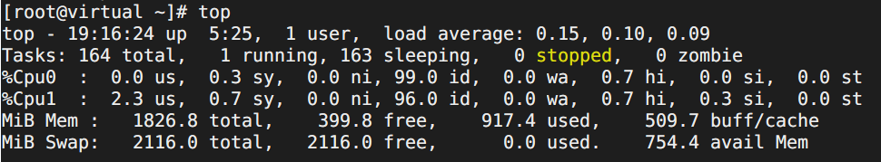
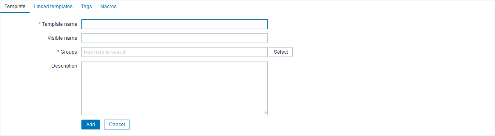
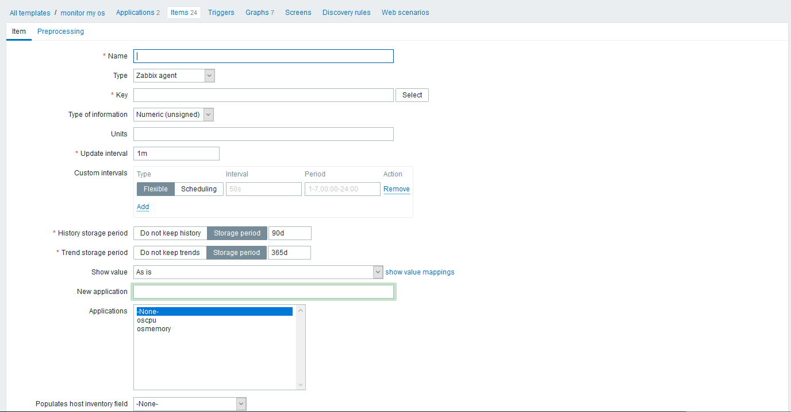
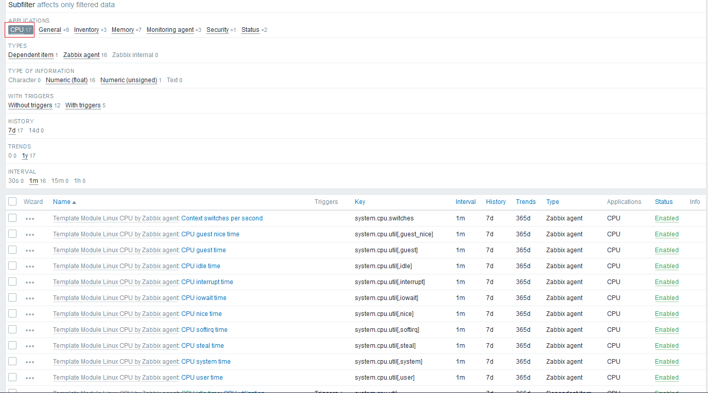
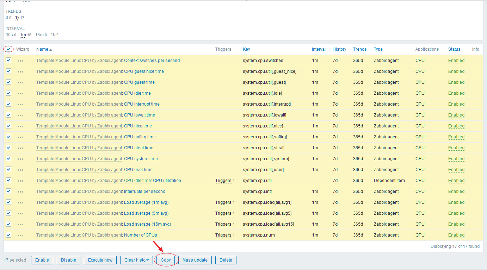
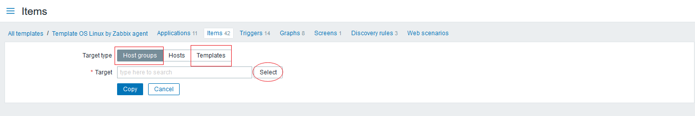
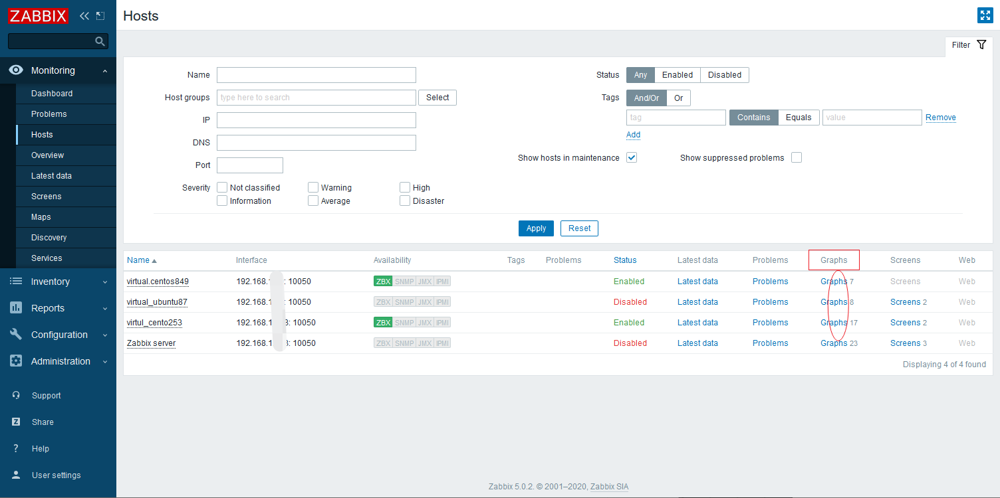
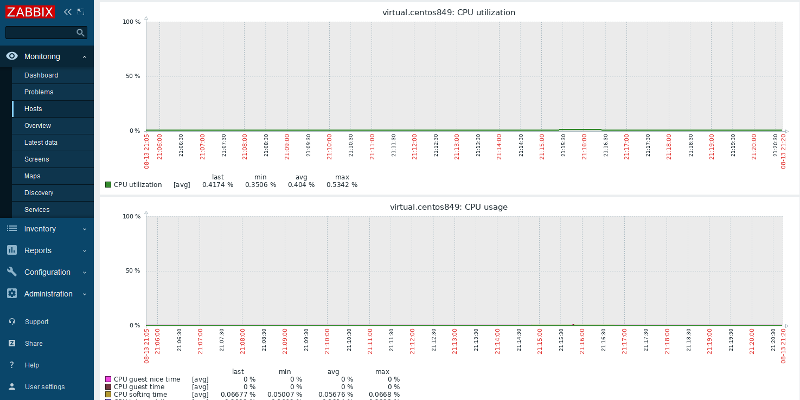

# zabbix 监控模板配置(五)

zabbix平台已经为我们配置好了，很多用于监控主机的模板，而且监控的非常丰富，但是，有时候，我们并不需要监控那么多内容，只需要监控具体的某一些特定信息即可。减少监控项，也同样在减少被监控和控制机的资源消耗。所以，我们还是有必要了解一下，如何自定义配置监控项。

很多时候，我们都需要去监控主机的cpu使用情况，那今天，我们就配置一个cpu监控模板给大家举例。

先问下大家，**知道监控cpu，需要监控哪些信息吗？**

相信，这个问题一出，就难倒了一大批‘有志之士’，其实，要想知道它的答案，很简单，只需要我们在linux服务器上，执行一个 **top** 命令，结果就出来了：

相信，这张图，很多很多同学都见过，在我们查看服务器运行情况的时候，我们都会习惯性的敲下top命令，然后，看下%Cpu开头的一行信息，这就是我们常常关注的cpu信息。

那在zabbix的web页面中，怎么配置一个cpu监控模板呢？

+ **Ⅰ、创建主机组**

登录zabbix的web页面，进入 **Configuration > Host groups**  页面， 点击页面右上角的 **Create host group** 按钮，填写 group name(组名)，点击Add.

+ **Ⅱ、创建模板**

进入 **Configuration > Templates**  页面，点击右上角的 **Create template** 按钮，

填写 Template name模板名，Visible name可见的模板名(可选)，Groups 选择上一步添加的模板，点击Add.

现在模板是已经创建了，但是此时你在Templates的列表中看到，applications应用集、items监控项、targgers触发器、graphs图形、screens聚合图形、discovery自动发现、web监控，后面都没有数字，说明没有数据。

+ **Ⅲ、添加Application**

选中模板，可以点击模板名称，然后再点击打开页面顶部的 Application ；或者选择模板，点击Applications列中的Application连接入口；点击右上角的 Create application ，输入name应用集的名称，点击Add.

+ **Ⅳ、添加Items**

添加监控项，肯定很多同学就会想到和前面添加应用集一样操作一遍。是的，这样可以，但是你会发现，在你create item时，不知道怎么填了

这里，**告诉大家走捷径**，

回到我的templates，找到一个叫 "Template os linux by \*\*\*"，点击右边的 <u>Items</u> , 打开的页面中，就会显示非常多的items，可以用上面的搜索功能搜索，也可以用 subfilter过滤器中的 Application应用集，点击<u>CPU</u>

 

就可以过滤出所有的有关于cpu的监控项，选中所有，点击列表最底部的 **copy** 按钮

在打开的页面，可以选择之前自己创建的Hostgroups，也可以选择之前自己创建Template，点击copy.

这样，就可以直接复用别人已经配置好的监控项

+ **Ⅴ、添加Graphs**

如上操作，再次对graph进行复制一份到自己创建的模板中。

这样，一个最基本的cpu监控模板就完成了。当然，如果你想配置触发器，对于异常给与提示，你也可以再次复制操作一次。

**使用模板监控主机**

现在，我们一个模板已经配置好了，下面我们就要用配置好的模板来监控一台主机。

进入 **Configuration > Hosts**  页面，点击一个Status状态为 <u>Enabled</u> 的机器名称，在页面中更改 *Groups* 为我们新配的模板名称，点击 **update**.

然后，再进入  **Monitoring > Hosts**  

点击我们监控的主机的 Graphs 

就能看我们需要的监控cpu图表。

现在我们知道如何来配置一个监控cpu的模板，哪你想配置一个监控其他的模板，知道怎么配置了吗？方法是想通的的，只是监控项不同而已。

+ **附录**

| 预监控对象  | 推荐模板                                                     | 模板搜索关键字 |
| ----------- | ------------------------------------------------------------ | -------------- |
| os linux    | Template OS Linux by Zabbix agent Template OS Linux by Prom | os linux       |
| os windows  | Template OS Windows by Zabbix agent                          |                |
| os mac      | Template OSMac OS X                                          |                |
| cpu         | Template Module Linux CPU by Zabbix agent Template Module Windows CPU by Zabbix agent | cpu            |
| memory      | Template Module Linux memory by Zabbix agent Template Module Windows memory by Zabbix agent | memory         |
| system      | Template Module Linux filesystems by Zabbix agent Template Module Linux generic by Zabbix agent Template Module Windows filesystems by Zabbix agent Template Module Windows generic by Zabbix agent |                |
| network     | Template Module Linux network interfaces by Zabbix agent Template Module Windows network by Zabbix agent | network        |
| disk        | Template Module Windows physical disks by Zabbix agent       |                |
| apache      | Template App Apache by Zabbix agent Template App Apache by HTTP | apache         |
| tomcat      | Template App Apache Tomcat JMX                               | tomcat         |
| docker      | Template App Docker                                          | docker         |
| http server | Template App HTTP Service Template App HTTPS Service Template Module Windows services by Zabbix agent | service        |
| IIS server  | Template App IIS by Zabbix agent                             | IIS            |
| memcache    | Template App Memcached                                       | memcache       |
| redis       | Template DB Redis                                            | redis          |
| nginx       | Template App Nginx by Zabbix agent Template App Nginx by HTTP | nginx          |
| MQ          | Template App RabbitMQ cluster by Zabbix agent Template App RabbitMQ cluster by HTTP Template App RabbitMQ node by Zabbix agent Template App RabbitMQ node by HTTP | rabbitmq       |
| mysql       | Template DB MySQL by Zabbix agent Template DB MySQL      | mysql          |
| postgresql  | Template DB PostgreSQL                                       | postgresql     |

