# zabbix与grafana结合，监控性能测试服务器(六)

## grafana介绍

Grafana是一款用Go语言开发的开源数据可视化工具，可以灵活配置各种图标，展示监控的数据。

zabbix是一个企业级的、高度成熟的、分布式开源监控解决方案，它能够监控众多网络参数和服务器的健康度、完整性。

grafana可以接入zabbix数据进行展示。

那grafana+zabbix解决方案，他的具体实现思路是怎样的呢？

- 在任意一台电脑上安装zabbix-server，然后再在被测试的性能服务器上安装zabbix-agent，这样，就可以把性能测试过程中，性能服务器各种监控数据给zabbix-server
- 在任意一台电脑上安装grafana，然后再安装zabbix插件，这样，就可以让grafana支持zabbix
- 在grafana中，配置zabbix-server作为数据源，再添加展示面板，这样，就能把用zabbix监控的被测试的性能服务器的数据在grafana中展示了。

好了，现在思路已经清晰了，那就开始动手吧！

## Ⅰ、安装zabbix

选择一台服务器，安装zabbix-server、zabbix-agent  详见 

[在centos8中安装zabbix]: 


## Ⅱ、性能服务器安装zabbix-agent

在被测的服务器上安装 zabbix-agent，详见 

[linux系统增加zabbix资源监控]: 


## Ⅲ、grafana 安装

### 	安装方法1：直接安装

centos

```sh
wget https://dl.grafana.com/oss/release/grafana-7.1.3-1.x86_64.rpm
sudo yum install grafana-7.1.3-1.x86_64.rpm

# 参照：https://grafana.com/grafana/download
```


### 	安装方法2：容器安装

执行：

```sh
docker run -d --name=grafana2 -p 7777:3000 -v /var/lib/grafana:/var/lib/grafana  grafana/grafana:3.0.4

```

## Ⅳ、grafana中安装zabbix插件

centos(对应上面的方法1)

```sh
# 在linux终端中执行
grafana-cli plugins install alexanderzobnin-zabbix-app

# 插件安装完成后，重启grafana
systemctl restart grafana-server

```

docker容器安装(对应上面的方法2)

```sh
# 进入docker容器
docker exec -it 容器名称 /bin/bash

# 使用grafana-cli 安装插件
grafana-cli plugins install alexanderzobnin-zabbix-app

# 插件安装完成后，退出容器
exec

# 重启容器
docker restart 容器名称
```

> 注意： 这个插件安装，时间可能有点长


## Ⅴ、grafana配置zabbix

浏览器访问： http://安装了grafana的机器ip:端口(默认3000)  登录账户/密码：admin/admin

进入 插件plugin管理

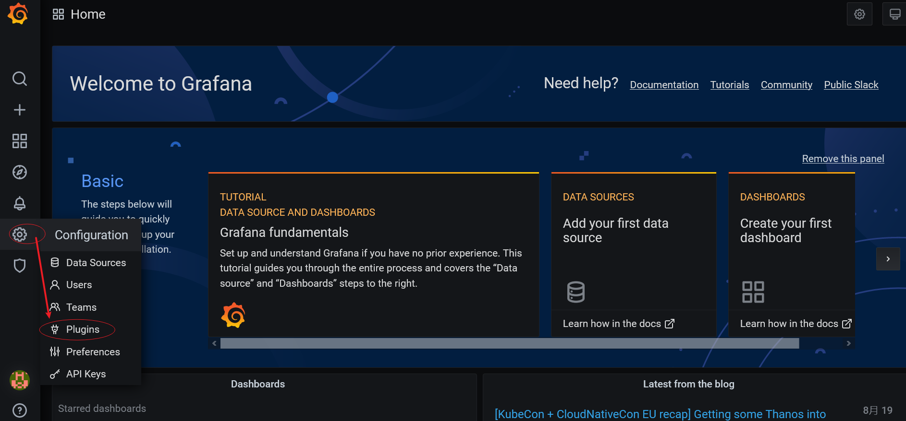

搜索 zabbix 插件

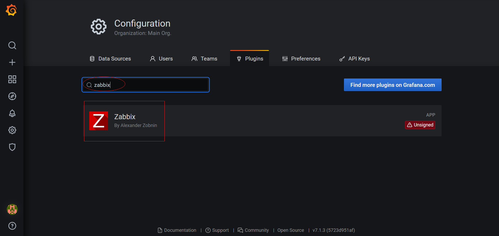

点击【Enable】按钮

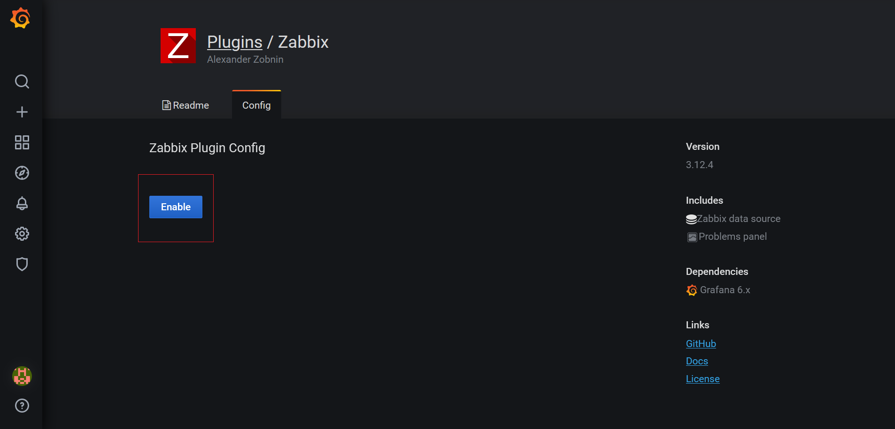

配置数据库资源 datasource

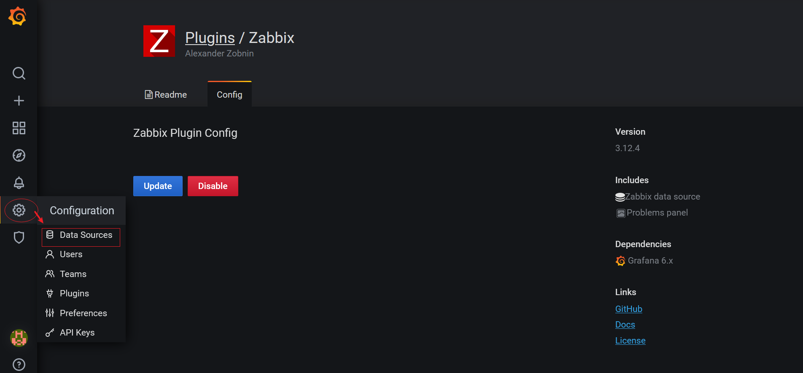

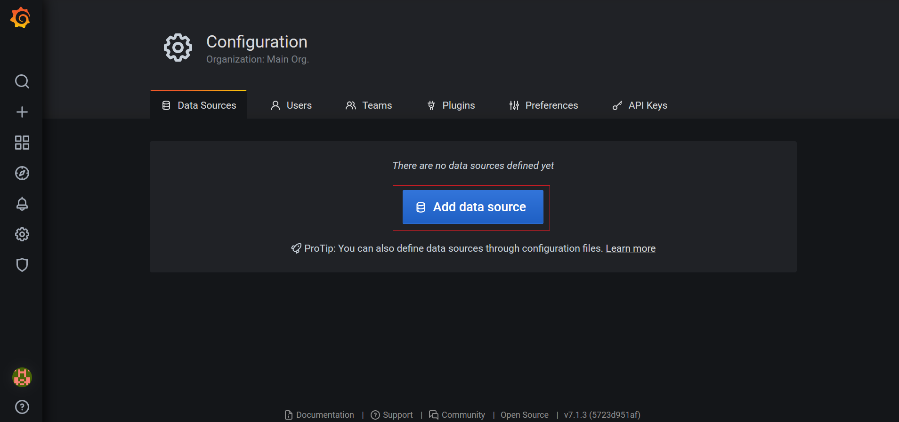

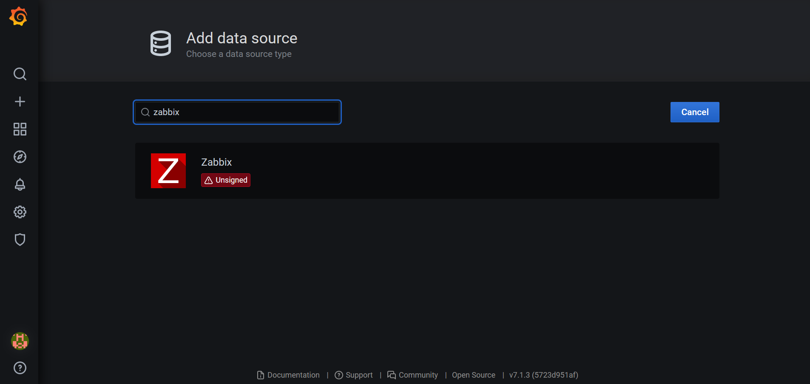

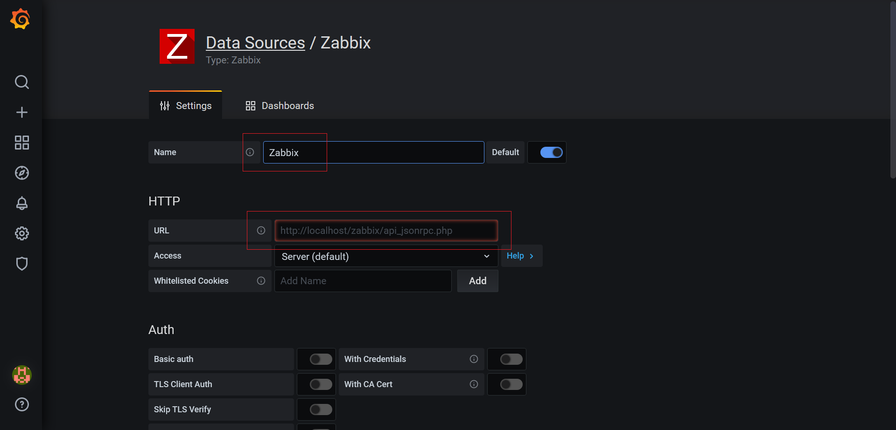

填写 name，名称可以自己定义；添加HTTP的URL地址： http://zabbix-server机器ip:端口(如果zabbix-server使用nginx，默认端口为80)/api_jsonrpc.php ; Access选择 Server(default)； 往下滚动

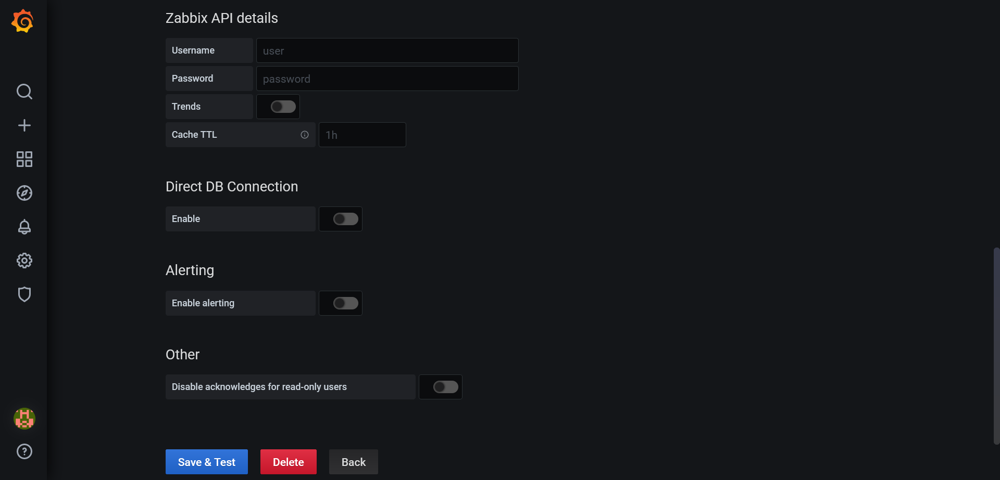

在 Zabbix API details中填写 zabbix登录用账号/密码：Admin/zabbix，点击底部【Save & Test】按钮。出现如下图，说明添加成功。


如果出现如下，请求检查http的url地址 和 zabbix的账号密码是否存在问题；若均无误，还提示如下图，可以等待一小会后再保存。


引入面板

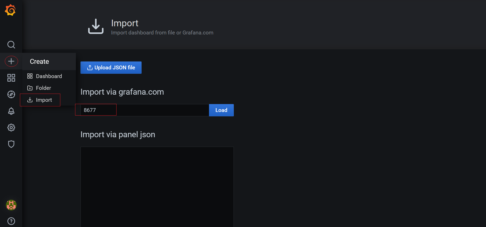

输入8677\6098，点击【load】

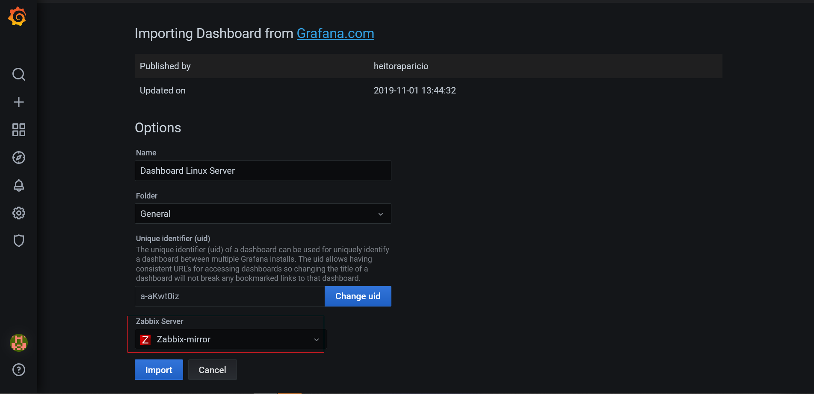

在 Zabbix Server中，选择前面添加的 data source， 点击【import】按钮

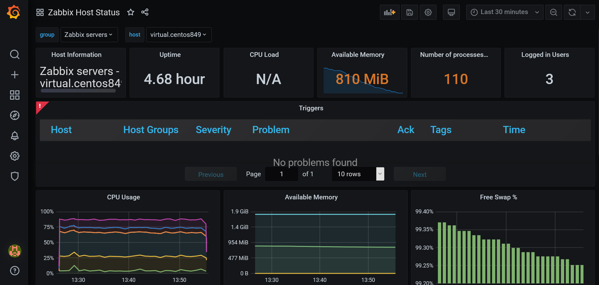

> 想要获得更多面板模板，可以从官方网站搜索。 <a href="https://grafana.com/grafana/dashboards?plcmt=footer&search=zabbix"> 更多模板 </a>

## Ⅵ、性能测试执行与监控

+ 打开jmeter，编写脚本，调用被性能测服务器的服务，实现性能测试。
+ 在grafana的面板中，查看展示的图表

> 注意：如何出现grafana中，不能正常显示被监控服务器的数据，需要检查grafana中面板左上角‘group’ 和 ‘host’ 分别是什么值；然后，再检查zabbix-server的前端中，配置hosts时，被监控的性能服务器的group是否一致，这个地方要保证一致。


好了，至此，我们一套新的性能测试监控解决方案已经完成。


