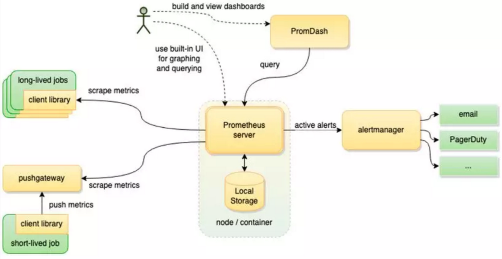

# prometheus与zabbix比较(八)

前面给大家讲了zabbix监控服务器，也给大家讲了prometheus监控服务器。两种方式都可以单独监控服务器资源使用情况，也都可以和grafana进行集成，在性能测试时，对服务器进行监控。

那，他们两个工具只有有什么差别呢？

**首先，我们从工具本身成熟度来对比下**

zabbix是在98年的时候，就出来了，开始是商业，后来才逐步开源，用的是c + php 语言实现服务，用数据库存储监控数据，典型的service+应用的模式。技术实现，非常的成熟，所以产品也是非常的成熟，用数据库存储数据，可以存储历史数据，方便后续回溯，但是，一旦数据量聚增到一定量后，本身资源消耗就比较大，数据库也相应的成了瓶颈。

prometheus是2012年的开源出来的，用go语言开发，由监控系统和时序数据库组成。由于出现的比较新，能够与现在最新的技术比较友好的结合，如支持容器技术。

**然后，我们从技术实现来对比下**

zabbix

agent收集被监控的主机数据，sever提供服务，数据库存储监控的数据，web进行数据展示。

prometheus

server周期性抓取被监控的组件的指标数据，采用拉取数据的方式，大大降低了客户端的负复杂度，另外，promQL提供了多维度数据模型和灵活的数据查询方式。

**最后，我们综合评价一下**

从使用的角度来说，在性能测试时，想要对服务器进行性能监控，同时，还想和grafana结合，两款工具都能满足要求。主要看个人习惯，以及对工具的熟悉度。相比较而言，可能prometheus学习起来，会稍稍难度大一点点。

从工具本身来说，工具本身无好坏，主要看你怎么用，用在什么地方？如果你想监控物理机、或虚拟机，传统的web-server服务，同时，还要是运维人员可以用，性能测试人员也可以用，那zabbix就完全满足要求了；如果你是想监控云服务器，而且项目服务为微服务，容器化的，prometheus相对可能更适合。

