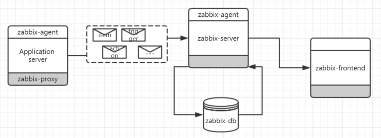
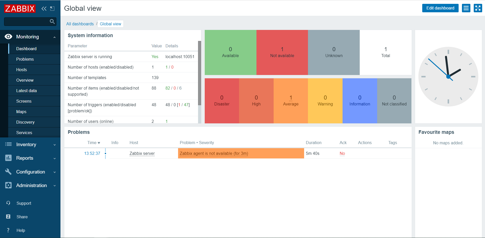

# zabbix入门介绍(一)

## zabbix介绍

zabbix是一个企业级的、高度成熟的、分布式开源监控解决方案，它能够监控众多网络参数和服务器的健康度、完整性，把数据存储在数据库中，然后再通过web页面，用不同的方式，展示各种监控数据，再通过告警机制，设置告警阈值，发送收取告警信息。

## zabbix主要特点

+ 数据采集
+ 灵活的阈值定义
+ 高度可配置的警报
+ 实时图表绘制
+ Web监控功能
+ 丰富的可视化选项
+ 历史数据存储
+ 配置简单
+ 使用模板
+ 网络发现
+ 快捷的web界面
+ zabbix api
+ 权限管理系统
+ 功能齐全，易于扩展的agent
+ 进程守护
+ 简化复杂环境

## zabbix组成部分

+ **Server**

  + zabbix的核心软件，它通过主动和被动方式，收集被监控的机器数据，并实现数据存储，将发现的系统问题，提醒管理员。

  + 它的主要组成部分为：zabbix server、web 前端、database存储。

  + 用户在web前端(或通过api接口)做一个配置修改，zabbixserver每个1分钟，进行配置轮询，然后再读到 缓存中，配置才真正生效，所以，配置变更后，会有一定的延迟。

  + zabbix server的守护进程为 zabbix-server 可以通过 `service zabbix-server stop\restart\status` 进行服务操作。

  + zabbix server的默认配置文件位置为：/etc/zabbix/zabbix_server.conf

  + 可以通过 `zabbix_server --help` 命令获得帮助信息。

  + zabbix server 可以运行在几乎所有的系统平台上，可以使用非root用户运行。

    > 注意： 系统编码要为UTF-8

+ **Agent**
  
  + agent部署在被监控的服务器上，主动收集服务器的资源和应用数据，然后把数据发送给zabbix sever。
  + zabbix agent支持主动、被动两种方法。被动模式时，响应server的询问(如cpu数据)，主动模式时，先从server上获取要监控的列表，然后再把监控的数据发给server (默认是被动的，这将影响在web上配置主机监控模板的选择)
  + zabbix agent的守护进程为 zabbix-agent 可以通过 ` service zabbix-agent stop\restart\status` 进行服务操作。
  + 可以通过 `zabbix_agent --help` 命令获得帮助信息。
+ zabbix agent 可以运行在几乎所有的系统平台上，可以使用非root用户运行。
  
+ **Agent2**
  
  + agent 2是新一代zabbix agent，将来用于替代现在的agent， 用go语言编写。
  + agent 2 不支持进程守护
  + agent2的被动模式与agent相似，主动模式，支持定时执行多并发请求
+ 需要从源码包编辑，并且制定 ` --enable-agent2` 参数
  
+ **Proxy**
  
  + Zabbix Proxy是一个可以从一个或多个受监控设备收集监控数据，并将信息发送到Zabbix sever的进程。
  + zabbix proxy是可选安装的应用，安装了，可以分摊zabbix server的压力，减少server机器的cpu、磁盘I/0的消耗。
  + zabbix proxy 需要独立数据库
  + zabbix agent的守护进程为 zabbix-agent 可以通过 ` service zabbix-proxy stop\restart\status` 进行服务操作。
  + 可以通过 `zabbix_proxy --help` 命令获得帮助信息。
+ zabbix proxy 可以可以使用非root用户运行。
  
+ **Java gateway**
  
  + zabbix java gateway 是用于监控服务器上JMX应用程序的，是用java开发的，被监控的程序，在启动时，需要启用 `-Dcom.sum.management.jmxremote` 选项
  + zabbixserver 或 zabbix proxy 只能陪着一个zabbix java gateway
+ zabbix server或zabbix proxy有个**StartJavaPollers**选项控制连接 zabbix java gateway；启动多少个线程由**START_POLLERS**选项控制(建议StartJavaPollers小于或等于START_POLLERS的值)；在zabbix server上，如果连接时长超过**Timeout**选项配置时长，就会终止连接，但zabbix java gateway可能依然在获取JMX数据，为了解决这个问题，在java gateway配置中可以通过**TIMEOUT**来设置JMX超时时长。 
  
+ **Sender**
  
  + zabbix sender是一个命令行应用，它可以将性能数据发送到Zabbix server进行处理。通常用在长时间运行的用户脚本，定期发送可用性和性能数据
  
+ **Get**
  
  + Zabbix get 是一种命令行应用，它可以用于与Zabbix agent进行通信，并从agent哪里获取所需的信息 该应用通常被用于Zabbix agent故障排除
  
+ **JS**
  
  + zabbix_js是一个命令行实用程序，可用于嵌入式脚本测试。使用字符串参数执行用户脚本并打印结果。使用嵌入式 Zabbix 脚本引擎执行脚本。

## zabbix中名词科普

+ **host**：主机，即被监控的机器

+ **item**： 监控项
+ **trigger**：触发器
+ escalation：升级
+ media：媒介
+ **application**：应用集
+ frontend：前端
+ **passive check**：被动检查模式
+ **active check**：主动检查模式

## zabbix流程图

## zabbix前端界面效果

