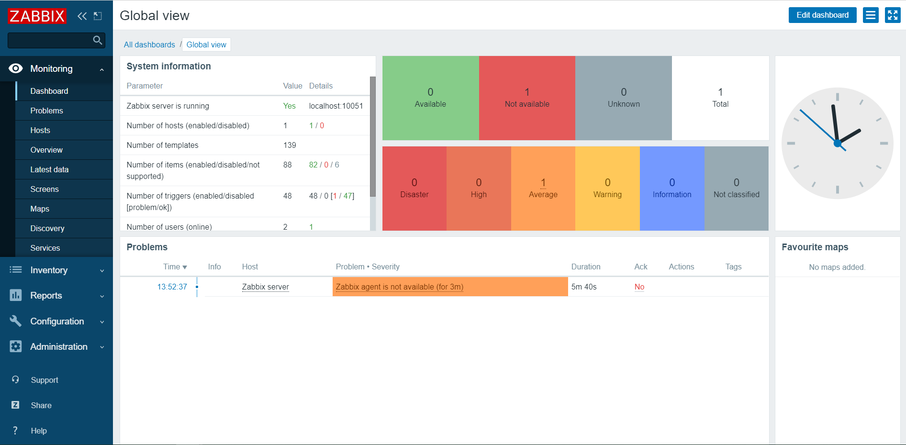

# zabbix管理界面添加监控机器(三)

## 访问zabbix 前端

在浏览器中输入： http://server_ip/zabbix  账户Admin/zabbix

登录账户： Admin，密码：zabbix

设置语言为中文

## 添加主机

进入 **Configuration > Hosts** 点击页面右上角的 **Create host** 按钮

页面中的‘Hostname’为你的被监控机器的hostname，也是你在zabbix-agent中填的，然后选择‘Groups’，填写好Agent的ip地址，确认最下面的‘Enabled’复选框勾选中，点击‘update’按钮。

再在主机列表中，找到自己添加的这个主机，进入‘templates’，选择一个‘Link new templates’，点击update，这样一个最基本的服务器资源监控就已经好了。

> 如果想要停止对某个机器的监控，可以点击Hosts列表的‘Status’状态，当为‘Disable’时，为禁用该服务主机

最后，查看新添加的服务器实时监控情况。

进入 **Monitoring > Hosts**  在列表中，即可看到新增加的监控主机，点击‘Graphs’列的链接，即可打开当前服务器资源监控情况

至此，我们的一个新服务监控已经弄好了。