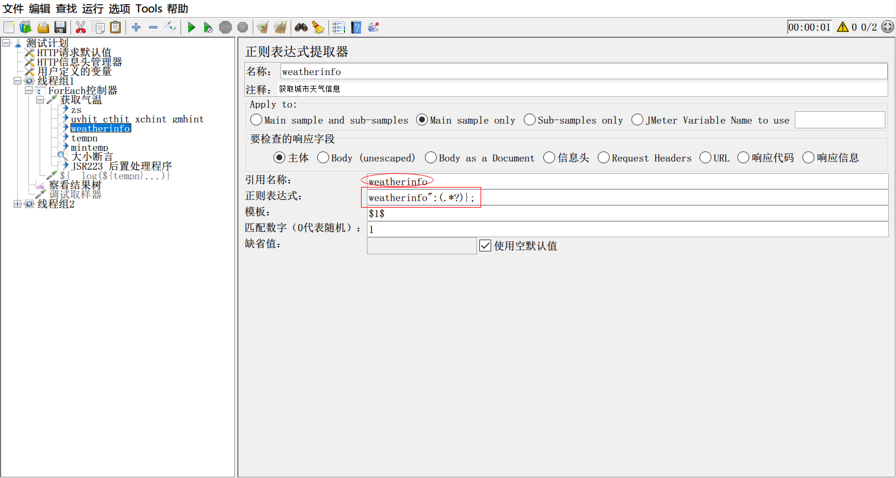

# jmeter面试题剖析实战

​	最近有个学生反馈，自己在面试的时候，遇到一个jmeter题目，要我帮忙看下，题目如下：

```
进入http://www.weather.com.cn/网站，用jmeter编写脚本实现如下操作(下列要求在同一个测试脚本) :
(1)编写获取北京天气紫外线、穿衣、洗车、感冒指数的压测脚本，要求将城市参数化10个(城市名字自定义)，将城
市的当前实时天气>10度作为断言，并将天气数字输出打印到日志，
设置200用户并发持续运行3天

(2)编写获取周边景点的脚本，并景点返回的个数作为断言，并将各景点名字输出打印到日志，
设置200用户并发持续运行10分钟

```

## 第一个题目	

​	粗看，其实没有什么难度，但是当你去访问了这个网站，然后看到网站数据结构时，才知道并不是那么简单。

​	当你去访问这个网站的时候，你会发现，这个网站并没有直接提供接口。

​	没有提供接口，哪怎么做呢？

​	抓包！是个不错的选择，所以，这个题目，首先考察的是：**你是否懂得用抓包工具住包** ？

​	通过抓包，你会看到有一个类似这样： http://d1.weather.com.cn/weather_index/101010100.html?_=1595579781357 的地址，返回了我们第一问中的北京天气信息。看到这样一个地址，你会找出哪些信息？**101010100**这个应该要想到，这个应该是城市代码，而"_="这个之后的值，应该是一个时间戳。这就在**考察：你对于数据的敏感度**；接下来，我们看下这个接口返回的消息体，数据类似“var cityDZ ={"weatherinfo":{xxxx}；xxxxxxxxx}” 咋一看，还以为是json格式，但又不像，仔细看响应头的Content-Type，你又会发现是‘text/html' 文本类型。也就是说，题目中要求获取的天气、紫外线...... 等等信息，不能简单一次提取，需要用到正则，所以这个又在**考察：你对正则提取器的使用**；题目要求获取多个信息，一直用所有的都用正则可以吗？可以，但是你如果所有的信息都通过正则提取器提取，那也从侧面反映你技术不咋滴。因为那是干劳动力的活，其实是在隐式**考察：你对正则提取器和json提取器以及多提取器一起灵活使用的能力**。把一个文本内容，通过正则提取器提取出一段json，然后再用json提取器提取正则式结果中想要数据，这才是他的真正的目的。然后题目又来一个难题，<u>实时天气大于10度作为断言</u>。是不是一下又楞了，不知道怎么搞了？提取实时天气，这个可以提取出来，难点就在“大于10度”这个要怎么做呢？这又在**考察：你对于断言中大小断言掌握情况**， 首先我们要知道应该用什么断言？响应断言，没有比较大小功能。比较断言，是两个特定的比较，也不适用。那就只有“大小断言”这一个。题目中还有，要参数化10个城市，别小看这个参数化，为什么不是八个，不是九个，却刚好十个？这其实也隐藏了一个点，这个又在**考察：你对于循环控制和foreach控制器的使用**，当然这个点，可以取巧，用用户自定义10个城市，然后再用foreach控制器能简单解决。题目中，还要求“将天气数字输出打印到日志”，因为jmeter本身没有直接写参数到日志的元件，需要用函数或java代码来实现，所以这个又在**考察：你对jmeter函数或java脚本的使用能力**；至于后面的“设置200个用户持续运行3天”这个就非常简单了，**考察：线程组进行性能场景的设置**，这个可以用普通的线程组就能实现，当然，也可以使用其他的线程组。

​	看视一个简单的jmeter题目，只要有一定的jmeter使用经验，这个题目思路不复杂，但是难点在具体脚本的写法。下面把脚本截图，仅供参考。





## 第二个题目

​	看题干，就知道比第一个要简单，第一个题目做出来了，第二个马上就能用上上面的技能。但是，却埋下了一个**难题**，哪就是获取景点个数，作为断言。为什么说还难点呢？仔细看过接口响应文本，就会发现，又不是简单的json。数据是：var data=({key1:{xxx}},{key2:{xxx}},{key3:{xxx}})。<u>**如果不懂得json的相对提取法，这个题目就变得异常复杂**。</u>

​	下面是解题截图，仅供参考：


好了，一个看似简单的jmeter面试题，却隐藏了这么多考察项，你是否都掌握了呢？

> 更多有趣又有料的软件测试相关知识，欢迎关注 **柠檬班** 微信公众号！

[参考源文件](https://github.com/wohuyuelong/articles/blob/master/jmx/weather-0724.jmx)


