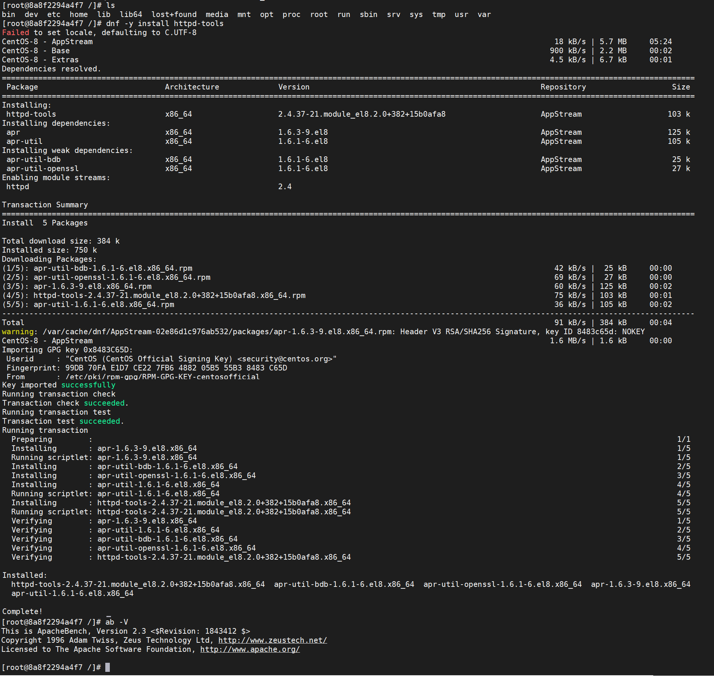
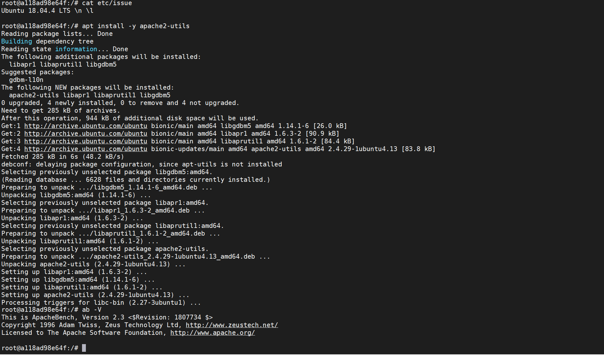
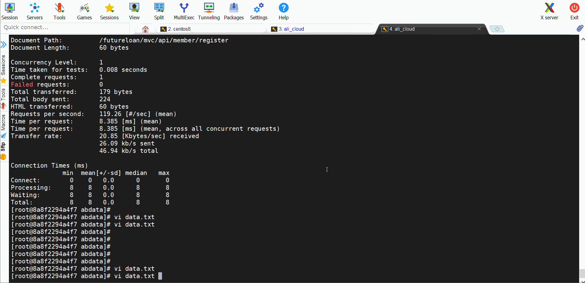
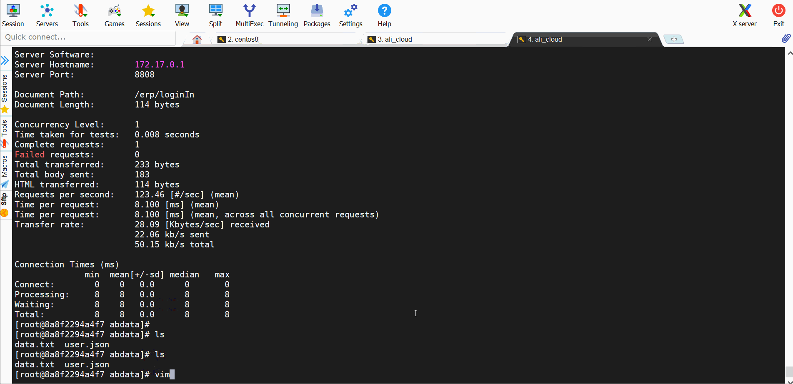

# 一文告诉你ab如何做性能测试

说到ab，可能有同学听说过，不知道的同学，也可能马上就去百度了。ab是apache服务器附带一个工具，下载了apache服务，那么在它的bin文件夹中，就有这个工具命令。

但是，

我的项目不是用apache做服务器，我想用这个工具，就一定需要下载apache服务吗？这个ab工具，可以独立安装。

## 安装ab

在你的linux服务器上，执行：

```shell
# centos系统
sudo yum -y install httpd-tools

# ubuntu系统
sudo apt-get -y install apache2-utils
```

待命令安装完成后，在系统中执行 `ab -V` 如果一切正常，就能看到ab相关信息，说明你的电脑已经安装好了ab工具包了。

**centos中安装：**



**ubuntu中安装：**



## 用法说明

在服务器上执行：

```shell
$ ab --help
ab: wrong number of arguments
Usage: ab [options] [http[s]://]hostname[:port]/path
Options are:
    -n requests     Number of requests to perform
    -c concurrency  Number of multiple requests to make at a time
    -t timelimit    Seconds to max. to spend on benchmarking
                    This implies -n 50000
    -s timeout      Seconds to max. wait for each response
                    Default is 30 seconds
    -b windowsize   Size of TCP send/receive buffer, in bytes
    -B address      Address to bind to when making outgoing connections
    -p postfile     File containing data to POST. Remember also to set -T
    -u putfile      File containing data to PUT. Remember also to set -T
    -T content-type Content-type header to use for POST/PUT data, eg.
                    'application/x-www-form-urlencoded'
                    Default is 'text/plain'
    -v verbosity    How much troubleshooting info to print
    -w              Print out results in HTML tables
    -i              Use HEAD instead of GET
    -x attributes   String to insert as table attributes
    -y attributes   String to insert as tr attributes
    -z attributes   String to insert as td or th attributes
    -C attribute    Add cookie, eg. 'Apache=1234'. (repeatable)
    -H attribute    Add Arbitrary header line, eg. 'Accept-Encoding: gzip'
                    Inserted after all normal header lines. (repeatable)
    -A attribute    Add Basic WWW Authentication, the attributes
                    are a colon separated username and password.
    -P attribute    Add Basic Proxy Authentication, the attributes
                    are a colon separated username and password.
    -X proxy:port   Proxyserver and port number to use
    -V              Print version number and exit
    -k              Use HTTP KeepAlive feature
    -d              Do not show percentiles served table.
    -S              Do not show confidence estimators and warnings.
    -q              Do not show progress when doing more than 150 requests
    -l              Accept variable document length (use this for dynamic pages)
    -g filename     Output collected data to gnuplot format file.
    -e filename     Output CSV file with percentages served
    -r              Don''t exit on socket receive errors.
    -m method       Method name
    -h              Display usage information (this message)
    -I              Disable TLS Server Name Indication (SNI) extension
    -Z ciphersuite  Specify SSL/TLS cipher suite (See openssl ciphers)
    -f protocol     Specify SSL/TLS protocol
                    (SSL2, TLS1, TLS1.1, TLS1.2 or ALL)
    -E certfile     Specify optional client certificate chain and private key

```

**Usage:**  用法  `ab 参数 被测地址`

+ **参数：**
  + -c concurrency:  一次产生的请求数，可以理解为并发数
  + -n  requests：执行的总请求数，默认1次
  + -t timelimit：测试进行的最长时长，可以理解为持续施压时长
  + -s timeout： 最大超时等待时长
  + -p postfile:   POST 请求文件，但是记得 配置 -T  参数
  + -u putfile:   PUT请求， 但是记得配置 -T 参数
  + -i:   HEAD请求
  + -m method： 方法名称
  + -T content-type： 指定POST\PUT请求的头部信息Content-Type,默认为'text/plain'，可以根据自己需要更改为如：application/x-www-form-urlencoded、application/json、multipart/form-data
  + -C attribute： 对请求附加一个Cookie:行。其典型形式是name=value的一个参数对，此参数可以重复
  + -H attribute:  对请求附加额外的头信息。此参数的典型形式是一个有效的头信息行，其中包含了以冒号分隔的字段和值的对(如,"Accept-Encoding:zip/zop;8bit")
  + -A attribute： 对服务器提供BASIC认证信任。用户名和密码由一个:隔开，并以base64编码形式发送。无论服务器是否需要(即,是否发送了401认证需求代码)，此字符串都会被发送
  + -g filename： 把所有测试结果写入一个'gnuplot'或者TSV(以Tab分隔的)文件。此文件可以方便地导入到Gnuplot,IDL,Mathematica,Igor甚至Excel中。其中的第一行为标题
  + -e filename： 将执行的结果写到csv文件，并提供百分比
  + -r : 出现错误时，不退出

## 案例操作

**案例：**   并发请求，指定时长

```shell
ab -c 100 -t 120 https://www.baidu.com/
```

​	用100个并发用户，向 http://www.baidu.com/ 这个网址，持续请求120秒

**案例：**	 指定请求次数

```sh
ab -c 100 -n 1000 https://www.baidu.com/
```

​	用100个用户并发，总共请求1000次

**案例： **  GET请求带参数，用户登录

```shell
ab -c 100 -t 10 -p pdata.txt -T "application/x-www-form-urlencoded" http://172.17.0.1:8380/futureloan/mvc/api/member/register

# data.txt文件内容为
mobilephone=13500090018&pwd=123456780
```



**案例：**  POST请求，带参数，参数类型为json，用户登录

```shell
ab -c 1 -n 1 -p user.json -T "application/json" -v 4  http://172.17.0.1:8808/erp/loginIn

# user.json是请求的参数文件
{"name":"029ip","pwd":"1234567890"}

```



## 结果参数说明

```shell
# ab -c 15 -t 10 -p data.txt -T "application/x-www-form-urlencoded"  http://172.17.0.1:8380/futureloan/mvc/api/member/register
This is ApacheBench, Version 2.3 <$Revision: 1843412 $>
Copyright 1996 Adam Twiss, Zeus Technology Ltd, http://www.zeustech.net/
Licensed to The Apache Software Foundation, http://www.apache.org/

Benchmarking 172.17.0.1 (be patient)
Finished 1220 requests	# 总共请求数量

# 服务器信息
Server Software:
Server Hostname:        172.17.0.1	#服务器主机名
Server Port:            8380	#服务器端口

Document Path:          /futureloan/mvc/api/member/register	 #请求的URL中的根绝对路径
Document Length:        60 bytes	#HTTP响应的正文长度

Concurrency Level:      15	#并发数
Time taken for tests:   10.009 seconds	 #整个测试耗时
Complete requests:      1220	# 总共完成的请求数量
Failed requests:        1219	# 失败数
   (Connect: 0, Receive: 0, Length: 1219, Exceptions: 0)
Total transferred:      233008 bytes	#测试过程中产生的网络传输总量
Total body sent:        277425
HTML transferred:       87828 bytes	 #测试过程中产生的HTML传输量
Requests per second:    121.89 [#/sec] (mean)	# 平均每秒请求数
Time per request:       123.065 [ms] (mean)	# 每个请求平均时间，所有并发用户一起
Time per request:       8.204 [ms] (mean, across all concurrent requests) #单个用户请求时间
Transfer rate:          22.73 [Kbytes/sec] received	#吞吐率 每秒接收多少kb
                        27.07 kb/s sent	# 吞吐率， 每秒发送多少kb
                        49.80 kb/s total	#吞吐率 每秒多少kb

Connection Times (ms)
              min  mean[+/-sd] median   max	 #(最小值、平均值、方差、中位数、最大值)
Connect:        0    0   0.2      0       4	 #socket链路建立消耗，代表网络状况好
Processing:     1  121 229.3     12    3282	 #写入缓冲区消耗+链路消耗+服务器消耗
Waiting:        1  121 229.2     12    3282	 #写入缓冲区消耗+链路消耗+服务器消耗+读取数据消耗
Total:          1  121 229.3     12    3282	 #单个事务总时间

#网络上消耗的时间的分解，表示这些请求在单位时间内从服务器获取的数据长度
Percentage of the requests served within a certain time (ms)
  50%     12
  66%     26
  75%    215
  80%    221
  90%    293
  95%    503
  98%    879
  99%   1131
 100%   3282 (longest request)

```

## 注意事项

+ -c 设置最大并发数，一般不超过1024，因为系统默认设置最大打开文件数为1024，linux中，可以通过 ulimit -a查看
+ -n 指定最大请求数，但是不能操作 50000


## 总结

​	总体来说，ab工具小巧灵活，学习上手快，可以提供基本的性能测试指标。但是，不能做复杂的脚本开发，没有图形化结果，不能监控。所以，ab工具做个临时的紧急的简单测试是可以的。

---

> 想了解更多有趣，有料的测试相关技能技巧，欢迎关注**柠檬班**微信公众号，或在腾讯课堂中搜索柠檬班机构，观看测试相关视频。
