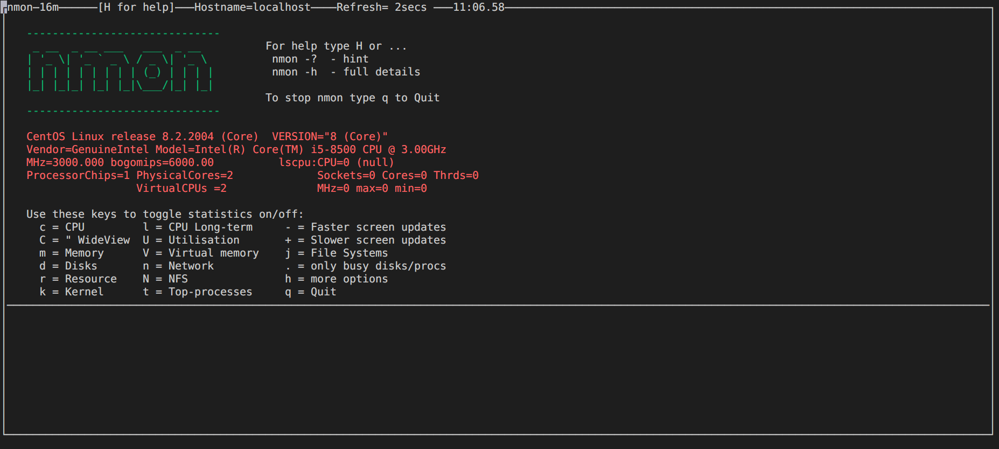
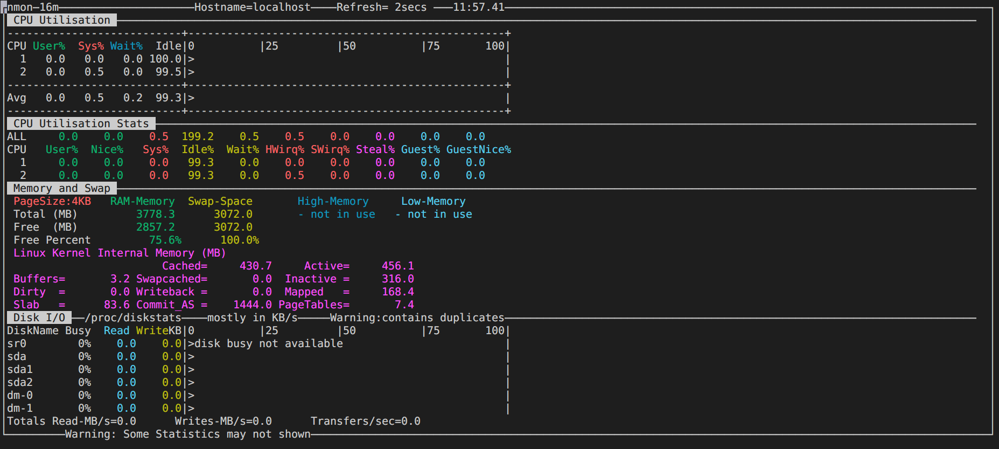
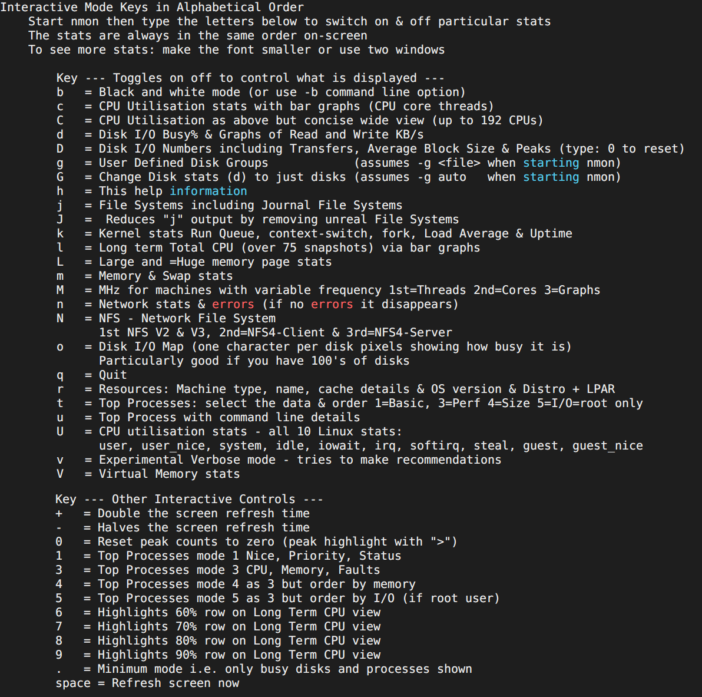
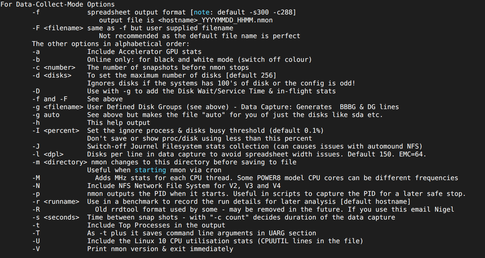
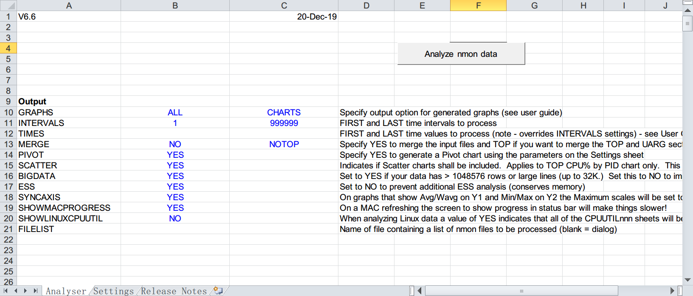
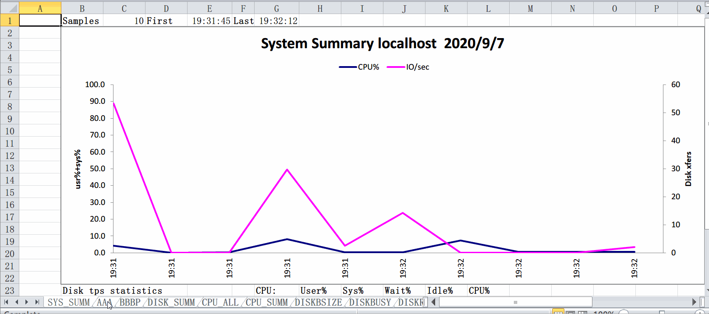
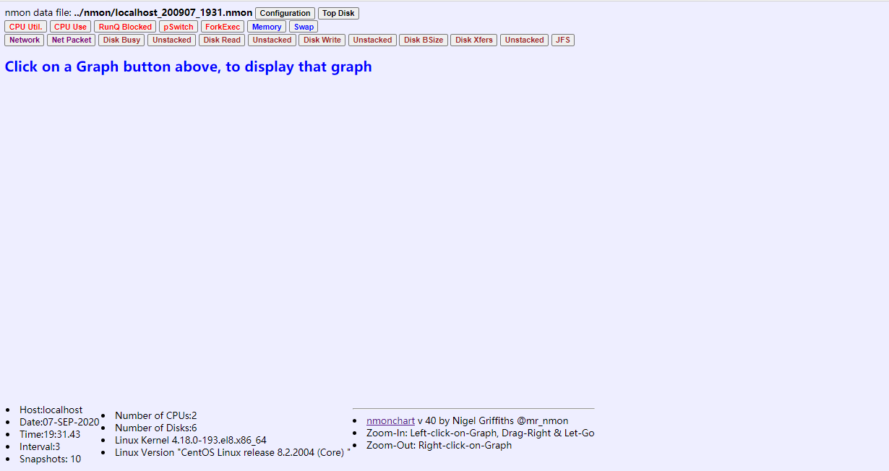
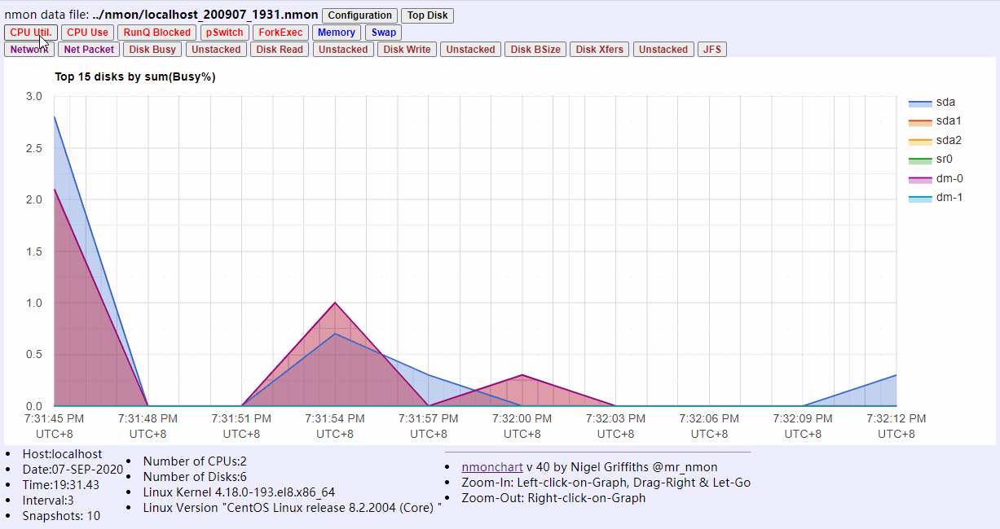

# 一文让你学到nmon最详尽的用法

说到服务器资源监控，你的第一反应，是不是nmon这个工具？

如果你不是，或者你不会nmon进行服务器资源监控，请认真看下这篇文章，因为，这可能是国内用一篇文章，对nmon进行最详尽讲解的。

## 简介

nmon是 **N**igel's performance **M**onitor for **L**inux(nigel的linux性能监控器)的英文缩写；它有**三种**运行模式，分别是：**实时屏幕模式、数据收集模式、定时计划执行模式**；这款工具运行时，本身资源消耗很小，而且监控的资源种类比较多，使用非常简单，所以，在没有搭建专业的监控平台时，很多人都会想到用它来监控服务器。


## 安装与使用

+ 下载安装

  + 首先要知道自己监控的linux服务器的发行版本，怎么看呢？

  ```sh
  # 查看centos的发行版本
  cat /ect/redhat-release
  
  # 查看Ubuntu的发行版本
  lsb_release -a
  ```

  

  + 根据看到的系统版本，在nmon的<a href='http://nmon.sourceforge.net/pmwiki.php?n=Site.Download'> 下载页面 </a>中，查找支持对应版本的最新nmon版本，下载完成之后，在linux中，解压下载包

  ```shell
  # 本地下载，然后通过sftp方式上传到linux服务器任意文件路径
  # 或
  # 在linux中用wget 下载地址 直接下载到机器的任意文件路径
  
  # 解压
  tar -xzvf nmon****.tar.gz
  
  ```

  

+ 第一种模式：**实时屏幕模式**

  + 直接执行对应系统的nmon文件，如linux系统发行版本的centos8，则执行 `./nmon_x86_64_centos8 ` ,将开启nmon的实时屏幕展示模式

  

  + 看到这样一个黑色窗口，是不是就楞了，不知道怎么做了？看到这样一个自己陌生的东西，千万不要去害怕，你要知道，他们其实都是纸老虎。从顶部第一行，我们可以看到，当前机器的名称叫 localhost，页面数据刷新的时间是2秒，当前时间，再往下看，告诉我们输入'h'，就能获得更多帮助，接下来，就是操作系统相关信息；再接下来告诉我们，可以使用下面这些键，获得对应功能数据展示。

  | 参数 | 用法                                                         |
  | ---- | ------------------------------------------------------------ |
  | c    | 带条形图的**CPU**利用率统计信息（CPU核心线程）               |
  | m    | **内存**和交换统计                                           |
  | d    | **磁盘** I/O 繁忙百分比 & 每秒读\写数据量KB/s图              |
  | r    | **资源**：机器类型，名称，缓存详细信息和操作系统版本以及Distro + LPAR |
  | t    | top进程，1基础、3性能、4大小、5 I/O 仅root用户可用           |
  | n    | **网络统计信息**和错误（如果没有错误，则消失）               |
  | j    | 文件系统，包括日记文件系统                                   |
  | k    | 内核统计信息运行队列，上下文切换，派生，平均负载和正常运行时间 |
  | U    | **CPU使用率统计信息** user, user_nice, system, idle, iowait, irq, softirq, steal, guest, guest_nice |
  | u    | 进程详细信息                                                 |

  输入：cmdU

  

  

  + 这样，我们就能从屏幕上，实时看到当前服务器资源使用情况，按 q，退出查看

    更多参数说明：

  

  

+ 第二种模式：**数据收集模式**

  + 如果你的linux系统发行版本是centos8，则执行 `./nmon_x86_64_centos8 -f ` ,将开启nmon的数据收集模式，该命令后面不在跟参数，则默认为： `-s300 -c288`
    + **注意**： 直接执行这个命令，后面不带参数，该命令将在**后台持续运行24小时**，收集24小时资源使用情况
  + 使用 `-f` 开启数据收集模式，还可以跟上其他参数

  | 参数           | 用法                                                         |
  | -------------- | ------------------------------------------------------------ |
  | -f             | **标准输出到表格文件，默认 -s300 -c288 ,为24小时，输出文件格式为：hostname_YMD_HHMM.nmon** |
  | -F <filename>  | 类似-f，但是支持指定输出文件的名称                           |
  | -a             | GPU加速，统计信息                                            |
  | -b             | 切换黑白 和彩色模式                                          |
  | -c <number>    | **总统计次数**                                               |
  | -s <seconds>   | **数据统计间隔时间， 单位为：秒**                            |
  | -d <disks>     | 最大的磁盘数，默认256                                        |
  | -D             | 与-g一起使用以添加磁盘等待/服务时间和运行中状态              |
  | -g <filename>  | 用户定义的磁盘组获取数据：生成BBBG和DG行                     |
  | -I <percent>   | 设置忽略进程和磁盘繁忙阈值（默认为0.1％），不要使用小于此百分比的百分比保存或显示proc /磁盘 |
  | -J             | 关闭日志文件系统统计信息收集（可能导致自动挂载NFS出现问题）  |
  | -l <dpl>       | 数据捕获中的每行磁盘数可避免电子表格宽度问题。 默认值为150。EMC= 64。 |
  | -m <directory> | **把输出文件保存到指定文件夹**。通过cron启动nmon时有用       |
  | -M             | 为每个CPU线程添加MHz统计信息。 某些POWER8型号CPU内核的频率可能不同 |
  | -N             | 包括适用于V2，V3和V4的NFS网络文件系统                        |
  | -p             | nmon启动时将**输出PID**。 在脚本中很有用，可捕获PID以便以后安全停止。 |
  | -r <runname>   | 在基准测试中用于记录运行详细信息，以供以后分析[默认主机名]   |
  | -t             | 在输出中包括top流程                                          |
  | -T             | -t 增强，它将命令行参数保存在UARG部分中                      |
  | -U             | 包括Linux 10 CPU使用率统计信息（文件中的CPUUTIL行）          |

  

  + 这么多参数，并不需要所有都记住，只需要重点记住几个即可： `-f` `-s`  `-c`  `-m    `   `-p`
  + 常用**案例**：

  ```sh
  ./nmon_x86_64_centos8 -f	# 监控服务器，将结果标准输出，命令将后台持续运行 24 小时
  
  ./nmon_x86_64_centos8 -f -s3 -c10  # 每隔3秒收集一次，收集10次,将结果标准输出
  
  ./nmon_x86_64_centos8 -f -s3 -c10 -m /tmp/nmon  # 每隔3秒收集一次，收集10次,将结果标准输出到指定路径，注意：文件夹要存在
  
  ```

  更多参数说明

  


+ 第三种模式：**定时计划执行模式**
  + 如果你的linux系统发行版本是centos8，则执行 `./nmon_x86_64_centos8 -x ` , 将开启nmon的定时计划执行模式，如果后面不再添加任何参数，默认为 `-s900 -c96` 即：每隔900秒获取一次数据，总共执行96，也就是24小时，收集的数据结果采用标准输出
    + **注意**：该命令后面，不再加参数，默认执行24小时
  + 另外，还可以使用`-X`参数，这个参数默认为 `-s30 -c120`  即：每隔30秒获取一次数据，总共执行120次，也就是1个小时，收集的数据结果采用标准输出
  + `-z` 用root账户运行，收集1天数据，输出到/var/perf/tmp文件夹

  

## 结果查看

+ 标准输出**结果查看**

  + nmon的标准输出结果文件为：  **主机名\_年月日\_时分.nmon** 是一种文本数据文件，可以用文本编辑器打开，但是不便于阅读，可以使用nmon的analysis工具打开
    + 在本地电脑上下载<a href='http://nmon.sourceforge.net/pmwiki.php?n=Site.Nmon-Analyser'> nmon_analysis </a>
      + http://nmon.sourceforge.net/pmwiki.php?n=Site.Nmon-Analyser
    + 解压tar包
    + 从linux服务器上，下载nmon的标准输出文件到本地电脑
  + 用**Microsoft Excel 打开**解压的"nmon analyser v*.xlsm" 文件，然后 **启用宏**
  
  
  
  + 点击 【Analyze nmon data】按钮，选择从服务器上下载的nmon文件，将会自动分析，生成一个xlsx的文件，保存，自动会用excel打开，打开我们就能看到多个图表
  
  


## 技能提升

对于大多少数学习或使用过nmon的同学，可能都只是掌握了上面这些，国内的绝大多数的文章也就介绍上面这些技能，但是，<u>Microsoft Excel却有一个致命缺陷，严重制约了这个工具的使用</u>。

什么问题呢？

如果你使用nmon监控的时间比较长，生成的nmon文件比较大，大几兆，十几兆，或几十兆，你打开看看，肯定无响应，或者奔溃，有木有！

么有！

那你肯定没有真正用过。

其实，nmon的结果查看还有其他工具，可以去下载<a href='http://nmon.sourceforge.net/pmwiki.php?n=Site.Nmonchart'> nmonchar.tar </a> 文件，下载文件到linux服务器上

```sh
# 下载
wget http://sourceforge.net/projects/nmon/files/nmonchart40.tar

# 解压
tar -xvf nmonchart40.tar

# 进入解压后的文件夹
cd nmonchart40
```

使用nmonchar，分析监控生成的nmon文件

```sh
./nmonchart 被分析的nmon文件.nmon 生成结果文件.html

# 注意：
# 这个命令要能执行，需要有ksh，centos可以使用 yum install ksh 命令安装

```

下载生成的html文件到本地

是不是，就急着去用浏览器打开，打开看到了什么



很尴尬是不是，什么都没有，点击上面的按钮，也，然并卯

为什么呢？因为这个文件渲染用到js，跑到**外星**去啦，相信你明白的，如果你能去外星走一遭，你就会看到



这个是不是比Excel的要好看些，重要的是不用再害怕文件太大，无法打开了。


好了，这种不对外讲的技术都给大家讲了，你学会了吗？

> 想要获得更多有趣油料的测试相关知识，可以持续关注 柠檬班 微信公众号，我们将不定期发布最新原创文章。

