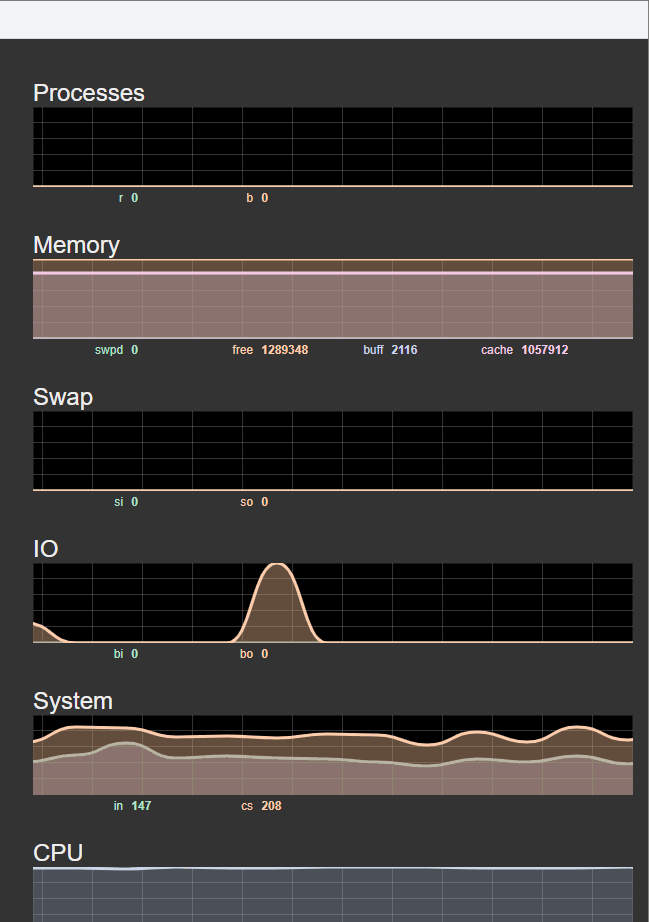

# 史上最容易的linux服务器资源监控平台搭建

在部署这个容易linux服务器资源监控平台之前，先让我们看下效果

这个监控平台搭建非常非常简单，

1、下载websocketd：https://github.com/joewalnes/websocketd/releases   在这个页面中，找到你系统对应的包，下载后安装，并配置好环境变量。

2、下载源代码：git clone https://github.com/joewalnes/web-vmstats.git， 进入到下载文件夹中，运行 `./run` ，如果正常，则可以用浏览器访问 http://ip:9231/ 就可以看到如上图的服务器实时监控效果。 **如果第1步websocketd已经添加环境变量，执行run文件时，可能会报错，修改run文件，去掉websocketd命令前的./即可**。

这么简单就搭建好了，那他是怎么实现的呢？

因为websocketd，是一个使用websocket协议的服务器，安装了这个服务器就可以部署websocket服务。web-vmstats的服务就是使用的websocket协议通信。

---

> 想了解更多有趣，有料的测试相关技能技巧，欢迎关注**柠檬班**微信公众号，或在腾讯课堂中搜索柠檬班机构，观看测试相关视频。