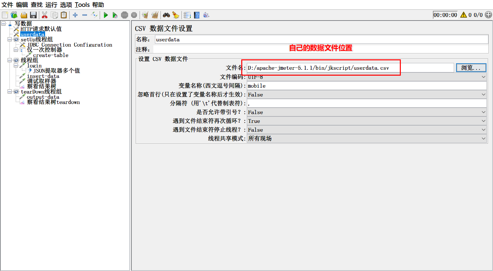

# 不写java代码把jmeter结果写入excel表格

## 背景	

​	大家在使用jmeter的工作中，可能经常会遇到想把一些结果写到execl表格中。因为，很多人都习惯用execl表格写测试用例，就想着读取表格中的数据，然后再把运行的结果写到表格中。诉求很简单，但是，使用jmeter的人都会告诉你，要实现这样的诉求，去写java代码。但是，**<u>对于java小白，不懂java代码的人来说，这就是自己的拦路虎，一时半会搞不定。</u>** 那么还有没有其他办法呢？

​	今天，我就教大家一个，**不写代码，把jmeter运行过程中，想要的信息写入到execl表格中的办法**。<u>小白，只要仔细看了，跟着操作，也是可以做到的噢。</u>

## 思路

​	我们都知道，数据库，是我们用来存储数据的软件服务。而且大多时候，大家用的都是关系型数据库，就是那种看起来就像execl表格的数据库。我们把jmeter运行过程中，我们需要的各种数据，用参数接收，然后再把这些数据写到数据库中，然后再从数据库中把这些数据导出到execl表格中，是不是就可以了呢？

​	你是不是，看了这个思路，立马就明白了。就想着赶紧动手，干起来呢？

## 行动

​	好了，思路有了，我们先来撸一撸，看下怎么动手。

​	**首先**，我们想要用数据库来写数据，是不是我们应该先在jmeter中配置好jdbc相关配置请求。哪包括哪些呢？JDBC Connection Configuration 肯定是不能少的对吧，然后是用一个JDBC Request 来创建存储的表对吧，再用一个JDBC Request 写入我们要存储的数据对吧，最后，再用一个JDBC Request来导出我们的数据到execl表格对吧。有的同学，可能会说，数据库有数据了，我直接用数据库客户端导出。也行！所以，前面三个，是必不可少的。

​	**接下来**，我们应该要准备测试数据，这个测试数据准备，是不是很简单，我们就用‘csv 数据文件设置’ 是不是，就可以搞定。

​	**然后**，我们就是各种接口请求，在接口请求之后，再加上提取器，把我们想要的数据用变量接收。对吧！

​	看，这些步骤中，我们有说到要写java代码吗？没有！那，对你来说，有难度吗？

​	不过，我还是建议大家，继续往下看，因为往下看，你还会有意向不到的收获哦！

​	先看下，我写好的代码结构：


​	首先，我们要配置数据库的连接信息，我们可以添加setup线程组，里面放上 JDBC Connection Configuration在这个里面，我们配置上我们用的数据库信息 


​	然后，我们再在setup线程组中，添加一个JDBC Request，用于创建表。因为，我们创建表只需要执行一次，并不需要执行多次，所有也可以放在setup线程组中。当然，此时的‘仅一次控制器’，你可加可不加。


```mysql
CREATE TABLE IF NOT EXISTS  runresult(
	user	varchar(16),
	pwd	varchar(12),
	code	varchar(10),
	msg	varchar(32),
	data	varchar(128)
)ENGINE=InnoDB DEFAULT CHARSET=utf8;
```

​	接下来我们就要去掉接口了，添加一个线程组，线程组下，挂你需要的接口，如图，模拟你的真实接口请求：


这个接口，我们使用一个参数，这些参数来源与我们的测试用例，或者其他的数据文档，所以，我们可以在前面再加一个 ‘csv 数据文件设置’



发起了一个接口请求，我们跟期望的是接口请求的响应信息中我们需要的部分信息能被截取保存，对吧，所以，我们再接口请求下面增加一个后置处理器，我这个接口返回的是json格式，所以我用json提取器即可，如果你返回的不是json格式，可以选择自己熟悉的，或者正则提取器这个万能的，也行。


​	**注意**：<u>json提取器，一次提取多个，中间用分号，同时matchNo和DefaultValue值； 还有，一次提取整个Response的json全部信息，单独用个$即可。</u>

​	那么，接下来，就是把我们响应的信息，写到数据库中了。


```mysql
insert into runresult values('${mobile}','${passwd}','${code}','${msg}','${response}');
```

**注意**： <u>sql语句，不建议大家用占位符的写法，因为json串的 { 在脚本种，会导致异常，需要特殊处理</u>。因脚本中没有写表字段，所以要与创建表时，位置对应，否则，数据就会插错字段。

好了，到这里，很多人就认为已经完成了，数据的导出，变成人工从数据库客户端中导出，这也是可以的。我们为了让大家一次成行，再添加一个导出功能，省去人工的导出。

我们再添加一个JDBC Request请求，做导出数据。因为，这个我们也只需要执行一次，不需要方法执行，所以，我们可以添加一个teardown线程组


```mysql
select * from runresult into outfile "/var/lib/mysql-files/resul.xlsx" FIELDS TERMINATED BY "\t" ENCLOSED BY '"';
```

支持，我们的整个脚本全部写完了。我们run一下，看下


你这样操作后，都成功了吗？

我知道，很多同学，前面都会成功，就是最后一步，导出可能会失败。这个嘛，与你的数据库有关。

> 首先，数据库必须是mysql数据库，如果不是，最后一步导出，做不了。
>
> 然后，mysql数据库账户要有创建表的权限，没有创建表的权限，第一步创建表就会失败
>
> 然后，就是在数据库中执行 `show global variables like '%secure%';` 这一句，返回的secure_file_priv 要为空，不是空，你最后一步也会报错。

如果最后一步，失败，你也不想去纠结，哪就把最后的导出，变成手工去客户端上导出吧。

## 总结

这种方法，思路很简单，只需要知道jmeter如何调用jdbc接口，就能懂，完全不用写java代码。对于小白来说，还是很有吸引力的，对吧。

好了，通过这篇文章的学习，你get到其中的思路了吗？


> 更多有趣有料的测试相关知识，欢迎微信关注 **柠檬班** 微信公众号