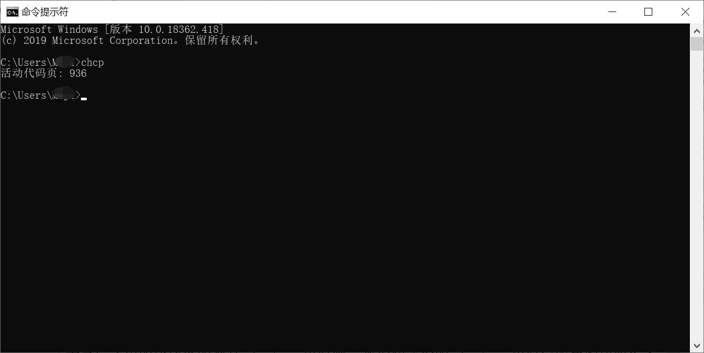

# 不写代码搞定jmeter录制和响应结果中文乱码牛皮癣

如果你已经开始使用jmeter工具，进行接口测试了，也许你曾经或者正在被一个问题困扰，哪就是你录制脚本或接口请求返回中包含中文时，一不小心就中文乱码了。

中文乱码，不是我们想要的，但是却经常性的困扰着大家。那么如何解决这个牛皮癣呢？

也许，在你没有看到这篇文章之前，你已经百度了很多，尝试了很多很多方法，但是，你可能都已经沮丧了，因为你百度的结果都是告诉你如何设置‘UTF-8’，你按照他们说的做了，甚至还写了一大堆你不知所云的代码，但是很可惜，可能你的付出与你的回报不一致，问题依旧，是不是？

那我今天，我就给大家讲一个万能的方法，不用写代码，而且非常非常简单，是不是很想马上尝试一下呢？

> 想了解更多的jmeter使用技巧，想获得一些百度很多次，却依然无法解决你问题的办法，欢迎关注**柠檬班**微信公众号，里面有非常多最新最全的测试技巧哦

**注意**：我讲的windows系统，linux、mac请同理设置，但不能照搬

哈哈，来吧，开干......
大家应该用的比较多的都是windows电脑吧，那你知道你的windows电脑字符集编码吗？不知道，那就快来看看吧

打开dos窗口，输入 chcp 回车

此时，你看到了什么？

是不是，看到的都是类似这样的。‘代码页’是什么鬼？‘936’又是什么鬼？代码页是字符集编码的别名，那字符集编辑又是什么呢？它的概念很生涩，举个例吧，我们都知道不同国家或多或少都有自己的文字，这些文字，要在计算机中存在，是不是就要转成计算机码？计算机里就把每种语言的所有文字放在一个连续的计算机码片段中，而这个连续的片段就取一个名称叫字符集，用一个编号代替这一整个字符片段，理解了吧。‘936’就是这个片段的编号，它代表的就是‘简体中文(GB2312)’GB2312:国标编号2312

好，现在我们知道了我们电脑的中文编码格式，那jmeter的编码格式是什么呢？是不是，就是因为编码格式不一致，导致的中文乱码呢？binggo，孺子可教也！恭喜你，答对了。

我们打开jmeter的配置文件 jmeter.properties,我们搜索'encod'(本来应该是encode，但是我不知道文章里面会用encode，还是encoding，所以我用encod肯定是都能搜素出来，对吧)，一搜索，你可能会在大概‘1087’行，你会看到这样一句**The encoding to be used if none is provided (default ISO-8859-1)**

默认情况下，我们jmeter采用的是ISO-8859-1编码，与我们系统的GB2312不一致。好，现在我们已经找到原因了，哪如何修改呢？是不是直接写上一句“sampleresult.default.encoding=GB2312”（ **注意**：写这句的时候，前面没有‘ # ’号注释）就可了？不知道可不可以先开干，试一下不就知道了，重启jmeter，跑个脚本试一试。

噢啦！你会发现，没有乱码！没有乱码！是不是这样就ok了？是的，就这样ok了，但是，这还不是完美的。为了追求完美，我们很多时候会把GB2312，改成GBK，再在请求的时候Content encoding，输入utf-8。这又是为什么呢？

因为GBK的字符集范围更多，他包含了GB2312兼容所有中文。而请求时
的内容编码为utf-8是为了防止向服务器发起请求时中文乱码。

> 想了解更多有趣，有料的测试相关技能技巧，欢迎关注**柠檬班**微信公众号，或在腾讯课堂中搜索柠檬班机构，观看测试相关视频。