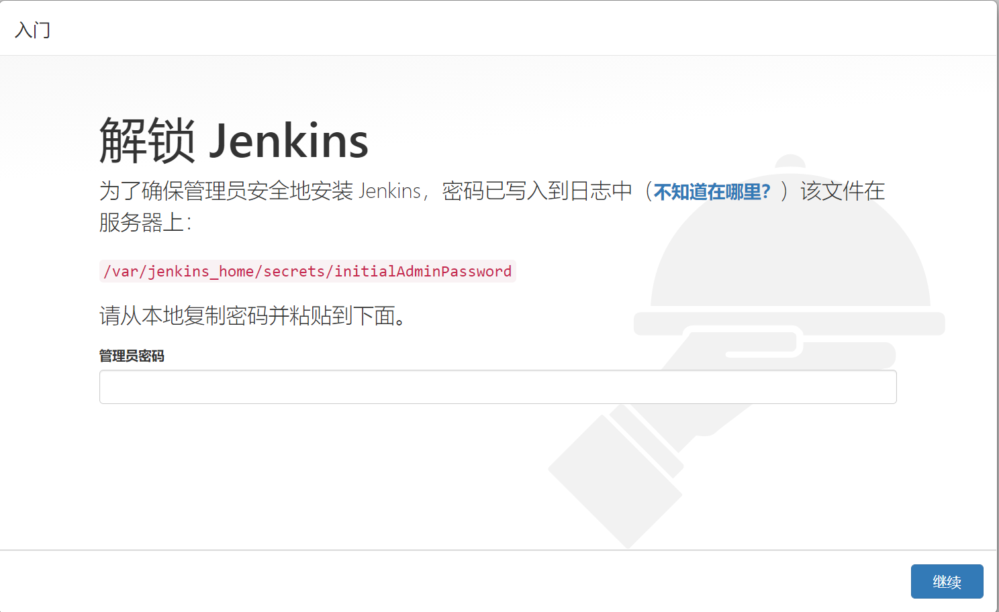
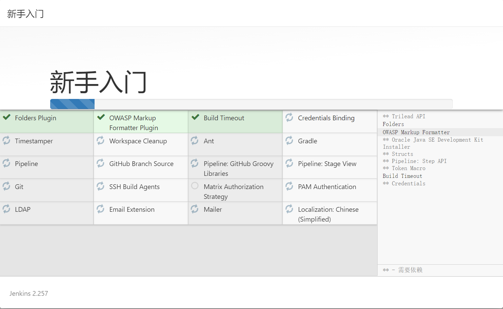
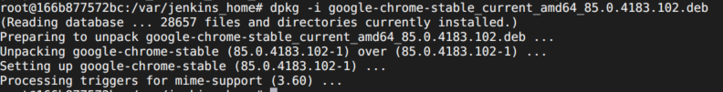
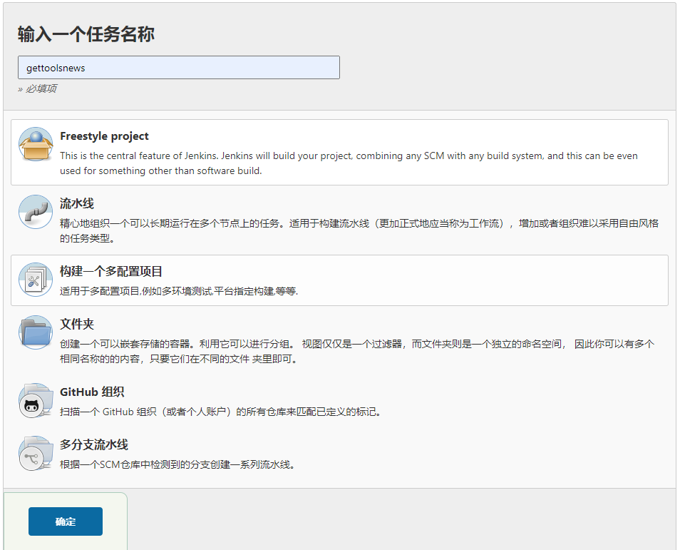
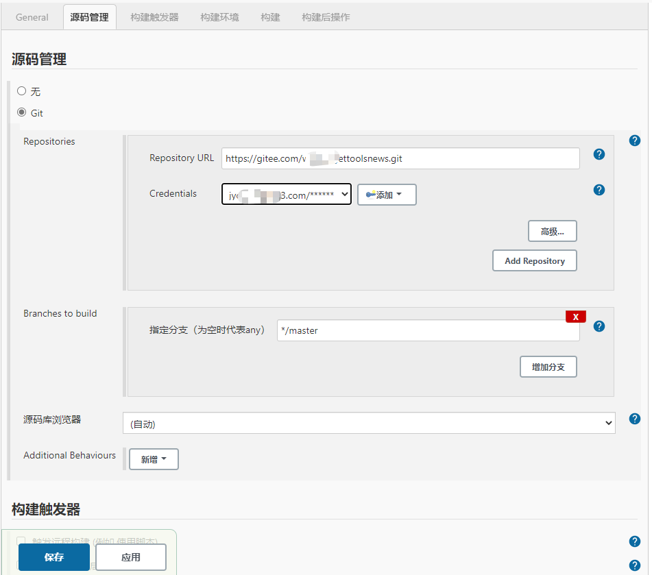
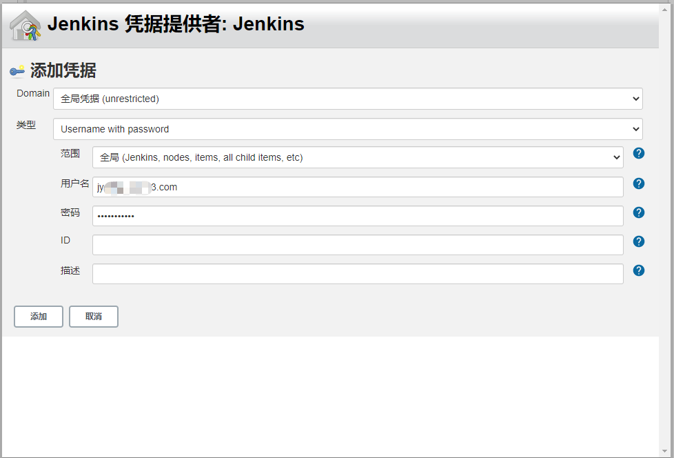
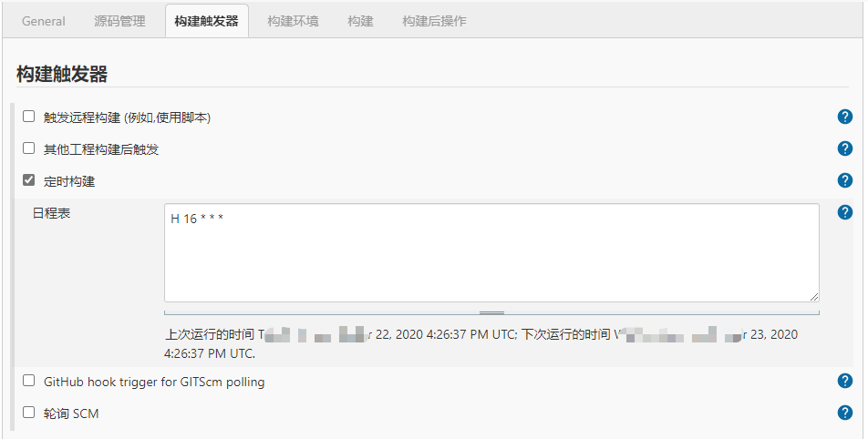
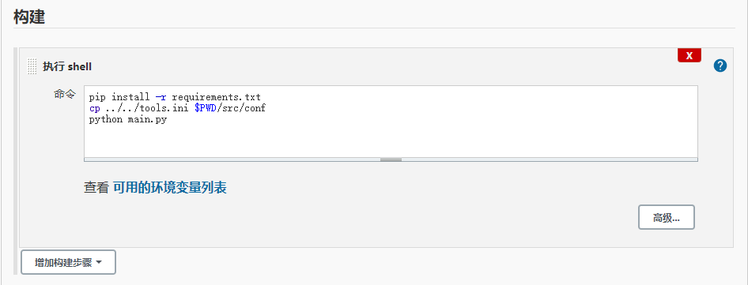
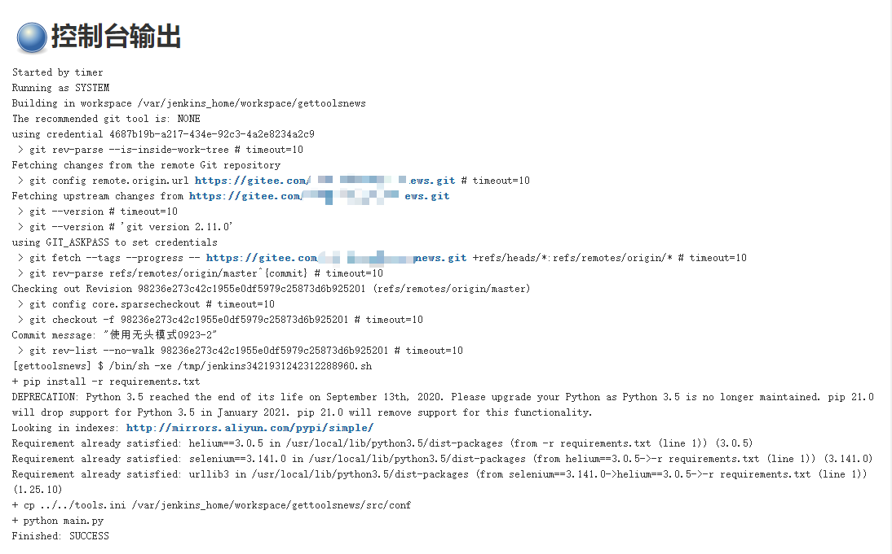

# 使用Docker搭建Jenkins+python3+selenium\helium项目

## 项目背景

用python3在本地写了一个项目，这个项目采用helium+selenium+chrome进行界面操作，代码放在gitee上托管。现在基本功能已经实现，想在linux服务器上部署项目代码，实现自动构建。

+ 自动构建解决方案

  + 自动构建工具选型：jenkins

  + 中间件选型：docker

  + 代码运行环境：python3

  + 脚本运行工具：chrome浏览器、chromedriver、helium库

    

## Ⅰ、安装docker

+ linux系统中安装docker

```sh
curl -fsSL https://get.docker.com | bash -s docker --mirror Aliyun
```

+ docker镜像国内加速

```sh
vim /etc/docker/daemon.json

{
  "registry-mirrors": [
    "https://registry.docker-cn.com",
    "http://hub-mirror.c.163.com",
    "https://docker.mirrors.ustc.edu.cn"
  ]
}

# 重启服务
systemctl daemon-reload
systemctl restart docker
```


## Ⅱ、安装jenkins

+ 在linux上任意路径，创建一个用于存放Jenkins文件的文件夹 "jenkins_py"

```sh
mkdir jenkins_py
docker run -itd --name=jenkins_py -p 8989:8080 -p 50001:50000 -v $PWD:/var/jenkins_home --privileged=true -u root jenkins/jenkins
```

+ 访问jenkins： http://ip:8989



+ 出现输入密码页面时，获取密码：
  
  + 方法1：
  
  ```sh
  # 进入容器
  docker exec -it -u root jenkins_py /bin/bash
  
  # 查看密码
  cat /var/jenkins_home/secrets/initialAdminPassword
  ```
  
  + 方法2：

```sh
# 在当前宿主linux机器上，进入前面自己创建的jenkins_py文件夹
cd secrets
cat initialAdminPassword
```


复制密码，填入web页面的密码框，在选择安装插件页面，点击安装推荐插件，等待插件自动安装




## Ⅲ、容器安装必要软件

+ 进入容器

```sh
docker exec -it -u root jenkins_py /bin/bash
```

+ 安装更新

```sh
# 安装更新
apt-get update

# 查看系统
cat /etc/issue

# 此时容器默认的系统为 debain 9
# debain默认的软件源非常慢， 可以更换为国内阿里源

# 安装vim
apt-get install -y vim
apt-get install -y wget

# 更换源为阿里源
vim /etc/apt/sources.list

deb http://mirrors.aliyun.com/debian/ stretch main non-free contrib
deb-src http://mirrors.aliyun.com/debian/ stretch main non-free contrib
deb http://mirrors.aliyun.com/debian-security stretch/updates main
deb-src http://mirrors.aliyun.com/debian-security stretch/updates main
deb http://mirrors.aliyun.com/debian/ stretch-updates main non-free contrib
deb-src http://mirrors.aliyun.com/debian/ stretch-updates main non-free contrib
deb http://mirrors.aliyun.com/debian/ stretch-backports main non-free contrib
deb-src http://mirrors.aliyun.com/debian/ stretch-backports main non-free contrib

# 更新系统
apt-get update
apt-get install libssl-dev
```


## Ⅳ、配置web自动化环境

+ 下载浏览器
  + 百度搜索"chrome for linux"， 下载适合debain版本的chrome浏览器
  + 把下载的文件上传到linux机器
+ 下载浏览器驱动
  + 下载chrome浏览器linux对应版本的驱动
  + 把下载的文件上传到linux机器
+ Jenkins容器中，安装chrome浏览器

```sh
# 把chrome文件，复制到上面创建的 jenkins_py 文件夹
cp google-chrome-stable_current_amd64_85.0.4183.102.deb ./jenkins_py/

# 进入容器
docker exec -it -u root jenkins_py /bin/bash

cd /var/jenkins_home
chmod +x google-chrome-stable_current_amd64_85.0.4183.102.deb
dpkg -i google-chrome-stable_current_amd64_85.0.4183.102.deb
```



+ 配置浏览器驱动

```sh
# 解压驱动zip包
unzip chromedriver_linux64.zip  

# 拷贝到 jenkins_py文件夹
cp chromedriver ./jenkins_py/

# 进入容器
docker exec -it -u root jenkins_py /bin/bash

cd /var/jenkins_home
chmod +x chromedriver
mv chromedriver /usr/bin/
cp /usr/bin/chromedriver /usr/local/bin/
```


## Ⅴ、安装python3

+ 安装python3

```sh
apt-get install -y python3
```

+ 安装pip

```sh
# 下载pip
wget https://bootstrap.pypa.io/get-pip.py

python3 get-pip.py

pip3 install --upgrade --force-reinstall setuptools

```

+ 修改系统默认python版本为python3

```sh
cd /usr/bin
ls -l python*
# 查看上面的python3的版本

rm -rf python
ln -s python3.5 python
# python3.5修改为上面对于的python3版本
```

+ 修改pip源

```sh
vim  /etc/pip.conf
[global]
trusted-host = mirrors.aliyun.com
index-url = http://mirrors.aliyun.com/pypi/simple/

```


## Ⅵ、jenkins 配置任务

+ 创建任务




+ 配置git






+ 配置构建触发器(可选)




+ 配置构建脚本



pip install -r requirements.txt 执行项目根目录中的requirements.txt文件，自动安装项目需要的库，这样就不用担心代码引入了新库，而Jenkins中不存在，导致报错了。

cp ../../tools.ini $PWD/src/conf  拷贝配置文件。因为gitee托管项目时，没有提交ini带私密信息的配置文件

python main.py  用python执行项目

+ 构建



**注意：** 用docker+jenkins来运行selenium的项目，是无图形界面的，所以项目中，浏览器必须采用无头模式

```python
# 参考代码
self.options = ChromeOptions()
self.options.add_argument('--headless')
self.options.add_argument('--no-sandbox')
self.options.add_argument('--disable-gpu')
self.options.add_argument('--disable-dev-shm-usage')
start_chrome(headless=True,options=self.options)
```

好了，项目构建成功。整个构建步骤、方法，你学会了吗？