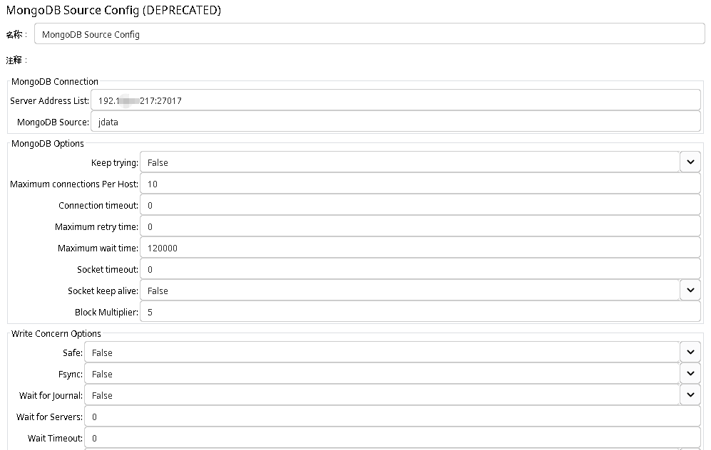
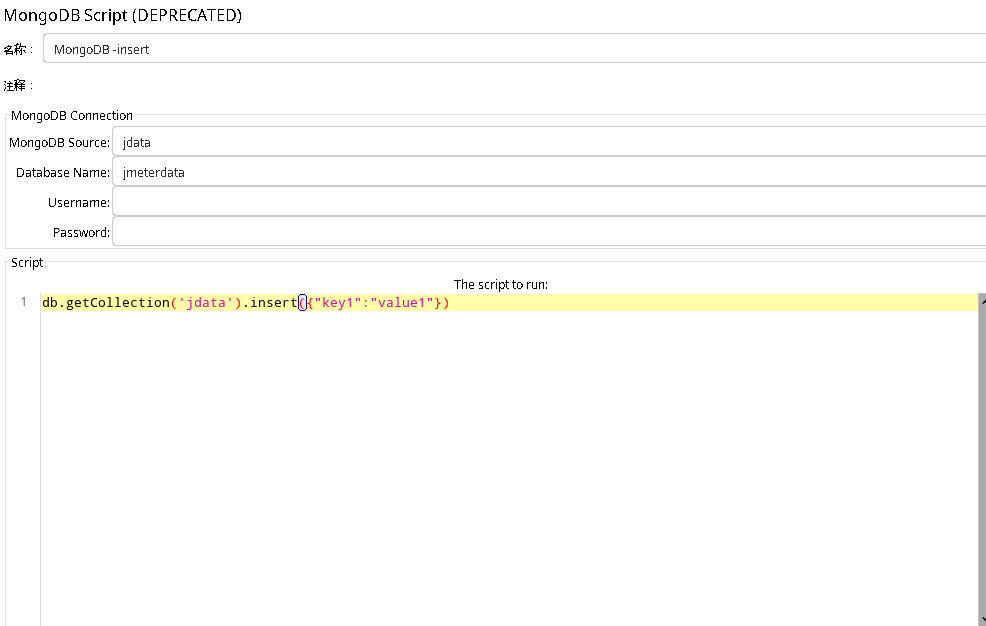
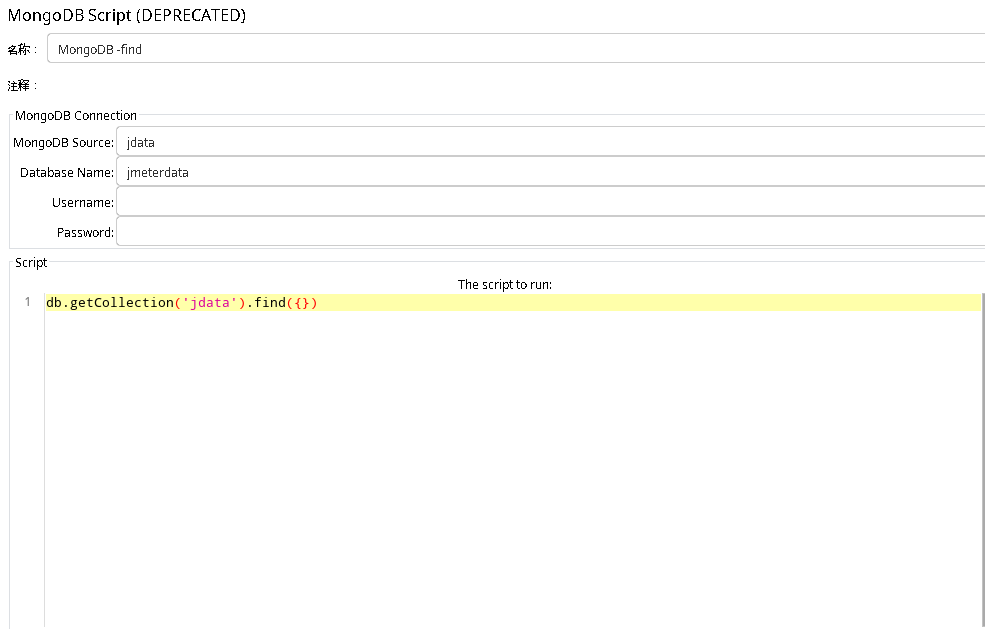
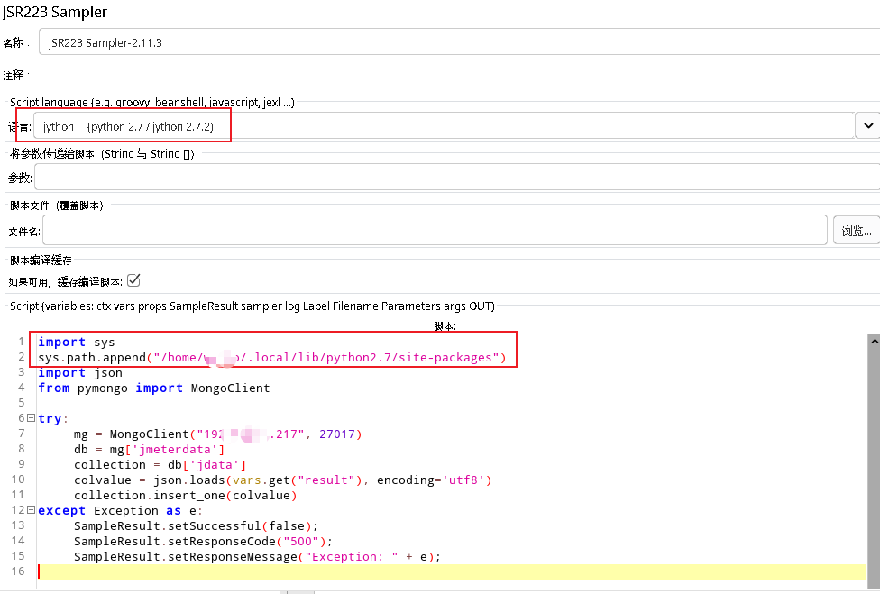
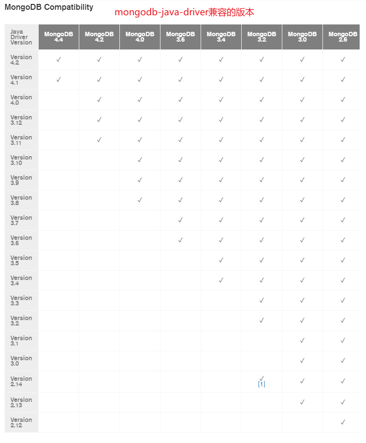
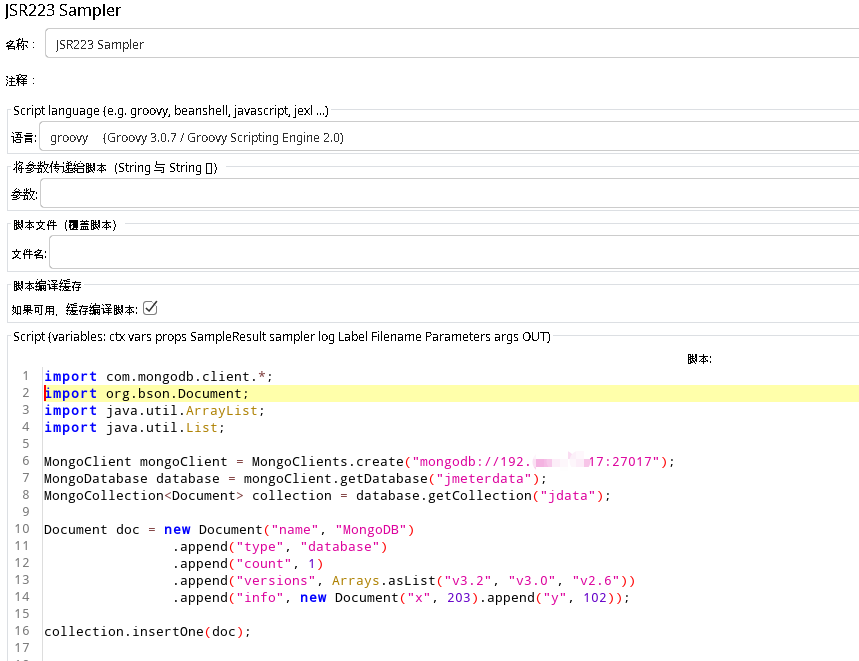

# 新版本Jmeter对mongodb进行测试

mongodb作为非关系型数据库，在现在企业中，还是有广泛的使用。但是，用jmeter如何测试mongodb，却是一个令很多人头疼的问题。去搜索，国内基本找不到一篇比较有价值的文章。

今天，我就用三种不同方法，系统介绍用jmeter如何测试mongodb。

### 方法一： 使用jmeter自带mongodb取样器

如果你现在打开jmeter，你在取样器下面查找，你可能已经找不到mongodb的取样器。因为，官方已经把这个取样器下架了，不过，你还可以把它上架。

找到jmeter的属性配置文件 jmeter.properties文件，搜索 'not_in_menu' ，你会发现mongodb相关的元件入口在这个地方下架的。只有你把mongodb相关的从下面移除出来就可以了。

重启jmeter，就可以在配置元件中，找到 **MongoDB Source Config**，在取样器下面，找到**MongoDB Script**。

在**MongoDB Source Config**中配置 Server Address List: mongodb://mongo服务器ip:端口  MongoDB Source中自定义一个资源名



在**MongoDB Script**中配置 MongoDB Source为上一步配置的资源名 Database Name中填写数据名

然后，在script中，写上你要值的脚本







### 方法二：写python脚本调用mongodb

可能很多同学都还有误解，说jmeter不支持python语言。这在我们机构，我给VIP学生上课的时候，我反反复复在纠正这个误解，我告诉我的学生，Jmeter其实支持不少于4种程序语言。

现在，我就先给大家讲用python语言，如何实现对mongodb数据库进行操作。

首先，先确保有这么一台图形界面电脑，电脑中安装了python2.7 和jdk1.8及以上版本。虽然python2已经不维护了，但是一般的linux系统还是自带这个版本的，而为什么要有jdk1.8及以上的版本，这个应该不用我多说，用过jmeter都知道。

然后，我们要去下载 [jython-standalone-2.7.2.jar包](https://repo1.maven.org/maven2/org/python/jython-standalone/2.7.2/) 把这个jar包下载下来后，放入到jmeter的lib文件夹中。

接下来，我们就可以启动jmeter来写python2脚本，调用mongodb了。

当然，我们要调mongodb，肯定需要有mongodb服务；写python脚本，可能你更喜欢用pycharm，你可以自己下载安装；python调用mongodb还需要pymongo库，也需要用pip命令去下载安装。这些都是工欲善其事必先利其器的事，请自行安装。

可以在pycharm中，参考如下脚本，调试一个python2调用mongodb的脚本

```python
#!/usr/bin/python
# -*- coding:UTF-8 -*-

import json
import requests
from pymongo import MongoClient

# 调用被测试服务器接口，获取响应
# 响应体为 json 格式
rsp = requests.get("http://被测试服务器ip:端口/接口地址").text

try:
    # 连接mongodb服务器
    mg = MongoClient("mongodb服务器ip", 27017)	# 27017默认端口
    # 连接 mongodb数据库，jmeterdata为数据库名
    db = mg['jmeterdata']
    # 连接 mongodb 数据集，jdata为数据集名
    collection = db['jdata']
    # 向mongodb中插入 上面接口返回的响应信息
    collection.insert_one(json.loads(rsp, encoding='utf8'))
except Exception as e:
    print e
```

执行该脚本，如果没有报错，则可以在mongodb数据库中，查看是否有数据插入。

接下来，在jmeter中，线程组下，新增 JSR223 Sampler 取样器，语言选择' jython {python2.7 / jython2.7.2}'



在脚本区域黏贴之前调试好的脚本，稍做改动，可参考如下：

```python
import sys
sys.path.append("/home/用户名/.local/lib/python2.7/site-packages")
import json
from pymongo import MongoClient

try:
    # 连接mongodb服务器
    mg = MongoClient("mongodb服务器ip", 27017)	# 27017默认端口
    # 连接 mongodb数据库，jmeterdata为数据库名
    db = mg['jmeterdata']
    # 连接 mongodb 数据集，jdata为数据集名
	collection = db['jdata']
    # 格式化响应信息 
    # vars.get("result") 为获取前面jmeter调接口响应信息用json提取器提取的给result值
	colvalue = json.loads(vars.get("result"), encoding='utf8')
    # 向mongodb中插入 上面接口返回的响应信息
	collection.insert_one(colvalue)
except Exception as e:
	SampleResult.setSuccessful(false);
	SampleResult.setResponseCode("500");
	SampleResult.setResponseMessage("Exception: " + e);

```

注意：此脚本使用的第三方库，需要加载python2的库文件，不然将无法引入pymongo

调用脚本，会发现jsr223取样器响应正常，从mongodb数据库中，就可以正常查找到插入的信息。


### 方法三：写groovy脚本调用mongodb

groovy语言，我就不做过多介绍，它是一种类java语言，不懂的，可以当java语言理解。

首先，你要知道你的mongodb服务器的版本，因为jmeter自带的mongo-java-driver版本过低，如果你的mongo版本比较高，用自带的是不能正常运行脚本的。



这张图，告诉你驱动版本与mongodb版本兼容关系。

然后，在[maven仓库](https://maven.aliyun.com/mvn/search)中，文件搜索，搜索关键词 ’mongo-java-driver‘ 然后选择你需要的jar包下载。

然后，把下载的mongo-java-driver-\*.jar 包放到jmeter的lib中，备份原来的mongo-java-driver-2.11.3.jar包

然后，重启jmeter，在线程组下，新增 JSR223 Sampler， 语言选择 groovy {Groovy 3.0.7 / Groovy Scripting Engine 2.0}

然后，阅读mongodb-java对应的api文档，如我用的3.8的jar包[文档](http://mongodb.github.io/mongo-java-driver/3.8/driver/getting-started/quick-start/)

```groovy
import com.mongodb.client.*;
import org.bson.Document;
import java.util.ArrayList;
import java.util.List;

// 建立数据库连接
MongoClient mongoClient = MongoClients.create("mongodb://mongodb服务器ip:27017");
// 连接 数据库  jmeterdata为数据库名
MongoDatabase database = mongoClient.getDatabase("jmeterdata");
// 连接 数据集 jdata为数据集名
MongoCollection<Document> collection = database.getCollection("jdata");

// 构造数据
Document doc = new Document("name", "MongoDB")
                .append("type", "database")
                .append("count", 1)
                .append("versions", Arrays.asList("v3.2", "v3.0", "v2.6"))
                .append("info", new Document("x", 203).append("y", 102));
// 插入1条数据
collection.insertOne(doc);
```



执行请求，请求成功。查看mongodb服务器，发现数据库中多了一条数据。


好了，三种方法都给大家讲了，你学到了吗？记得动手操作哦。

[参考脚本](https://github.com/wohuyuelong/articles/blob/master/jmx/jmeter-request-mongodb.jmx)