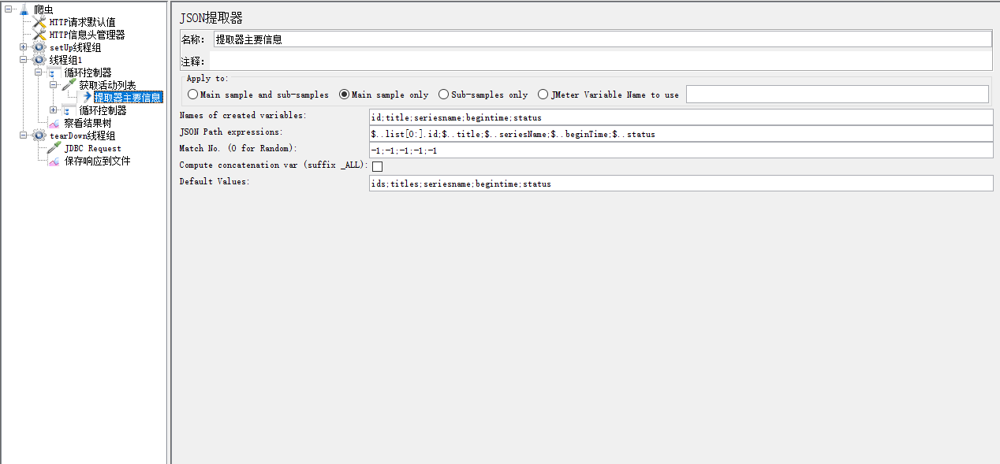

# 写爬虫，要懂代码吗？No！！！

说到爬虫，你想到了什么？

是不是想着，这是开发人员写的代码，生成一个软件，然后执行，就去访问某些网站，从网站上获取特定的信息，然后把这些信息存储下来。

如果你是这么想的，是不是觉得‘爬虫’很高大上，自己不懂得写代码，想从网站上搞点数据下来，就会很难呢？

那今天，我就教你一招，**不写代码，速度、效率比写代码还高**的办法，认真学习下吧！

+ 首先，确认你要爬取的网站。如，我想了解前沿技术，我想爬取<a href='https://cloud.tencent.com/developer/salon/activities?page=1'> 腾讯云沙龙 </a>视频，

+ 然后，你要确认，想要爬取的信息。我想要获取页面中课题的基本信息，如，标题、类型、开课时间、课程状态等。

  作为一个测试人员，或者有一定网络知识基础的同学，肯定就会想到，我可以通过浏览器的F12，看下页面接口请求信息，因为，接口主要就是用来传递数据的，我要的信息，很可能在某个接口中，就会有。

通过这个抓包，我们发现有如图中的接口，返回了我们想要的信息。

+ 接下来，我们就要想，用什么办法提取到这些信息，并固化下来。

其实，对于测试人员，我们有很多现成的工具。大家平时做接口测试，都用什么工具？——Jmeter ! 是不是，相信很多同学都会用，今天我们的爬虫，就用jmeter来实现。

jmeter写http协议的接口请求，大家会吗？

不会！ 不会的自己搬上小板凳，去找柠檬班的老师。

调通接口后，我们看下响应结果是json，就要**分析json数据格式，分析出自己想要爬取下来的信息的key**

接下来，提取json中对应key的值

> 这个json提取器中使用了一些特殊用法，如果大家看不懂，可以咨询柠檬班老师，也可以在柠檬班的测试派网站中搜索文章学习。

前面大家看到，一个页面有非常多个课程信息，那通过这个json提取器，获取的课程id、标题、名称、起始时间、状态肯定也会返回多个值。要想把这些多值，固化下来，首先，我们肯定会想到要用循环，既然要固化下来，那肯定就会想到要写入文件，所以我们就会采用循环相关的控制器

固化到文件，这一步，估计很多同学都会头痛！

因为jmeter本身并没有提供运行过程中的参数值保存到文件的功能，要想保存这些动态参数值，可能需要写代码，所以很多不懂代码的，就头痛了。

但是，

我们采用了**数据库嫁接法**！

在setup线程组中，添加数据库配置，采用sqlite数据库，这个数据库不需要安装，直接就可以用，然后，再创建一张表，用于后续存储我们爬取的信息，然后，就是在循环控制器中，把从接口中提取出来的数据，循环的写入数据库表中，即可。

> 当然，这其中，还包括数据的清洗！

此时，你要爬取的数据，已经写到数据库中了，算不算已经固化了你想要的信息呢？

如果，你觉得这还不算，你还可以添加一个tearDown线程组，写一个查询脚本，查询库中所有数据，再，保存响应结果到文件

此时，你可以去你的jmeter下面找找，看能不能找到你保存的文件，打开看看。

+ 最后，打开保存的信息，或把爬取的信息用于其他用途

这就要看你爬取信息的具体目的了。

好了，不知不觉中，一个爬虫就完成了，回头想一下，自己有些过一行程序代码吗？

No！！！

<a href='https://github.com/wohuyuelong/articles/blob/master/jmx/reptile.jmx'> 脚本源码 </a>