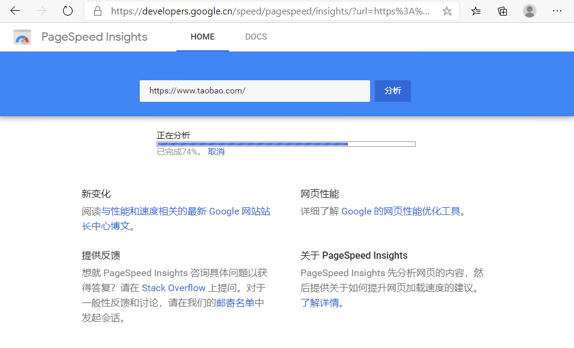
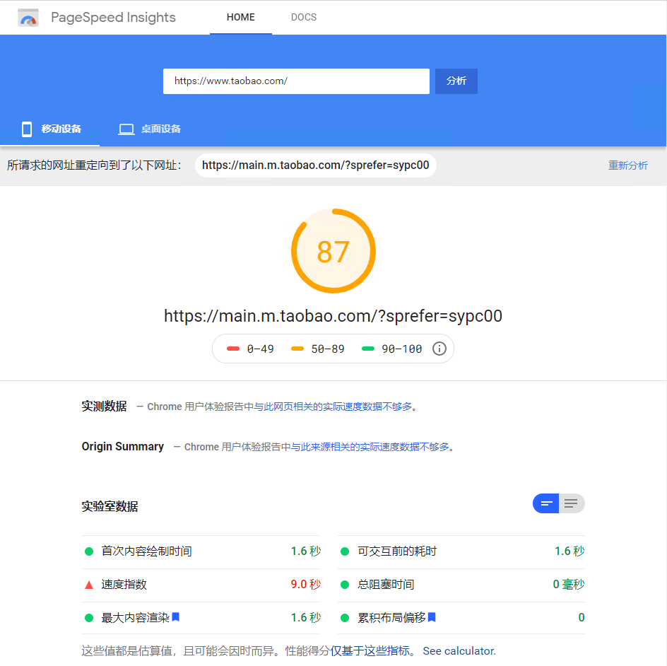
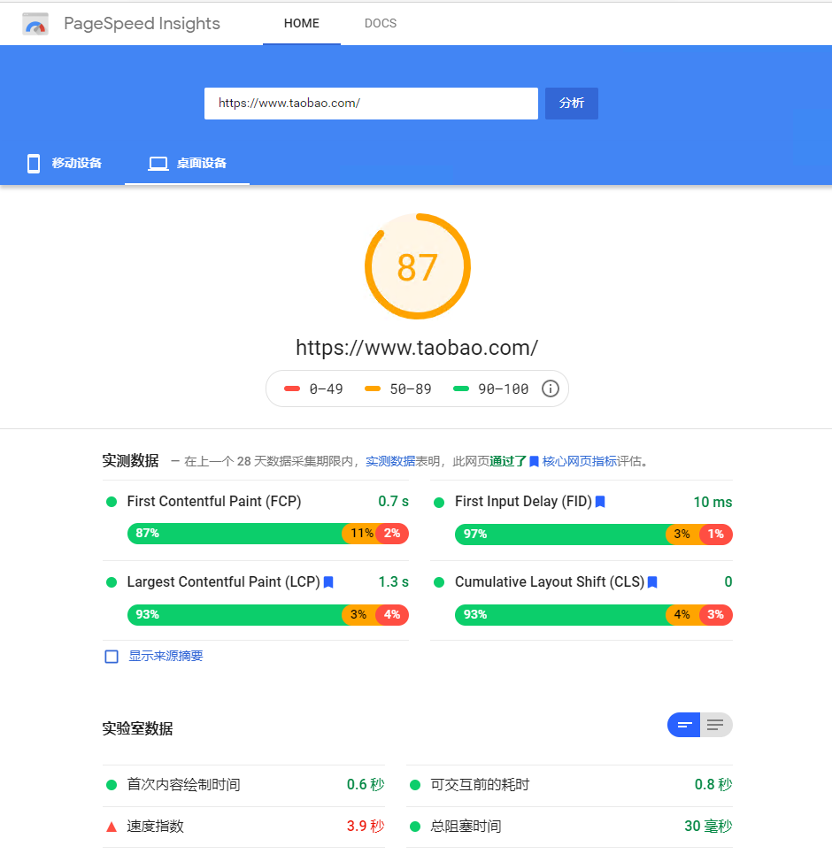
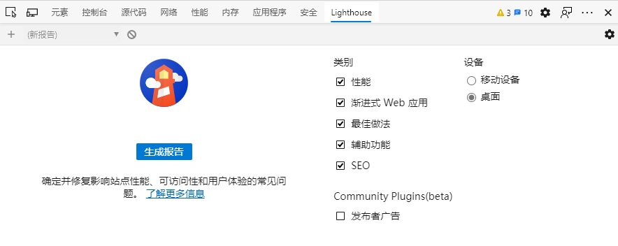
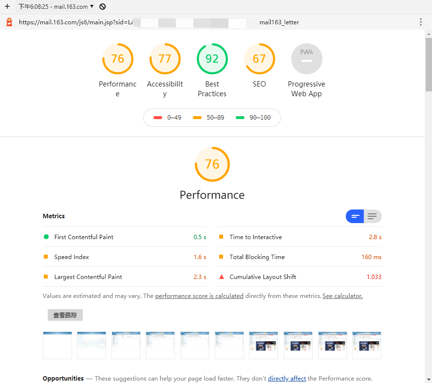
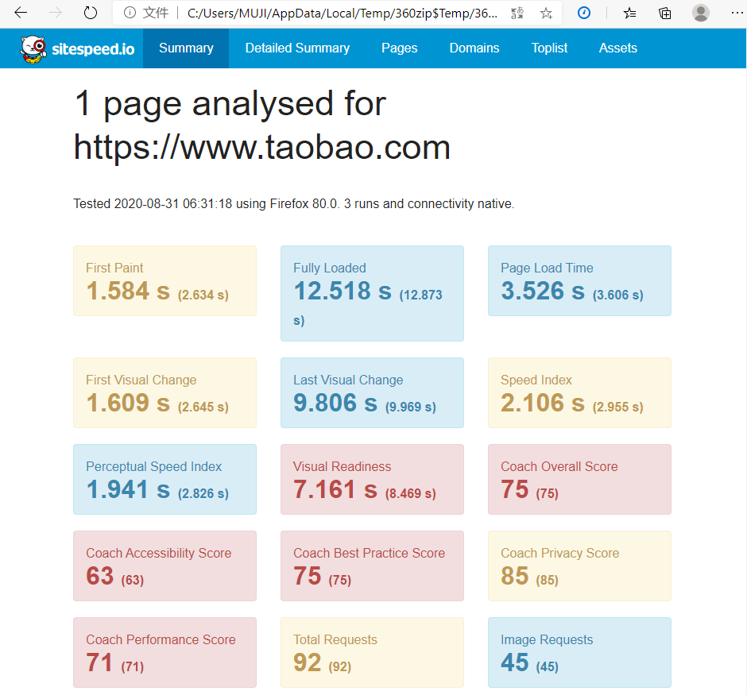
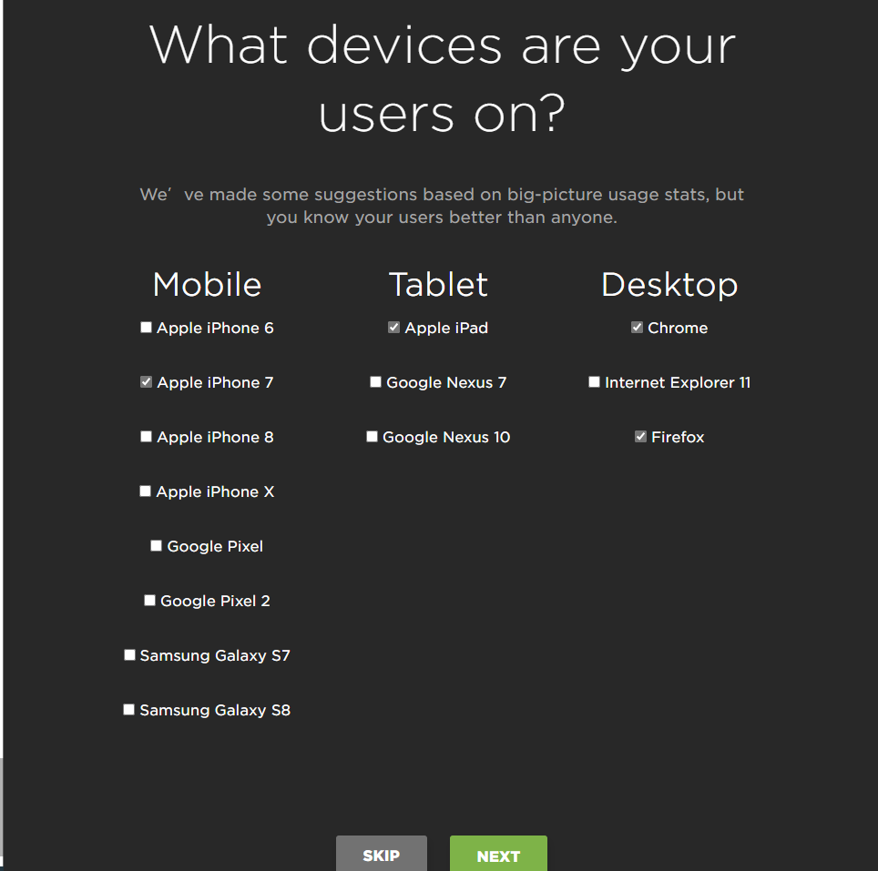
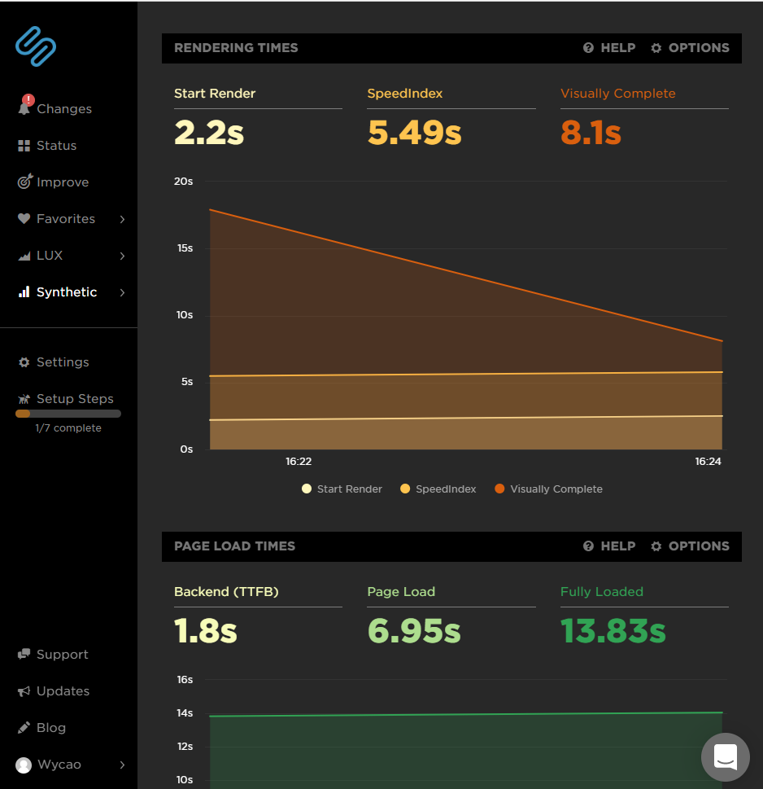

# 	值得推荐的5个前端性能测试工具

## PageSpeed Insights

谷歌开发的一个免费的<a href='https://developers.google.cn/speed/pagespeed/insights/'>网页分析工具</a>，在地址栏中输入被分析的网站url地址，点击分析，



可模拟移动设备访问页面结果分析



桌面设备访问页面结果分析



前端开发工程师，可以根据这个报告进行页面优化


## Lighthouse

+ **简介**

  Lighthouse是谷歌开源的一款web前端性能测试工具，用于改进网络应用的质量，适用于网页版和移动端。能生成一个包括页面性能、PWA（Progressive web apps，渐进式 Web 应用）、可访问性（无障碍）、最佳实践、SEO的报告清单提供参考，看看可以采取哪些措施来改进您的应用。

+ **使用方法**

  + 浏览器F12功能
    + 在最新的谷歌浏览器 或 Edge浏览器 访问一个被测试网站，按F12 ，打开开发者工具，看到最后一个项就是 Lighthouse
  + 下载安装到电脑

  ```sh
  npm install -g lighthouse
  ```

+ **测试某个网站**

  + 访问被测网站，打开浏览器的开发者工具

  

  + 点击【**生成报告**】 就会自动分析你访问的网站，得出性能分析报告

  

+ 这款工具，大家在用浏览器访问任意一个页面（包括需要登录，才能访问的页面），想要对这个页面进行性能分析都非常简单。

  

## SiteSpeed

+ **简介**

  + <a href='https://www.sitespeed.io/'>SiteSpeed</a> 也是一款开源的，可以用于监控和检查网站性能的工具。可以通过docker镜像或npm方式来使用。这个工具，并不是单一的，而是一组工具集合，可以根据自己需要，选择适合自己的工具。

    

+ **安装**

  + docker 安装使用

  ```shell
  $ sudo docker run --rm -v "$(pwd):/sitespeed.io" sitespeedio/sitespeed.io:14.4.0 https://www.taobao.com/
  
  # https://www.taobao.com/ 是被测试的网站
  ```

  + npm安装使用

  ```shell
  $ npm install -g sitespeed.io	# 安装
  $ sitespeed.io https://www.taobao.com/  # 测试淘宝网站
  ```

  

+ **测试结果**

  + 测试结束后，会把测试结果写到html文件

  

  + 可以通过顶部菜单，查看更多详细信息

  

## Speedcurve

<a href='https://speedcurve.com/'>Speedcurve</a> 是一个前端性能综合监控网站，可以在网站输入被测网站的url地址，进行测试


选择要默认访问网站的设备，进行模拟访问



访问后，网站会给出一份性能测试监控报告



通过报告，可以看到详细信息。


## webpagetest

<a href='https://www.webpagetest.org/'>webpagetest</a> 和上面的speedcurve相似，也是在一个网站中，输入被测试的网站ip地址，就可以对被测网站页面进行分析。但是，这个网站在国内，被友好的和谐了，会出现无法正常进行测试的情况。


好了，这些是现在比较方便的前端性能测试工具，你都了解吗？可能有同学会说为什么没有yslow，嗯，这个也是前端性能测工具，但是，你可以去搜索下，看下你现在的电脑上能非常方便的使用这个工具吗？yslow，不可否认，是一款经典的web端性能测试工具，但是现在使用起来非常的不方便，所以现在你想去学习这款工具，可能事被功半，收不到预期的效果，所以，个人不推荐大家学习这款工具了。

